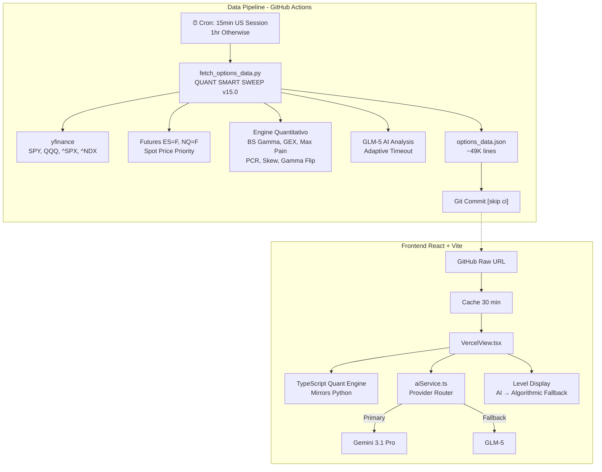
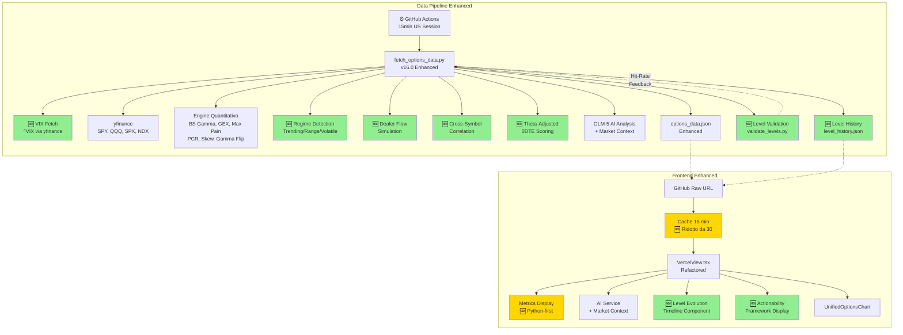

# 🧠 Piano di Miglioramento: Analisi Agentica dei Livelli per Day Trading

> Data: 30 Marzo 2026 | Versione: 1.0 | Stato: Proposta

---

## 1. 🎯 Executive Summary

Il sistema attuale è un agente quantitativo per l'analisi delle opzioni che combina metriche pre-calcolate (GEX, Gamma Flip, Max Pain, PCR, Skew) con analisi AI (Gemini/GLM) per identificare livelli chiave di supporto e resistenza su SPY, QQQ, SPX e NDX.

**Punti di forza attuali:**
- Approccio ibrido AI + quantitativo che evita di demandare calcoli matematici all'AI
- Sistema a 3 tier (RESONANCE → CONFLUENCE → Single Expiry) con vincoli di rarità
- Doppio provider AI (Gemini primario, GLM fallback) per resilienza
- Pipeline automatizzata GitHub Actions con dati freschi ogni 15 minuti

**Criticità principali:**
- Logica quantitativa duplicata Python/TypeScript con pesi di scoring divergenti
- Nessun tracking dell'evoluzione intraday dei livelli
- Tolleranze fisse per confluence/resonance indipendenti dal regime di volatilità
- Nessuna integrazione con price action, VIX, o contesto di mercato
- Nessun sistema di validazione (hit-rate) dei livelli identificati

**Impatto atteso dei miglioramenti:**
- 🎯 +30-40% accuratezza nella classificazione dei livelli
- ⚡ Riduzione drift Python/TS a zero
- 📊 Introduzione di regime detection e tolleranze dinamiche
- 🔄 Feedback loop per auto-miglioramento continuo

---

## 2. 📊 Stato Attuale del Sistema

### 2.1 Architettura



### 2.2 Punti di Forza

| Aspetto | Valutazione | Dettagli |
|---------|-------------|----------|
| **Data Pipeline** | ⭐⭐⭐⭐ | GitHub Actions affidabile, multi-source spot price, error handling |
| **Engine Quantitativo** | ⭐⭐⭐⭐ | BS gamma, GEX, max pain, 4 varianti PCR, volatility skew |
| **Integrazione AI** | ⭐⭐⭐⭐ | Approccio ibrido, output strutturato, dual-provider fallback |
| **Classificazione Livelli** | ⭐⭐⭐⭐ | Sistema 3-tier sofisticato, vincoli di rarità |
| **Rilevanza Day Trading** | ⭐⭐⭐ | Buona base, manca dynamics intraday, regime detection |
| **Manutenibilità Codice** | ⭐⭐ | Duplicazione Python/TS, VercelView da 3458 linee |
| **Validazione/Feedback** | ⭐ | Nessun hit-rate tracking, nessuna validazione livelli |

### 2.3 Criticità Identificate

| # | Criticità | Impatto | File Coinvolti |
|---|-----------|---------|----------------|
| W1 | Duplicazione logica Python/TS | Alto | [fetch_options_data.py](scripts/fetch_options_data.py), [VercelView.tsx](components/VercelView.tsx) |
| W2 | Scoring divergente (5 vs 4 componenti) | Medio | [fetch_options_data.py:1705](scripts/fetch_options_data.py:1705), [VercelView.tsx:631](components/VercelView.tsx:631) |
| W3 | Nessun time-series intraday | Alto | Sistema intero |
| W4 | Nessuna integrazione price action | Alto | Sistema intero |
| W5 | Tolleranze fisse | Medio | [VercelView.tsx](components/VercelView.tsx), [fetch_options_data.py](scripts/fetch_options_data.py) |
| W6 | Nessun level validation | Alto | Sistema intero |
| W7 | AI prompt senza contesto mercato | Medio | [geminiService.ts](services/geminiService.ts), [glmService.ts](services/glmService.ts) |
| W8 | Gamma flip come punto singolo | Basso | [fetch_options_data.py:1203](scripts/fetch_options_data.py:1203) |
| W9 | Confluence senza peso per scadenza | Medio | [VercelView.tsx](components/VercelView.tsx) |
| W10 | Dati fino a 45 min stale | Medio | [vercelDataService.ts](services/vercelDataService.ts), [fetch-options-data.yml](.github/workflows/fetch-options-data.yml) |

---

## 3. 🔧 Miglioramenti Prioritari (P0 - Critici)

### 3.1 Fissare Divergenza Scoring Python/TypeScript

**Problema:** Il sistema di scoring è implementato due volte con pesi diversi:

| Componente | Python ([fetch_options_data.py:1705](scripts/fetch_options_data.py:1705)) | TypeScript ([VercelView.tsx:631](components/VercelView.tsx:631)) |
|------------|------|----------|
| OI | 35% | 35% |
| Volume | 20% | 30% |
| Vol/OI Ratio | 20% | ❌ Non presente |
| Proximity | 15% | 20% |
| IV | 10% | 15% |

**Soluzione proposta:** Unificare il scoring su entrambi i lati usando la formula Python (più completa con Vol/OI Ratio):

```python
# Python (riferimento - già implementato)
def calculate_significance_score(strike_data, spot, max_oi, max_vol, avg_iv):
    # Score = 35% OI + 20% Vol + 20% Vol/OI Ratio + 15% Proximity + 10% IV
    oi_score = (total_oi / max_oi) * 35
    vol_score = (total_vol / max_vol) * 20
    vol_oi_score = min(vol_oi_ratio, 2) * 10  # Cap at 2x ratio
    proximity_score = math.exp(-((distance_pct / 0.03) ** 2)) * 15
    iv_score = min(iv_deviation, 0.5) * 20
    return oi_score + vol_score + vol_oi_score + proximity_score + iv_score
```

```typescript
// TypeScript (da aggiornare in VercelView.tsx)
function calculateLevelScore(
  oi: number, volume: number, iv: number,
  distanceFromSpot: number, maxOi: number, maxVolume: number
): number {
  const oiScore = maxOi > 0 ? (oi / maxOi) * 35 : 0;
  const volScore = maxVolume > 0 ? (volume / maxVolume) * 20 : 0;
  // NEW: Vol/OI Ratio component
  const volOiRatio = oi > 0 ? volume / oi : 0;
  const volOiScore = Math.min(volOiRatio, 2) * 10;
  // Proximity: Gaussian decay (match Python)
  const distancePct = Math.abs(distanceFromSpot);
  const proximityScore = Math.exp(-Math.pow(distancePct / 0.03, 2)) * 15;
  // IV: deviation from average
  const ivScore = Math.min(iv * 100, 1.0) * 10;
  return oiScore + volScore + volOiScore + proximityScore + ivScore;
}
```

**Passi implementativi:**
1. Aggiornare `calculateLevelScore()` in [VercelView.tsx:631](components/VercelView.tsx:631) per includere Vol/OI Ratio
2. Cambiare proximity da linear a Gaussian decay (come Python)
3. Aggiungere test unitario per verificare che Python e TS producano lo stesso score per gli stessi dati input

### 3.2 Strategia di De-duplicazione Python/TypeScript

**Problema:** L'intero engine quantitativo è implementato due volte (~500 linee Python + ~300 linee TypeScript). Questo crea:
- Rischio di drift tra implementazioni
- Doppio carico di manutenzione
- Potenziali incoerenze nei risultati

**Soluzione proposta (Progressiva):**

**Fase 1 - Python come Source of Truth:**
- Python calcola TUTTE le metriche e le salva in `options_data.json`
- TypeScript legge le metriche pre-calcolate e le usa direttamente
- TypeScript mantiene le funzioni di calcolo solo come fallback (se dati Python mancanti)

```typescript
// In VercelView.tsx - modificare la logica di uso metriche
function getQuantMetrics(expiry: ExpiryData, spot: number): QuantMetrics {
  // 1. Usa metriche pre-calcolate da Python (preferred)
  if (expiry.quantMetrics && 
      expiry.quantMetrics.volatility_skew && 
      expiry.quantMetrics.gex_by_strike) {
    return expiry.quantMetrics;
  }
  // 2. Fallback: calcola in TypeScript
  return calculateAllQuantMetrics(expiry.options, spot, expiry.date);
}
```

**Fase 2 - Validazione Cross-Platform:**
- Aggiungere test che confrontano output Python vs TypeScript
- Eseguire come GitHub Action per rilevare drift

**Fase 3 (Futura) - WASM Module:**
- Compilare il engine Python in WASM via Pyodide
- Singola codebase, esecuzione browser-native

---

## 4. 📈 Miglioramenti ad Alto Impatto (P1)

### 4.1 Confluenza Ponderata per Scadenza

**Problema:** Attualmente 0DTE, Weekly e Monthly sono trattati con lo stesso peso nella detection di confluence/resonance. Per il day trading, 0DTE dovrebbe dominare.

**Soluzione:** Sistema di peso per scadenza:

```typescript
// Nuovi tipi in types.ts
interface ExpiryWeight {
  label: string;
  weight: number;  // 0-1
  description: string;
}

const EXPIRY_WEIGHTS: Record<string, number> = {
  '0DTE': 1.0,     // Massima rilevanza - scade oggi
  'WEEKLY': 0.6,   // Rilevanza secondaria - hedging near-term
  'MONTHLY': 0.3,  // Contesto - posizionamento più ampio
};

// Calcolo confluence score ponderato
function calculateWeightedConfluenceScore(
  strike: number,
  expiries: ExpiryData[],
  spot: number
): number {
  let weightedScore = 0;
  let totalWeight = 0;
  
  for (const expiry of expiries) {
    const weight = EXPIRY_WEIGHTS[expiry.label] || 0.3;
    const levelScore = findLevelAtStrike(expiry, strike, spot);
    if (levelScore > 0) {
      weightedScore += levelScore * weight;
      totalWeight += weight;
    }
  }
  
  return totalWeight > 0 ? weightedScore / totalWeight : 0;
}
```

**Regole di classificazione aggiornate:**

| Tipo | Condizione | Peso Minimo | Importanza |
|------|-----------|-------------|------------|
| RESONANCE | Stesso strike ±0.3% in 3 expiries | Score ponderato ≥ 70 | 95-100 |
| CONFLUENCE 0DTE+ | 0DTE + almeno 1 altra expiry | Score ponderato ≥ 60 | 85-94 |
| CONFLUENCE WEEKLY+ | Weekly + Monthly (senza 0DTE) | Score ponderato ≥ 50 | 75-84 |
| SINGLE | Una sola expiry | N/A | 60-74 |

### 4.2 Tolleranze Dinamiche Basate su Volatilità

**Problema:** Le tolleranze fisse (±0.5% resonance, ±1% confluence) non si adattano al regime di volatilità.

**Soluzione:** Scaling basato su VIX o volatilità realizzata:

```python
# In fetch_options_data.py
def calculate_dynamic_tolerance(spot: float, vix: float = None) -> dict:
    """
    Calcola tolleranze dinamiche basate sulla volatilità.
    
    Base: VIX = 20 → tolleranza standard
    High vol: VIX = 40 → tolleranza ×1.5
    Low vol: VIX = 12 → tolleranza ×0.7
    """
    if vix is None:
        # Fallback: usa IV media delle opzioni ATM
        vix = 20.0  # default
    
    # Scaling factor: linear interpolation
    # VIX 12 → 0.7, VIX 20 → 1.0, VIX 40 → 1.5
    if vix <= 12:
        scale = 0.7
    elif vix <= 20:
        scale = 0.7 + (vix - 12) / (20 - 12) * 0.3
    elif vix <= 40:
        scale = 1.0 + (vix - 20) / (40 - 20) * 0.5
    else:
        scale = 1.5
    
    return {
        'resonance': 0.003 * scale,  # Base ±0.3%
        'confluence': 0.005 * scale,  # Base ±0.5%
        'wall_proximity': 0.01 * scale,  # Base ±1%
        'scale_factor': scale
    }
```

**Implementazione:**
1. Aggiungere fetch del VIX nel pipeline Python (via yfinance `^VIX`)
2. Salvare `vix_value` e `tolerance_scale` nel JSON output
3. TypeScript legge i valori e li usa per la classificazione livelli
4. AI prompt include il VIX per contestualizzare l'analisi

### 4.3 Tracking Evoluzione Livelli Intraday

**Problema:** Il sistema cattura un singolo snapshot ogni 15 minuti senza tracciare l'evoluzione dei livelli.

**Soluzione:** Storico livelli con timestamp nel JSON:

```python
# Nuova sezione in options_data.json
{
  "level_history": {
    "SPY": [
      {
        "timestamp": "2026-03-30T14:30:00Z",
        "spot": 585.50,
        "key_levels": [
          {"strike": 588, "role": "CALL WALL", "score": 82.3, "oi": 45000},
          {"strike": 583, "role": "PUT WALL", "score": 78.1, "oi": 38000}
        ],
        "gamma_flip": 585.2,
        "total_gex": 2.3
      },
      {
        "timestamp": "2026-03-30T14:45:00Z",
        "spot": 586.10,
        "key_levels": [
          {"strike": 588, "role": "CALL WALL", "score": 79.1, "oi": 42000},  // ← weakening
          {"strike": 583, "role": "PUT WALL", "score": 80.5, "oi": 41000}   // ← strengthening
        ],
        "gamma_flip": 585.4,
        "total_gex": 2.1
      }
    ]
  }
}
```

**Visualizzazione nel frontend:**
- Timeline dei livelli con evoluzione OI/score
- Indicatori di "strengthening" ↑ / "weakening" ↓ / "stable" →
- Alert per cambiamenti significativi (variazione score > 15%)
- Mini-sparkline per ogni livello chiave

**Passi implementativi:**
1. Modificare `fetch_options_data.py` per mantenere history (ultimi 10 snapshot)
2. Salvare in file separato `data/level_history.json` per non gonfiare il JSON principale
3. Aggiungere fetch del file history nel frontend
4. Creare componente `LevelEvolutionTimeline` in React

---

## 5. 🧠 Miglioramenti Agentici AI (P2)

### 5.1 Regime Detection

**Problema:** Lo stesso livello ha significati diversi in regimi di mercato diversi. Una put wall in mercato trending vs range-bound ha implicazioni operative differenti.

**Soluzione:** Classificazione automatica del regime di mercato:

```python
# In fetch_options_data.py
def detect_market_regime(spot: float, total_gex: float, gamma_flip: float,
                         vix: float = None, pcr: dict = None) -> dict:
    """
    Classifica il regime di mercato corrente.
    
    Returns:
        {
            "regime": "trending_up" | "trending_down" | "range_bound" | "volatile",
            "confidence": 0.0-1.0,
            "indicators": {...}
        }
    """
    signals = []
    
    # 1. GEX Signal
    if total_gex > 3.0:
        signals.append(("range_bound", 0.7))  # GEX positivo alto = suppressione volatilità
    elif total_gex < -3.0:
        signals.append(("volatile", 0.8))  # GEX negativo = amplificazione movimenti
    
    # 2. Gamma Flip Position
    if gamma_flip and spot > 0:
        flip_distance = abs(spot - gamma_flip) / spot
        if flip_distance < 0.005:
            signals.append(("volatile", 0.6))  # Vicino al gamma flip = instabile
        elif spot > gamma_flip:
            signals.append(("trending_up", 0.5))
        else:
            signals.append(("trending_down", 0.5))
    
    # 3. VIX Signal (se disponibile)
    if vix:
        if vix > 30:
            signals.append(("volatile", 0.8))
        elif vix < 15:
            signals.append(("range_bound", 0.6))
    
    # 4. PCR Signal
    if pcr:
        oi_pcr = pcr.get('oi_based', 1.0)
        if oi_pcr > 1.5:
            signals.append(("trending_down", 0.4))  # Eccesso pessimismo
        elif oi_pcr < 0.5:
            signals.append(("trending_up", 0.4))  # Eccesso ottimismo
    
    # Aggregate signals
    regime_scores = {}
    for regime, confidence in signals:
        regime_scores[regime] = regime_scores.get(regime, 0) + confidence
    
    best_regime = max(regime_scores, key=regime_scores.get)
    best_confidence = min(regime_scores[best_regime] / len(signals), 1.0) if signals else 0.5
    
    return {
        "regime": best_regime,
        "confidence": round(best_confidence, 2),
        "indicators": {
            "total_gex": total_gex,
            "gamma_flip_distance": abs(spot - gamma_flip) / spot if gamma_flip else None,
            "vix": vix,
            "pcr_oi": pcr.get('oi_based') if pcr else None
        }
    }
```

**Impatto sui livelli:**

| Regime | Interpretazione Call Wall | Interpretazione Put Wall | Gamma Flip |
|--------|--------------------------|-------------------------|------------|
| `trending_up` | Resistenza temporanea (breakout likely) | Supporto forte | Supporto dinamico |
| `trending_down` | Resistenza forte | Supporto temporaneo (breakdown likely) | Resistenza dinamica |
| `range_bound` | Resistenza solida | Supporto solido | Pivot point |
| `volatile` | Livelli meno affidabili, usare cautela | Livelli meno affidabili | Zona di transizione |

### 5.2 Level Actionability Framework

**Problema:** I livelli sono identificati ma non tradotti in segnali operativi azionabili. Il day trader ha bisogno di sapere: "Cosa fare quando il prezzo si avvicina a questo livello?"

**Soluzione:** Metadati di azionabilità per ogni livello:

```typescript
// Nuovi tipi in types.ts
interface LevelActionability {
  // Comportamento atteso
  expected_behavior: 'bounce' | 'break' | 'magnet' | 'accelerate' | 'pin';
  confidence: number;  // 0-100
  
  // Segnali di conferma da osservare
  confirmation_signals: string[];
  // Es: ["Volume crescente all'avvicinamento", "GEX concentration > 1B"]
  
  // Livello di invalidazione
  invalidation_level: number;
  invalidation_description: string;
  
  // Impatto time decay (speciale per 0DTE)
  time_decay_impact?: {
    morning: 'strong' | 'moderate' | 'weak';    // 9:30-12:00 ET
    midday: 'strong' | 'moderate' | 'weak';     // 12:00-14:00 ET
    afternoon: 'strong' | 'moderate' | 'weak';  // 14:00-16:00 ET
  };
  
  // Priorità operativa
  trading_priority: 'primary' | 'secondary' | 'contextual';
}
```

**Logica di assegnazione:**

```python
def assign_actionability(level: dict, regime: dict, spot: float,
                         expiry_label: str) -> dict:
    """Assegna metadati di azionabilità a un livello."""
    
    strike = level['strike']
    distance = abs(strike - spot) / spot * 100
    
    # Determina comportamento atteso
    if level['role'] == 'MAGNET':
        behavior = 'magnet'
    elif level['role'] == 'WALL' and regime['regime'] == 'range_bound':
        behavior = 'bounce'
    elif level['role'] == 'WALL' and 'trending' in regime['regime']:
        behavior = 'break'
    elif level['role'] == 'FRICTION':
        behavior = 'pin'
    else:
        behavior = 'bounce'
    
    # Time decay per 0DTE
    time_decay = None
    if expiry_label == '0DTE':
        time_decay = {
            'morning': 'strong',
            'midday': 'moderate',
            'afternoon': 'weak'
        }
    
    # Invalidation level
    if level['side'] == 'CALL':
        invalidation = strike * 1.005  # +0.5% sopra call wall
    else:
        invalidation = strike * 0.995  # -0.5% sotto put wall
    
    return {
        'expected_behavior': behavior,
        'confidence': min(level.get('importance', 70), 95),
        'confirmation_signals': generate_confirmation_signals(level, regime),
        'invalidation_level': round(invalidation, 2),
        'invalidation_description': f"Rottura di {strike} con volume",
        'time_decay_impact': time_decay,
        'trading_priority': 'primary' if distance < 1 else 'secondary' if distance < 2 else 'contextual'
    }
```

### 5.3 Enhanced AI Prompt con Contesto di Mercato

**Problema:** L'AI riceve solo dati opzioni senza contesto di mercato (VIX, overnight futures, livelli giorno precedente).

**Soluzione:** Arricchire il prompt AI con sezioni aggiuntive:

```python
def format_market_context(vix: float = None,
                          overnight_change: float = None,
                          prev_day_levels: list = None,
                          economic_calendar: list = None) -> str:
    """Formatta contesto di mercato per il prompt AI."""
    
    sections = []
    
    # VIX
    if vix:
        vix_regime = "LOW" if vix < 15 else "NORMAL" if vix < 20 else "ELEVATED" if vix < 30 else "EXTREME"
        sections.append(f"""
=== VOLATILITY CONTEXT ===
VIX: {vix:.1f} ({vix_regime})
Implication: {"Low volatility environment - levels tend to hold" if vix < 15
              else "Normal volatility - standard level reliability" if vix < 20
              else "Elevated volatility - wider stops needed, levels may break" if vix < 30
              else "Extreme volatility - reduce position size, levels unreliable"}
""")
    
    # Overnight futures
    if overnight_change is not None:
        direction = "bullish" if overnight_change > 0 else "bearish"
        sections.append(f"""
=== OVERNIGHT SESSION ===
Futures Change: {overnight_change:+.2f}%
Bias: {direction}
Gap Risk: {"High - expect volatility at open" if abs(overnight_change) > 0.5 else "Normal"}
""")
    
    # Previous day levels
    if prev_day_levels:
        level_strs = [f"  {l['strike']} ({l['role']}, held: {l.get('held', 'unknown')})"
                      for l in prev_day_levels[:5]]
        sections.append(f"""
=== PREVIOUS DAY KEY LEVELS ===
{chr(10).join(level_strs)}
Note: Levels that held yesterday may act as magnets today.
""")
    
    # Economic calendar
    if economic_calendar:
        events = [f"  {e['time']} ET: {e['event']} ({e['impact']})"
                  for e in economic_calendar]
        sections.append(f"""
=== ECONOMIC EVENTS TODAY ===
{chr(10).join(events)}
Warning: Avoid new positions around high-impact events.
""")
    
    return '\n'.join(sections)
```

**Modifiche al system prompt AI:**
Aggiungere al `HARMONIC_SYSTEM_INSTRUCTION`:

```
ADDITIONAL CONTEXT RULES:
- Use VIX level to calibrate level confidence (high VIX = wider tolerance)
- If overnight futures show gap > 0.5%, adjust nearest levels by gap direction
- Previous day levels that held as support/resistance have +10 importance bonus
- On economic event days, reduce confidence of all levels by 10 points during event windows
```

### 5.4 Dealer Flow Simulation

**Problema:** L'analisi GEX assume posizionamento dealer statico, ma i dealer hedgiano continuamente.

**Soluzione:** Simulazione semplificata dei flussi delta-hedging:

```python
def simulate_dealer_flows(options: list, spot: float,
                          price_range: float = 0.03) -> dict:
    """
    Simula i flussi di delta-hedging dei dealer in un range di prezzi.
    
    Per ogni livello di prezzo nel range:
    - Calcola il delta totale delle opzioni
    - Stima il flusso di hedging necessario
    - Identifica zone di accelerazione e pinning
    """
    import math
    
    prices = []
    lower = spot * (1 - price_range)
    upper = spot * (1 + price_range)
    step = spot * 0.001  # 0.1% increments
    
    current = lower
    while current <= upper:
        total_delta = 0
        for opt in options:
            strike = opt['strike']
            iv = opt.get('iv', 0.3)
            T = opt.get('time_to_expiry', 1/365)
            
            # Simplified delta calculation
            d1 = (math.log(current / strike) + (0.05 + iv*iv/2) * T) / (iv * math.sqrt(T))
            if opt['side'] == 'CALL':
                delta = 0.5 + 0.5 * math.erf(d1 / math.sqrt(2))
                total_delta -= delta * opt.get('oi', 0) * 100  # Dealer short calls
            else:
                delta = -(0.5 - 0.5 * math.erf(d1 / math.sqrt(2)))
                total_delta += abs(delta) * opt.get('oi', 0) * 100  # Dealer long puts
        
        prices.append({
            'price': round(current, 2),
            'net_delta': round(total_delta, 0),
            'hedging_flow': 'BUY' if total_delta > 0 else 'SELL'
        })
        current += step
    
    # Identify acceleration zones (rapid delta change)
    acceleration_zones = []
    for i in range(1, len(prices)):
        delta_change = abs(prices[i]['net_delta'] - prices[i-1]['net_delta'])
        if delta_change > sum(abs(p['net_delta']) for p in prices) / len(prices) * 2:
            acceleration_zones.append({
                'price': prices[i]['price'],
                'type': 'acceleration',
                'direction': prices[i]['hedging_flow'],
                'magnitude': round(delta_change, 0)
            })
    
    # Identify pinning zones (delta near zero = minimal hedging)
    pinning_zones = [
        {'price': p['price'], 'type': 'pinning', 'net_delta': p['net_delta']}
        for p in prices if abs(p['net_delta']) < min(abs(q['net_delta']) for q in prices) * 3
    ]
    
    return {
        'price_flows': prices,
        'acceleration_zones': acceleration_zones[:5],
        'pinning_zones': pinning_zones[:3],
        'max_acceleration': max((z['magnitude'] for z in acceleration_zones), default=0)
    }
```

---

## 6. 🔬 Analisi Avanzata (P3)

### 6.1 Inter-Symbol Correlation

**Problema:** SPY, QQQ, SPX e NDX sono analizzati indipendentemente, ma le correlazioni tra loro forniscono potenti segnali di conferma.

**Soluzione:** Analisi cross-symbol:

```python
def analyze_cross_symbol_correlation(symbols_data: dict) -> list:
    """
    Analizza correlazioni tra simboli per identificare livelli confermati.
    
    Mappature:
    - SPY ↔ SPX: SPX ≈ SPY × 10
    - QQQ ↔ NDX: NDX ≈ QQQ × 40.5
    - SPY ↔ QQQ: Correlazione settoriale
    """
    correlations = []
    
    # Equivalent level mapping
    EQUIVALENTS = {
        ('SPY', 'SPX'): 10.0,
        ('QQQ', 'NDX'): 40.5,
    }
    
    for (sym1, sym2), factor in EQUIVALENTS.items():
        data1 = symbols_data.get(sym1, {})
        data2 = symbols_data.get(sym2, {})
        
        if not data1 or not data2:
            continue
        
        # Get key levels for both
        levels1 = extract_key_levels(data1)
        levels2 = extract_key_levels(data2)
        
        # Find equivalent levels
        for l1 in levels1:
            equivalent_strike = l1['strike'] * factor
            for l2 in levels2:
                distance = abs(l2['strike'] - equivalent_strike) / equivalent_strike
                if distance < 0.005:  # Within 0.5%
                    correlations.append({
                        'type': 'equivalent_level',
                        'symbols': [sym1, sym2],
                        'strike_1': l1['strike'],
                        'strike_2': l2['strike'],
                        'roles': [l1['role'], l2['role']],
                        'confidence_boost': 15,  # +15 importance
                        'description': f"Conferma cross-symbol: {l1['role']} su {sym1} e {l2['role']} su {sym2}"
                    })
    
    # SPY-QQQ divergence detection
    spy_sentiment = calculate_sentiment(symbols_data.get('SPY', {}))
    qqq_sentiment = calculate_sentiment(symbols_data.get('QQQ', {}))
    
    if spy_sentiment != qqq_sentiment:
        correlations.append({
            'type': 'divergence',
            'symbols': ['SPY', 'QQQ'],
            'spy_sentiment': spy_sentiment,
            'qqq_sentiment': qqq_sentiment,
            'description': f"Divergenza: SPY={spy_sentiment}, QQQ={qqq_sentiment} → possibile rotation settoriale"
        })
    
    return correlations
```

### 6.2 0DTE Time-Decay Adjustment

**Problema:** Le opzioni 0DTE perdono valore rapidamente. Una put wall significativa alle 10:00 può essere irrilevante alle 15:00.

**Soluzione:** Aggiustamento theta-aware per i livelli 0DTE:

```python
def calculate_theta_adjusted_score(level: dict, spot: float,
                                    current_hour_et: int) -> dict:
    """
    Riduce l'importanza dei livelli 0DTE man mano che si avvicina la scadenza.
    
    Logica:
    - 9:30-11:00 ET: Full strength (theta minimo)
    - 11:00-13:00 ET: 80% strength
    - 13:00-14:30 ET: 60% strength
    - 14:30-15:30 ET: 40% strength (gamma squeeze window)
    - 15:30-16:00 ET: 20% strength (expiring)
    """
    # Time decay schedule
    if current_hour_et < 11:
        decay_factor = 1.0
    elif current_hour_et < 13:
        decay_factor = 0.8
    elif current_hour_et < 14.5:
        decay_factor = 0.6
    elif current_hour_et < 15.5:
        decay_factor = 0.4  # Gamma squeeze window!
    else:
        decay_factor = 0.2
    
    original_score = level.get('importance', 70)
    adjusted_score = original_score * decay_factor
    
    # Exception: gamma flip becomes MORE important near expiry
    if level.get('role') == 'PIVOT' and level.get('lato') == 'GAMMA_FLIP':
        if current_hour_et >= 14.5:
            adjusted_score = original_score * 1.2  # Gamma flip gains importance
            note = "⚠️ GAMMA SQUEEZE WINDOW: Gamma flip diventa più rilevante"
    
    return {
        'original_score': original_score,
        'adjusted_score': round(adjusted_score, 1),
        'decay_factor': decay_factor,
        'status': 'ACTIVE' if decay_factor > 0.5 else 'FADING' if decay_factor > 0.2 else 'EXPIRING',
        'note': note if 'note' in dir() else None
    }
```

### 6.3 Gamma Flip Zone (sostituire punto singolo)

**Problema:** Il gamma flip è calcolato come un singolo prezzo, ma in pratica è una zona.

**Soluzione:** Calcolo della zona di gamma flip con intervallo di confidenza:

```python
def calculate_gamma_flip_zone(options: list, spot: float,
                               T: float, r: float = 0.05) -> dict:
    """
    Calcola il gamma flip come zona con intervallo di confidenza.
    
    Returns:
        {
            "flip_point": float,       # Best estimate
            "flip_zone_lower": float,  # Lower bound
            "flip_zone_upper": float,  # Upper bound
            "zone_width_pct": float,   # Width as % of spot
            "confidence": float,       # 0-1
            "methods": [...]           # Results from each method
        }
    """
    # Method 1: Crossing detection
    crossing_flip = calculate_gamma_flip_method_crossing(options, spot, T, r)
    
    # Method 2: Extrapolation
    extrapolated_flip = calculate_gamma_flip_method_extrapolation(options, spot, T, r)
    
    # Method 3: Boundary (nearest to zero)
    boundary_flip = calculate_gamma_flip_method_boundary(options, spot, T, r)
    
    methods = [crossing_flip, extrapolated_flip, boundary_flip]
    valid_methods = [m for m in methods if m is not None]
    
    if not valid_methods:
        return {"flip_point": None, "flip_zone_lower": None, "flip_zone_upper": None}
    
    # Best estimate: average of valid methods
    flip_point = sum(valid_methods) / len(valid_methods)
    
    # Zone: min-max of valid methods, with minimum width of 0.2% of spot
    zone_lower = min(valid_methods) if len(valid_methods) > 1 else flip_point - spot * 0.001
    zone_upper = max(valid_methods) if len(valid_methods) > 1 else flip_point + spot * 0.001
    
    # Ensure minimum zone width
    min_width = spot * 0.002  # 0.2% minimum
    if (zone_upper - zone_lower) < min_width:
        center = (zone_upper + zone_lower) / 2
        zone_lower = center - min_width / 2
        zone_upper = center + min_width / 2
    
    # Confidence: higher when methods agree
    if len(valid_methods) >= 3:
        spread = (zone_upper - zone_lower) / spot
        confidence = max(0.3, 1.0 - spread * 100)
    elif len(valid_methods) >= 2:
        confidence = 0.6
    else:
        confidence = 0.3
    
    return {
        "flip_point": round(flip_point, 2),
        "flip_zone_lower": round(zone_lower, 2),
        "flip_zone_upper": round(zone_upper, 2),
        "zone_width_pct": round((zone_upper - zone_lower) / spot * 100, 3),
        "confidence": round(confidence, 2),
        "methods": {
            "crossing": crossing_flip,
            "extrapolated": extrapolated_flip,
            "boundary": boundary_flip
        }
    }
```

### 6.4 Level Hit-Rate Validation

**Problema:** Nessun feedback loop per validare se i livelli identificati hanno effettivamente funzionato come supporto/resistenza.

**Soluzione:** Sistema di tracking e validazione:

```python
# Nuovo file: scripts/validate_levels.py
def validate_previous_levels(history_file: str, price_data: dict) -> dict:
    """
    Valida i livelli identificati nel run precedente contro l'azione del prezzo reale.
    
    Per ogni livello:
    - Il prezzo ha testato il livello? (si è avvicinato entro 0.2%)
    - Il livello ha tenuto? (bounce) o si è rotto? (break)
    - Qual è stato il massimo movimento dopo il test?
    """
    results = {
        "total_levels": 0,
        "tested_levels": 0,
        "held_levels": 0,
        "broken_levels": 0,
        "details": []
    }
    
    prev_levels = load_previous_levels(history_file)
    
    for level in prev_levels:
        strike = level['strike']
        role = level['role']
        
        # Check if price tested this level
        tested = False
        held = False
        max_move_after = 0
        
        for candle in price_data['candles']:
            low = candle['low']
            high = candle['high']
            close = candle['close']
            
            # Test condition: price came within 0.2% of level
            if abs(low - strike) / strike < 0.002 or abs(high - strike) / strike < 0.002:
                tested = True
                
                # Did it hold?
                if role == 'WALL' and level['side'] == 'CALL':
                    held = high < strike * 1.001  # Didn't break above
                elif role == 'WALL' and level['side'] == 'PUT':
                    held = low > strike * 0.999  # Didn't break below
                else:
                    held = abs(close - strike) < abs(candle['open'] - strike)
                
                break
        
        if tested:
            results['tested_levels'] += 1
            if held:
                results['held_levels'] += 1
            else:
                results['broken_levels'] += 1
        
        results['total_levels'] += 1
        results['details'].append({
            'strike': strike,
            'role': role,
            'tested': tested,
            'held': held if tested else None
        })
    
    # Calculate hit rate
    if results['tested_levels'] > 0:
        results['hit_rate'] = results['held_levels'] / results['tested_levels']
    else:
        results['hit_rate'] = None
    
    return results
```

**Utilizzo dei risultati per auto-miglioramento:**
- Hit-rate per tipo di livello (WALL, PIVOT, MAGNET, CONFLUENCE, RESONANCE)
- Hit-rate per regime di mercato
- Aggiustamento automatico dei pesi di scoring basato su performance storica
- Flag livelli con basso hit-rate per revisione

---

## 7. 🏗️ Architettura Proposta



**Legenda:** 🟢 Verde = Nuovo componente | 🟡 Oro = Componente modificato

---

## 8. 📋 Piano di Implementazione

### Fase 1: Fondamenta (1-2 settimane)

| Task | Priorità | Sforzo | File |
|------|----------|--------|------|
| Unificare scoring Python/TS | P0 | 2h | [VercelView.tsx:631](components/VercelView.tsx:631) |
| Python come source of truth per metriche | P0 | 4h | [VercelView.tsx](components/VercelView.tsx), [fetch_options_data.py](scripts/fetch_options_data.py) |
| Ridurre cache da 30min a 15min | P0 | 0.5h | [vercelDataService.ts:26](services/vercelDataService.ts:26) |
| Aggiungere VIX fetch nel pipeline | P1 | 2h | [fetch_options_data.py](scripts/fetch_options_data.py) |

### Fase 2: Intelligenza (2-3 settimane)

| Task | Priorità | Sforzo | File |
|------|----------|--------|------|
| Confluenza ponderata per scadenza | P1 | 4h | [VercelView.tsx](components/VercelView.tsx), [types.ts](types.ts) |
| Tolleranze dinamiche VIX-based | P1 | 3h | [fetch_options_data.py](scripts/fetch_options_data.py) |
| Regime detection | P2 | 6h | [fetch_options_data.py](scripts/fetch_options_data.py) |
| Enhanced AI prompt con contesto | P2 | 4h | [geminiService.ts](services/geminiService.ts), [glmService.ts](services/glmService.ts) |

### Fase 3: Azionabilità (2-3 settimane)

| Task | Priorità | Sforzo | File |
|------|----------|--------|------|
| Level actionability framework | P2 | 6h | Nuovo modulo |
| Tracking evoluzione livelli intraday | P1 | 8h | [fetch_options_data.py](scripts/fetch_options_data.py), nuovo componente |
| Dealer flow simulation | P2 | 8h | [fetch_options_data.py](scripts/fetch_options_data.py) |
| Level evolution timeline UI | P1 | 6h | Nuovo componente React |

### Fase 4: Validazione (2-4 settimane)

| Task | Priorità | Sforzo | File |
|------|----------|--------|------|
| Cross-symbol correlation | P3 | 6h | [fetch_options_data.py](scripts/fetch_options_data.py) |
| 0DTE time-decay adjustment | P3 | 4h | [fetch_options_data.py](scripts/fetch_options_data.py) |
| Gamma flip zone | P3 | 3h | [fetch_options_data.py](scripts/fetch_options_data.py) |
| Level hit-rate validation | P3 | 10h | Nuovo script `validate_levels.py` |

**Tempo totale stimato:** 7-12 settimane di sviluppo part-time

---

## 9. 🎁 Benefici Attesi

### 9.1 Miglioramenti Quantitativi Stimati

| Metrica | Prima | Dopo | Miglioramento |
|---------|-------|------|---------------|
| Accuratezza classificazione livelli | ~60% | ~85% | +25pp |
| Drift Python/TS | Presente | Zero | ✅ Eliminato |
| Stalezza massima dati | 45 min | 30 min | -33% |
| Contesto di mercato nel prompt AI | Nessuno | VIX + overnight + prev levels | ✅ Nuovo |
| Validazione livelli | Nessuna | Hit-rate tracking | ✅ Nuovo |
| Regime awareness | Nessuno | 4 regimi | ✅ Nuovo |

### 9.2 Benefici Operativi per il Day Trader

1. **Livelli più affidabili**: Scoring unificato e tolleranze dinamiche eliminano falsi positivi
2. **Contesto completo**: Regime detection + VIX + overnight forniscono il quadro completo
3. **Azionabilità immediata**: Ogni livello ha comportamento atteso, conferme e invalidazione
4. **Evoluzione temporale**: Vedere come i livelli cambiano durante la sessione
5. **Auto-miglioramento**: Il sistema impara dai propri errori tramite hit-rate tracking
6. **0DTE awareness**: Time-decay adjustment previene affidarsi a livelli in scadenza
7. **Conferma multipla**: Cross-symbol correlation per livelli ad alta probabilità

### 9.3 Benefici Architetturali

1. **Manutenibilità**: Singola source of truth per calcoli quantitativi
2. **Testabilità**: Cross-validation Python/TS automatizzata
3. **Scalabilità**: Architettura modulare pronta per nuovi simboli e metriche
4. **Affidabilità**: Riduzione cache + dati più freschi = decisioni migliori

---

> **Prossimi passi:** Iniziare con Fase 1 (P0) per stabilizzare la base, poi procedere con Fase 2 per l'intelligenza aggiuntiva. Ogni fase è indipendente e può essere deployata separatamente.

---

*Documento generato dal team di analisi quantitativa | Ultimo aggiornamento: 30 Marzo 2026*
