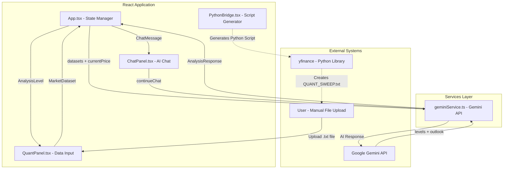
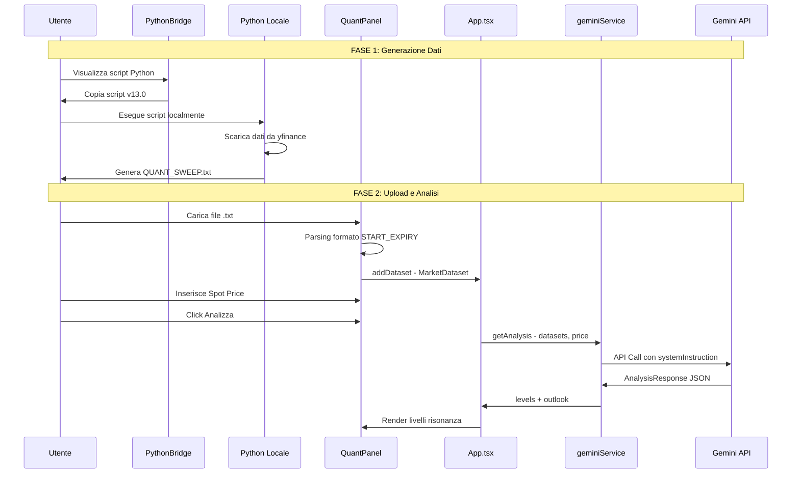
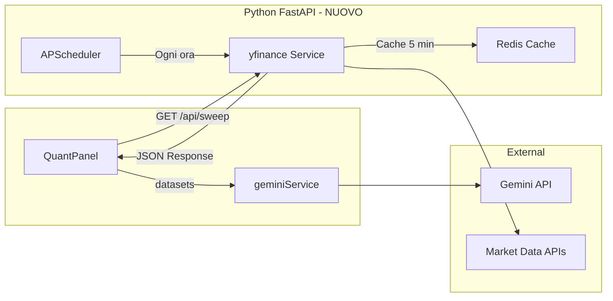

# Analisi dell'Architettura dell'Agente Quant per Opzioni

## 1. Panoramica dell'Architettura

L'applicazione è una React Single Page Application (SPA) che utilizza Vite come build tool e TypeScript per la type safety. L'architettura è centrata sull'analisi quantitativa delle opzioni tramite l'API di Google Gemini.

### Stack Tecnologico
- **Frontend**: React 18 + TypeScript
- **Build Tool**: Vite
- **AI Engine**: Google Gemini API (modello `gemini-3-pro-preview`)
- **Styling**: Tailwind CSS

---

## 2. Diagramma dell'Architettura



---

## 3. Flusso di Caricamento Dati Attuale

### 3.1 Processo Manuale (Stato Attuale)



### 3.2 Formato File Dati Richiesto

Il file `.txt` deve seguire questo formato specifico:

```
--- GLOBAL HEADER ---
SYMBOL: SPY | SPOT: 450.25 | GENERATED: 2026-02-20 10:30:00
--- END HEADER ---

=== START_EXPIRY: 0DTE | DATE: 2026-02-20 ===
STRIKE | TIPO | IV | OI | VOL
449.00 | PUT | 0.2345 | 12500 | 3200
450.00 | CALL | 0.2198 | 18200 | 4500
...
=== END_EXPIRY: 0DTE ===

=== START_EXPIRY: WEEKLY | DATE: 2026-02-27 ===
...
=== END_EXPIRY: WEEKLY ===

=== START_EXPIRY: MONTHLY | DATE: 2026-03-21 ===
...
=== END_EXPIRY: MONTHLY ===
```

---

## 4. Strutture Dati Principali

### 4.1 MarketDataset
```typescript
interface MarketDataset {
  id: string;          // ID univoco generato randomicamente
  name: string;        // Nome visualizzato (es. "0DTE (2026-02-20)")
  content: string;     // Contenuto raw del file
  type: '0DTE' | 'WEEKLY' | 'MONTHLY' | 'OTHER';
}
```

### 4.2 AnalysisLevel - Output dell'Analisi
```typescript
interface AnalysisLevel {
  livello: string;           // Nome del livello
  prezzo: number;            // Strike price
  motivazione: string;       // Spiegazione del livello
  sintesiOperativa: string;  // Segnale trading (max 8 parole)
  colore: 'rosso' | 'verde' | 'indigo' | 'ambra';
  importanza: number;        // 0-100
  ruolo: 'WALL' | 'PIVOT' | 'MAGNET' | 'FRICTION' | 'CONFLUENCE';
  isDayTrade: boolean;
  scadenzaTipo?: string;     // Es. "0DTE", "WEEKLY", "MULTI"
  lato: 'CALL' | 'PUT' | 'BOTH' | 'GAMMA_FLIP';
}
```

### 4.3 DailyOutlook
```typescript
interface DailyOutlook {
  sentiment: string;              // Es. "BULLISH" / "BEARISH"
  gammaFlipZone: number;          // Prezzo del gamma flip
  volatilityExpectation: string;  // Es. "MODERATE"
  summary: string;                // Riassunto armonico
}
```

---

## 5. Punti di Integrazione per l'Automazione

### 5.1 Punto A: Automazione Backend Python

**Posizione**: Nuovo servizio backend

**Descrizione**: Creare un server Python (FastAPI/Flask) che:
1. Esegue lo script yfinance automaticamente
2. Espone endpoint REST per il frontend React
3. Genera e restituisce i dati formattati

**Vantaggi**:
- Elimina l'esecuzione manuale dello script
- Dati sempre aggiornati
- Possibilità di scheduling automatico

### 5.2 Punto B: Modifica QuantPanel - Fetch Automatico

**Posizione**: [`components/QuantPanel.tsx`](components/QuantPanel.tsx:176) - Funzione `handleFile`

**Descrizione**: Aggiungere un nuovo metodo `fetchAutomatedData()` che:
1. Chiama il backend Python
2. Riceve i dati formattati
3. Popola automaticamente i `MarketDataset`

**Codice chiave da modificare**:
```typescript
// Riga 176-218: handleFile attuale
// Aggiungere nuovo handler per fetch automatico
const handleAutoFetch = async () => {
  const response = await fetch('/api/options-sweep?symbol=SPY');
  const data = await response.json();
  // Parsing simile a handleFile
};
```

### 5.3 Punto C: Integrazione Diretta yfinance nel Browser

**Posizione**: Nuovo service

**Descrizione**: Utilizzare un proxy CORS o un servizio serverless per chiamare yfinance direttamente dal browser.

**Limitazioni**: yfinance non ha API HTTP native, richiede Python runtime.

### 5.4 Punto D: Web Scraping / API Alternative

**Posizione**: Nuovo service

**Descrizione**: Utilizzare API di mercato esistenti:
- Alpha Vantage
- IEX Cloud
- Polygon.io
- CBOE Data

---

## 6. Raccomandazioni per l'Automazione

### Soluzione Consigliata: Architettura Ibrida



### Step di Implementazione Consigliati

1. **Creare Backend Python** (FastAPI)
   - Endpoint `GET /api/sweep?symbol=SPY`
   - Esegue yfinance con logica v13.0 esistente
   - Restituisce JSON con struttura `MarketDataset[]`

2. **Modificare QuantPanel.tsx**
   - Aggiungere bottone "Auto Fetch" 
   - Implementare `fetchAutomatedData()`
   - Mantenere fallback upload manuale

3. **Aggiungere Cache**
   - Redis con TTL 5-10 minuti
   - Evitare rate limiting di yfinance

4. **Deploy**
   - Backend su Render/Railway/Fly.io
   - Frontend su Vercel/Netlify
   - Variabile d'ambiente `API_KEY` per Gemini

### Alternative Senza Backend

Se non si vuole gestire un backend:

1. **Serverless Function** (Vercel/Netlify Functions)
   - Funzione Python che esegue yfinance
   - Chiamata diretta dal frontend

2. **GitHub Actions Scheduled**
   - Workflow che genera il file ogni ora
   - Commit su repo privato
   - Frontend fetcha da raw.githubusercontent.com

---

## 7. Riepilogo Componenti Analizzati

| File | Responsabilità | Punti di Integrazione |
|------|---------------|----------------------|
| [`App.tsx`](App.tsx:1) | State management, orchestrazione componenti | Aggiungere stato per auto-fetch |
| [`types.ts`](types.ts:1) | Definizioni TypeScript | Estendere per supportare API response |
| [`services/geminiService.ts`](services/geminiService.ts:1) | Comunicazione Gemini API | Nessuna modifica necessaria |
| [`components/QuantPanel.tsx`](components/QuantPanel.tsx:1) | Input dati, visualizzazione livelli | **Principale punto di modifica** |
| [`components/ChatPanel.tsx`](components/ChatPanel.tsx:1) | Chat interattiva AI | Nessuna modifica necessaria |
| [`components/PythonBridge.tsx`](components/PythonBridge.tsx:1) | Genera script Python | Potrebbe essere rimosso con automazione |

---

## 8. Prossimi Step

1. Decidere l'approccio di automazione (Backend vs Serverless vs GitHub Actions)
2. Implementare il servizio di fetching dati
3. Modificare `QuantPanel.tsx` per supportare auto-fetch
4. Testare end-to-end
5. Rimuovere o deprecare `PythonBridge.tsx`
