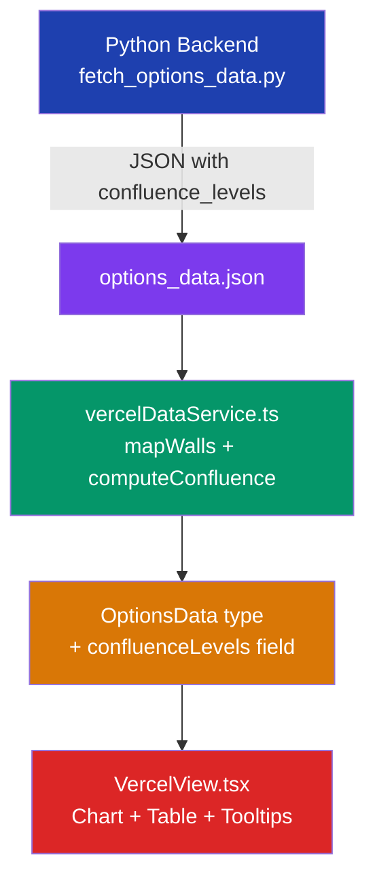

# Confluence Levels — Implementation Plan

## Overview

**Confluence Levels** are a new type of options analysis level that identifies strikes where **both puts and calls** have significant open interest and volume. Unlike Put Walls (support, strikes ≤ spot) and Call Walls (resistance, strikes ≥ spot), Confluence Levels examine **all strikes** and find those with high bilateral interest.

These levels are relevant for:
- **Max Pain theory** — strikes with heavy interest on both sides pin price action
- **Gamma flip detection** — where dealer hedging flips from suppressing to amplifying moves
- **Straddle signatures** — high put+call OI indicates large straddle/strangle positions

---

## Architecture Overview



---

## 1. Python Backend Changes

### File: `scripts/fetch_options_data.py`

### 1.1 New Constants (after line 50)

```python
# Confluence level settings
CONFLUENCE_MIN_INTEREST = 50       # Minimum total interest to qualify
CONFLUENCE_MIN_RATIO = 0.15        # Minimum balance ratio (15%)
CONFLUENCE_INTEREST_WEIGHT = 0.5   # Weight for total interest in score
CONFLUENCE_RATIO_WEIGHT = 0.3      # Weight for balance ratio in score
CONFLUENCE_DISTANCE_WEIGHT = 0.2   # Weight for proximity to spot in score
```

### 1.2 New Function: `calculate_confluence_levels()` (insert after `_score_and_rank`, ~line 378)

This function operates on the **same `strike_data` structure** already built by `calculate_walls()`. It iterates over ALL strikes (no spot-based filtering) and computes bilateral metrics.

```python
def calculate_confluence_levels(
    strike_data: Dict[float, Dict[str, Dict[str, Dict[str, int]]]],
    spot: float,
    expiry_weights_put: Dict[str, float],
    expiry_weights_call: Dict[str, float],
    top_n: int = TOP_N_WALLS,
) -> List[Dict[str, Any]]:
    """
    Identify strikes where both put and call sides have significant interest.

    Unlike put/call walls, confluence levels examine ALL strikes regardless
    of their position relative to spot.

    Metrics:
        - total_interest: weighted sum of put_oi + call_oi + put_vol + call_vol
        - put_side: weighted put_oi + put_vol
        - call_side: weighted call_oi + call_vol
        - confluence_ratio: min(put_side, call_side) / max(put_side, call_side)
          (1.0 = perfectly balanced, 0.0 = one-sided)

    Returns:
        List of confluence level dicts sorted by score desc.
    """
    candidates = []

    for strike, sides in strike_data.items():
        # Weighted put side totals
        put_oi = sum(
            e["oi"] * expiry_weights_put.get(exp, 1.0)
            for exp, e in sides.get("put", {}).items()
        )
        put_vol = sum(
            e["vol"] * expiry_weights_put.get(exp, 1.0)
            for exp, e in sides.get("put", {}).items()
        )

        # Weighted call side totals
        call_oi = sum(
            e["oi"] * expiry_weights_call.get(exp, 1.0)
            for exp, e in sides.get("call", {}).items()
        )
        call_vol = sum(
            e["vol"] * expiry_weights_call.get(exp, 1.0)
            for exp, e in sides.get("call", {}).items()
        )

        put_side = put_oi + put_vol
        call_side = call_oi + call_vol
        total_interest = put_side + call_side

        # Skip strikes with insufficient total interest
        if total_interest < CONFLUENCE_MIN_INTEREST:
            continue

        # Balance ratio: how evenly distributed is the interest
        max_side = max(put_side, call_side)
        confluence_ratio = min(put_side, call_side) / max_side if max_side > 0 else 0.0

        # Skip strikes that are too one-sided
        if confluence_ratio < CONFLUENCE_MIN_RATIO:
            continue

        # Build expiry breakdown (both sides combined)
        all_expiry_dates = set(sides.get("put", {}).keys()) | set(sides.get("call", {}).keys())
        expiry_breakdown = {}
        for exp_date in all_expiry_dates:
            put_data = sides.get("put", {}).get(exp_date, {"oi": 0, "vol": 0})
            call_data = sides.get("call", {}).get(exp_date, {"oi": 0, "vol": 0})
            expiry_breakdown[exp_date] = {
                "put_oi": put_data["oi"],
                "put_vol": put_data["vol"],
                "call_oi": call_data["oi"],
                "call_vol": call_data["vol"],
                "weight": max(
                    expiry_weights_put.get(exp_date, 1.0),
                    expiry_weights_call.get(exp_date, 1.0),
                ),
            }

        candidates.append({
            "strike": strike,
            "put_oi": put_oi,
            "put_vol": put_vol,
            "call_oi": call_oi,
            "call_vol": call_vol,
            "total_interest": total_interest,
            "confluence_ratio": round(confluence_ratio, 4),
            "expiry_breakdown": expiry_breakdown,
            "type": "confluence",
        })

    if not candidates:
        return []

    # Score: normalize interest, ratio, and distance separately
    interests = [c["total_interest"] for c in candidates]
    ratios = [c["confluence_ratio"] for c in candidates]
    distances = [abs(c["strike"] - spot) / spot for c in candidates]

    norm_interest = min_max_normalize(interests)
    norm_ratio = min_max_normalize(ratios)
    # Invert distance: closer to spot = higher score
    norm_distance = [1.0 - d for d in min_max_normalize(distances)]

    for i, c in enumerate(candidates):
        c["score"] = round(
            norm_interest[i] * CONFLUENCE_INTEREST_WEIGHT
            + norm_ratio[i] * CONFLUENCE_RATIO_WEIGHT
            + norm_distance[i] * CONFLUENCE_DISTANCE_WEIGHT,
            6,
        )
        c["distance_pct"] = round((c["strike"] - spot) / spot * 100, 2)
        c["contributing_expiries"] = sorted(c["expiry_breakdown"].keys())

    candidates.sort(key=lambda x: x["score"], reverse=True)
    return candidates
```

### 1.3 Modify `calculate_walls()` to Return Confluence Levels (line 257–351)

Change the function signature and add the confluence calculation:

**Line 257–261** — Update signature:

```python
def calculate_walls(
    all_options_by_expiry: List[Dict[str, Any]],
    spot: float,
    top_n: int = TOP_N_WALLS,
) -> Tuple[List[Dict[str, Any]], List[Dict[str, Any]], List[Dict[str, Any]]]:
```

**Line 347–351** — Add confluence calculation before return:

```python
    # Score and rank traditional walls
    put_walls = _score_and_rank(put_candidates, spot, top_n)
    call_walls = _score_and_rank(call_candidates, spot, top_n)

    # Calculate confluence levels from the same strike_data
    confluence_levels = calculate_confluence_levels(
        strike_data, spot, expiry_weights_put, expiry_weights_call, top_n
    )

    return put_walls, call_walls, confluence_levels
```

### 1.4 Update Call Site in `fetch_symbol_data()` (line 512)

**Line 512** — Unpack three values:

```python
    put_walls_raw, call_walls_raw, confluence_raw = calculate_walls(all_options_by_expiry, spot)
```

### 1.5 Build Confluence Wall Structures (insert after line 559, before step 7)

```python
    confluence_levels = [
        {
            "strike": w["strike"],
            "type": "confluence",
            "put_oi": w["put_oi"],
            "put_vol": w["put_vol"],
            "call_oi": w["call_oi"],
            "call_vol": w["call_vol"],
            "total_interest": w["total_interest"],
            "confluence_ratio": w["confluence_ratio"],
            "score": round(w["score"] * 100, 1),
            "contributing_expiries": w["contributing_expiries"],
            "distance_pct": w["distance_pct"],
            "expirations": [
                {
                    "expiration_date": exp_date,
                    "days_to_expiry": days_to_expiry(exp_date),
                    "put_oi": data["put_oi"],
                    "put_vol": data["put_vol"],
                    "call_oi": data["call_oi"],
                    "call_vol": data["call_vol"],
                    "weight": data.get("weight", 1.0),
                }
                for exp_date, data in w["expiry_breakdown"].items()
            ],
        }
        for w in confluence_raw
    ]
```

### 1.6 Add to Output JSON (line 574–583)

**Line 579–582** — Add `confluence_levels` to the walls dict:

```python
    result = {
        "spot": spot,
        "generated": now_iso,
        "oi_fallback_used": oi_fallback_used,
        "expiries": raw_expiries,
        "walls": {
            "put_walls": put_walls,
            "call_walls": call_walls,
            "confluence_levels": confluence_levels,
        },
    }
```

### 1.7 Update Summary Logging (line 585–587)

```python
    logger.info(
        f"✅ {symbol}: {len(put_walls)} put walls, {len(call_walls)} call walls, "
        f"{len(confluence_levels)} confluence levels identified"
    )
```

### 1.8 Update `main()` Summary (line 691–696)

```python
    total_confluence = sum(
        len(symbols_data[s].get("walls", {}).get("confluence_levels", []))
        for s in symbols_data
    )
    logger.info(
        f"📊 Summary: {len(symbols_data)} symbols, "
        f"{total_put} total put walls, {total_call} total call walls, "
        f"{total_confluence} confluence levels"
    )
```

---

## 2. TypeScript Type Changes

### File: `types.ts`

### 2.1 Extend `WallLevel` Type (line 3–10)

Add `'confluence'` to the type union and optional confluence-specific fields:

```typescript
export interface WallLevel {
  strike: number;
  totalOI: number;        // sum of OI across all expirations at this strike
  totalVolume: number;    // sum of volume across all expirations at this strike
  score: number;          // combined score: OI*0.6 + Volume*0.4 (normalized)
  expirations: ExpirationDetail[];  // breakdown per expiration
  type: 'put' | 'call' | 'confluence';

  // Confluence-specific fields (undefined for put/call walls)
  putOI?: number;           // weighted put OI at this strike
  putVolume?: number;       // weighted put volume at this strike
  callOI?: number;          // weighted call OI at this strike
  callVolume?: number;      // weighted call volume at this strike
  totalInterest?: number;   // putOI + callOI + putVolume + callVolume
  confluenceRatio?: number; // balance metric 0-1 (1 = perfectly balanced)
}
```

### 2.2 Extend `ExpirationDetail` (line 12–18)

Add optional confluence fields:

```typescript
export interface ExpirationDetail {
  expirationDate: string;   // e.g. "2026-05-16"
  daysToExpiry: number;
  oi: number;
  volume: number;
  weight: number;           // 0.0 to 1.0, based on contract count relative to most liquid expiration

  // Confluence-specific per-expiry breakdown
  putOI?: number;
  putVolume?: number;
  callOI?: number;
  callVolume?: number;
}
```

### 2.3 Extend `OptionsData` (line 20–27)

Add the confluence levels array:

```typescript
export interface OptionsData {
  symbol: string;
  spotPrice: number;
  timestamp: string;        // ISO timestamp of data fetch
  putWalls: WallLevel[];    // top put walls (supports), sorted by score desc
  callWalls: WallLevel[];   // top call walls (resistances), sorted by score desc
  confluenceLevels: WallLevel[];  // strikes with high bilateral interest
  allExpirations: string[]; // list of all expiration dates analyzed
}
```

---

## 3. TypeScript Service Changes

### File: `services/vercelDataService.ts`

### 3.1 Update `RawSymbolData` Interface (line 33–41)

Add `confluence_levels` to the walls structure:

```typescript
interface RawSymbolData {
  spot: number;
  generated: string;
  expiries: RawExpiry[];
  walls?: {
    put_walls: RawWall[];
    call_walls: RawWall[];
    confluence_levels?: RawConfluenceLevel[];  // NEW — optional for backward compat
  };
}
```

### 3.2 Add `RawConfluenceLevel` Interface (after `RawWall`, ~line 73)

```typescript
interface RawConfluenceExpiration {
  expiration_date: string;
  days_to_expiry: number;
  put_oi: number;
  put_vol: number;
  call_oi: number;
  call_vol: number;
  weight: number;
}

interface RawConfluenceLevel {
  strike: number;
  type: 'confluence';
  put_oi: number;
  put_vol: number;
  call_oi: number;
  call_vol: number;
  total_interest: number;
  confluence_ratio: number;
  score: number;
  contributing_expiries: string[];
  distance_pct: number;
  expirations?: RawConfluenceExpiration[];
}
```

### 3.3 Add `mapConfluenceLevels()` Function (after `mapWalls()`, ~line 214)

```typescript
/**
 * Maps raw confluence level data from JSON to WallLevel[] for the frontend.
 */
function mapConfluenceLevels(
  rawLevels: RawConfluenceLevel[],
  expiries: RawExpiry[]
): WallLevel[] {
  if (!rawLevels || !Array.isArray(rawLevels)) return [];

  return rawLevels.map(w => ({
    strike: w.strike,
    totalOI: w.put_oi + w.call_oi,
    totalVolume: w.put_vol + w.call_vol,
    score: w.score,
    type: 'confluence' as const,
    putOI: w.put_oi,
    putVolume: w.put_vol,
    callOI: w.call_oi,
    callVolume: w.call_vol,
    totalInterest: w.total_interest,
    confluenceRatio: w.confluence_ratio,
    expirations: w.expirations && w.expirations.length > 0
      ? w.expirations.map(e => ({
          expirationDate: e.expiration_date,
          daysToExpiry: e.days_to_expiry,
          oi: e.put_oi + e.call_oi,
          volume: e.put_vol + e.call_vol,
          weight: e.weight ?? 1.0,
          putOI: e.put_oi,
          putVolume: e.put_vol,
          callOI: e.call_oi,
          callVolume: e.call_vol,
        }))
      : buildConfluenceExpirationDetails(w.strike, expiries),
  }));
}
```

### 3.4 Add `buildConfluenceExpirationDetails()` Helper (after `buildExpirationDetails()`, ~line 186)

```typescript
/**
 * Builds per-expiration breakdown for a confluence strike by looking up
 * both PUT and CALL data from each expiry.
 */
function buildConfluenceExpirationDetails(
  strike: number,
  expiries: RawExpiry[]
): ExpirationDetail[] {
  const details: ExpirationDetail[] = [];

  for (const expiry of expiries) {
    const putMatch = expiry.options.find(
      opt => opt.strike === strike && opt.side === 'PUT'
    );
    const callMatch = expiry.options.find(
      opt => opt.strike === strike && opt.side === 'CALL'
    );

    const putOI = putMatch?.oi ?? 0;
    const putVol = putMatch?.vol ?? 0;
    const callOI = callMatch?.oi ?? 0;
    const callVol = callMatch?.vol ?? 0;

    if (putOI > 0 || putVol > 0 || callOI > 0 || callVol > 0) {
      const expiryDate = new Date(expiry.date);
      const now = new Date();
      const daysToExpiry = Math.max(0, Math.ceil(
        (expiryDate.getTime() - now.getTime()) / (1000 * 60 * 60 * 24)
      ));

      details.push({
        expirationDate: expiry.date,
        daysToExpiry,
        oi: putOI + callOI,
        volume: putVol + callVol,
        weight: 1.0,
        putOI,
        putVolume: putVol,
        callOI,
        callVolume: callVol,
      });
    }
  }

  return details;
}
```

### 3.5 Add `computeConfluenceFromExpiries()` for Fallback (after `computeWallsFromExpiries()`, ~line 297)

```typescript
/**
 * Computes confluence levels from raw expiry data (old format v2.0 fallback).
 */
function computeConfluenceFromExpiries(
  expiries: RawExpiry[],
  spotPrice: number
): WallLevel[] {
  // Aggregate OI and Volume per strike, per side
  const strikeMap = new Map<number, { putOI: number; putVol: number; callOI: number; callVol: number }>();

  for (const expiry of expiries) {
    for (const opt of expiry.options) {
      const existing = strikeMap.get(opt.strike) || { putOI: 0, putVol: 0, callOI: 0, callVol: 0 };
      if (opt.side === 'PUT') {
        existing.putOI += opt.oi;
        existing.putVol += opt.vol;
      } else {
        existing.callOI += opt.oi;
        existing.callVol += opt.vol;
      }
      strikeMap.set(opt.strike, existing);
    }
  }

  // Filter: require both sides to have activity
  const entries = Array.from(strikeMap.entries()).filter(
    ([, d]) => (d.putOI + d.putVol > 0) && (d.callOI + d.callVol > 0)
  );

  if (entries.length === 0) return [];

  // Compute metrics
  const scored = entries.map(([strike, data]) => {
    const putSide = data.putOI + data.putVol;
    const callSide = data.callOI + data.callVol;
    const totalInterest = putSide + callSide;
    const maxSide = Math.max(putSide, callSide);
    const confluenceRatio = maxSide > 0 ? Math.min(putSide, callSide) / maxSide : 0;

    return { strike, ...data, totalInterest, confluenceRatio };
  });

  // Filter by minimum ratio
  const filtered = scored.filter(s => s.confluenceRatio >= 0.15);
  if (filtered.length === 0) return [];

  // Normalize
  const interests = filtered.map(s => s.totalInterest);
  const ratios = filtered.map(s => s.confluenceRatio);
  const distances = filtered.map(s => Math.abs(s.strike - spotPrice) / spotPrice);

  const minInt = Math.min(...interests);
  const maxInt = Math.max(...interests);
  const minRat = Math.min(...ratios);
  const maxRat = Math.max(...ratios);
  const minDist = Math.min(...distances);
  const maxDist = Math.max(...distances);

  const result = filtered.map(s => {
    const normInt = maxInt > minInt ? (s.totalInterest - minInt) / (maxInt - minInt) : 1;
    const normRat = maxRat > minRat ? (s.confluenceRatio - minRat) / (maxRat - minRat) : 1;
    const normDist = maxDist > minDist ? 1 - (Math.abs(s.strike - spotPrice) / spotPrice - minDist) / (maxDist - minDist) : 1;
    const score = normInt * 0.5 + normRat * 0.3 + normDist * 0.2;

    return {
      strike: s.strike,
      totalOI: s.putOI + s.callOI,
      totalVolume: s.putVol + s.callVol,
      score: Math.round(score * 1000) / 10,
      type: 'confluence' as const,
      putOI: s.putOI,
      putVolume: s.putVol,
      callOI: s.callOI,
      callVolume: s.callVol,
      totalInterest: s.totalInterest,
      confluenceRatio: Math.round(s.confluenceRatio * 10000) / 10000,
      expirations: buildConfluenceExpirationDetails(s.strike, expiries),
    };
  });

  result.sort((a, b) => b.score - a.score);
  return result;
}
```

### 3.6 Update `fetchOptionsData()` (line 310–354)

Add confluence level handling in both the new-format and old-format branches:

**Line 328–344** — Add confluence level resolution:

```typescript
  let putWalls: WallLevel[];
  let callWalls: WallLevel[];
  let confluenceLevels: WallLevel[];

  if (symbolData.walls) {
    // New format: walls are pre-computed in the JSON
    putWalls = mapWalls(symbolData.walls.put_walls, 'put', symbolData.expiries || []);
    callWalls = mapWalls(symbolData.walls.call_walls, 'call', symbolData.expiries || []);
    // Confluence levels (optional — backward compatible)
    confluenceLevels = symbolData.walls.confluence_levels
      ? mapConfluenceLevels(symbolData.walls.confluence_levels, symbolData.expiries || [])
      : computeConfluenceFromExpiries(symbolData.expiries || [], symbolData.spot);
  } else if (symbolData.expiries && symbolData.expiries.length > 0) {
    // Old format (v2.0): compute walls on the fly from raw options data
    console.log(`[vercelDataService] Computing walls from raw expiry data for "${upperSymbol}" (old format v2.0)`);
    const computed = computeWallsFromExpiries(symbolData.expiries, symbolData.spot);
    putWalls = computed.putWalls;
    callWalls = computed.callWalls;
    confluenceLevels = computeConfluenceFromExpiries(symbolData.expiries, symbolData.spot);
  } else {
    console.warn(`[vercelDataService] No wall data found for "${upperSymbol}"`);
    return null;
  }
```

**Line 346–354** — Include in return object:

```typescript
  return {
    symbol: upperSymbol,
    spotPrice: symbolData.spot,
    timestamp: symbolData.generated || raw.generated,
    putWalls,
    callWalls,
    confluenceLevels,
    allExpirations,
  };
```

---

## 4. View Component Changes

### File: `components/VercelView.tsx`

### 4.1 Chart: Add Confluence Level Markers in `PricePositionBar` (after call wall bars, ~line 486)

Add dashed vertical lines at confluence strike positions. These render as **orange dashed lines** spanning the full chart height, making them visually distinct from the put/call histogram bars.

```tsx
{/* Confluence level markers — dashed orange vertical lines */}
{data.confluenceLevels && data.confluenceLevels
  .filter(w => w.confluenceRatio && w.confluenceRatio >= 0.3)  // Only show meaningful confluence
  .slice(0, 10)  // Limit to top 10
  .map((w, i) => (
    <div
      key={`confluence-${i}`}
      className="absolute top-0 bottom-0 z-5 pointer-events-none"
      style={{
        left: `${pct(w.strike)}%`,
        width: '2px',
        backgroundImage: 'repeating-linear-gradient(to bottom, #f97316 0px, #f97316 4px, transparent 4px, transparent 8px)',
        opacity: 0.6 + (w.confluenceRatio ?? 0) * 0.4,  // Higher ratio = more opaque
      }}
      title={`Confluence $${formatStrike(w.strike)} | Ratio: ${((w.confluenceRatio ?? 0) * 100).toFixed(0)}%`}
    />
  ))
}
```

### 4.2 Chart: Add Confluence Tooltip State

Extend the tooltip state to handle confluence levels. Add a new state variable near line 218:

```tsx
const [hoveredConfluence, setHoveredConfluence] = useState<{
  level: WallLevel;
  leftPct: number;
} | null>(null);
```

### 4.3 Chart: Add Interactive Confluence Markers (alternative to 4.1)

For clickable/hoverable confluence markers, replace the simple dashed lines with interactive elements:

```tsx
{/* Confluence level markers — interactive dashed orange lines */}
{data.confluenceLevels && data.confluenceLevels
  .filter(w => w.confluenceRatio && w.confluenceRatio >= 0.3)
  .slice(0, 10)
  .map((w, i) => (
    <div
      key={`confluence-${i}`}
      className="absolute top-0 bottom-0 cursor-pointer"
      style={{
        left: `${pct(w.strike)}%`,
        width: '12px',
        transform: 'translateX(-50%)',
        backgroundImage: 'repeating-linear-gradient(to bottom, #f97316 0px, #f97316 4px, transparent 4px, transparent 8px)',
        opacity: 0.5 + (w.confluenceRatio ?? 0) * 0.5,
        zIndex: 5,
      }}
      onMouseEnter={() => setHoveredConfluence({ level: w, leftPct: pct(w.strike) })}
      onMouseLeave={() => setHoveredConfluence(null)}
    />
  ))
}

{/* Confluence tooltip */}
{hoveredConfluence && (() => {
  const w = hoveredConfluence.level;
  const dist = distancePct(w.strike, spotPrice);
  const tooltipLeft = Math.max(12, Math.min(88, hoveredConfluence.leftPct));
  return (
    <div
      className="absolute z-50 pointer-events-none"
      style={{
        left: `${tooltipLeft}%`,
        bottom: '8px',
        transform: 'translateX(-50%)',
      }}
    >
      <div className="bg-gray-900 text-white text-[11px] leading-relaxed rounded-lg shadow-xl border border-orange-500/50 px-3 py-2 whitespace-nowrap">
        <div className="font-semibold text-orange-400 mb-1">
          ⚡ Confluence: ${formatStrike(w.strike)}
        </div>
        <div className="flex items-center gap-1.5">
          <div style={{ width: '8px', height: '8px', backgroundColor: 'rgba(16, 185, 129, 0.8)', borderRadius: '2px' }} />
          Put OI: {(w.putOI ?? 0).toLocaleString()}
        </div>
        <div className="flex items-center gap-1.5">
          <div style={{ width: '8px', height: '8px', backgroundColor: 'rgba(239, 68, 68, 0.8)', borderRadius: '2px' }} />
          Call OI: {(w.callOI ?? 0).toLocaleString()}
        </div>
        <div className="text-orange-300">
          Ratio: {((w.confluenceRatio ?? 0) * 100).toFixed(1)}%
        </div>
        <div>Total Interest: {(w.totalInterest ?? 0).toLocaleString()}</div>
        <div>Distance: {dist > 0 ? '+' : ''}{dist.toFixed(2)}%</div>
      </div>
    </div>
  );
})()}
```

### 4.4 Chart: Update Legend (line 558–567)

Add confluence entry to the legend bar:

```tsx
<div className="flex items-center gap-4 justify-center py-1 bg-gray-800/30 border-t border-gray-700/50">
  <div className="flex items-center gap-1">
    <div style={{ width: '12px', height: '8px', backgroundColor: 'rgba(16, 185, 129, 0.8)', borderRadius: '2px' }} />
    <span className="text-[10px] text-gray-400">OI</span>
  </div>
  <div className="flex items-center gap-1">
    <div style={{ width: '12px', height: '8px', backgroundColor: 'rgba(52, 211, 153, 0.45)', borderRadius: '2px' }} />
    <span className="text-[10px] text-gray-400">Volume</span>
  </div>
  <div className="flex items-center gap-1">
    <div style={{
      width: '12px', height: '8px',
      backgroundImage: 'repeating-linear-gradient(to right, #f97316 0px, #f97316 3px, transparent 3px, transparent 6px)',
    }} />
    <span className="text-[10px] text-gray-400">Confluence</span>
  </div>
</div>
```

### 4.5 Add Confluence Table Component (after `WallTable`, ~line 204)

A new table component specifically for confluence levels, showing both put and call side data:

```tsx
const ConfluenceTable: React.FC<{
  levels: WallLevel[];
  spotPrice: number;
}> = ({ levels, spotPrice }) => {
  const [expandedStrike, setExpandedStrike] = useState<number | null>(null);
  const maxInterest = levels.length > 0 ? Math.max(...levels.map(w => w.totalInterest ?? 0)) : 1;

  const toggle = (strike: number) => {
    setExpandedStrike(prev => prev === strike ? null : strike);
  };

  if (levels.length === 0) {
    return (
      <div className="bg-gray-800/50 rounded-xl border border-gray-700 p-6">
        <h3 className="text-lg font-semibold text-orange-400">⚡ Confluence Levels</h3>
        <p className="text-gray-500 text-sm mt-2">No significant confluence levels detected</p>
      </div>
    );
  }

  return (
    <div className="bg-gray-800/50 rounded-xl border border-gray-700 overflow-hidden">
      <div className="px-4 py-3 border-b border-gray-700 bg-orange-900/20">
        <h3 className="text-lg font-semibold text-orange-400">
          ⚡ Confluence Levels
        </h3>
        <p className="text-xs text-gray-400 mt-0.5">
          {levels.length} strike{levels.length !== 1 ? 's' : ''} with high bilateral interest • sorted by score
        </p>
      </div>

      <div className="overflow-x-auto">
        <table className="w-full text-sm">
          <thead>
            <tr className="text-xs text-gray-500 uppercase tracking-wider border-b border-gray-700">
              <th className="px-4 py-2 text-left">Strike</th>
              <th className="px-4 py-2 text-right">Put OI</th>
              <th className="px-4 py-2 text-right">Call OI</th>
              <th className="px-4 py-2 text-right">Ratio</th>
              <th className="px-4 py-2 text-right">Interest</th>
              <th className="px-4 py-2 text-right">Detail</th>
            </tr>
          </thead>
          <tbody>
            {levels.slice(0, 15).map((level) => {
              const dist = distancePct(level.strike, spotPrice);
              const interestPct = maxInterest > 0 ? ((level.totalInterest ?? 0) / maxInterest) * 100 : 0;
              const ratioPct = ((level.confluenceRatio ?? 0) * 100);
              const isExpanded = expandedStrike === level.strike;

              return (
                <React.Fragment key={level.strike}>
                  <tr
                    className="hover:bg-gray-750 cursor-pointer transition-colors border-b border-gray-700/50"
                    onClick={() => toggle(level.strike)}
                  >
                    <td className="px-4 py-2.5 font-mono font-semibold text-white">
                      <span className="flex items-center gap-2">
                        {isExpanded ? <IconChevronUp className="h-3 w-3 text-gray-500" /> : <IconChevronDown className="h-3 w-3 text-gray-500" />}
                        {formatStrike(level.strike)}
                      </span>
                    </td>
                    <td className="px-4 py-2.5 text-right text-emerald-400">{formatCompact(level.putOI ?? 0)}</td>
                    <td className="px-4 py-2.5 text-right text-red-400">{formatCompact(level.callOI ?? 0)}</td>
                    <td className="px-4 py-2.5 text-right">
                      <div className="flex items-center gap-1 justify-end">
                        <div className="w-12 bg-gray-700 rounded-full h-1.5 overflow-hidden">
                          <div className="h-full rounded-full bg-orange-400" style={{ width: `${ratioPct}%` }} />
                        </div>
                        <span className="text-xs text-orange-300">{ratioPct.toFixed(0)}%</span>
                      </div>
                    </td>
                    <td className="px-4 py-2.5 text-right text-gray-300">{formatCompact(level.totalInterest ?? 0)}</td>
                    <td className="px-4 py-2.5 text-right text-xs text-orange-400">
                      {level.expirations.length} exp
                      <span className="ml-2 text-gray-500">
                        {dist > 0 ? '+' : ''}{dist.toFixed(1)}%
                      </span>
                    </td>
                  </tr>
                  {isExpanded && level.expirations.map((exp, i) => (
                    <tr key={`${level.strike}-${exp.expirationDate}-${i}`} className="bg-gray-800/50 text-xs text-gray-400">
                      <td className="px-4 py-1.5 pl-10">{exp.expirationDate}</td>
                      <td className="px-4 py-1.5 text-right text-emerald-400/60">{formatCompact(exp.putOI ?? 0)}</td>
                      <td className="px-4 py-1.5 text-right text-red-400/60">{formatCompact(exp.callOI ?? 0)}</td>
                      <td className="px-4 py-1.5 text-right">-</td>
                      <td className="px-4 py-1.5 text-right">{formatCompact(exp.putOI ?? 0 + exp.callOI ?? 0)}</td>
                      <td className="px-4 py-1.5 text-right text-gray-500">{exp.daysToExpiry}d</td>
                    </tr>
                  ))}
                </React.Fragment>
              );
            })}
          </tbody>
        </table>
      </div>
    </div>
  );
};
```

### 4.6 Add Confluence Table to Main Layout (line 954–972)

Insert the confluence table between the chart and the wall tables, or as a full-width section above the two wall tables:

```tsx
{/* Confluence Levels — full width */}
{displayData!.confluenceLevels && displayData!.confluenceLevels.length > 0 && (
  <ConfluenceTable
    levels={[...displayData!.confluenceLevels]
      .sort((a, b) => b.score - a.score)
      .slice(0, 15)}
    spotPrice={data.spotPrice}
  />
)}

{/* Wall Tables — side by side on desktop, stacked on mobile */}
<div className="grid grid-cols-1 lg:grid-cols-2 gap-6">
  {/* ... existing put/call wall tables ... */}
</div>
```

### 4.7 Update `filteredData` useMemo (line 649–685)

Add confluence levels to the expiration filter logic:

```typescript
  const filteredData = useMemo(() => {
    if (!data || expirationFilter === 'all') return data;

    const filterFn = (exp: ExpirationDetail) => {
      switch (expirationFilter) {
        case '0dte': return exp.daysToExpiry === 0;
        case '1-7dte': return exp.daysToExpiry >= 1 && exp.daysToExpiry <= 7;
        case '8-30dte': return exp.daysToExpiry >= 8 && exp.daysToExpiry <= 30;
        case '30+dte': return exp.daysToExpiry > 30;
        default: return true;
      }
    };

    const filterWalls = (walls: WallLevel[]): WallLevel[] => {
      return walls
        .map(wall => {
          const filteredExps = wall.expirations.filter(filterFn);
          const totalOI = filteredExps.reduce((sum, e) => sum + e.oi, 0);
          const totalVolume = filteredExps.reduce((sum, e) => sum + e.volume, 0);
          const scoreRatio = totalOI > 0 ? totalOI / wall.totalOI : 0;
          return {
            ...wall,
            totalOI,
            totalVolume,
            score: wall.score * scoreRatio,
            expirations: filteredExps,
          };
        })
        .filter(wall => wall.totalOI > 0);
    };

    const filterConfluence = (levels: WallLevel[]): WallLevel[] => {
      return levels
        .map(level => {
          const filteredExps = level.expirations.filter(filterFn);
          const putOI = filteredExps.reduce((sum, e) => sum + (e.putOI ?? 0), 0);
          const callOI = filteredExps.reduce((sum, e) => sum + (e.callOI ?? 0), 0);
          const putVol = filteredExps.reduce((sum, e) => sum + (e.putVolume ?? 0), 0);
          const callVol = filteredExps.reduce((sum, e) => sum + (e.callVolume ?? 0), 0);
          const totalInterest = putOI + callOI + putVol + callVol;
          const putSide = putOI + putVol;
          const callSide = callOI + callVol;
          const maxSide = Math.max(putSide, callSide);
          const confluenceRatio = maxSide > 0 ? Math.min(putSide, callSide) / maxSide : 0;
          return {
            ...level,
            totalOI: putOI + callOI,
            totalVolume: putVol + callVol,
            putOI, callOI, putVolume: putVol, callVolume: callVol,
            totalInterest,
            confluenceRatio,
            expirations: filteredExps,
          };
        })
        .filter(level => (level.totalInterest ?? 0) > 0 && (level.confluenceRatio ?? 0) >= 0.15);
    };

    return {
      ...data,
      putWalls: filterWalls(data.putWalls),
      callWalls: filterWalls(data.callWalls),
      confluenceLevels: data.confluenceLevels ? filterConfluence(data.confluenceLevels) : [],
    };
  }, [data, expirationFilter]);
```

### 4.8 Update `displayData` useMemo (line 688–695)

Add confluence levels to the top-15 display data:

```typescript
  const displayData = useMemo(() => {
    if (!filteredData) return null;
    return {
      ...filteredData,
      putWalls: [...filteredData.putWalls].sort((a, b) => b.score - a.score).slice(0, 15),
      callWalls: [...filteredData.callWalls].sort((a, b) => b.score - a.score).slice(0, 15),
      confluenceLevels: filteredData.confluenceLevels
        ? [...filteredData.confluenceLevels].sort((a, b) => b.score - a.score).slice(0, 15)
        : [],
    };
  }, [filteredData]);
```

### 4.9 Update Info Bar (line 934–951)

Add confluence count to the info bar:

```tsx
<span>{displayData!.putWalls.length} put walls, {displayData!.callWalls.length} call walls, {displayData!.confluenceLevels?.length ?? 0} confluence</span>
```

### 4.10 Update `PricePositionBar` Props

The `PricePositionBar` component receives `data: OptionsData`. Since `OptionsData` now includes `confluenceLevels`, the component can access it via `data.confluenceLevels`. No prop changes needed — just use the new field directly.

---

## 5. Data Format & Backward Compatibility

### 5.1 JSON Output Format

The new `confluence_levels` array appears inside the existing `walls` object:

```json
{
  "version": "3.0",
  "generated": "2026-05-20T12:00:00+00:00",
  "symbols": {
    "SPY": {
      "spot": 738.40,
      "generated": "2026-05-20T12:00:00+00:00",
      "expiries": [ /* ... unchanged ... */ ],
      "walls": {
        "put_walls": [ /* ... unchanged ... */ ],
        "call_walls": [ /* ... unchanged ... */ ],
        "confluence_levels": [
          {
            "strike": 740.0,
            "type": "confluence",
            "put_oi": 125000,
            "put_vol": 45000,
            "call_oi": 98000,
            "call_vol": 38000,
            "total_interest": 306000,
            "confluence_ratio": 0.6172,
            "score": 78.5,
            "contributing_expiries": ["2026-06-19", "2026-07-17"],
            "distance_pct": 0.22,
            "expirations": [
              {
                "expiration_date": "2026-06-19",
                "days_to_expiry": 30,
                "put_oi": 80000,
                "put_vol": 30000,
                "call_oi": 65000,
                "call_vol": 25000,
                "weight": 0.95
              }
            ]
          }
        ]
      }
    }
  }
}
```

### 5.2 Backward Compatibility Guarantees

| Scenario | Behavior |
|---|---|
| Old JSON without `confluence_levels` | TypeScript service falls back to `computeConfluenceFromExpiries()` |
| Old `WallLevel` without confluence fields | Optional fields (`putOI`, `confluenceRatio`, etc.) default to `undefined` |
| `type` field | Existing code checks `isPut` boolean, not `type` — confluence levels are handled separately |
| `OptionsData` without `confluenceLevels` | Component guards with `data.confluenceLevels &&` before rendering |

---

## 6. Implementation Order

The recommended implementation sequence:

1. **`types.ts`** — Add new fields to `WallLevel`, `ExpirationDetail`, `OptionsData`
2. **`scripts/fetch_options_data.py`** — Add `calculate_confluence_levels()`, modify `calculate_walls()`, update output
3. **`services/vercelDataService.ts`** — Add raw types, mapping functions, fallback computation, update `fetchOptionsData()`
4. **`components/VercelView.tsx`** — Add chart markers, tooltip, table component, update layout and filters

---

## 7. Visual Design Summary

| Element | Put Walls | Call Walls | Confluence Levels |
|---|---|---|---|
| Chart representation | Green histogram bars | Red histogram bars | Orange dashed vertical lines |
| Table accent | `text-emerald-400` | `text-red-400` | `text-orange-400` |
| Table header bg | `bg-emerald-900/20` | `bg-red-900/20` | `bg-orange-900/20` |
| Icon | ▼ | ▲ | ⚡ |
| Tooltip border | default | default | `border-orange-500/50` |
| Legend | green square | red square | orange dashed line |

---

## 8. Testing Checklist

- [ ] Python script runs and produces `confluence_levels` in JSON output
- [ ] JSON structure validates against expected schema
- [ ] TypeScript service correctly maps pre-computed confluence levels
- [ ] TypeScript fallback computation works with old-format data (no `confluence_levels` in JSON)
- [ ] Chart renders orange dashed lines at confluence strikes
- [ ] Confluence tooltips show put OI, call OI, ratio, total interest
- [ ] Confluence table displays correctly with expandable rows
- [ ] Expiration filter correctly filters confluence levels
- [ ] Top-15 limit applies to confluence levels in display
- [ ] No confluence levels shown when data is absent (graceful degradation)
- [ ] Existing put/call wall functionality is unchanged
