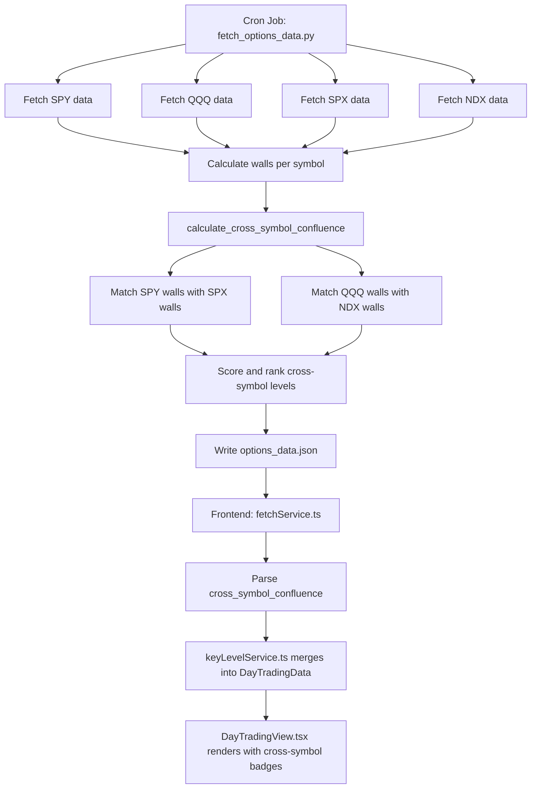
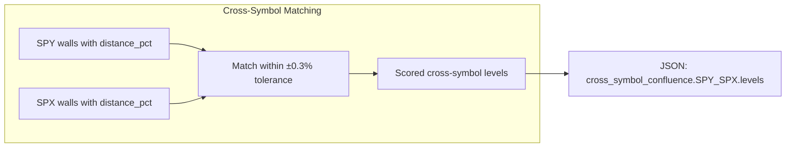

# Cross-Symbol Confluence Levels — Design Document

## 1. Problem Statement

The options dashboard fetches data for 4 instruments: **SPY**, **QQQ**, **SPX**, **NDX**. Currently, key levels (walls, confluence) are computed independently per symbol. However, since SPY↔SPX and QQQ↔NDX track the same underlying basket, a price level where **both** the ETF and its corresponding index show significant options activity is far more meaningful than a level identified on only one.

**Goal**: Design an algorithm that finds **cross-symbol confluence levels** — price levels where both the ETF and its paired index have significant options activity (high OI and volume).

**Pairs**:
- **SPY ↔ SPX** — ratio ≈ 10× (SPX_price / SPY_price)
- **QQQ ↔ NDX** — ratio ≈ 41× (NDX_price / QQQ_price)

---

## 2. Level Conversion Strategy

### Options Considered

| Approach | Mechanism | Pros | Cons |
|---|---|---|---|
| **A. ETF → Index** | `ETF_strike × ratio` | Works in higher-granularity index space | ETF strikes may not map cleanly; ratio imprecision amplified |
| **B. Index → ETF** | `Index_strike / ratio` | Simpler numbers | Loss of precision; fractional ETF strikes |
| **C. % from Spot** | `(strike - spot) / spot × 100` | Ratio-agnostic; universal; intuitive tolerance | Loses absolute price context; must map back for display |

### ✅ Recommendation: Option C — Normalize to Percentage from Spot

**Justification**:

1. **Ratio-agnostic**: The ETF/Index ratio is approximate (median of last 5 days) and drifts daily. Converting strikes via multiplication/division propagates this error. Percentage-from-spot avoids the ratio entirely for matching.

2. **Natural tolerance**: A ±0.3% tolerance means the same thing regardless of whether we're comparing SPY ($593) to SPX ($5930) or QQQ ($520) to NDX ($21,300).

3. **Different strike intervals handled gracefully**: SPY has $1 strikes, SPX has $5 strikes. At SPY $593, a $1 move = 0.17%. At SPX $5930, a $5 move = 0.08%. Percentage normalization makes these comparable.

4. **Already computed**: Both the Python backend and TypeScript frontend already calculate `distance_pct` for every wall and confluence level.

5. **Display mapping is trivial**: Once a match is found, we store both the actual ETF strike and Index strike for display — no conversion needed at render time.

**Implementation note**: The ratio IS still needed to derive the Index spot price from the ETF (already done in [`get_spot_price()`](scripts/fetch_options_data.py:283)), but it is NOT used for level matching.

---

## 3. Matching Algorithm

### 3.1 Input: Pre-computed Wall Levels

Match against **aggregated wall levels** (not raw individual strikes). The walls are already the filtered, scored, significant levels from [`calculate_walls()`](scripts/fetch_options_data.py:488). Using walls instead of raw strikes:

- Reduces noise (only significant levels considered)
- Leverages existing scoring (cross-side penalty already applied)
- Keeps the matching input small (~20-50 walls per symbol vs. thousands of raw strikes)

**Sources per symbol**:
- `put_walls` → support candidates (strikes ≤ spot)
- `call_walls` → resistance candidates (strikes ≥ spot)
- `confluence_levels` → bilateral interest candidates (both sides)

### 3.2 Matching Process

```
For each pair (ETF, Index):
  1. Collect all ETF walls with their distance_pct
  2. Collect all Index walls with their distance_pct
  3. For each ETF wall:
     a. Find all Index walls where |index.distance_pct - etf.distance_pct| ≤ TOLERANCE
     b. If multiple Index walls match, select the one with the highest score
  4. For each Index wall not yet matched:
     a. Find all ETF walls where |etf.distance_pct - index.distance_pct| ≤ TOLERANCE
     b. If multiple ETF walls match, select the one with the highest score
  5. Deduplicate: keep only unique pairs, prefer highest combined score
```

### 3.3 Tolerance Band

**Default: ±0.3% of spot price**

| Tolerance | SPY ($593) | SPX ($5930) | Rationale |
|---|---|---|---|
| ±0.1% | ±$0.59 | ±$5.93 | Too tight — misses valid confluences |
| **±0.3%** | **±$1.78** | **±$17.8** | **Balanced — catches same-level activity** |
| ±0.5% | ±$2.97 | ±$29.6 | Loose — may match unrelated levels |

The ±0.3% tolerance means two levels match if their percentage-distance-from-spot differs by at most 0.6 percentage points. This is configurable via a constant `CROSS_SYMBOL_TOLERANCE_PCT = 0.3`.

### 3.4 Handling Multiple Nearby Levels

When multiple walls from one symbol fall within the tolerance band of a wall from the other symbol:

1. **Primary match**: Select the wall with the highest individual `score` (strongest level)
2. **Merge secondary**: If additional walls from the same symbol are within ±0.1% of the primary match, merge their OI/volume into the primary (additive). This handles cases like SPY having walls at $590 and $591 that both correspond to SPX ~$5900.

### 3.5 Type Matching Rules

| ETF Wall Type | Index Wall Type | Cross-Symbol Type |
|---|---|---|
| `put_wall` | `put_wall` | `cross_support` |
| `call_wall` | `call_wall` | `cross_resistance` |
| `put_wall` | `confluence` | `cross_support` (put-dominant) |
| `confluence` | `call_wall` | `cross_resistance` (call-dominant) |
| `confluence` | `confluence` | `cross_confluence` |
| `put_wall` | `call_wall` | **Skip** — contradictory signals |

---

## 4. Scoring System

### 4.1 Components

The cross-symbol confluence score combines four normalized components:

| Component | Weight | Rationale |
|---|---|---|
| **Combined Interest** | 0.40 | Total activity across both symbols — the core signal |
| **Cross Balance** | 0.20 | How equally both symbols contribute — prevents one-sided dominance |
| **Proximity to Spot** | 0.15 | Closer levels are more actionable for trading |
| **Individual Strength** | 0.25 | Both sides must be strong independently |

### 4.2 Formulas

```
# Per-symbol activity (already computed as wall score)
etf_activity  = etf_wall.score     # 0-100, cross-side penalized
idx_activity  = idx_wall.score     # 0-100, cross-side penalized

# Combined Interest: geometric mean (penalizes one-sided)
combined_interest = sqrt(etf_activity × idx_activity)

# Cross Balance: ratio of weaker to stronger side
cross_balance = min(etf_activity, idx_activity) / max(etf_activity, idx_activity)
# Range: 0.0 (one-sided) to 1.0 (perfectly balanced)

# Proximity: inverse distance from spot (using average of both distances)
avg_distance_pct = (|etf_wall.distance_pct| + |idx_wall.distance_pct|) / 2
proximity = 1 / (1 + avg_distance_pct × 10)
# Range: 0.0 (far) to 1.0 (at spot)

# Individual Strength: minimum of the two (weakest-link principle)
individual_strength = min(
    etf_activity / max_etf_score,   # normalized to [0,1]
    idx_activity / max_idx_score     # normalized to [0,1]
)
```

### 4.3 Final Score

```
cross_score_raw = (
    0.40 × normalize(combined_interest) +
    0.20 × cross_balance +
    0.15 × normalize(proximity) +
    0.25 × individual_strength
)

cross_score = round(cross_score_raw × 100)  # Scale to 0-100
```

All `normalize()` calls use min-max normalization across all candidates within the pair.

### 4.4 Minimum Thresholds

A cross-symbol confluence level must meet ALL of:

| Threshold | Value | Rationale |
|---|---|---|
| Min ETF score | ≥ 15 | ETF level must be non-trivial |
| Min Index score | ≥ 15 | Index level must be non-trivial |
| Min cross_balance | ≥ 0.20 | Both sides must contribute meaningfully |
| Min combined OI | ≥ 1,000 | Sufficient total open interest |

---

## 5. Output Data Structure

### 5.1 JSON Structure (added to `options_data.json`)

```json
{
  "version": "3.0",
  "generated": "...",
  "symbols": { "SPY": {...}, "QQQ": {...}, "SPX": {...}, "NDX": {...} },
  "cross_symbol_confluence": {
    "SPY_SPX": {
      "ratio": 10.0234,
      "ratio_source": "dynamic",
      "etf_spot": 593.45,
      "index_spot": 5948.20,
      "levels": [
        {
          "type": "cross_support",
          "cross_score": 78.5,
          "distance_pct": -1.52,
          "etf": {
            "symbol": "SPY",
            "strike": 584.0,
            "wall_type": "put_wall",
            "score": 85.3,
            "total_oi": 45000,
            "total_vol": 12000,
            "distance_pct": -1.59
          },
          "index": {
            "symbol": "SPX",
            "strike": 5860.0,
            "wall_type": "put_wall",
            "score": 72.1,
            "total_oi": 38000,
            "total_vol": 8500,
            "distance_pct": -1.48
          },
          "combined_metrics": {
            "combined_oi": 83000,
            "combined_vol": 20500,
            "balance_ratio": 0.82,
            "match_distance_pct": 0.11
          }
        }
      ]
    },
    "QQQ_NDX": {
      "ratio": 41.12,
      "ratio_source": "dynamic",
      "etf_spot": 520.30,
      "index_spot": 21390.00,
      "levels": [...]
    }
  }
}
```

### 5.2 TypeScript Interface

```typescript
/** Cross-symbol confluence level */
export interface CrossSymbolLevel {
  type: 'cross_support' | 'cross_resistance' | 'cross_confluence';
  cross_score: number;          // 0-100
  distance_pct: number;         // average distance from spot (%)
  etf: CrossSymbolSide;
  index: CrossSymbolSide;
  combined_metrics: CrossSymbolMetrics;
}

export interface CrossSymbolSide {
  symbol: string;
  strike: number;
  wall_type: 'put_wall' | 'call_wall' | 'confluence';
  score: number;
  total_oi: number;
  total_vol: number;
  distance_pct: number;
}

export interface CrossSymbolMetrics {
  combined_oi: number;
  combined_vol: number;
  balance_ratio: number;        // 0-1, how balanced both sides are
  match_distance_pct: number;   // how far apart the two levels were (%)
}

export interface CrossSymbolPair {
  ratio: number;
  ratio_source: 'dynamic' | 'hardcoded';
  etf_spot: number;
  index_spot: number;
  levels: CrossSymbolLevel[];
}

/** Top-level addition to RawJson */
export interface RawJson {
  version: string;
  generated: string;
  symbols: Record<string, RawSymbolData>;
  cross_symbol_confluence?: Record<string, CrossSymbolPair>;
}
```

---

## 6. Implementation Location

### ✅ Recommendation: Python Backend Only

**Rationale**:

| Factor | Python Backend | TypeScript Frontend |
|---|---|---|
| Data availability | ✅ All 4 symbols available at computation time | ❌ Must load all symbols' data (currently loads one at a time) |
| Ratio computation | ✅ Already computed in [`_compute_etf_index_ratio()`](scripts/fetch_options_data.py:193) | ❌ Would need to recompute or extract from data |
| Performance | ✅ Runs once per cron cycle; no user-facing latency | ❌ Would run on every page load or symbol switch |
| Data size impact | ✅ Adds ~2-5KB per pair (small vs. 500K+ lines existing) | N/A |
| Consistency | ✅ Single source of truth; same data every time | ❌ Risk of divergent computations |

### Implementation Plan

**In [`scripts/fetch_options_data.py`](scripts/fetch_options_data.py)**:

1. Add a new function `calculate_cross_symbol_confluence()` that takes all 4 symbols' wall data
2. Call it in [`main()`](scripts/fetch_options_data.py:1119) after all symbols are processed (line ~1189)
3. Add the result to the output JSON under `cross_symbol_confluence`

**In the frontend**:

1. Update [`RawJson`](services/fetchService.ts:25) interface to include `cross_symbol_confluence`
2. Add new TypeScript types for the cross-symbol data
3. Create a new service or extend [`keyLevelService.ts`](services/keyLevelService.ts) to consume the pre-computed data
4. Update [`DayTradingView.tsx`](components/DayTradingView.tsx) to display cross-symbol levels

---

## 7. Algorithm Pseudocode

```python
def calculate_cross_symbol_confluence(
    symbols_data: Dict[str, Dict],
    pairs: List[Tuple[str, str]] = [("SPY", "SPX"), ("QQQ", "NDX")],
    tolerance_pct: float = 0.3,
) -> Dict[str, Any]:
    """
    Find cross-symbol confluence levels for each ETF/Index pair.
    
    For each pair:
      1. Extract walls from both symbols
      2. Normalize to percentage-from-spot
      3. Match walls within tolerance
      4. Score and rank matches
      5. Return top N cross-symbol levels
    """
    result = {}
    
    for etf_sym, idx_sym in pairs:
        etf_data = symbols_data.get(etf_sym)
        idx_data = symbols_data.get(idx_sym)
        
        if not etf_data or not idx_data:
            continue
        
        etf_spot = etf_data["spot"]
        idx_spot = idx_data["spot"]
        ratio = idx_spot / etf_spot if etf_spot > 0 else None
        
        # Collect all walls with distance_pct
        etf_walls = normalize_walls(etf_data["walls"], etf_sym)
        idx_walls = normalize_walls(idx_data["walls"], idx_sym)
        
        # Find matches
        matches = []
        for ew in etf_walls:
            for iw in idx_walls:
                # Skip contradictory types
                if is_contradictory(ew.type, iw.type):
                    continue
                
                # Check tolerance
                dist_diff = abs(ew.distance_pct - iw.distance_pct)
                if dist_diff > tolerance_pct:
                    continue
                
                # Compute cross-symbol score
                cross_level = build_cross_level(
                    ew, iw, etf_spot, idx_spot, 
                    etf_walls, idx_walls
                )
                if cross_level meets minimum thresholds:
                    matches.append(cross_level)
        
        # Deduplicate: keep best match per level cluster
        matches = deduplicate_matches(matches, cluster_tolerance=0.2)
        
        # Sort by cross_score descending
        matches.sort(key=lambda x: x["cross_score"], reverse=True)
        
        # Store pair result
        pair_key = f"{etf_sym}_{idx_sym}"
        result[pair_key] = {
            "ratio": ratio,
            "ratio_source": "dynamic",
            "etf_spot": etf_spot,
            "index_spot": idx_spot,
            "levels": matches[:20],  # Cap at 20 levels per pair
        }
    
    return result
```

---

## 8. UI Display Considerations

### 8.1 Integration Approach

Cross-symbol confluence levels should be **interspersed** with regular levels in the existing support/resistance layout, not in a separate section. This avoids context-switching and keeps all relevant levels in one view.

### 8.2 Visual Design

```
┌─────────────────────────────────────────────────┐
│  RESISTANCE                                      │
│  ─────────────────────────────────────────────── │
│  $600  Call Wall     OI: 45K  Vol: 12K  ████ 72 │
│  $598  ★ Cross-Symbol  SPY+SPX  OI: 83K  ████ 79│
│         ↳ SPX: 5980 Call Wall                    │
│  $596  Call Wall     OI: 22K  Vol: 5K   ██░░ 45 │
│                                                   │
│  ─────── Spot $593.45 ─────────────────────────  │
│                                                   │
│  $590  Put Wall      OI: 38K  Vol: 9K   ███░ 68 │
│  $588  ★ Cross-Symbol  SPY+SPX  OI: 71K  ████ 82│
│         ↳ SPX: 5860 Put Wall                     │
│  $585  Put Wall      OI: 15K  Vol: 3K   ██░░ 35 │
└─────────────────────────────────────────────────┘
```

### 8.3 UI Implementation Details

1. **Badge**: Use a distinctive badge like `★ Cross-Symbol` with a unique color (amber/gold: `#f59e0b`) to differentiate from regular `Put Wall` / `Call Wall` badges.

2. **Sub-row**: Show the paired symbol's strike below the main level (e.g., `↳ SPX: 5860 Put Wall`).

3. **Combined metrics**: Show combined OI (sum of both symbols) in the OI column.

4. **Cross-score bar**: Use the `cross_score` for the strength bar, with the amber/gold color.

5. **Symbol context**: When viewing SPY, cross-symbol levels show "SPY+SPX". When viewing SPX, the same levels show "SPX+SPY" with the ETF strike as the sub-row.

6. **Filter behavior**: Cross-symbol levels appear regardless of the DTE filter (they're computed across all expirations). Optionally, add a toggle to show/hide them.

### 8.4 Data Flow in Frontend

```
options_data.json
    │
    ├─ symbols[SPY] → existing pipeline → DayTradingData (support/resistance)
    │
    └─ cross_symbol_confluence[SPY_SPX]
         │
         └─ Filter by current symbol (SPY or SPX)
              │
              └─ Map to DayTradingLevel[] with type='cross_support'/'cross_resistance'
                   │
                   └─ Merge into sorted support/resistance lists
                        │
                        └─ Render with CrossSymbolLevelRow component
```

---

## 9. Configuration Constants

Add these to [`fetch_options_data.py`](scripts/fetch_options_data.py) constants section:

```python
# Cross-symbol confluence settings
CROSS_SYMBOL_TOLERANCE_PCT = 0.3    # % tolerance for matching levels
CROSS_SYMBOL_MIN_SCORE = 15.0       # Minimum individual wall score to qualify
CROSS_SYMBOL_MIN_BALANCE = 0.20     # Minimum balance ratio between ETF/Index
CROSS_SYMBOL_MIN_COMBINED_OI = 1000 # Minimum combined OI
CROSS_SYMBOL_MAX_LEVELS = 20        # Max cross-symbol levels per pair
CROSS_SYMBOL_INTEREST_WEIGHT = 0.40 # Weight for combined interest
CROSS_SYMBOL_BALANCE_WEIGHT = 0.20  # Weight for cross balance
CROSS_SYMBOL_PROXIMITY_WEIGHT = 0.15# Weight for proximity to spot
CROSS_SYMBOL_STRENGTH_WEIGHT = 0.25 # Weight for individual strength
```

---

## 10. Edge Cases and Handling

| Edge Case | Handling |
|---|---|
| One symbol in pair failed to fetch | Skip the pair entirely; log warning |
| Ratio is hardcoded (not dynamic) | Proceed with matching; set `ratio_source: "hardcoded"` |
| No matching levels found | Return empty `levels: []` for the pair |
| ETF has many more walls than Index | Normal — matching is many-to-many, deduplication handles it |
| Same ETF wall matches multiple Index walls | Keep the best match (highest combined score); discard others |
| Levels very close to spot (0 DTE) | Proximity component naturally boosts their score |
| Contradictory types (put vs. call) | Skip — these represent conflicting signals across symbols |

---

## 11. Implementation Checklist

### Python Backend (`scripts/fetch_options_data.py`)

- [ ] Add cross-symbol configuration constants (Section 9)
- [ ] Implement `normalize_walls()` — extract walls with distance_pct into flat list
- [ ] Implement `is_contradictory()` — check if wall types conflict
- [ ] Implement `build_cross_level()` — compute cross-symbol score and build output dict
- [ ] Implement `deduplicate_matches()` — cluster nearby matches, keep best
- [ ] Implement `calculate_cross_symbol_confluence()` — main orchestration function
- [ ] Call `calculate_cross_symbol_confluence()` in `main()` after all symbols processed
- [ ] Add result to output JSON under `cross_symbol_confluence` key

### TypeScript Frontend

- [ ] Add `CrossSymbolLevel`, `CrossSymbolSide`, `CrossSymbolMetrics`, `CrossSymbolPair` types to [`types.ts`](types.ts)
- [ ] Update [`RawJson`](services/fetchService.ts:25) interface to include `cross_symbol_confluence`
- [ ] Add `crossSymbolConfluence` field to [`DayTradingData`](types.ts:52) interface
- [ ] Create `CrossSymbolLevelRow` component in [`DayTradingView.tsx`](components/DayTradingView.tsx)
- [ ] Update [`keyLevelService.ts`](services/keyLevelService.ts) to merge cross-symbol levels into support/resistance
- [ ] Update [`services/index.ts`](services/index.ts) pipeline to pass cross-symbol data through
- [ ] Add toggle/checkbox to show/hide cross-symbol levels

---

## 12. Architecture Diagram




