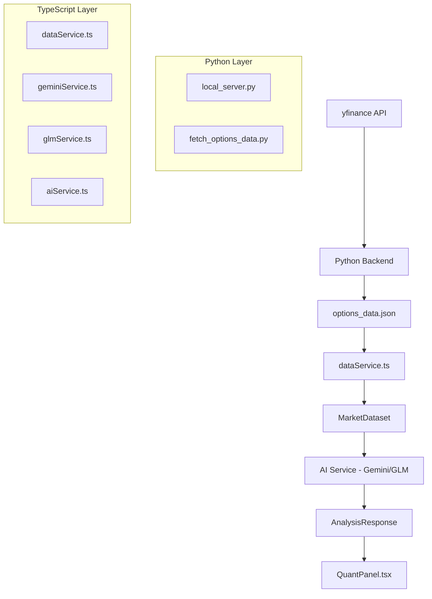

# Deep Analysis: Options Agent Level Extraction Methodology

## Executive Summary

This document provides a comprehensive technical analysis of how the quantitative options agent extracts important price levels from options data. The system combines Python-based data fetching with AI-powered analysis to identify key support/resistance levels, gamma flip zones, and market maker hedging levels.

---

## 1. Architecture Overview

### 1.1 System Components



### 1.2 Data Flow

```
1. Data Fetching: yfinance → Python scripts → JSON structure
2. Data Loading: JSON → dataService.ts → MarketDataset conversion
3. AI Analysis: MarketDataset → AI Provider → AnalysisLevel extraction
4. Presentation: AnalysisLevel[] → QuantPanel → Visual display
```

---

## 2. Data Structures

### 2.1 Core Type Definitions

#### [`AnalysisLevel`](types.ts:2) - Primary Level Output
```typescript
interface AnalysisLevel {
  livello: string;        // Level name/identifier
  prezzo: number;         // Strike price
  motivazione: string;    // Reasoning for importance
  sintesiOperativa: string; // Trading signal (max 8 words)
  colore: 'rosso' | 'verde' | 'indigo' | 'ambra';
  importanza: number;     // Importance score 0-100
  ruolo: 'WALL' | 'PIVOT' | 'MAGNET' | 'FRICTION' | 'CONFLUENCE';
  isDayTrade: boolean;
  scadenzaTipo?: string;  // Expiry type label
  lato: 'CALL' | 'PUT' | 'BOTH' | 'GAMMA_FLIP';
}
```

#### [`OptionData`](types.ts:73) - Raw Option Contract
```typescript
interface OptionData {
  strike: number;
  side: 'CALL' | 'PUT';
  iv: number;    // Implied Volatility
  oi: number;    // Open Interest
  vol: number;   // Volume
}
```

#### [`SymbolData`](types.ts:93) - Per-Symbol Dataset
```typescript
interface SymbolData {
  spot: number;
  generated: string;
  expiries: ExpiryData[];
  legacy?: Record<string, LegacyExpiryContent>;
}
```

#### [`StructuredLevels`](types.ts:63) - Pre-calculated Levels
```typescript
interface StructuredLevels {
  spot_price: number;
  call_levels: OptionLevel[];  // Contains gamma, delta, vega, theta
  put_levels: OptionLevel[];
  gamma_levels: GammaLevel[];
  gamma_flip: number | null;
}
```

### 2.2 Data Format Hierarchy

The system supports three data formats with priority order:

1. **Symbols Format** (Python-generated, preferred)
2. **Structured Format** (pre-calculated levels)
3. **Legacy Format** (text-based QUANT_SWEEP format)

---

## 3. Level Extraction Algorithms

### 3.1 Gamma Flip Calculation

**Location:** [`scripts/local_server.py:259-309`](scripts/local_server.py:259)

**Algorithm:**
```python
def calculate_gamma_exposure(options, side, current_price):
    # 1. Group by strike and sum open interest
    strike_oi: Dict[float, float] = {}
    for opt in options:
        # Weight by proximity to current price
        distance = abs(opt.strike - current_price)
        weight = 1.0 / (1.0 + distance / current_price)
        oi = opt.openInterest if opt.openInterest else 0
        strike_oi[opt.strike] += oi * weight
    
    # 2. Calculate weighted averages
    total_call_oi = sum(oi for s, oi in strike_oi.items() if s >= current_price)
    total_put_oi = sum(oi for s, oi in strike_oi.items() if s < current_price)
    
    call_weighted = sum(s * oi for s, oi in strike_oi.items() if s >= current_price)
    put_weighted = sum(s * oi for s, oi in strike_oi.items() if s < current_price)
    
    # 3. Gamma flip = OI-weighted average of all strikes
    gamma_flip = (call_weighted + put_weighted) / (total_call_oi + total_put_oi)
```

**Formula:**
```
Gamma Flip = Σ(strike × OI × proximity_weight) / Σ(OI × proximity_weight)

where proximity_weight = 1 / (1 + |strike - spot| / spot)
```

### 3.2 Call/Put Wall Identification

**Location:** [`scripts/local_server.py:279-287`](scripts/local_server.py:279)

**Algorithm:**
```python
# Call walls: strikes >= spot, sorted by OI descending
call_strikes = [(s, oi) for s, oi in strike_oi.items() if s >= current_price]
call_strikes.sort(key=lambda x: x[1], reverse=True)
call_walls = [GammaWall(strike=s, gamma=oi) for s, oi in call_strikes[:3]]

# Put walls: strikes < spot, sorted by OI descending
put_strikes = [(s, oi) for s, oi in strike_oi.items() if s < current_price]
put_strikes.sort(key=lambda x: x[1], reverse=True)
put_walls = [GammaWall(strike=s, gamma=oi) for s, oi in put_strikes[:3]]
```

**Selection Criteria:**
- **Call Walls:** Top 3 strikes above spot by OI
- **Put Walls:** Top 3 strikes below spot by OI

### 3.3 Expiry Selection Logic

**Location:** [`scripts/local_server.py:136-184`](scripts/local_server.py:136)

```python
def select_expirations(expirations):
    # 1. 0DTE - First available expiration
    selected.append(("0DTE", expirations[0]))
    
    # 2. WEEKLY - Next Friday that is NOT the third Friday
    for exp in expirations:
        if is_weekly_friday(exp):
            selected.append(("WEEKLY", exp))
            break
    
    # 3. MONTHLY - Third Friday of month (day 15-21, weekday=4)
    for exp in expirations:
        if is_monthly(exp):
            selected.append(("MONTHLY", exp))
            break
```

**Monthly Detection:**
```python
def is_monthly(date_str):
    dt = datetime.strptime(date_str, '%Y-%m-%d')
    return dt.weekday() == 4 and 15 <= dt.day <= 21
```

---

## 4. AI Level Extraction Rules

### 4.1 System Instruction (Harmonic Analysis Engine)

**Location:** [`services/geminiService.ts:26-44`](services/geminiService.ts:26) and [`services/glmService.ts:26-44`](services/glmService.ts:26)

```
Sei un Engine di Analisi Quantitativa specializzato in Market Maker Hedging e Risonanza Armonica delle Opzioni.

REGOLE TASSATIVE PER LE CONFLUENZE (MULTI-EXPIRY):
1. DEFINIZIONE DI CONFLUENZA: Se uno strike price appare in PIÙ di una scadenza, ruolo 'CONFLUENCE', lato 'BOTH'.
2. PRIORITÀ VISIVA: Le confluenze sono i livelli più importanti. Importanza 98-100 se 3+ scadenze.

REGOLE DI ANALISI STANDARD:
- CALL WALLS: Strike sopra lo Spot con OI Call dominante. Ruolo 'WALL', Colore 'rosso'.
- PUT WALLS: Strike sotto lo Spot con OI Put dominante. Ruolo 'WALL', Colore 'verde'.
- GAMMA FLIP: Punto di equilibrio sentiment. Ruolo 'PIVOT', Colore 'indigo', Lato 'GAMMA_FLIP'.
```

### 4.2 Level Classification Rules

| Role | Side | Color | Criteria |
|------|------|-------|----------|
| WALL | CALL | rosso | Strike > Spot, dominant Call OI |
| WALL | PUT | verde | Strike < Spot, dominant Put OI |
| PIVOT | GAMMA_FLIP | indigo | Sentiment equilibrium point |
| CONFLUENCE | BOTH | ambra | Strike in multiple expiries |
| MAGNET | CALL/PUT | varies | Price attraction level |
| FRICTION | CALL/PUT | varies | Resistance zone |

### 4.3 Importance Scoring

**AI-Determined Factors:**
- **96-100:** Multi-expiry confluences (3+ expiries)
- **90-95:** Major walls with extreme OI concentration
- **80-89:** Significant gamma exposure levels
- **70-79:** Moderate OI clusters
- **Below 70:** Minor levels

### 4.4 Response Schema

**Location:** [`services/geminiService.ts:46-80`](services/geminiService.ts:46)

```typescript
const responseSchema = {
  type: Type.OBJECT,
  properties: {
    outlook: {
      sentiment: { type: Type.STRING },
      gammaFlipZone: { type: Type.NUMBER },
      volatilityExpectation: { type: Type.STRING },
      summary: { type: Type.STRING }
    },
    levels: {
      type: Type.ARRAY,
      items: {
        livello: { type: Type.STRING },
        prezzo: { type: Type.NUMBER },
        motivazione: { type: Type.STRING },
        sintesiOperativa: { type: Type.STRING },
        colore: { enum: ["rosso", "verde", "indigo", "ambra"] },
        importanza: { type: Type.NUMBER },
        ruolo: { enum: ["WALL", "PIVOT", "MAGNET", "FRICTION", "CONFLUENCE"] },
        isDayTrade: { type: Type.BOOLEAN },
        scadenzaTipo: { type: Type.STRING },
        lato: { enum: ["CALL", "PUT", "BOTH", "GAMMA_FLIP"] }
      }
    }
  }
}
```

---

## 5. Data Processing Pipeline

### 5.1 Data Fetching

**Location:** [`services/dataService.ts:124-182`](services/dataService.ts:124)

```typescript
export const fetchOptionsData = async (forceRefresh, symbol, expiry) => {
  // 1. Check cache (5-minute TTL)
  if (!forceRefresh) {
    const cached = getCachedData();
    if (cached) return { success: true, data: cached.data, fromCache: true };
  }
  
  // 2. Fetch from JSON file
  const response = await fetch(getDataUrl());
  const data: OptionsDataResponse = await response.json();
  
  // 3. Validate structure
  if (!data.version && !data.structured && !data.legacy && !data.symbols) {
    throw new Error('Invalid data format');
  }
  
  // 4. Cache and return
  setCachedData(data);
  return { success: true, data, fromCache: false };
}
```

### 5.2 Format Conversion

**Location:** [`services/dataService.ts:338-378`](services/dataService.ts:338)

```typescript
export const convertToDatasets = (response, spotPrice) => {
  const datasets: MarketDataset[] = [];
  
  // Priority 1: Parse symbols format (Python-generated)
  if (response.symbols && Object.keys(response.symbols).length > 0) {
    const symbolsResult = parseSymbolsFormat(response.symbols);
    datasets.push(...symbolsResult.datasets);
  }
  
  // Priority 2: Parse structured data
  if (response.structured) {
    datasets.push(...parseStructuredLevels(response.structured));
  }
  
  // Priority 3: Parse legacy format
  if (response.legacy) {
    datasets.push(...parseLegacyFormat(response.legacy));
  }
  
  return { datasets, extractedSpotPrice };
}
```

### 5.3 Symbols Format Parsing

**Location:** [`services/dataService.ts:236-292`](services/dataService.ts:236)

```typescript
const parseSymbolsFormat = (symbols) => {
  const datasets: MarketDataset[] = [];
  
  for (const [symbol, data] of Object.entries(symbols)) {
    for (const expiry of data.expiries) {
      const lines = [];
      lines.push(`SPOT: ${data.spot}`);
      lines.push(`SYMBOL: ${symbol}`);
      lines.push(`EXPIRY: ${expiry.date}`);
      lines.push('STRIKE | TIPO | IV | OI | VOL');
      
      for (const opt of expiry.options) {
        lines.push(`${opt.strike.toFixed(2)} | ${opt.side} | ${opt.iv.toFixed(4)} | ${opt.oi} | ${opt.vol}`);
      }
      
      datasets.push({
        id: `symbols-${symbol}-${expiry.label}`,
        name: `${symbol} - ${expiry.label} (${expiry.date})`,
        content: lines.join('\n'),
        type: expiry.label // 0DTE, WEEKLY, MONTHLY
      });
    }
  }
  
  return { datasets, spotPrice };
}
```

---

## 6. Quantitative Metrics Used

### 6.1 Primary Metrics

| Metric | Source | Usage |
|--------|--------|-------|
| **Open Interest (OI)** | yfinance | Wall identification, confluence detection |
| **Volume** | yfinance | Activity measurement, validation |
| **Implied Volatility (IV)** | yfinance | Sentiment gauge, level strength |
| **Spot Price** | yfinance | Reference point for all calculations |

### 6.2 Derived Metrics

| Metric | Calculation | Purpose |
|--------|-------------|---------|
| **Gamma Flip** | OI-weighted strike average | Sentiment pivot point |
| **Proximity Weight** | 1 / (1 + distance/spot) | Near-money emphasis |
| **OI Concentration** | strike OI / total OI | Wall strength |
| **Multi-Expiry Score** | Count of appearances | Confluence importance |

### 6.3 Missing Metrics (Not Currently Used)

- **Delta:** Not utilized in current implementation
- **Gamma:** Exposed in data but not used in calculations
- **Vega:** Available in structured format but not processed
- **Theta:** Available but not used
- **Max Pain:** Not calculated
- **Put/Call Ratio:** Not computed
- **Volume/OI Ratio:** Not calculated

---

## 7. Presentation Layer

### 7.1 Level Display Logic

**Location:** [`components/QuantPanel.tsx:48-175`](components/QuantPanel.tsx:48)

```typescript
const LevelRow = ({ level, onClick, spot }) => {
  // Calculate distance from spot
  const distancePct = spot > 0 ? ((level.prezzo - spot) / spot) * 100 : 0;
  const isVeryClose = Math.abs(distancePct) <= 0.6; // Critical threshold: 0.6%
  
  // Detect resonance/confluence
  const isResonance = 
    level.ruolo === 'CONFLUENCE' || 
    level.lato === 'BOTH' || 
    level.scadenzaTipo?.toUpperCase().includes('MULTI') ||
    level.importanza >= 96;
  
  // Theme selection based on level type
  const getTheme = () => {
    if (isResonance) return { /* Amber/Gold theme */ };
    if (level.lato === 'GAMMA_FLIP') return { /* Indigo theme */ };
    if (level.lato === 'CALL') return { /* Red theme */ };
    if (level.lato === 'PUT') return { /* Green theme */ };
    return { /* Gray default */ };
  };
}
```

### 7.2 Visual Indicators

| Condition | Visual Effect |
|-----------|---------------|
| Resonance/Confluence | 💎 icon, amber border, pulse animation |
| Proximate (≤0.6% from spot) | PROXIMATE badge, ping animation |
| Gamma Flip | ⚖️ icon, indigo theme |
| CALL side | 🛡️ icon, red theme |
| PUT side | 🛡️ icon, green theme |
| High importance (≥96) | Treated as resonance |

---

## 8. Data Flow Diagram

```
┌─────────────────────────────────────────────────────────────────────┐
│                        DATA ACQUISITION                              │
├─────────────────────────────────────────────────────────────────────┤
│  yfinance API                                                        │
│       │                                                              │
│       ▼                                                              │
│  ┌─────────────────┐    ┌─────────────────┐                         │
│  │ local_server.py │    │ fetch_options_  │                         │
│  │ (FastAPI)       │    │ data.py (CLI)   │                         │
│  └────────┬────────┘    └────────┬────────┘                         │
│           │                      │                                   │
│           ▼                      ▼                                   │
│  ┌─────────────────────────────────────┐                            │
│  │     options_data.json               │                            │
│  │  { version, symbols: { SPY: {       │                            │
│  │      spot, expiries: [{             │                            │
│  │        label, date, options []      │                            │
│  │  }]}})                              │                            │
│  └─────────────────────────────────────┘                            │
└─────────────────────────────────────────────────────────────────────┘
                              │
                              ▼
┌─────────────────────────────────────────────────────────────────────┐
│                        DATA PROCESSING                               │
├─────────────────────────────────────────────────────────────────────┤
│  dataService.ts                                                      │
│       │                                                              │
│       ├── fetchOptionsData() ── Cache check (5min TTL)              │
│       ├── fetchFromBackend() ── Local server or Vercel API          │
│       │                                                              │
│       ▼                                                              │
│  convertToDatasets()                                                 │
│       │                                                              │
│       ├── parseSymbolsFormat() ── Python-generated format           │
│       ├── parseStructuredLevels() ── Pre-calculated levels          │
│       └── parseLegacyFormat() ── Text-based format                  │
│                                                                      │
│       ▼                                                              │
│  MarketDataset[] { id, name, content, type }                        │
└─────────────────────────────────────────────────────────────────────┘
                              │
                              ▼
┌─────────────────────────────────────────────────────────────────────┐
│                        AI ANALYSIS                                   │
├─────────────────────────────────────────────────────────────────────┤
│  aiService.ts                                                        │
│       │                                                              │
│       ├── Provider selection (Gemini/GLM)                           │
│       ├── Model selection (configurable)                            │
│       │                                                              │
│       ▼                                                              │
│  geminiService.ts / glmService.ts                                    │
│       │                                                              │
│       ├── System instruction (harmonic analysis rules)              │
│       ├── Formatted data (STRIKE | TIPO | IV | OI | VOL)            │
│       ├── Response schema (JSON structure)                          │
│       │                                                              │
│       ▼                                                              │
│  AnalysisResponse {                                                  │
│    outlook: { sentiment, gammaFlipZone, volatilityExpectation },    │
│    levels: AnalysisLevel[]                                           │
│  }                                                                   │
└─────────────────────────────────────────────────────────────────────┘
                              │
                              ▼
┌─────────────────────────────────────────────────────────────────────┐
│                        PRESENTATION                                  │
├─────────────────────────────────────────────────────────────────────┤
│  QuantPanel.tsx                                                      │
│       │                                                              │
│       ├── LevelRow component                                         │
│       │   ├── Distance calculation (% from spot)                    │
│       │   ├── Resonance detection (confluence check)                │
│       │   ├── Theme selection (color/icon)                          │
│       │   └── Importance bar visualization                          │
│       │                                                              │
│       └── Display elements:                                          │
│           ├── Price with distance %                                  │
│           ├── Operational synthesis (sintesiOperativa)              │
│           ├── Motivation text                                        │
│           ├── Importance percentage                                  │
│           └── Visual indicators (icons, colors, animations)         │
└─────────────────────────────────────────────────────────────────────┘
```

---

## 9. Identified Gaps and Limitations

### 9.1 Algorithmic Limitations

1. **Simplified Gamma Calculation**
   - Current: OI-weighted average with proximity weighting
   - Missing: True gamma exposure calculation using actual gamma values
   - Impact: Gamma flip may not accurately reflect dealer positioning

2. **No Max Pain Calculation**
   - Max pain (price where most options expire worthless) is not computed
   - This is a commonly used level by traders

3. **Missing Greeks Utilization**
   - Delta, Gamma, Vega, Theta are available but not used in analysis
   - Could provide more sophisticated level identification

4. **No Volume/OI Ratio**
   - Volume relative to open interest indicates new positioning
   - Not currently calculated or used

### 9.2 Data Limitations

1. **Delayed Data**
   - yfinance data may have 15-minute delay
   - No real-time options flow

2. **Limited Symbols**
   - Only SPY, QQQ, SPX, NDX supported
   - No individual stocks

3. **No Historical Comparison**
   - Levels are identified without historical context
   - No tracking of how levels change over time

### 9.3 AI Analysis Limitations

1. **Temperature Settings**
   - Low temperature (0.1) for consistency
   - May miss nuanced patterns

2. **No Confidence Scores**
   - AI returns single set of levels
   - No uncertainty quantification

3. **Language Dependency**
   - System instructions in Italian
   - May limit model reasoning in some cases

### 9.4 Architecture Limitations

1. **Cache Duration**
   - 5-minute cache may be too long for active trading
   - No invalidation on significant market moves

2. **Single Analysis Path**
   - All analysis goes through single AI call
   - No ensemble or multi-model approach

---

## 10. Recommendations for Enhancement

### 10.1 Algorithm Improvements

1. **Implement True Gamma Exposure**
   ```python
   def calculate_true_gamma(options, spot, days_to_expiry):
       gamma_exposure = 0
       for opt in options:
           # Use Black-Scholes gamma
           gamma = black_scholes_gamma(spot, opt.strike, opt.iv, days_to_expiry)
           # Dealer gamma = -gamma × OI × 100
           gamma_exposure += -gamma * opt.oi * 100 * (1 if opt.side == 'CALL' else -1)
   ```

2. **Add Max Pain Calculation**
   ```python
   def calculate_max_pain(calls, puts, strikes):
       max_pain = None
       min_pain_value = float('inf')
       for strike in strikes:
           pain = sum(cash_at_expiry(c, strike) for c in calls)
           pain += sum(cash_at_expiry(p, strike) for p in puts)
           if pain < min_pain_value:
               min_pain_value = pain
               max_pain = strike
       return max_pain
   ```

3. **Add Volume/OI Ratio Analysis**
   ```python
   def calculate_vol_oi_ratio(options):
       return [{
           'strike': opt.strike,
           'vol_oi_ratio': opt.vol / opt.oi if opt.oi > 0 else float('inf')
       } for opt in options]
   ```

### 10.2 Data Enhancements

1. **Real-time Data Integration**
   - Consider CBOE, OPRA, or broker APIs for live data
   - Implement WebSocket streaming for level updates

2. **Historical Level Tracking**
   - Store identified levels with timestamps
   - Track accuracy and level evolution

3. **Extended Symbol Support**
   - Add configurable symbol list
   - Support for high-volume individual stocks

### 10.3 AI Enhancements

1. **Multi-Model Ensemble**
   - Run analysis with multiple AI models
   - Aggregate or vote on level identification

2. **Confidence Scoring**
   - Request confidence scores from AI
   - Display uncertainty to users

3. **Structured Prompting**
   - Break analysis into steps (identify walls → find confluences → score importance)
   - More transparent reasoning chain

---

## 11. File Reference Summary

| File | Purpose | Key Functions |
|------|---------|---------------|
| [`types.ts`](types.ts) | Type definitions | `AnalysisLevel`, `OptionData`, `SymbolData` |
| [`services/dataService.ts`](services/dataService.ts) | Data loading | `fetchOptionsData`, `convertToDatasets`, `parseSymbolsFormat` |
| [`services/aiService.ts`](services/aiService.ts) | AI orchestration | `getAnalysis`, `getChat`, provider selection |
| [`services/geminiService.ts`](services/geminiService.ts) | Gemini AI | `getAnalysis`, system instruction, response schema |
| [`services/glmService.ts`](services/glmService.ts) | GLM AI | `getAnalysis`, `callGLMAPI` |
| [`scripts/local_server.py`](scripts/local_server.py) | Python backend | `calculate_gamma_exposure`, `select_expirations` |
| [`scripts/fetch_options_data.py`](scripts/fetch_options_data.py) | Data fetching | `fetch_options_chain`, `calculate_gamma_flip` |
| [`components/QuantPanel.tsx`](components/QuantPanel.tsx) | UI display | `LevelRow`, theme selection, resonance detection |
| [`components/ChatPanel.tsx`](components/ChatPanel.tsx) | Chat interface | AI model/provider selection |

---

## 12. Conclusion

The options agent level extraction system uses a hybrid approach combining:

1. **Python-based quantitative calculations** for gamma flip and wall identification
2. **AI-powered analysis** for interpreting market structure and identifying confluences
3. **Multi-expiry analysis** to find resonance levels across timeframes

The current implementation provides a solid foundation but has opportunities for enhancement in:
- True gamma exposure calculation using actual Greeks
- Max pain and additional quantitative metrics
- Real-time data integration
- Confidence scoring and ensemble approaches

The architecture is well-structured with clear separation between data fetching, processing, AI analysis, and presentation layers, making it amenable to incremental improvements.
