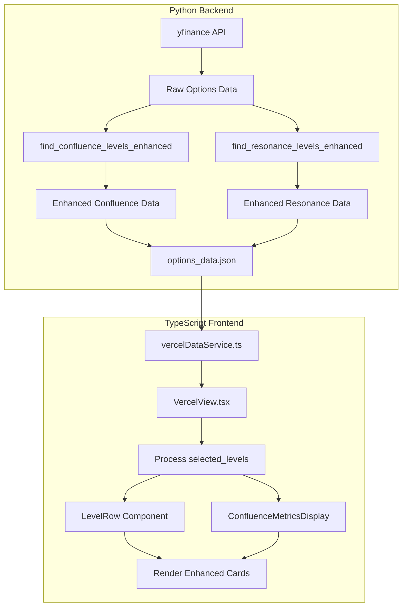

# Enhanced Confluence Level Display - Technical Specification

## Overview

This document specifies the design for enhancing confluence level display in the options trading application. The goal is to replace generic "MULTI" labels with specific expiry combinations like "0DTE+WEEKLY" and include detailed Call/Put breakdown with Volume and Open Interest data.

---

## 1. Current State Analysis

### 1.1 Python Data Generation (`scripts/fetch_options_data.py`)

#### Current Confluence Detection (Lines 1120-1170)
```python
def find_confluence_levels(expiries: List[Dict], spot: float, tolerance_pct: float = 0.01) -> List[Dict]:
    # Returns only strike and distance - NO expiry labels
    return [
        {"strike": s, "distance_pct": round(abs(s - spot) / spot * 100, 2)}
        for s in confluence_strikes[:5]
    ]
```

**Problem**: The function identifies which strikes appear in multiple expiries but discards the information about **which specific expiries** contributed to each confluence.

#### Current Resonance Detection (Lines 1068-1117)
```python
def find_resonance_levels(expiries: List[Dict], spot: float, tolerance_pct: float = 0.005) -> List[Dict]:
    # Returns only strike and distance - NO expiry labels
    return [
        {"strike": s, "distance_pct": round(abs(s - spot) / spot * 100, 2)}
        for s in common_strikes[:2]
    ]
```

**Problem**: Same issue - loses expiry combination information.

### 1.2 TypeScript Types (`types.ts`)

#### Current SelectedLevels Interface (Lines 95-102)
```typescript
export interface SelectedLevels {
  resonance: Array<{strike: number; distance_pct: number}>;
  confluence: Array<{strike: number; distance_pct: number}>;
  call_walls: Array<{strike: number; oi: number; expiry: string}>;
  put_walls: Array<{strike: number; oi: number; expiry: string}>;
  gamma_flip: number;
  max_pain: number;
}
```

**Problem**: `resonance` and `confluence` arrays lack expiry labels and detailed metrics.

### 1.3 Frontend Display (`components/VercelView.tsx`)

#### Current Confluence Display (Line 2042)
```typescript
confluenceLevels.set(c.strike, ['MULTI']); // Generic label for pre-selected
```

#### LevelRow Description (Line 1295)
```typescript
case 'CONFLUENCE': return `Confluence: ${expiries.join(' + ')}`;
```

**Problem**: Shows "MULTI" instead of actual expiry combinations like "0DTE+WEEKLY".

---

## 2. Proposed Data Structure Changes

### 2.1 Enhanced Confluence Level Structure

#### New Python Data Structure
```python
@dataclass
class ConfluenceLevelDetail:
    """Detailed information for a confluence/resonance level."""
    strike: float
    distance_pct: float
    expiries: List[str]  # e.g., ["0DTE", "WEEKLY"]
    # Per-expiry metrics at this strike
    call_oi: int           # Total Call OI across expiries
    put_oi: int            # Total Put OI across expiries
    call_vol: int          # Total Call Volume across expiries
    put_vol: int           # Total Put Volume across expiries
    # Per-expiry breakdown
    expiry_details: List[Dict]  # Detailed metrics per expiry
```

#### New TypeScript Interface
```typescript
/**
 * Detailed breakdown for a single expiry at a confluence level
 */
export interface ConfluenceExpiryDetail {
  expiry_label: string;     // e.g., "0DTE", "WEEKLY", "MONTHLY"
  expiry_date: string;      // e.g., "2024-01-15"
  call_oi: number;          // Call Open Interest at this strike
  put_oi: number;           // Put Open Interest at this strike
  call_vol: number;         // Call Volume at this strike
  put_vol: number;          // Put Volume at this strike
  call_iv: number;          // Call Implied Volatility
  put_iv: number;           // Put Implied Volatility
}

/**
 * Enhanced confluence level with full details
 */
export interface ConfluenceLevel {
  strike: number;
  distance_pct: number;
  expiries: string[];                    // e.g., ["0DTE", "WEEKLY"]
  expiry_label: string;                  // Combined label: "0DTE+WEEKLY"
  // Aggregated metrics
  total_call_oi: number;
  total_put_oi: number;
  total_call_vol: number;
  total_put_vol: number;
  // Dominant side
  dominant_side: 'CALL' | 'PUT' | 'NEUTRAL';
  put_call_ratio: number;                // OI-based PCR at this strike
  // Per-expiry breakdown
  expiry_details: ConfluenceExpiryDetail[];
}

/**
 * Enhanced resonance level (same structure, but for 3+ expiries)
 */
export interface ResonanceLevel extends ConfluenceLevel {
  // Resonance has all 3 expiries
  all_expiries_present: boolean;
}
```

### 2.2 Updated SelectedLevels Interface

```typescript
export interface SelectedLevels {
  resonance: ResonanceLevel[];      // Enhanced with details
  confluence: ConfluenceLevel[];    // Enhanced with details
  call_walls: Array<{strike: number; oi: number; expiry: string}>;
  put_walls: Array<{strike: number; oi: number; expiry: string}>;
  gamma_flip: number;
  max_pain: number;
}
```

---

## 3. Implementation Changes

### 3.1 Python Script Changes (`scripts/fetch_options_data.py`)

#### 3.1.1 New Helper Function

```python
def get_options_at_strike(options: List[Dict], strike: float, tolerance: float = 0.01) -> Dict:
    """
    Get Call and Put data at a specific strike with tolerance.
    
    Returns:
        {
            'call_oi': int,
            'put_oi': int,
            'call_vol': int,
            'put_vol': int,
            'call_iv': float,
            'put_iv': float
        }
    """
    call_oi = 0
    put_oi = 0
    call_vol = 0
    put_vol = 0
    call_iv = 0.0
    put_iv = 0.0
    
    for opt in options:
        opt_strike = opt.get('strike', 0)
        # Check if within tolerance
        if abs(opt_strike - strike) / max(strike, 1) <= tolerance:
            if opt.get('side') == 'CALL':
                call_oi += opt.get('oi', 0)
                call_vol += opt.get('vol', 0)
                call_iv = opt.get('iv', 0.3)  # Take last non-zero IV
            else:
                put_oi += opt.get('oi', 0)
                put_vol += opt.get('vol', 0)
                put_iv = opt.get('iv', 0.3)
    
    return {
        'call_oi': call_oi,
        'put_oi': put_oi,
        'call_vol': call_vol,
        'put_vol': put_vol,
        'call_iv': call_iv,
        'put_iv': put_iv
    }
```

#### 3.1.2 Enhanced find_confluence_levels Function

```python
def find_confluence_levels_enhanced(expiries: List[Dict], spot: float, tolerance_pct: float = 0.01) -> List[Dict]:
    """
    Find confluence levels with full expiry and metric details.
    
    Returns:
        List of enhanced confluence level dictionaries
    """
    if len(expiries) < 2:
        return []
    
    # Track which expiries contain each strike
    strike_expiry_map: Dict[float, List[int]] = {}  # strike -> list of expiry indices
    
    for expiry_idx, expiry in enumerate(expiries):
        for opt in expiry.get('options', []):
            strike = round(opt.get('strike', 0), 2)
            if strike <= 0:
                continue
            
            # Find matching strike key (with tolerance)
            matched_key = None
            for existing_strike in strike_expiry_map.keys():
                if abs(existing_strike - strike) / max(existing_strike, 1) <= tolerance_pct:
                    matched_key = existing_strike
                    break
            
            if matched_key is not None:
                if expiry_idx not in strike_expiry_map[matched_key]:
                    strike_expiry_map[matched_key].append(expiry_idx)
            else:
                strike_expiry_map[strike] = [expiry_idx]
    
    # Filter to strikes appearing in exactly 2 expiries
    confluence_candidates = []
    
    for strike, expiry_indices in strike_expiry_map.items():
        if len(expiry_indices) == 2:  # Exactly 2 expiries = CONFLUENCE
            # Get expiry labels
            expiry_labels = [expiries[i].get('label', 'UNKNOWN') for i in expiry_indices]
            
            # Calculate aggregated metrics
            total_call_oi = 0
            total_put_oi = 0
            total_call_vol = 0
            total_put_vol = 0
            expiry_details = []
            
            for idx in expiry_indices:
                expiry = expiries[idx]
                metrics = get_options_at_strike(expiry.get('options', []), strike, tolerance_pct)
                
                total_call_oi += metrics['call_oi']
                total_put_oi += metrics['put_oi']
                total_call_vol += metrics['call_vol']
                total_put_vol += metrics['put_vol']
                
                expiry_details.append({
                    'expiry_label': expiry.get('label', 'UNKNOWN'),
                    'expiry_date': expiry.get('date', 'N/A'),
                    **metrics
                })
            
            # Calculate dominant side and PCR
            put_call_ratio = total_put_oi / max(total_call_oi, 1)
            if total_call_oi > total_put_oi * 1.2:
                dominant_side = 'CALL'
            elif total_put_oi > total_call_oi * 1.2:
                dominant_side = 'PUT'
            else:
                dominant_side = 'NEUTRAL'
            
            confluence_candidates.append({
                'strike': strike,
                'distance_pct': round(abs(strike - spot) / spot * 100, 2),
                'expiries': expiry_labels,
                'expiry_label': '+'.join(sorted(expiry_labels)),
                'total_call_oi': total_call_oi,
                'total_put_oi': total_put_oi,
                'total_call_vol': total_call_vol,
                'total_put_vol': total_put_vol,
                'dominant_side': dominant_side,
                'put_call_ratio': round(put_call_ratio, 2),
                'expiry_details': expiry_details
            })
    
    # Sort by distance from spot and limit to 5
    confluence_candidates.sort(key=lambda x: abs(x['distance_pct']))
    return confluence_candidates[:5]
```

#### 3.1.3 Enhanced find_resonance_levels Function

Similar enhancement for resonance levels, but filtering for strikes appearing in ALL 3 expiries.

### 3.2 TypeScript Frontend Changes (`components/VercelView.tsx`)

#### 3.2.1 Update Confluence Level Processing

Replace line 2042:
```typescript
// OLD
confluenceLevels.set(c.strike, ['MULTI']);

// NEW
confluenceLevels.set(c.strike, c.expiries);  // Use actual expiry labels
```

#### 3.2.2 Enhanced LevelRow Component

Add new props for detailed metrics display:

```typescript
const LevelRow: React.FC<{
  level: number;
  type: 'CALL_WALL' | 'PUT_WALL' | 'GAMMA_FLIP' | 'MAX_PAIN' | 'CONFLUENCE' | 'RESONANCE';
  spot: number;
  expiries?: string[];
  oi?: number;
  isMatch?: boolean;
  wallType?: WallType;
  // NEW: Enhanced metrics for confluence/resonance
  confluenceDetails?: {
    total_call_oi: number;
    total_put_oi: number;
    total_call_vol: number;
    total_put_vol: number;
    dominant_side: 'CALL' | 'PUT' | 'NEUTRAL';
    put_call_ratio: number;
    expiry_details: ConfluenceExpiryDetail[];
  };
}>
```

#### 3.2.3 New Confluence Metrics Sub-Component

```typescript
const ConfluenceMetricsDisplay: React.FC<{
  details: ConfluenceLevel;
}> = ({ details }) => {
  return (
    <div className="mt-3 p-3 bg-black/30 rounded-lg border border-gray-700/30">
      {/* Expiry Label Badge */}
      <div className="flex items-center gap-2 mb-2">
        <span className="text-[10px] font-black bg-violet-500/20 text-violet-300 px-2 py-0.5 rounded">
          {details.expiry_label}
        </span>
        <span className={`text-[9px] font-bold ${
          details.dominant_side === 'CALL' ? 'text-green-400' :
          details.dominant_side === 'PUT' ? 'text-red-400' : 'text-gray-400'
        }`}>
          {details.dominant_side} DOMINANT
        </span>
      </div>
      
      {/* OI/Vol Grid */}
      <div className="grid grid-cols-2 gap-2 text-[10px]">
        <div className="flex justify-between">
          <span className="text-gray-500">Call OI:</span>
          <span className="text-green-400 font-mono">{formatNumber(details.total_call_oi, 0)}</span>
        </div>
        <div className="flex justify-between">
          <span className="text-gray-500">Put OI:</span>
          <span className="text-red-400 font-mono">{formatNumber(details.total_put_oi, 0)}</span>
        </div>
        <div className="flex justify-between">
          <span className="text-gray-500">Call Vol:</span>
          <span className="text-green-400 font-mono">{formatNumber(details.total_call_vol, 0)}</span>
        </div>
        <div className="flex justify-between">
          <span className="text-gray-500">Put Vol:</span>
          <span className="text-red-400 font-mono">{formatNumber(details.total_put_vol, 0)}</span>
        </div>
      </div>
      
      {/* PCR Indicator */}
      <div className="mt-2 flex items-center justify-between text-[10px]">
        <span className="text-gray-500">Put/Call Ratio:</span>
        <span className={`font-mono font-bold ${
          details.put_call_ratio > 1.0 ? 'text-red-400' : 'text-green-400'
        }`}>
          {details.put_call_ratio.toFixed(2)}
        </span>
      </div>
      
      {/* Per-Expiry Breakdown (collapsible) */}
      <details className="mt-2">
        <summary className="text-[9px] text-gray-500 cursor-pointer hover:text-gray-300">
          ▸ Per-Expiry Breakdown
        </summary>
        <div className="mt-2 space-y-1 pl-2 border-l border-gray-700/50">
          {details.expiry_details.map((ed, idx) => (
            <div key={idx} className="text-[9px] grid grid-cols-3 gap-1">
              <span className="text-violet-300 font-bold">{ed.expiry_label}</span>
              <span className="text-gray-400">C: {formatNumber(ed.call_oi, 0)}</span>
              <span className="text-gray-400">P: {formatNumber(ed.put_oi, 0)}</span>
            </div>
          ))}
        </div>
      </details>
    </div>
  );
};
```

---

## 4. Display Format Design

### 4.1 Confluence Level Card Layout

```
┌─────────────────────────────────────────────────────────────────────┐
│ ✨ CONFLUENCE          0DTE+WEEKLY          CALL DOMINANT           │
│                                                                       │
│ RESISTANCE: Multiple expiry alignment                                │
│                                                                       │
│ ┌─────────────────────────────────────────────────────────────────┐ │
│ │ Call OI: 12,450    │ Put OI: 8,230     │ PCR: 0.66              │ │
│ │ Call Vol: 5,670    │ Put Vol: 3,890    │                        │ │
│ └─────────────────────────────────────────────────────────────────┘ │
│                                                                       │
│ ▸ Per-Expiry Breakdown                                               │
│   0DTE     C: 8,200  P: 5,100                                        │
│   WEEKLY   C: 4,250  P: 3,130                                        │
│                                                                       │
│ ────────────────────────────────────────────── 85%          │
│                                                     $598.50          │
│                                                     +0.42% DIST      │
└─────────────────────────────────────────────────────────────────────┘
```

### 4.2 Resonance Level Card Layout (All 3 Expiries)

```
┌─────────────────────────────────────────────────────────────────────┐
│ 💎 RESONANCE           0DTE+WEEKLY+MONTHLY     PUT DOMINANT         │
│                                                                       │
│ MULTI-EXPIRY RESONANCE: Critical structural level                   │
│                                                                       │
│ ┌─────────────────────────────────────────────────────────────────┐ │
│ │ Call OI: 45,200    │ Put OI: 62,800    │ PCR: 1.39              │ │
│ │ Call Vol: 18,340   │ Put Vol: 24,560   │                        │ │
│ └─────────────────────────────────────────────────────────────────┘ │
│                                                                       │
│ ▸ Per-Expiry Breakdown                                               │
│   0DTE     C: 15,200 P: 22,100                                      │
│   WEEKLY   C: 18,000 P: 25,300                                      │
│   MONTHLY  C: 12,000 P: 15,400                                      │
│                                                                       │
│ ────────────────────────────────────────────────── 95%     │
│                                                     $585.00          │
│                                                     -1.85% DIST      │
└─────────────────────────────────────────────────────────────────────┘
```

### 4.3 Color Coding

| Element | Color | Tailwind Class |
|---------|-------|----------------|
| Confluence Border | Violet | `border-violet-500/50` |
| Confluence Background | Violet tint | `bg-violet-500/10` |
| Resonance Border | Amber | `border-amber-500/60` |
| Resonance Background | Amber tint | `bg-amber-500/10` |
| Call OI/Vol | Green | `text-green-400` |
| Put OI/Vol | Red | `text-red-400` |
| PCR > 1.0 | Red | `text-red-400` |
| PCR < 0.7 | Green | `text-green-400` |
| Expiry Label Badge | Violet | `bg-violet-500/20 text-violet-300` |

---

## 5. Implementation Steps

### Phase 1: Python Backend Changes
1. [ ] Add `get_options_at_strike()` helper function
2. [ ] Create `find_confluence_levels_enhanced()` function
3. [ ] Create `find_resonance_levels_enhanced()` function
4. [ ] Update `select_important_levels()` to use enhanced functions
5. [ ] Test data generation with new structure

### Phase 2: TypeScript Type Updates
1. [ ] Add `ConfluenceExpiryDetail` interface to `types.ts`
2. [ ] Add `ConfluenceLevel` interface to `types.ts`
3. [ ] Add `ResonanceLevel` interface to `types.ts`
4. [ ] Update `SelectedLevels` interface

### Phase 3: Frontend Component Updates
1. [ ] Create `ConfluenceMetricsDisplay` sub-component
2. [ ] Update `LevelRow` component to accept enhanced props
3. [ ] Update confluence level processing to use actual expiry labels
4. [ ] Add collapsible per-expiry breakdown
5. [ ] Update resonance level display similarly

### Phase 4: Testing & Validation
1. [ ] Verify data flows correctly from Python to frontend
2. [ ] Test display with various expiry combinations
3. [ ] Validate OI/Vol calculations
4. [ ] Test responsive layout on mobile

---

## 6. Data Flow Diagram



---

## 7. Backward Compatibility

To ensure backward compatibility:

1. **Python**: Keep original `find_confluence_levels()` and `find_resonance_levels()` as aliases
2. **TypeScript**: Make enhanced fields optional in interfaces
3. **Frontend**: Gracefully handle both old and new data formats

```typescript
// Backward compatible type
export interface ConfluenceLevel {
  strike: number;
  distance_pct: number;
  expiries?: string[];           // Optional for backward compat
  expiry_label?: string;         // Optional for backward compat
  // ... other optional fields
}

// Runtime check
function isEnhancedConfluence(level: any): level is ConfluenceLevel {
  return level.expiries !== undefined;
}
```

---

## 8. Summary

This specification outlines a comprehensive enhancement to confluence level display that:

1. **Preserves expiry combination labels** through the entire data pipeline
2. **Adds detailed Call/Put metrics** including OI and Volume
3. **Provides per-expiry breakdown** for deeper analysis
4. **Maintains backward compatibility** with existing data formats
5. **Uses clear visual hierarchy** with color-coded elements

The implementation requires coordinated changes across:
- Python data generation script
- TypeScript type definitions
- React frontend components
