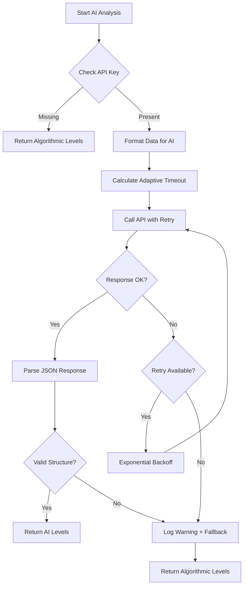
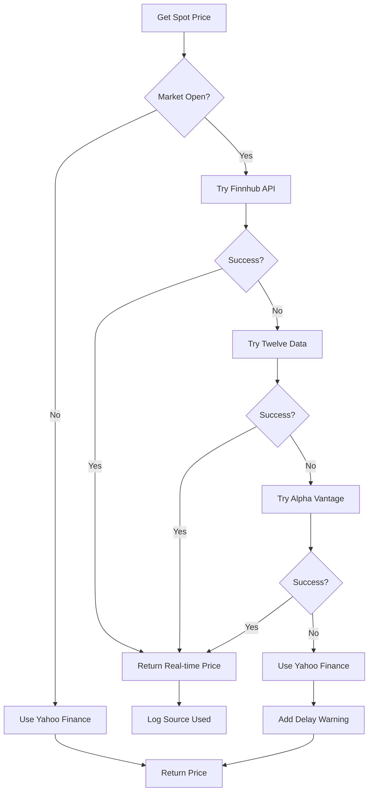

# Solutions for AI Timeout and Real-time Spot Price Issues

## Executive Summary

This document outlines solutions for two critical issues in the options quant agent:

1. **AI Analysis Timeout**: GLM-5 API calls sometimes timeout, especially with certain symbols
2. **Stale Spot Price**: Yahoo Finance data is delayed 15-20 minutes, affecting level calculations

---

## Issue1: AI Analysis Timeout

### Current Implementation Analysis

The AI timeout handling is implemented in [`scripts/fetch_options_data.py`](scripts/fetch_options_data.py:247):

```python
def call_ai_api(messages: List[Dict[str, str]], max_retries: int = 3) -> Optional[str]:
    for attempt in range(max_retries):
        try:
            response = requests.post(
                AI_API_URL,
                headers={...},
                json={...},
                timeout=120  # Fixed120 second timeout
            )
            # ... response handling
        except requests.exceptions.Timeout:
            logger.warning(f"⚠️ AI API timeout (attempt {attempt + 1})")
        
        if attempt < max_retries - 1:
            time.sleep(2 ** attempt)  # Exponential backoff: 1s, 2s, 4s
```

#### Identified Problems

| Issue | Current Behavior | Impact |
|-------|-----------------|--------|
| Fixed timeout | 120 seconds for all symbols | Complex symbols may need more time |
| Short backoff | Starts at 1 second (2^0) | Too aggressive for rate-limited APIs |
| No per-symbol config | Same timeout for SPY, QQQ, SPX, NDX | Less flexible error handling |
| Silent fallback | Returns `None`, uses algorithmic levels | User not informed of AI failure |
| No timeout adaptation | Same timeout regardless of payload size | Large payloads need more time |

### Proposed Solution: Enhanced Retry Strategy

#### Solution Architecture



#### Implementation Details

##### 1. Adaptive Timeout Configuration

```python
# Add to configuration section (after line54)

# AI API Timeout Configuration
AI_TIMEOUT_CONFIG = {
    'base_timeout': 90,          # Base timeout in seconds
    'per_expiry_bonus': 30,      # Additional seconds per expiry
    'max_timeout': 300,          # Maximum timeout cap
    'min_timeout': 60,           # Minimum timeout
}

def calculate_adaptive_timeout(num_expiries: int, num_options: int) -> int:
    """
    Calculate adaptive timeout based on payload complexity.
    
    Args:
        num_expiries: Number of expirations being analyzed
        num_options: Total number of options in the payload
    
    Returns:
        Timeout in seconds
    """
    config = AI_TIMEOUT_CONFIG
    
    # Base timeout + bonus per expiry
    timeout = config['base_timeout'] + (num_expiries * config['per_expiry_bonus'])
    
    # Add bonus for large option counts (>100 options)
    if num_options > 100:
        timeout += min((num_options - 100) // 50 * 15, 60)  # +15s per 50 options, max+60s
    
    # Clamp to min/max
    return max(config['min_timeout'], min(timeout, config['max_timeout']))
```

##### 2. Enhanced Retry with Jitter

```python
import random

def call_ai_api(
    messages: List[Dict[str, str]], 
    max_retries: int = 3,
    timeout: int = 120,
    symbol: str = 'UNKNOWN'
) -> Optional[str]:
    """
    Call GLM-5 API with enhanced retry logic.
    
    Features:
    - Configurable timeout
    - Exponential backoff with jitter
    - Per-symbol error tracking
    """
    if not HAS_REQUESTS:
        logger.warning("⚠️ requests library not installed. AI analysis skipped.")
        return None
    
    if not AI_API_KEY:
        logger.warning("⚠️ AI_API_KEY not set. AI analysis skipped.")
        return None
    
    last_error = None
    
    for attempt in range(max_retries):
        try:
            logger.info(f"🤖 AI API call for {symbol} (attempt {attempt + 1}/{max_retries}, timeout={timeout}s)")
            
            response = requests.post(
                AI_API_URL,
                headers={
                    'Content-Type': 'application/json',
                    'Accept-Language': 'en-US,en',
                    'Authorization': f'Bearer {AI_API_KEY}'
                },
                json={
                    'model': AI_MODEL,
                    'messages': messages,
                    'temperature': 0.1,
                    'top_p': 0.9
                },
                timeout=timeout
            )
            
            if response.status_code == 200:
                data = response.json()
                content = data.get('choices', [{}])[0].get('message', {}).get('content', '')
                if content:
                    logger.info(f"✅ AI API success for {symbol}")
                    return content
                else:
                    last_error = "Empty response content"
                    logger.warning(f"⚠️ Empty response from AI API for {symbol} (attempt {attempt + 1})")
            elif response.status_code == 429:
                # Rate limited - use longer backoff
                last_error = f"Rate limited (429)"
                logger.warning(f"⚠️ AI API rate limited for {symbol} (attempt {attempt + 1})")
            else:
                last_error = f"HTTP {response.status_code}"
                logger.warning(f"⚠️ AI API error for {symbol}: {response.status_code} (attempt {attempt + 1})")
        
        except requests.exceptions.Timeout:
            last_error = "Timeout"
            logger.warning(f"⚠️ AI API timeout for {symbol} after {timeout}s (attempt {attempt + 1})")
        except requests.exceptions.ConnectionError as e:
            last_error = f"Connection error: {str(e)[:50]}"
            logger.warning(f"⚠️ AI API connection error for {symbol} (attempt {attempt + 1})")
        except Exception as e:
            last_error = f"Unexpected error: {str(e)[:50]}"
            logger.warning(f"⚠️ AI API unexpected error for {symbol}: {e} (attempt {attempt + 1})")
        
        # Exponential backoff with jitter
        if attempt < max_retries - 1:
            base_delay = 2 ** (attempt + 1)  # 2s, 4s, 8s
            jitter = random.uniform(0, 1)     # Add0-1s jitter
            delay = base_delay + jitter
            logger.info(f"⏳ Retrying in {delay:.1f}s...")
            time.sleep(delay)
    
    # All retries exhausted
    logger.error(f"❌ AI API failed for {symbol} after {max_retries} attempts. Last error: {last_error}")
    return None
```

##### 3. Graceful Fallback with User Notification

```python
def get_ai_analysis_with_fallback(
    expiries: List[Dict], 
    spot: float,
    symbol: str,
    algorithmic_levels: Dict
) -> Dict[str, Any]:
    """
    Get AI analysis with graceful fallback to algorithmic levels.
    
    Returns a structured response that includes:
    - AI analysis (if successful)
    - Algorithmic levels (always included as fallback)
    - Status information for UI feedback
    """
    if not AI_API_KEY:
        logger.info(f"ℹ️ AI_API_KEY not configured for {symbol}, using algorithmic levels")
        return {
            'status': 'skipped',
            'reason': 'AI_API_KEY not configured',
            'levels': format_algorithmic_levels(algorithmic_levels),
            'outlook': generate_algorithmic_outlook(algorithmic_levels, spot)
        }
    
    # Calculate adaptive timeout
    total_options = sum(len(e.get('options', [])) for e in expiries)
    timeout = calculate_adaptive_timeout(len(expiries), total_options)
    
    logger.info(f"🤖 Requesting AI analysis for {symbol} (timeout={timeout}s)...")
    
    # Format data and call API
    formatted_data = format_options_for_ai(expiries, spot)
    messages = [
        {'role': 'system', 'content': HARMONIC_SYSTEM_INSTRUCTION},
        {'role': 'user', 'content': f"ESEGUI DEEP QUANT ANALYSIS. SPOT: {spot}.\n{formatted_data}"}
    ]
    
    response_text = call_ai_api(messages, timeout=timeout, symbol=symbol)
    
    if response_text:
        try:
            cleaned_json = clean_json_response(response_text)
            result = json.loads(cleaned_json)
            
            if 'outlook' in result and 'levels' in result:
                logger.info(f"✅ AI analysis complete for {symbol}: {len(result.get('levels', []))} levels")
                return {
                    'status': 'success',
                    'levels': result['levels'],
                    'outlook': result['outlook'],
                    'fallback_levels': format_algorithmic_levels(algorithmic_levels)
                }
        except json.JSONDecodeError as e:
            logger.warning(f"⚠️ Failed to parse AI response for {symbol}: {e}")
    
    # Fallback to algorithmic levels
    logger.info(f"📊 Using algorithmic levels for {symbol}")
    return {
        'status': 'fallback',
        'reason': 'AI analysis unavailable',
        'levels': format_algorithmic_levels(algorithmic_levels),
        'outlook': generate_algorithmic_outlook(algorithmic_levels, spot)
    }


def format_algorithmic_levels(algorithmic_levels: Dict) -> List[Dict]:
    """Convert algorithmic levels to AI-like format for UI consistency."""
    levels = []
    
    # Add gamma flip as PIVOT
    if algorithmic_levels.get('gamma_flip'):
        levels.append({
            'livello': 'Gamma Flip',
            'prezzo': algorithmic_levels['gamma_flip'],
            'motivazione': 'Punto di inversione GEX cumulativo',
            'sintesiOperativa': 'PIVOT: Monitorare per break direzionale',
            'colore': 'indigo',
            'importanza': 85,
            'ruolo': 'PIVOT',
            'lato': 'GAMMA_FLIP'
        })
    
    # Add max pain as MAGNET
    if algorithmic_levels.get('max_pain'):
        levels.append({
            'livello': 'Max Pain',
            'prezzo': algorithmic_levels['max_pain'],
            'motivazione': 'Target market maker - valore opzioni minimo',
            'sintesiOperativa': 'MAGNET: Attrazione prezzo alla scadenza',
            'colore': 'ambra',
            'importanza': 80,
            'ruolo': 'MAGNET',
            'lato': 'BOTH'
        })
    
    # Add call walls
    for wall in algorithmic_levels.get('call_walls', [])[:3]:
        levels.append({
            'livello': f"Call Wall {wall['expiry']}",
            'prezzo': wall['strike'],
            'motivazione': f"Massima OI Call - Resistenza",
            'sintesiOperativa': 'WALL: Resistenza strutturale',
            'colore': 'rosso',
            'importanza': 75,
            'ruolo': 'WALL',
            'lato': 'CALL'
        })
    
    # Add put walls
    for wall in algorithmic_levels.get('put_walls', [])[:3]:
        levels.append({
            'livello': f"Put Wall {wall['expiry']}",
            'prezzo': wall['strike'],
            'motivazione': f"Massima OI Put - Supporto",
            'sintesiOperativa': 'WALL: Supporto strutturale',
            'colore': 'verde',
            'importanza': 75,
            'ruolo': 'WALL',
            'lato': 'PUT'
        })
    
    return levels


def generate_algorithmic_outlook(algorithmic_levels: Dict, spot: float) -> Dict:
    """Generate outlook based on algorithmic analysis."""
    gamma_flip = algorithmic_levels.get('gamma_flip', spot)
    max_pain = algorithmic_levels.get('max_pain', spot)
    
    # Determine sentiment based on spot vs key levels
    if spot > gamma_flip:
        sentiment = 'bullish'
    elif spot < gamma_flip:
        sentiment = 'bearish'
    else:
        sentiment = 'neutral'
    
    return {
        'sentiment': sentiment,
        'gammaFlipZone': gamma_flip,
        'volatilityExpectation': 'Media (dati algoritmici)',
        'summary': f'Analisi algoritmica: Spot {spot:.2f}, Gamma Flip {gamma_flip:.2f}, Max Pain {max_pain:.2f}'
    }
```

### Implementation Steps

1. **Add configuration constants** (lines54-65)
2. **Implement `calculate_adaptive_timeout()`** function
3. **Update `call_ai_api()`** with enhanced retry logic
4. **Implement `get_ai_analysis_with_fallback()`** to replace `get_ai_analysis()`
5. **Add helper functions** for algorithmic level formatting
6. **Update `main()`** to use new fallback mechanism

---

## Issue2: Real-time Spot Price

### Current Implementation Analysis

The spot price retrieval is in [`scripts/fetch_options_data.py`](scripts/fetch_options_data.py:416):

```python
def get_spot_price(ticker: yf.Ticker) -> Optional[float]:
    """
    Recupera il prezzo spot corrente con fallback multipli.
    """
    try:
        # Metodo 1: fast_info (più veloce)
        return float(ticker.fast_info['last_price'])
    except (KeyError, TypeError):
        pass
    
    try:
        # Metodo 2: history
        hist = ticker.history(period="1d")
        if not hist.empty:
            return float(hist['Close'].iloc[-1])
    except Exception:
        pass
    
    return None
```

#### Problem

Yahoo Finance data is **delayed 15-20 minutes** during market hours. This affects:
- AI analysis prompt (spot price context)
- Level calculations (walls relative to spot)
- TradingView level output

### Research: Free Real-time Price APIs

| API | Free Tier | Rate Limit | Real-time? | Symbols | Best For |
|-----|-----------|------------|------------|---------|----------|
| **Alpha Vantage** | 25 req/day | 5 calls/min | ~1min delay | US stocks | Low volume usage |
| **Finnhub** | 60 calls/min | 60 calls/min | Real-time | US stocks | Best free tier |
| **IEX Cloud** | 50K msgs/mo | N/A |15min delay | US stocks | Good for testing |
| **Twelve Data** | 800 calls/day | 8 calls/min | Real-time | Stocks, ETFs | Balanced option |
| **Polygon.io** | 5 calls/min | 5 calls/min |15min delayed | US stocks | Limited free tier |
| **Yahoo Finance** | Unlimited | N/A |15-20min delay | Global | Current solution |

### Recommended Solution: Multi-Source Spot Price with Fallback

#### Solution Architecture



#### Implementation Details

##### 1. API Configuration

```python
# Add to configuration section (after line54)

# Real-time spot price API configuration
SPOT_PRICE_CONFIG = {
    # Finnhub - Best free tier (60 calls/min, real-time)
    'finnhub': {
        'api_key': os.environ.get('FINNHUB_API_KEY', ''),
        'url': 'https://finnhub.io/api/v1/quote',
        'rate_limit_per_min': 60,
        'priority': 1  # Try first
    },
    # Twelve Data - Good balance (800 calls/day, real-time)
    'twelve_data': {
        'api_key': os.environ.get('TWELVE_DATA_API_KEY', ''),
        'url': 'https://api.twelvedata.com/price',
        'rate_limit_per_day': 800,
        'priority': 2
    },
    # Alpha Vantage - Backup (25 calls/day, ~1min delay)
    'alpha_vantage': {
        'api_key': os.environ.get('ALPHA_VANTAGE_API_KEY', ''),
        'url': 'https://www.alphavantage.co/query',
        'rate_limit_per_day': 25,
        'priority': 3
    },
    # Yahoo Finance - Always available fallback (15-20min delay)
    'yahoo': {
        'priority': 4  # Last resort
    }
}

# Symbol mapping for APIs that use different formats
SPOT_SYMBOL_MAP = {
    'SPY': {'finnhub': 'SPY', 'twelve_data': 'SPY', 'alpha_vantage': 'SPY'},
    'QQQ': {'finnhub': 'QQQ', 'twelve_data': 'QQQ', 'alpha_vantage': 'QQQ'},
    'SPX': {'finnhub': 'SPX', 'twelve_data': 'SPX', 'alpha_vantage': 'SPX'},
    'NDX': {'finnhub': 'NDX', 'twelve_data': 'NDX', 'alpha_vantage': 'NDX'},
}
```

##### 2. Multi-Source Spot Price Function

```python
import datetime

def is_market_open() -> bool:
    """
    Check if US market is currently open.
    Market hours: Mon-Fri, 9:30 AM - 4:00 PM ET
    """
    now = datetime.datetime.now(datetime.timezone.utc)
    
    # Convert to ET (simplified - doesn't handle DST perfectly)
    et_offset = -5  # EST, use -4 for EDT
    et_now = now.replace(tzinfo=datetime.timezone.utc).astimezone(
        tz=datetime.timezone(datetime.timedelta(hours=et_offset))
    )
    
    # Check weekend
    if et_now.weekday() >= 5:  # Saturday=5, Sunday=6
        return False
    
    # Check market hours (9:30 AM - 4:00 PM ET)
    market_open = et_now.replace(hour=9, minute=30, second=0, microsecond=0)
    market_close = et_now.replace(hour=16, minute=0, second=0, microsecond=0)
    
    return market_open <= et_now <= market_close


def get_spot_finnhub(symbol: str) -> Optional[float]:
    """Get real-time spot price from Finnhub."""
    config = SPOT_PRICE_CONFIG['finnhub']
    if not config['api_key']:
        return None
    
    try:
        mapped_symbol = SPOT_SYMBOL_MAP.get(symbol, {}).get('finnhub', symbol)
        response = requests.get(
            config['url'],
            params={
                'symbol': mapped_symbol,
                'token': config['api_key']
            },
            timeout=10
        )
        
        if response.status_code == 200:
            data = response.json()
            price = data.get('c')  # Current price
            if price and price > 0:
                logger.info(f"📈 Finnhub spot for {symbol}: {price:.2f}")
                return float(price)
    except Exception as e:
        logger.warning(f"⚠️ Finnhub error for {symbol}: {e}")
    
    return None


def get_spot_twelve_data(symbol: str) -> Optional[float]:
    """Get real-time spot price from Twelve Data."""
    config = SPOT_PRICE_CONFIG['twelve_data']
    if not config['api_key']:
        return None
    
    try:
        mapped_symbol = SPOT_SYMBOL_MAP.get(symbol, {}).get('twelve_data', symbol)
        response = requests.get(
            config['url'],
            params={
                'symbol': mapped_symbol,
                'apikey': config['api_key']
            },
            timeout=10
        )
        
        if response.status_code == 200:
            data = response.json()
            # Twelve Data returns price as string or in 'price' field
            price = data.get('price') if isinstance(data, dict) else data
            if price:
                price_float = float(price)
                if price_float > 0:
                    logger.info(f"📈 Twelve Data spot for {symbol}: {price_float:.2f}")
                    return price_float
    except Exception as e:
        logger.warning(f"⚠️ Twelve Data error for {symbol}: {e}")
    
    return None


def get_spot_alpha_vantage(symbol: str) -> Optional[float]:
    """Get spot price from Alpha Vantage (~1min delay)."""
    config = SPOT_PRICE_CONFIG['alpha_vantage']
    if not config['api_key']:
        return None
    
    try:
        mapped_symbol = SPOT_SYMBOL_MAP.get(symbol, {}).get('alpha_vantage', symbol)
        response = requests.get(
            config['url'],
            params={
                'function': 'GLOBAL_QUOTE',
                'symbol': mapped_symbol,
                'apikey': config['api_key']
            },
            timeout=10
        )
        
        if response.status_code == 200:
            data = response.json()
            quote = data.get('Global Quote', {})
            price = quote.get('05. price') or quote.get('08. previous close')
            if price:
                price_float = float(price)
                if price_float > 0:
                    logger.info(f"📈 Alpha Vantage spot for {symbol}: {price_float:.2f}")
                    return price_float
    except Exception as e:
        logger.warning(f"⚠️ Alpha Vantage error for {symbol}: {e}")
    
    return None


def get_spot_price_realtime(symbol: str, ticker: yf.Ticker) -> Dict[str, Any]:
    """
    Get spot price with multi-source fallback.
    
    Returns:
        {
            'price': float,
            'source': str,
            'delay_minutes': int,
            'is_realtime': bool
        }
    """
    # If market is closed, just use Yahoo (no need for real-time)
    if not is_market_open():
        price = get_spot_yahoo(ticker)
        if price:
            return {
                'price': price,
                'source': 'yahoo',
                'delay_minutes': 0,  # Market closed, no delay concern
                'is_realtime': False
            }
        return None
    
    # Market is open - try real-time sources in priority order
    
    # Try Finnhub (best free tier)
    price = get_spot_finnhub(symbol)
    if price:
        return {
            'price': price,
            'source': 'finnhub',
            'delay_minutes': 0,
            'is_realtime': True
        }
    
    # Try Twelve Data
    price = get_spot_twelve_data(symbol)
    if price:
        return {
            'price': price,
            'source': 'twelve_data',
            'delay_minutes': 0,
            'is_realtime': True
        }
    
    # Try Alpha Vantage (~1min delay)
    price = get_spot_alpha_vantage(symbol)
    if price:
        return {
            'price': price,
            'source': 'alpha_vantage',
            'delay_minutes': 1,
            'is_realtime': False
        }
    
    # Fallback to Yahoo Finance (15-20min delay)
    price = get_spot_yahoo(ticker)
    if price:
        logger.warning(f"⚠️ Using delayed Yahoo data for {symbol} (~15-20min delay)")
        return {
            'price': price,
            'source': 'yahoo',
            'delay_minutes': 15,
            'is_realtime': False
        }
    
    return None


def get_spot_yahoo(ticker: yf.Ticker) -> Optional[float]:
    """Get spot price from Yahoo Finance (original implementation)."""
    try:
        return float(ticker.fast_info['last_price'])
    except (KeyError, TypeError):
        pass
    
    try:
        hist = ticker.history(period="1d")
        if not hist.empty:
            return float(hist['Close'].iloc[-1])
    except Exception:
        pass
    
    return None
```

##### 3. Update Data Fetching to Include Spot Metadata

```python
def fetch_symbol_data(symbol: str) -> Optional[OptionsDataset]:
    """Download all data for a single symbol with real-time spot."""
    yf_symbol = SYMBOL_MAP.get(symbol.upper(), symbol.upper())
    
    logger.info(f"\n{'='*50}")
    logger.info(f"  Processing: {symbol} (yfinance: {yf_symbol})")
    logger.info(f"{'='*50}")
    
    try:
        ticker = yf.Ticker(yf_symbol)
        
        # Get spot price with real-time fallback
        logger.info("[1/3] Fetching spot price...")
        spot_data = get_spot_price_realtime(symbol, ticker)
        
        if not spot_data:
            logger.error(f"❌ Cannot retrieve spot price for {symbol}")
            return None
        
        spot = spot_data['price']
        spot_source = spot_data['source']
        is_realtime = spot_data['is_realtime']
        
        logger.info(f"  -> Spot: {spot:.2f} (source: {spot_source}, realtime: {is_realtime})")
        
        # ... rest of the function remains the same ...
        
        return OptionsDataset(
            symbol=symbol,
            spot=round(spot, 2),
            generated=datetime.now().isoformat(),
            expiries=expiries,
            # Add metadata
            _metadata={
                'spot_source': spot_source,
                'spot_is_realtime': is_realtime,
                'spot_delay_minutes': spot_data['delay_minutes']
            }
        )
```

### API Key Setup

Add to `.env` file or environment:

```bash
# Real-time spot price APIs (get free keys at:)
# Finnhub: https://finnhub.io/register
FINNHUB_API_KEY=your_finnhub_key_here

# Twelve Data: https://twelvedata.com/pricing
TWELVE_DATA_API_KEY=your_twelve_data_key_here

# Alpha Vantage: https://www.alphavantage.co/support/#api-key
ALPHA_VANTAGE_API_KEY=your_alpha_vantage_key_here
```

### Implementation Steps

1. **Add API configuration** constants
2. **Implement `is_market_open()`** function
3. **Implement provider-specific functions** (`get_spot_finnhub`, etc.)
4. **Implement `get_spot_price_realtime()`** with fallback chain
5. **Update `fetch_symbol_data()`** to use new spot price function
6. **Add spot metadata** to output JSON for UI display
7. **Update frontend** to show spot price source and delay warning

---

## Summary of Changes

### Files to Modify

| File | Changes |
|------|---------|
| `scripts/fetch_options_data.py` | All timeout and spot price improvements |
| `services/glmService.ts` | Mirror timeout improvements for frontend |
| `types.ts` | Add spot metadata types |
| `components/QuantPanel.tsx` | Display spot source and delay warnings |
| `.env.local` | Add new API keys |

### Configuration Required

```bash
# Required for real-time spot prices
FINNHUB_API_KEY=        # Recommended (best free tier)
TWELVE_DATA_API_KEY=    # Alternative
ALPHA_VANTAGE_API_KEY=  # Backup

# Existing
AI_API_KEY=             # For GLM-5 AI analysis
```

### Testing Checklist

- [ ] Test AI timeout with various symbols (SPY, QQQ, SPX, NDX)
- [ ] Verify fallback to algorithmic levels works
- [ ] Test real-time spot price during market hours
- [ ] Verify Yahoo fallback when APIs unavailable
- [ ] Check rate limiting doesn't cause issues
- [ ] Verify UI shows appropriate warnings for delayed data
