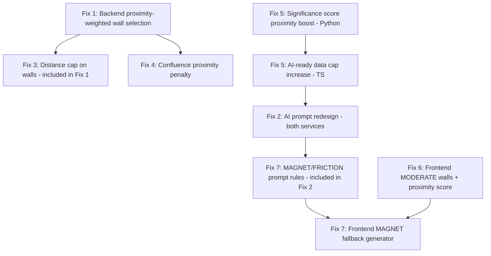

# Intraday Levels Fix — Implementation Plan

## Problem Statement

The application generates too few support/resistance levels, and the ones it does generate are too far from the current spot price for intraday trading. Example: NDX at $27,036.75 shows only 3 levels — 27000 (-0.14%), 26700 (-1.24%), and 27500 (+1.71%) — while strikes 708–715 on SPY with OI of 4,777–21,698 within ±0.7% of spot are completely absent.

## Root Causes → Fixes Map

| # | Root Cause | File | Fix |
|---|-----------|------|-----|
| 1 | Wall selection is pure OI-ranked, no proximity weighting | `scripts/fetch_options_data.py` | Add proximity-weighted scoring to `select_walls_by_expiry()` |
| 2 | AI prompt caps level count too aggressively | `services/glmService.ts`, `services/geminiService.ts` | Redesign prompt for 8–15 levels with mandatory MAGNET/FRICTION |
| 3 | No max distance filter on algorithmic walls | `scripts/fetch_options_data.py` | Add ±5% distance cap in `select_walls_by_expiry()` |
| 4 | Confluence detection fills slots with distant strikes | `scripts/fetch_options_data.py` | Add proximity penalty in `find_confluence_levels_enhanced()` |
| 5 | AI-ready data caps at 25 strikes, proximity under-weighted | `services/glmService.ts`, `services/geminiService.ts`, `scripts/fetch_options_data.py` | Increase cap to 40, boost proximity weight from 15% → 30% |
| 6 | Frontend only shows DOMINANT walls | `components/VercelView.tsx` | Include MODERATE walls near spot (within ±1.5%) |
| 7 | MAGNET/FRICTION levels never generated | `services/glmService.ts`, `services/geminiService.ts` | Add explicit intraday micro-level rules to AI prompt |

---

## Fix 1: Proximity-Weighted Wall Selection (Backend)

### File: `scripts/fetch_options_data.py`

**Target function:** `select_walls_by_expiry()` — lines 2872–2923

**Current behavior:** Sorts calls above spot and puts below spot by **pure OI descending**, then takes top N. This selects hedge fund structural hedges 25–30% from spot.

**New behavior:** Score each candidate by a composite of OI rank + proximity rank, then take top N.

#### Code Changes

At line 2888, replace the entire function body from line 2888 through 2923:

```python
def select_walls_by_expiry(expiries: List[Dict], spot: float, top_n: int = 3,
                           max_distance_pct: float = 5.0) -> Dict[str, List[Dict]]:
    """
    Select Call/Put Walls per expiry using proximity-weighted scoring.
    
    Scoring: 50% OI rank + 50% proximity rank.
    Walls beyond max_distance_pct from spot are excluded.
    
    Args:
        expiries: List of expiry data with options
        spot: Current spot price
        top_n: Number of walls per type per expiry (default 3)
        max_distance_pct: Maximum distance from spot as percentage (default 5%)
    
    Returns:
        {"call_walls": [...], "put_walls": [...]}
    """
    MAX_DISTANCE_PCT = max_distance_pct  # ±5% cap
    call_walls = []
    put_walls = []
    
    for expiry in expiries:
        expiry_label = expiry.get('label', 'UNKNOWN')
        
        # Separate calls and puts
        calls = [(opt['strike'], opt['oi']) for opt in expiry.get('options', [])
                 if opt['side'] == 'CALL' and opt['oi'] > 0]
        puts = [(opt['strike'], opt['oi']) for opt in expiry.get('options', [])
                if opt['side'] == 'PUT' and opt['oi'] > 0]
        
        # Filter by side of spot AND distance cap
        calls_above = [(s, o) for s, o in calls
                       if s > spot and o > 0 and (abs(s - spot) / spot * 100) <= MAX_DISTANCE_PCT]
        puts_below = [(s, o) for s, o in puts
                      if s < spot and o > 0 and (abs(s - spot) / spot * 100) <= MAX_DISTANCE_PCT]
        
        # Score by composite: 50% OI rank + 50% proximity rank
        def score_wall(item, all_items, spot_price):
            strike, oi = item
            # OI rank: normalized 0-1 by max OI
            max_oi = max(o for _, o in all_items) if all_items else 1
            oi_score = oi / max_oi if max_oi > 0 else 0
            # Proximity rank: 1.0 at spot, decaying to 0 at MAX_DISTANCE_PCT
            dist_pct = abs(strike - spot_price) / spot_price * 100
            prox_score = max(0, 1.0 - (dist_pct / MAX_DISTANCE_PCT))
            return 0.5 * oi_score + 0.5 * prox_score
        
        # Score and sort
        calls_scored = sorted(calls_above, key=lambda x: score_wall(x, calls_above, spot), reverse=True)
        puts_scored = sorted(puts_below, key=lambda x: score_wall(x, puts_below, spot), reverse=True)
        
        for strike, oi in calls_scored[:top_n]:
            call_walls.append({"strike": round(strike, 2), "oi": oi, "expiry": expiry_label})
        for strike, oi in puts_scored[:top_n]:
            put_walls.append({"strike": round(strike, 2), "oi": oi, "expiry": expiry_label})
    
    # Final sort by composite score and limit
    return {
        "call_walls": call_walls[:top_n * len(expiries)],
        "put_walls": put_walls[:top_n * len(expiries)]
    }
```

**Key changes:**
- New `max_distance_pct` parameter defaults to 5.0 (Fix 3 — distance cap)
- Composite scoring: 50% OI + 50% proximity (Fix 1 — proximity weighting)
- Strikes beyond ±5% are excluded entirely (Fix 3)

---

## Fix 2: AI Prompt Redesign for Intraday Micro-Levels

### Files: `services/glmService.ts` (lines 40–163), `services/geminiService.ts` (lines 39–138)

**Current behavior:** The `harmonicSystemInstruction` prompt says:
- "RESONANCE max 1-2 total levels"
- "CONFLUENCE max 3-5 total levels"
- SINGLE EXPIRY roles are listed but no minimum count is enforced
- No mention of MAGNET/FRICTION for nearby strikes

**New behavior:** Prompt should mandate:
- 8–15 total levels
- Every strike with meaningful OI within ±1% must appear as MAGNET or FRICTION
- Explicit intraday micro-level generation rules

#### Changes to `harmonicSystemInstruction` in BOTH files

Replace the multi-expiry classification section (approximately lines 60–85 in both files) with:

```
**MANDATORY RULES FOR LEVEL GENERATION:**

⚠️ YOU MUST GENERATE 8-15 LEVELS TOTAL. Generating fewer than 8 levels is a FAILURE.

**INTRADAY MICRO-LEVEL RULES (HIGHEST PRIORITY):**
For EVERY strike within ±1% of spot that has meaningful OI (>500 contracts) or volume (>1000):
1. If the strike has dominant CALL OI above spot → classify as MAGNET with lato='CALL'
   - MAGNET = price attraction zone, MM delta-hedging pulls price toward this strike
   - Color: 'ambra', Importance: 65-80
2. If the strike has dominant PUT OI below spot → classify as MAGNET with lato='PUT'
   - MAGNET = price attraction zone, MM delta-hedging pulls price toward this strike
   - Color: 'ambra', Importance: 65-80
3. If the strike has high volume but moderate OI → classify as FRICTION
   - FRICTION = temporary resistance/support from intraday flow
   - Color: 'ambra', Importance: 60-75
4. NEVER skip a strike within ±0.5% of spot that has OI > 1000 or Volume > 2000

**MULTI-EXPIRY CLASSIFICATION:**

1. **RESONANCE** (VERY RARE - max 1-2 total levels):
   - Condition: The SAME exact strike (±0.5%) must be significant in ALL THREE expirations
   - Importance: 95-100

2. **CONFLUENCE** (max 3-5 total levels):
   - Condition: The SAME strike (±1%) is significant in EXACTLY TWO expirations
   - Importance: 85-94

3. **SINGLE EXPIRY** (THE MAJORITY - at least 6-10 levels):
   - Condition: Significant level in only one expiration
   - Roles: WALL (strongest OI), PIVOT (gamma flip), MAGNET (OI attraction), FRICTION (flow-based)
   - Importance: 60-84
   - This MUST cover ~70% of all levels generated

**LEVEL COUNT ENFORCEMENT:**
- Minimum 8 levels, target 10-15, maximum 20
- If you identify fewer than 8 levels from the data, re-examine strikes within ±1.5% of spot
- Every strike within ±0.7% of spot with OI > 500 MUST appear as a level
```

Also add to the `ANALYSIS INSTRUCTIONS` section in `formatAIReadyData()` (line ~318 in glmService.ts, line ~235 in geminiService.ts):

```
7. MANDATORY: Generate MAGNET levels for strikes within ±1% with significant OI
8. MANDATORY: Generate FRICTION levels for strikes within ±1% with high volume/OI ratio
9. NEVER produce fewer than 8 levels total
```

---

## Fix 3: Distance Cap on Algorithmic Walls

### File: `scripts/fetch_options_data.py`

**Already addressed in Fix 1** — the `max_distance_pct=5.0` parameter in `select_walls_by_expiry()`.

Additionally, add a distance filter to the wall data before it gets serialized. Find where `selected_levels` is built (search for `"call_walls"` in the main processing function) and add a filter:

```python
# After select_walls_by_expiry() call, filter by distance
MAX_WALL_DISTANCE_PCT = 5.0
walls = select_walls_by_expiry(expiries, spot, top_n=3, max_distance_pct=MAX_WALL_DISTANCE_PCT)
```

This is already handled by the new function signature in Fix 1.

---

## Fix 4: Confluence Detection Proximity Penalty

### File: `scripts/fetch_options_data.py`

**Target function:** `find_confluence_levels_enhanced()` — lines 2570–2722

**Current behavior:** Line 2636 sorts confluence strikes by distance from spot (closest first), then takes top 5. But if there are only 2–3 confluence strikes near spot, the remaining slots go to distant strikes.

**New behavior:** Add a distance penalty to the scoring so distant strikes rank lower, and cap at ±5%.

#### Code Changes

At line 2635, replace the sorting logic:

```python
    # Sort by proximity-weighted score (not just distance)
    # Penalize strikes far from spot
    MAX_CONFLUENCE_DISTANCE_PCT = 5.0
    
    def confluence_score(strike, spot_price):
        """Score confluence strike: closer to spot = higher score."""
        dist_pct = abs(strike - spot_price) / spot_price * 100 if spot_price > 0 else 999
        if dist_pct > MAX_CONFLUENCE_DISTANCE_PCT:
            return -1  # Will be filtered out
        # Exponential proximity bonus: 100 at spot, decaying to ~37 at 2.5%, ~14 at 5%
        return 100 * math.exp(-(dist_pct / 2.5) ** 2)
    
    # Filter and sort by proximity score
    scored_strikes = [(s, confluence_score(s, spot)) for s in confluence_strikes.keys()]
    scored_strikes = [(s, sc) for s, sc in scored_strikes if sc > 0]
    scored_strikes.sort(key=lambda x: x[1], reverse=True)
    sorted_strikes = [s for s, _ in scored_strikes]
```

Then at line 2640, change `sorted_strikes[:5]` to use the new list:

```python
    for strike in sorted_strikes[:5]:  # Max 5 confluence levels (now proximity-filtered)
```

---

## Fix 5: AI-Ready Data — More Strikes, Higher Proximity Weight

### File: `scripts/fetch_options_data.py`

**Target function:** `calculate_significance_score()` — lines 2163–2204

**Current weights:** OI 35%, Vol 20%, Vol/OI 20%, Proximity 15%, IV 10%

**New weights:** OI 25%, Vol 20%, Vol/OI 10%, Proximity 30%, IV 15%

#### Code Changes

At line 2182–2184, change the weight constants:

```python
    # Adjust weights based on data quality
    if data_quality in ('degraded', 'stale'):
        oi_weight = 20       # Reduced from 25
        proximity_weight = 35  # Boosted from 25
    else:
        oi_weight = 25       # Reduced from 35 — proximity matters more for intraday
        proximity_weight = 30  # Boosted from 15 — intraday relevance is paramount
```

Also tighten the proximity Gaussian decay at line 2198. Currently `distance_pct / 0.03` means the decay half-width is 3%. Change to 1.5% for intraday:

```python
    proximity_score = math.exp(-((distance_pct / 0.015) ** 2)) * proximity_weight
```

**Target function:** `create_ai_ready_data()` — line 2328

Change the max strikes cap from 30 to 40:

```python
            if len(strikes_list) >= 40:  # Max 40 strikes per expiry (was 30)
```

### Files: `services/glmService.ts` (line 308), `services/geminiService.ts` (line 225)

**Current behavior:** `formatAIReadyData()` slices to `.slice(0, 25)` strikes per expiry.

**New behavior:** Increase to 40 and add distance annotation:

```typescript
// In glmService.ts line 308 and geminiService.ts line 225:
${expiry.strikes.slice(0, 40).map(s =>
  `  ${s.strike}: Call OI ${s.call_oi.toLocaleString()}, Put OI ${s.put_oi.toLocaleString()}, Call IV ${(s.call_iv * 100).toFixed(1)}%, Put IV ${(s.put_iv * 100).toFixed(1)}%, Dist: ${((s.strike - data.spot) / data.spot * 100).toFixed(2)}%`
).join('\n')}
```

Note: The `Dist:` annotation helps the AI understand proximity at a glance.

---

## Fix 6: Frontend Shows MODERATE Walls Near Spot

### File: `components/VercelView.tsx`

**Target:** Lines 3696–3727 — the fallback level builder that filters to only DOMINANT walls.

**Current behavior:**
```typescript
if (wall.wallType === 'DOMINANT' && !isStrikeUsed(wall.strike))
```

**New behavior:** Include MODERATE walls if they are within ±1.5% of spot.

#### Code Changes

At line 3700–3711 (Call Walls), replace:

```typescript
    for (const wall of enhancedWalls.callWalls) {
      const distPct = spot > 0 ? Math.abs((wall.strike - spot) / spot) * 100 : 999;
      const isNearSpot = distPct <= 1.5;
      const isStrongEnough = wall.wallType === 'DOMINANT' || (wall.wallType === 'MODERATE' && isNearSpot);
      if (isStrongEnough && !isStrikeUsed(wall.strike)) {
        levels.push({
          level: wall.strike,
          type: 'CALL_WALL',
          expiries: ['0DTE'],
          oi: wall.oi,
          wallType: wall.wallType
        });
        markStrikeUsed(wall.strike);
      }
    }
```

At line 3714–3727 (Put Walls), same pattern:

```typescript
    for (const wall of enhancedWalls.putWalls) {
      const distPct = spot > 0 ? Math.abs((wall.strike - spot) / spot) * 100 : 999;
      const isNearSpot = distPct <= 1.5;
      const isStrongEnough = wall.wallType === 'DOMINANT' || (wall.wallType === 'MODERATE' && isNearSpot);
      if (isStrongEnough && !isStrikeUsed(wall.strike)) {
        levels.push({
          level: wall.strike,
          type: 'PUT_WALL',
          expiries: ['0DTE'],
          oi: wall.oi,
          wallType: wall.wallType
        });
        markStrikeUsed(wall.strike);
      }
    }
```

Also update the "No Significant Levels" message at line 4082:

```typescript
<p className="text-xs text-gray-600 mt-1">DOMINANT and nearby MODERATE walls are shown</p>
```

### Additional: Proximity Score Boost in `calculateLevelScore()`

**Target:** Lines 849–868 — the normal-mode scoring.

**Current proximity weight:** 15 points out of 100 (15%).

**New proximity weight:** 30 points, with tighter Gaussian decay:

```typescript
  // Normal mode (market open): OI is primary
  // 1. OI Score (0–25): Normalized by max OI (was 35)
  const oiScore = maxOi > 0 ? (oi / maxOi) * 25 : 0;

  // 2. Volume Score (0–20): Normalized by max volume (unchanged)
  const volScore = maxVolume > 0 ? (volume / maxVolume) * 20 : 0;

  // 3. Vol/OI Ratio Score (0–10): Reduced from 20 (was over-weighted)
  const volOiRatio = oi > 0 ? volume / oi : 0;
  const volOiScore = (Math.min(volOiRatio, 2) / 2) * 10;

  // 4. Proximity Score (0–30): Gaussian decay from spot (was 15, now 30)
  //    Tighter decay: divide by 1.5 instead of 3 for intraday relevance
  const proximityScore = Math.exp(-Math.pow(distanceFromSpot / 1.5, 2)) * 30;

  // 5. IV Score (0–15): IV extremity (was 10)
  const ivScore = Math.min(iv * 100, 1.0) * 15;

  return oiScore + volScore + volOiScore + proximityScore + ivScore;
```

Also update the volume-primary mode (lines 828–846) similarly:

```typescript
  if (useVolumePrimary) {
    const volScore = maxVolume > 0 ? (volume / maxVolume) * 30 : 0;
    const oiScore = (maxOi > 0 && oi > 0) ? (oi / maxOi) * 10 : 0;
    const proximityScore = Math.exp(-Math.pow(distanceFromSpot / 1.5, 2)) * 30;
    const ivScore = Math.min(iv * 100, 1.0) * 15;
    const rawTotal = volScore + oiScore + proximityScore + ivScore;
    return (rawTotal / 85) * 100;
  }
```

---

## Fix 7: MAGNET/FRICTION Level Generation

### Files: `services/glmService.ts`, `services/geminiService.ts`

**Already addressed in Fix 2** — the new prompt section "INTRADAY MICRO-LEVEL RULES" explicitly mandates MAGNET and FRICTION generation for nearby strikes.

Additionally, add a **fallback generator** in the frontend for when AI analysis is unavailable. In `components/VercelView.tsx`, after the wall sections (around line 3727), add MAGNET/FRICTION generation from raw options data:

```typescript
    // 5. Add MAGNET levels for high-OI strikes near spot (fallback only)
    const INTRADAY_MAGNET_MAX_DIST = 1.0; // ±1% from spot
    const allOptions = quantAnalysis.allOptions;
    
    // Group options by strike
    const strikeMap = new Map<number, { callOi: number; putOi: number; callVol: number; putVol: number }>();
    for (const opt of allOptions) {
      const existing = strikeMap.get(opt.strike) || { callOi: 0, putOi: 0, callVol: 0, putVol: 0 };
      if (opt.side === 'CALL') {
        existing.callOi += opt.oi;
        existing.callVol += opt.vol;
      } else {
        existing.putOi += opt.oi;
        existing.putVol += opt.vol;
      }
      strikeMap.set(opt.strike, existing);
    }
    
    // Find MAGNET candidates: strikes within ±1% with OI > 0
    for (const [strike, data] of strikeMap) {
      const distPct = spot > 0 ? Math.abs((strike - spot) / spot) * 100 : 999;
      if (distPct <= INTRADAY_MAGNET_MAX_DIST && !isStrikeUsed(strike)) {
        const totalOi = data.callOi + data.putOi;
        const totalVol = data.callVol + data.putVol;
        // Minimum threshold: OI > 500 or Vol > 1000
        if (totalOi > 500 || totalVol > 1000) {
          const isCallDominant = data.callOi > data.putOi;
          levels.push({
            level: strike,
            type: isCallDominant ? 'CALL_MAGNET' : 'PUT_MAGNET',
            expiries: ['0DTE'],
            oi: totalOi,
            wallType: 'MODERATE' as WallType
          });
          markStrikeUsed(strike);
        }
      }
    }
```

### Type Changes: `types.ts`

Add new level types to support the frontend fallback. At line 9, the `ruolo` field already includes `'MAGNET' | 'FRICTION'`. No type changes needed for AI levels.

For the frontend display, the `type` field in the fallback level builder uses string literals. Add these to the rendering logic. In `VercelView.tsx`, search for where `type` is rendered and add cases:

```typescript
// Around line 1880, the LevelRow component's type prop needs to accept:
type: 'RESONANCE' | 'CONFLUENCE' | 'CALL_WALL' | 'PUT_WALL' | 'CALL_MAGNET' | 'PUT_MAGNET' | 'GAMMA_FLIP';
```

Update the label rendering to handle MAGNET types:

```typescript
const typeLabels: Record<string, string> = {
  'RESONANCE': 'RESONANCE',
  'CONFLUENCE': 'CONFLUENCE',
  'CALL_WALL': 'CALL WALL',
  'PUT_WALL': 'PUT WALL',
  'CALL_MAGNET': 'CALL MAGNET',
  'PUT_MAGNET': 'PUT MAGNET',
  'GAMMA_FLIP': 'GAMMA FLIP',
};
```

---

## Implementation Order



### Step-by-step execution:

1. **`scripts/fetch_options_data.py`** — Apply Fixes 1, 3, 4, 5a (backend changes)
   - Modify `select_walls_by_expiry()` (line 2872)
   - Modify `find_confluence_levels_enhanced()` (line 2635)
   - Modify `calculate_significance_score()` (line 2182)
   - Modify `create_ai_ready_data()` (line 2328)

2. **`services/glmService.ts`** — Apply Fixes 2, 5b, 7 (GLM prompt + data)
   - Replace `harmonicSystemInstruction` multi-expiry section (line 60)
   - Update `formatAIReadyData()` slice cap and distance annotation (line 308)

3. **`services/geminiService.ts`** — Apply Fixes 2, 5b, 7 (Gemini prompt + data)
   - Replace `harmonicSystemInstruction` multi-expiry section (line 59)
   - Update `formatAIReadyData()` slice cap and distance annotation (line 225)

4. **`components/VercelView.tsx`** — Apply Fixes 6, 7 (frontend display)
   - Update `calculateLevelScore()` proximity weight (line 849)
   - Update wall filtering to include MODERATE near spot (line 3700)
   - Add MAGNET fallback generator (after line 3727)
   - Update type labels for MAGNET display

5. **`types.ts`** — Only if needed for new frontend level types (likely not needed since `ruolo` already has MAGNET/FRICTION)

---

## Testing Approach

### 1. Backend Validation (Python)

Run the data fetch script and verify wall selection:

```bash
python scripts/fetch_options_data.py --symbol SPY --output data/test_output.json
```

**Assertions:**
- No wall in `selected_levels.call_walls` or `put_walls` is beyond ±5% from spot
- At least 2–3 walls appear within ±2% of spot
- Confluence levels are sorted by proximity, not raw OI
- Significance scores for strikes within ±1% are higher than before

### 2. AI Response Validation

Trigger AI analysis and check:

**Assertions:**
- AI returns 8–15 levels (not 3–6)
- At least 3–4 levels are within ±1% of spot
- MAGNET and FRICTION roles appear in the response
- No level beyond ±5% unless it is RESONANCE or CONFLUENCE

### 3. Frontend Visual Validation

Load the VercelView and check:

**Assertions:**
- MODERATE walls appear in the levels list when within ±1.5%
- MAGNET levels display with amber color and proper badge
- Level count is 8+ instead of 3
- The "No Significant Levels" message does not appear for symbols with active options data
- All levels within ±1% of spot are visible

### 4. Regression Check

- RESONANCE detection still works (same strike in 3 expiries)
- CONFLUENCE detection still works (same strike in 2 expiries)
- Gamma Flip and Max Pain still appear correctly
- DOMINANT walls still display with red/green badges
- No performance degradation from increased strike count (40 vs 25)

---

## Risk Assessment

| Risk | Mitigation |
|------|-----------|
| AI token limit exceeded with 40 strikes | Monitor token usage; 40 strikes × 4 fields ≈ 2000 tokens, well within limits |
| Too many levels clutter UI | Levels are sorted by proximity; closest are most visible |
| MODERATE walls add noise | Only included within ±1.5%, and scored lower than DOMINANT |
| Proximity weight too aggressive | Gaussian decay ensures gradual falloff, not a hard cliff |
| Python changes break GitHub Actions | Test locally with `--symbol SPY` before pushing |

---

## Summary of All Line-Level Changes

| File | Lines | Change |
|------|-------|--------|
| `scripts/fetch_options_data.py` | 2182–2184 | Proximity weight 15→30, OI weight 35→25 |
| `scripts/fetch_options_data.py` | 2198 | Gaussian decay divisor 0.03→0.015 |
| `scripts/fetch_options_data.py` | 2328 | Strike cap 30→40 |
| `scripts/fetch_options_data.py` | 2635–2640 | Confluence proximity scoring + ±5% filter |
| `scripts/fetch_options_data.py` | 2872–2923 | Full rewrite: proximity-weighted wall selection + distance cap |
| `services/glmService.ts` | 60–85 | Replace multi-expiry classification with intraday-first rules |
| `services/glmService.ts` | 308 | Slice 25→40, add distance annotation |
| `services/glmService.ts` | 318–325 | Add MAGNET/FRICTION mandatory instructions |
| `services/geminiService.ts` | 59–84 | Replace multi-expiry classification with intraday-first rules |
| `services/geminiService.ts` | 225 | Slice 25→40, add distance annotation |
| `services/geminiService.ts` | 235–242 | Add MAGNET/FRICTION mandatory instructions |
| `components/VercelView.tsx` | 849–868 | Proximity score 15→30, tighter Gaussian decay |
| `components/VercelView.tsx` | 3700–3727 | Include MODERATE walls within ±1.5% |
| `components/VercelView.tsx` | ~3728 | Add MAGNET fallback generator block |
| `components/VercelView.tsx` | 4082 | Update empty-state message text |
