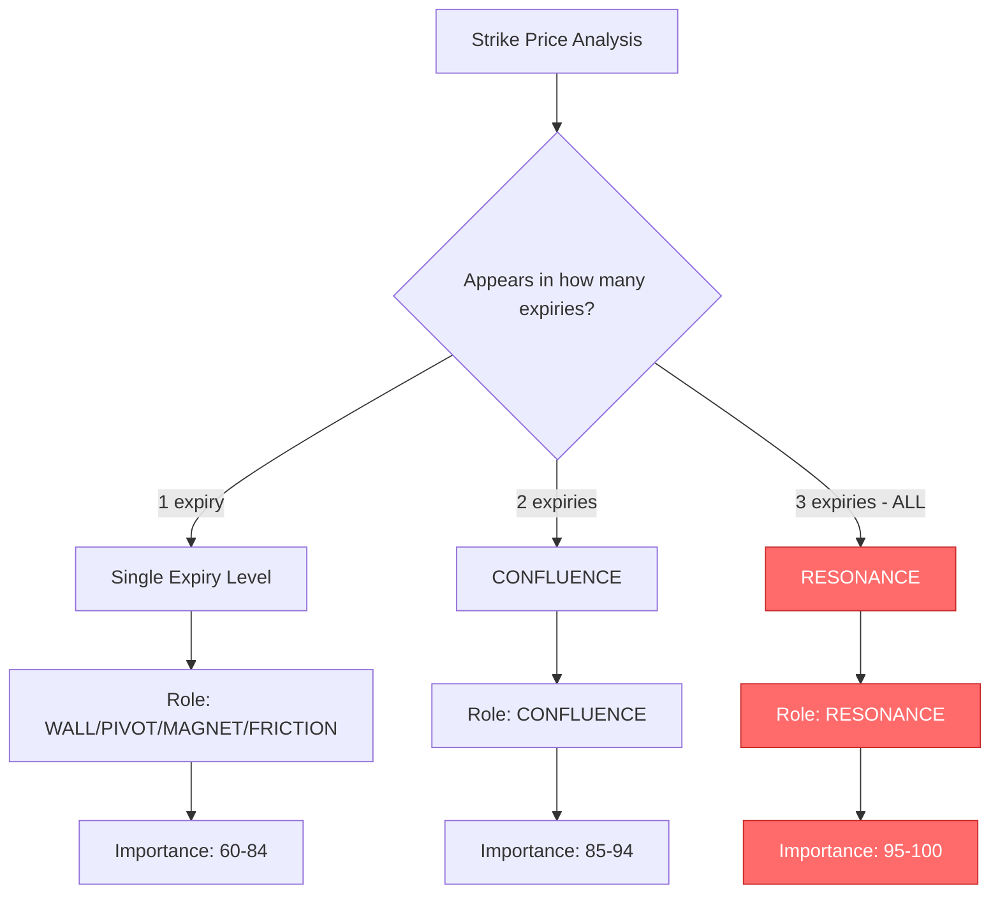

# Level Classification System Review & Improvements

## Executive Summary

The current level classification system has a gap: **RESONANCE is not defined** as a distinct level type. Strikes appearing in ALL three expiries (0DTE + WEEKLY + MONTHLY) are currently classified as `CONFLUENCE`, the same as strikes appearing in only two expiries.

---

## Current State Analysis

### 1. LevelRole Types ([`types.ts:9`](types.ts:9))

```typescript
ruolo: 'WALL' | 'PIVOT' | 'MAGNET' | 'FRICTION' | 'CONFLUENCE';
```

**Finding**: RESONANCE is NOT defined as a level type.

### 2. Classification Rules ([`geminiService.ts:37-39`](services/geminiService.ts:37))

```
REGOLE TASSATIVE PER LE CONFLUENZE (MULTI-EXPIRY):
1. DEFINIZIONE DI CONFLUENZA: Se uno strike price appare in PIÙ di una scadenza, ruolo 'CONFLUENCE', lato 'BOTH'.
2. PRIORITÀ VISIVA: Le confluenze sono i livelli più importanti. Importanza 98-100 se 3+ scadenze.
```

### 3. Response Schema ([`geminiService.ts:104`](services/geminiService.ts:104))

```typescript
ruolo: { type: Type.STRING, enum: ["WALL", "PIVOT", "MAGNET", "FRICTION", "CONFLUENCE"] }
```

**Finding**: Schema restricts AI to only output the 5 existing roles.

---

## Identified Gaps

| Gap | Description | Impact |
|-----|-------------|--------|
| No RESONANCE type | Strikes in all 3 expiries get same label as 2-expiry strikes | Cannot visually distinguish highest-confluence levels |
| Vague importance scaling | Only "98-100 se 3+ scadenze" defined | No clear rule for 2-expiry confluence importance |
| No expiry count tracking | System doesn't record how many expiries a level appears in | Harder to debug and verify classification |

---

## Proposed Improvements

### 1. Add RESONANCE Level Type

**Definition**: RESONANCE = Strike appears in ALL THREE expiries (0DTE + WEEKLY + MONTHLY)

This represents the strongest possible confluence - Market Maker hedging pressure aligns across all timeframes.

### 2. Importance Scaling System

| Level Type | Expiry Count | Importance Range | Visual Priority |
|------------|--------------|------------------|-----------------|
| Single Expiry | 1 | 60-84 | Normal |
| CONFLUENCE | 2 | 85-94 | High |
| RESONANCE | 3 (ALL) | 95-100 | Critical |

### 3. Updated AI Rules

```
REGOLE TASSATIVE PER CLASSIFICAZIONE MULTI-EXPIRY:

1. **RESONANCE** (3 scadenze - 0DTE + WEEKLY + MONTHLY):
   - Se uno strike appare in TUTTE E TRE le scadenze
   - Ruolo: 'RESONANCE', Lato: 'BOTH'
   - Importanza: 95-100
   - Descrizione: "Risonanza armonica totale - Massima priorità"

2. **CONFLUENCE** (2 scadenze):
   - Se uno strike appare in ESATTAMENTE DUE scadenze
   - Ruolo: 'CONFLUENCE', Lato: 'BOTH'  
   - Importanza: 85-94
   - Descrizione: "Confluenza parziale - Alta priorità"

3. **Single Expiry Levels**:
   - Appare in una sola scadenza
   - Ruolo: WALL/PIVOT/MAGNET/FRICTION in base a metriche
   - Importanza: 60-84
```

---

## Implementation Plan

### Files to Modify

1. **[`types.ts`](types.ts)** - Add RESONANCE to LevelRole type
2. **[`services/geminiService.ts`](services/geminiService.ts)** - Update AI rules and schema
3. **[`services/glmService.ts`](services/glmService.ts)** - Update AI rules and schema

### Changes Detail

#### Step 1: Update types.ts

```typescript
// Before
ruolo: 'WALL' | 'PIVOT' | 'MAGNET' | 'FRICTION' | 'CONFLUENCE';

// After
ruolo: 'WALL' | 'PIVOT' | 'MAGNET' | 'FRICTION' | 'CONFLUENCE' | 'RESONANCE';
```

#### Step 2: Update geminiService.ts

- Update `harmonicSystemInstruction` with new RESONANCE rules
- Update `responseSchema` enum to include 'RESONANCE'

#### Step 3: Update glmService.ts

- Update `harmonicSystemInstruction` with new RESONANCE rules
- Update JSON schema in system instruction to include 'RESONANCE'

---

## Visual Representation



---

## Benefits

1. **Clearer Visual Hierarchy**: Traders can immediately identify the most critical levels
2. **Better AI Classification**: Explicit rules reduce ambiguity in AI output
3. **Improved Trading Decisions**: RESONANCE levels represent strongest MM hedging pressure
4. **Backward Compatible**: Existing CONFLUENCE levels remain, just more precisely defined

---

## Testing Recommendations

After implementation, verify with test data containing:
- Strikes appearing in only 0DTE
- Strikes appearing in 0DTE + WEEKLY (should be CONFLUENCE)
- Strikes appearing in ALL THREE (should be RESONANCE)
