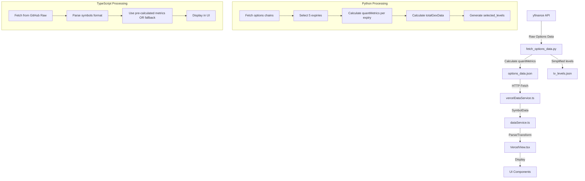

# Level and Metric Calculation Implementation Analysis

## Executive Summary

This document provides a comprehensive analysis of how levels and metrics are calculated in the options analysis application, including the data flow from raw data fetching to final display, and root cause analysis for why 0DTE metrics may show "N/A".

---

## 1. Level Calculations

### 1.1 Where Levels Are Calculated

Levels are calculated in **Python** ([`scripts/fetch_options_data.py`](scripts/fetch_options_data.py)) and stored in the JSON data files.

**Key Functions:**

| Function | Location | Purpose |
|----------|----------|---------|
| [`calculate_walls()`](scripts/fetch_options_data.py:931) | Line 931-951 | Identifies Call/Put walls based on Open Interest |
| [`find_resonance_levels()`](scripts/fetch_options_data.py:1302) | Line 1302-1351 | Finds strikes present in 3+ expiries (RESONANCE) |
| [`find_confluence_levels_enhanced()`](scripts/fetch_options_data.py:1452) | Line 1452-1518 | Finds strikes in exactly 2 expiries (CONFLUENCE) |
| [`generate_tradingview_levels()`](scripts/fetch_options_data.py:954) | Line 954-991 | Generates simplified JSON for TradingView |

### 1.2 Level Data Structure

**tv_levels.json** ([`data/tv_levels.json`](data/tv_levels.json)):
```json
{
  "updated": "2026-03-01T22:07:59.469752Z",
  "symbols": {
    "SPY": {
      "spot": 685.99,
      "gamma_flip": 685.99,
      "call_walls": [705.0, 706.0, 700.0],
      "put_walls": [653.0, 670.0, 676.0]
    }
  }
}
```

### 1.3 Level Selection Logic

From [`fetch_options_data.py`](scripts/fetch_options_data.py:560-578):

```python
# Select 5 distinct expirations for comprehensive analysis:
# 1. 0DTE - First available (intraday gamma)
# 2. WEEKLY_1 - First weekly (short-term)
# 3. WEEKLY_2 - Second weekly
# 4. MONTHLY_1 - First monthly (standard)
# 5. MONTHLY_2 - Second monthly
```

---

## 2. Metrics Calculations

### 2.1 Where Metrics Are Calculated

**Primary Location:** [`scripts/fetch_options_data.py`](scripts/fetch_options_data.py:1270-1295)

```python
def calculate_quant_metrics(options: List[Dict[str, Any]], spot: float, expiry_date: str) -> Dict[str, Any]:
    """
    Calcola tutte le metriche quantitative per una expiry.
    
    Returns:
        {
            "gamma_flip": float,
            "max_pain": float,
            "total_gex": float,
            "skew_type": str
        }
    """
    T = calculate_time_to_expiry(expiry_date)
    r = 0.05  # Risk-free rate assumption
    
    gamma_flip = calculate_gamma_flip(options, spot, T, r)
    max_pain = calculate_max_pain(options, spot)
    total_gex = calculate_total_gex(options, spot, T, r)
    skew_type = calculate_skew_type(options, spot)
    
    return {
        "gamma_flip": gamma_flip,
        "max_pain": max_pain,
        "total_gex": round(total_gex, 6),
        "skew_type": skew_type
    }
```

### 2.2 Individual Metric Calculations

| Metric | Function | Location | Formula |
|--------|----------|----------|---------|
| **Gamma Flip** | [`calculate_gamma_flip()`](scripts/fetch_options_data.py:1099) | Line 1099-1158 | Strike where cumulative GEX changes sign |
| **Total GEX** | [`calculate_total_gex()`](scripts/fetch_options_data.py:1067) | Line 1067-1096 | Σ (gamma × OI × 100 × spot² × 0.01) |
| **Max Pain** | [`calculate_max_pain()`](scripts/fetch_options_data.py:1161) | Line 1161-1212 | Strike with minimum option value at expiration |
| **Black-Scholes Gamma** | [`calculate_black_scholes_gamma()`](scripts/fetch_options_data.py:1042) | Line 1042-1064 | Standard B-S gamma formula |

### 2.3 TypeScript Metric Calculations (Frontend)

**Location:** [`components/VercelView.tsx`](components/VercelView.tsx:537-549)

The frontend can also calculate metrics locally as a fallback:

```typescript
function calculateAllQuantMetrics(options: OptionData[], spot: number, expiryDate: string): QuantMetrics {
  const T = calculateTimeToExpiry(expiryDate);
  const r = 0.05;

  return {
    gamma_flip: calculateGammaFlip(options, spot, T, r),
    total_gex: calculateTotalGEX(options, spot, T, r),
    max_pain: calculateMaxPain(options, spot),
    put_call_ratios: calculatePutCallRatios(options),
    volatility_skew: calculateVolatilitySkew(options, spot),
    gex_by_strike: calculateGexByStrike(options, spot, T, r)
  };
}
```

---

## 3. Data Flow Pipeline



### 3.1 Raw Data Structure

**options_data.json** ([`data/options_data.json`](data/options_data.json)):

```json
{
  "version": "2.0",
  "generated": "2026-03-04T08:26:58.673490Z",
  "symbols": {
    "SPY": {
      "spot": 680.28,
      "generated": "2026-03-04T08:27:01.011788Z",
      "expiries": [
        {
          "label": "0DTE",
          "date": "2026-03-04",
          "options": [...],
          "quantMetrics": {
            "gamma_flip": 680.5,
            "max_pain": 679.0,
            "total_gex": 0.123456,
            "skew_type": "CALL"
          }
        }
      ],
      "totalGexData": {...},
      "selected_levels": {...}
    }
  }
}
```

---

## 4. 0DTE Metrics Location

### 4.1 Where 0DTE Metrics Are Computed

**In Python:** [`fetch_options_data.py`](scripts/fetch_options_data.py:897-906)

```python
for label, date in selected:
    data = fetch_options_chain(ticker, date, label)
    if data:
        expiry_dict = asdict(data)
        # Calcola metriche quantitative
        expiry_dict['quantMetrics'] = calculate_quant_metrics(
            expiry_dict['options'], spot, date
        )
        expiries.append(expiry_dict)
```

The **0DTE expiry is always the first** in the selected list ([line 577](scripts/fetch_options_data.py:577)):

```python
# 1. 0DTE - always the first
selected.append(("0DTE", expirations[0]))
```

### 4.2 How 0DTE Metrics Are Displayed

**In VercelView.tsx** ([line 2439-2446](components/VercelView.tsx:2439)):

```typescript
const expiryMetrics = expiries.map(expiry => {
  // Use pre-calculated metrics if available, otherwise calculate
  if (expiry.quantMetrics) {
    return { ...expiry, calculatedMetrics: expiry.quantMetrics };
  }
  const calculated = calculateAllQuantMetrics(expiry.options, spot, expiry.date);
  return { ...expiry, calculatedMetrics: calculated };
});
```

---

## 5. Root Cause Analysis: Why 0DTE Metrics Show "N/A"

### 5.1 Primary Issue: Incomplete quantMetrics from Python

**The Python `calculate_quant_metrics()` function returns only 4 fields:**

```python
# scripts/fetch_options_data.py:1290-1295
return {
    "gamma_flip": gamma_flip,
    "max_pain": max_pain,
    "total_gex": round(total_gex, 6),
    "skew_type": skew_type
}
```

**But the TypeScript `QuantMetrics` interface expects 6 fields:**

```typescript
// types.ts:257-264
export interface QuantMetrics {
  gamma_flip: number;
  total_gex: number;
  max_pain: number;
  put_call_ratios: PutCallRatios;      // ❌ NOT in Python output
  volatility_skew: VolatilitySkew;      // ❌ NOT in Python output
  gex_by_strike: GEXData[];             // ❌ NOT in Python output
}
```

### 5.2 Secondary Issue: Missing Fallback Logic

In [`VercelView.tsx`](components/VercelView.tsx:2439-2446), when `expiry.quantMetrics` exists, it's used directly without merging missing fields:

```typescript
if (expiry.quantMetrics) {
  return { ...expiry, calculatedMetrics: expiry.quantMetrics };
  // ⚠️ put_call_ratios, volatility_skew, gex_by_strike are UNDEFINED
}
```

### 5.3 UI Display Code

The UI displays "N/A" when fields are undefined ([line 1224](components/VercelView.tsx:1224)):

```typescript
{metrics.put_call_ratios?.oi_based?.toFixed(2) ?? 'N/A'}
{metrics.volatility_skew?.skew_type?.replace('_', ' ') ?? 'N/A'}
```

### 5.4 Summary of Missing Fields

| Field | Python Calculates? | TypeScript Expects? | Result |
|-------|-------------------|---------------------|--------|
| `gamma_flip` | ✅ Yes | ✅ Yes | Works |
| `max_pain` | ✅ Yes | ✅ Yes | Works |
| `total_gex` | ✅ Yes | ✅ Yes | Works |
| `skew_type` | ✅ Yes | ❌ Different format | Issues |
| `put_call_ratios` | ❌ No | ✅ Yes | **N/A** |
| `volatility_skew` | ❌ No | ✅ Yes | **N/A** |
| `gex_by_strike` | ❌ No | ✅ Yes | **N/A** |

---

## 6. Data Transformation Pipeline

### 6.1 Complete Flow

```
1. yfinance API
   ↓ Raw options chain data
2. fetch_options_data.py
   ↓ Process and calculate metrics
3. options_data.json (stored on GitHub)
   ↓ HTTP GET request
4. vercelDataService.fetchVercelOptionsData()
   ↓ Cache and return
5. dataService.convertToDatasets()
   ↓ Parse symbols format
6. VercelView.tsx
   ↓ Calculate/display
7. UI Components
```

### 6.2 Key Data Transformations

| Stage | Input | Output | Location |
|-------|-------|--------|----------|
| Python Fetch | yfinance API | OptionsDataset | [`fetch_options_data.py:871-928`](scripts/fetch_options_data.py:871) |
| Python Calculate | Options + Spot | quantMetrics | [`fetch_options_data.py:1270`](scripts/fetch_options_data.py:1270) |
| JSON Serialize | OptionsDataset | JSON file | [`fetch_options_data.py`](scripts/fetch_options_data.py) |
| TS Fetch | GitHub Raw URL | VercelOptionsData | [`vercelDataService.ts:89`](services/vercelDataService.ts:89) |
| TS Parse | VercelOptionsData | MarketDataset[] | [`dataService.ts:282`](services/dataService.ts:282) |
| TS Display | SymbolData | UI | [`VercelView.tsx:2317`](components/VercelView.tsx:2317) |

---

## 7. Recommendations

### 7.1 Fix Python quantMetrics

Add missing fields to Python's `calculate_quant_metrics()`:

```python
def calculate_quant_metrics(options, spot, expiry_date):
    # ... existing code ...
    
    return {
        "gamma_flip": gamma_flip,
        "max_pain": max_pain,
        "total_gex": round(total_gex, 6),
        "skew_type": skew_type,
        # Add missing fields:
        "put_call_ratios": calculate_put_call_ratios(options),
        "volatility_skew": calculate_volatility_skew(options, spot),
        "gex_by_strike": calculate_gex_by_strike(options, spot, T, r)
    }
```

### 7.2 Fix TypeScript Fallback

Merge pre-calculated metrics with locally calculated missing fields:

```typescript
if (expiry.quantMetrics) {
  const localMetrics = calculateAllQuantMetrics(expiry.options, spot, expiry.date);
  return { 
    ...expiry, 
    calculatedMetrics: {
      ...localMetrics,           // Full metrics from local calculation
      ...expiry.quantMetrics     // Override with pre-calculated values
    } 
  };
}
```

---

## 8. File Reference Summary

| File | Purpose |
|------|---------|
| [`scripts/fetch_options_data.py`](scripts/fetch_options_data.py) | Python data fetching and metrics calculation |
| [`data/options_data.json`](data/options_data.json) | Main options data with quantMetrics |
| [`data/tv_levels.json`](data/tv_levels.json) | Simplified levels for TradingView |
| [`services/vercelDataService.ts`](services/vercelDataService.ts) | TypeScript data fetching service |
| [`services/dataService.ts`](services/dataService.ts) | Data parsing and transformation |
| [`components/VercelView.tsx`](components/VercelView.tsx) | UI display and local metric calculations |
| [`types.ts`](types.ts) | TypeScript type definitions |

---

## 9. Conclusion

The root cause of 0DTE metrics showing "N/A" is a **schema mismatch** between Python and TypeScript:

1. **Python** calculates only 4 fields in `quantMetrics`
2. **TypeScript** expects 6 fields in `QuantMetrics` interface
3. **Missing fields** (`put_call_ratios`, `volatility_skew`, `gex_by_strike`) are undefined
4. **UI** displays "N/A" for undefined values

The fix requires either:
- **Option A:** Add missing calculations to Python (preferred for consistency)
- **Option B:** Merge local calculations in TypeScript when pre-calculated metrics are incomplete
