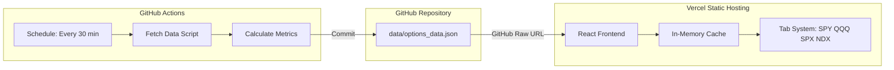
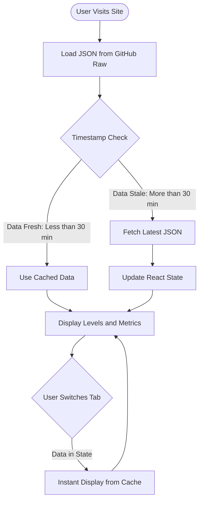
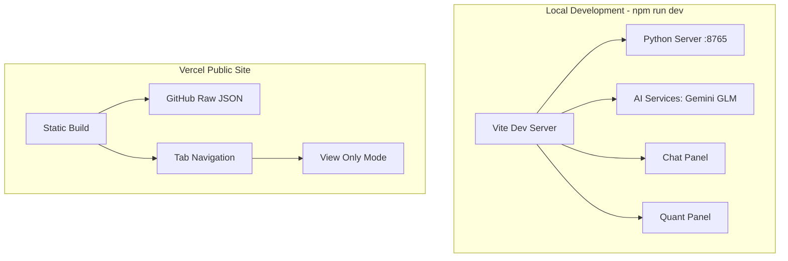

# Simplified Vercel Architecture for Options Data

## 1. Executive Summary

This document defines a simplified architecture for deploying the options quant dashboard:

| Environment | Features |
|-------------|----------|
| **Local Development** (`npm run dev`) | Full functionality: AI Chat, Model Selection, Python Server :8765 |
| **Vercel Public Site** | Read-only: Pre-calculated levels and metrics, 4-symbol tabs, 30-min updates |

**Key Principle**: No serverless functions on Vercel. Static hosting only with data served from GitHub Raw URLs.

---

## 2. Architecture Overview

### 2.1 High-Level Data Flow



### 2.2 Data Refresh Logic



### 2.3 Dual Environment Architecture



---

## 3. GitHub Actions Workflow

### 3.1 Workflow File

**File**: [`.github/workflows/fetch-options-data.yml`](.github/workflows/fetch-options-data.yml)

```yaml
name: Fetch Options Data

on:
  schedule:
    # Every 30 minutes during US market hours (9:30 AM - 4:00 PM ET)
    # UTC: 14:30, 15:00, 15:30, 16:00, 16:30, 17:00, 17:30, 18:00, 18:30, 19:00, 19:30, 20:00, 20:30
    - cron: '0,30 14-20 * * 1-5'
  workflow_dispatch:  # Manual trigger for testing

env:
  SYMBOLS: 'SPY,QQQ,SPX,NDX'
  PYTHON_VERSION: '3.11'

jobs:
  fetch-and-commit:
    runs-on: ubuntu-latest
    permissions:
      contents: write
    
    steps:
      - name: Checkout Repository
        uses: actions/checkout@v4
      
      - name: Setup Python
        uses: actions/setup-python@v5
        with:
          python-version: ${{ env.PYTHON_VERSION }}
          cache: 'pip'
      
      - name: Install Dependencies
        run: |
          pip install -r scripts/requirements.txt
      
      - name: Fetch Options Data
        run: |
          python scripts/fetch_options_data.py --symbols ${{ env.SYMBOLS }} --output data/options_data.json
        env:
          ALPHA_VANTAGE_API_KEY: ${{ secrets.ALPHA_VANTAGE_API_KEY }}
      
      - name: Commit Changes
        run: |
          git config --local user.email "github-actions[bot]@users.noreply.github.com"
          git config --local user.name "github-actions[bot]"
          git add data/options_data.json
          git diff --quiet && git diff --staged --quiet || git commit -m "chore: update options data [skip ci]"
          git push
```

### 3.2 Fetch Script Requirements

**File**: [`scripts/fetch_options_data.py`](scripts/fetch_options_data.py)

The script must:

1. **Accept command line arguments**:
   - `--symbols`: Comma-separated list of symbols
   - `--output`: Output file path

2. **Fetch data for each symbol**:
   - Options chain data
   - Current spot price
   - Volume and open interest

3. **Calculate metrics**:
   - Gamma Flip level
   - Max Pain price
   - GEX (Gamma Exposure)
   - Key support/resistance levels

4. **Generate output JSON** with timestamp

5. **Error handling**:
   - Retry logic with exponential backoff
   - Graceful degradation if one symbol fails
   - Include partial data with error flags

---

## 4. Frontend Vercel Specifications

### 4.1 Data Fetching Service

**File**: [`services/vercelDataService.ts`](services/vercelDataService.ts) (New)

```typescript
// GitHub Raw URL configuration
const GITHUB_RAW_BASE = 'https://raw.githubusercontent.com';
const REPO_OWNER = 'your-username';
const REPO_NAME = 'agente-quant-interattivo-per-opzioni';
const DATA_BRANCH = 'main';
const DATA_PATH = 'data/options_data.json';

const GITHUB_RAW_URL = `${GITHUB_RAW_BASE}/${REPO_OWNER}/${REPO_NAME}/${DATA_BRANCH}/${DATA_PATH}`;

// Refresh interval: 30 minutes
const REFRESH_INTERVAL_MS = 30 * 60 * 1000;

interface CachedData {
  timestamp: string;
  data: OptionsDataResponse;
  fetchedAt: number;
}

// In-memory cache
let cache: CachedData | null = null;

export async function fetchOptionsData(): Promise<OptionsDataResponse> {
  const now = Date.now();
  
  // Check if cache is valid
  if (cache && (now - cache.fetchedAt) < REFRESH_INTERVAL_MS) {
    return cache.data;
  }
  
  // Fetch fresh data
  const response = await fetch(GITHUB_RAW_URL);
  if (!response.ok) {
    // Return cached data if available, even if stale
    if (cache) {
      console.warn('Using stale cache due to fetch error');
      return cache.data;
    }
    throw new Error('Failed to fetch options data');
  }
  
  const data: OptionsDataResponse = await response.json();
  
  // Update cache
  cache = {
    timestamp: data.timestamp,
    data,
    fetchedAt: now
  };
  
  return data;
}

export function getCachedSymbolData(symbol: SymbolType): SymbolData | null {
  if (!cache) return null;
  return cache.data.symbols[symbol] || null;
}
```

### 4.2 React State Management

**Component**: [`components/VercelQuantPanel.tsx`](components/VercelQuantPanel.tsx) (New)

```typescript
type SymbolTab = 'SPY' | 'QQQ' | 'SPX' | 'NDX';

interface VercelQuantState {
  activeTab: SymbolTab;
  data: OptionsDataResponse | null;
  loading: boolean;
  error: string | null;
  lastUpdate: Date | null;
}

// Tab navigation with instant switching
function TabNavigation({ activeTab, onTabChange }: TabNavProps) {
  const tabs: SymbolTab[] = ['SPY', 'QQQ', 'SPX', 'NDX'];
  
  return (
    <div className="tab-navigation">
      {tabs.map(tab => (
        <button
          key={tab}
          className={activeTab === tab ? 'active' : ''}
          onClick={() => onTabChange(tab)}
        >
          {tab}
        </button>
      ))}
    </div>
  );
}

// Data stays in parent component state when switching tabs
// No re-fetch needed, instant tab switching
```

### 4.3 Vercel Configuration

**File**: [`vercel.json`](vercel.json)

```json
{
  "rewrites": [
    { "source": "/(.*)", "destination": "/index.html" }
  ],
  "headers": [
    {
      "source": "/assets/(.*)",
      "headers": [
        { "key": "Cache-Control", "value": "public, max-age=31536000, immutable" }
      ]
    }
  ],
  "trailingSlash": false
}
```

**Note**: No `functions` or `api` configuration. Pure static hosting.

### 4.4 Build Configuration

**File**: [`vite.config.ts`](vite.config.ts)

```typescript
export default defineConfig({
  build: {
    outDir: 'dist',
    sourcemap: false,
    rollupOptions: {
      output: {
        manualChunks: {
          vendor: ['react', 'react-dom'],
          charts: ['lightweight-charts']
        }
      }
    }
  },
  define: {
    'import.meta.env.VERCEL_BUILD': JSON.stringify(true)
  }
});
```

---

## 5. JSON Structure

### 5.1 Complete Schema

**File**: [`data/options_data.json`](data/options_data.json)

```json
{
  "timestamp": "2026-02-24T14:30:00Z",
  "generated_at": "2026-02-24T14:30:00Z",
  "next_update": "2026-02-24T15:00:00Z",
  "market_status": "open",
  "symbols": {
    "SPY": {
      "spot_price": 598.45,
      "previous_close": 597.20,
      "day_change": 0.21,
      "day_change_percent": 0.21,
      "volume": 85432100,
      "gamma_flip": 597.80,
      "max_pain": 598.00,
      "total_gex": 1250000000,
      "call_gex": 875000000,
      "put_gex": 375000000,
      "levels": {
        "support": [
          { "price": 595.00, "strength": "strong", "type": "put_wall" },
          { "price": 592.50, "strength": "moderate", "type": "high_oi" }
        ],
        "resistance": [
          { "price": 600.00, "strength": "strong", "type": "call_wall" },
          { "price": 605.00, "strength": "moderate", "type": "high_oi" }
        ]
      },
      "options_flow": {
        "total_call_volume": 2450000,
        "total_put_volume": 1820000,
        "put_call_ratio": 0.74,
        "unusual_activity": [
          { "strike": 600, "type": "call", "volume": 45000, "oi": 12000 }
        ]
      },
      "data_quality": "complete",
      "error": null
    },
    "QQQ": { ... },
    "SPX": { ... },
    "NDX": { ... }
  },
  "metadata": {
    "version": "1.0",
    "source": "github_actions",
    "fetch_duration_ms": 2340,
    "symbols_success": 4,
    "symbols_failed": 0
  }
}
```

### 5.2 TypeScript Interfaces

**File**: [`types.ts`](types.ts) (Additions)

```typescript
export interface OptionsDataResponse {
  timestamp: string;
  generated_at: string;
  next_update: string;
  market_status: 'open' | 'closed' | 'pre_market' | 'after_hours';
  symbols: Record<SymbolType, SymbolData>;
  metadata: ResponseMetadata;
}

export interface SymbolData {
  spot_price: number;
  previous_close: number;
  day_change: number;
  day_change_percent: number;
  volume: number;
  gamma_flip: number;
  max_pain: number;
  total_gex: number;
  call_gex: number;
  put_gex: number;
  levels: {
    support: LevelData[];
    resistance: LevelData[];
  };
  options_flow: {
    total_call_volume: number;
    total_put_volume: number;
    put_call_ratio: number;
    unusual_activity: UnusualActivity[];
  };
  data_quality: 'complete' | 'partial' | 'stale';
  error: string | null;
}

export interface LevelData {
  price: number;
  strength: 'strong' | 'moderate' | 'weak';
  type: 'put_wall' | 'call_wall' | 'high_oi' | 'gamma_flip' | 'max_pain';
}

export interface UnusualActivity {
  strike: number;
  type: 'call' | 'put';
  volume: number;
  oi: number;
}

export interface ResponseMetadata {
  version: string;
  source: string;
  fetch_duration_ms: number;
  symbols_success: number;
  symbols_failed: number;
}

export type SymbolType = 'SPY' | 'QQQ' | 'SPX' | 'NDX';
```

---

## 6. Implementation Checklist

### Phase 1: GitHub Actions Setup

- [ ] Create `.github/workflows/fetch-options-data.yml`
- [ ] Add `ALPHA_VANTAGE_API_KEY` to repository secrets
- [ ] Update `scripts/fetch_options_data.py` for CLI arguments
- [ ] Test workflow manually with `workflow_dispatch`
- [ ] Verify JSON is committed correctly

### Phase 2: Data Structure

- [ ] Update `types.ts` with new interfaces
- [ ] Create sample `data/options_data.json` with all 4 symbols
- [ ] Validate JSON schema in fetch script
- [ ] Add error handling for partial data

### Phase 3: Vercel Frontend

- [ ] Create `services/vercelDataService.ts`
- [ ] Create `components/VercelQuantPanel.tsx` with tab system
- [ ] Update `vercel.json` for static hosting only
- [ ] Remove API routes from Vercel deployment
- [ ] Add environment detection for local vs Vercel

### Phase 4: Build and Deploy

- [ ] Update `vite.config.ts` for Vercel build
- [ ] Create separate build scripts for local vs Vercel
- [ ] Test production build locally
- [ ] Deploy to Vercel
- [ ] Verify GitHub Raw URL accessibility
- [ ] Test data refresh behavior

### Phase 5: Monitoring

- [ ] Add GitHub Actions failure notifications
- [ ] Monitor JSON update frequency
- [ ] Add frontend error boundary
- [ ] Implement graceful degradation UI

---

## 7. Environment Detection

### 7.1 Code Pattern

```typescript
// Detect if running on Vercel or locally
const isVercel = import.meta.env.VERCEL === '1';
const isLocalDev = import.meta.env.DEV;

// Conditional rendering
if (isVercel) {
  // Render VercelQuantPanel (view only, tabs)
} else {
  // Render full QuantPanel with AI chat
}
```

### 7.2 Entry Point Logic

**File**: [`App.tsx`](App.tsx)

```typescript
function App() {
  const isVercel = import.meta.env.VERCEL === '1';
  
  if (isVercel) {
    return <VercelApp />;  // Simplified, view-only
  }
  
  return <LocalDevApp />;  // Full features
}
```

---

## 8. Summary

| Aspect | Local Development | Vercel Public |
|--------|-------------------|---------------|
| **Data Source** | Python Server :8765 | GitHub Raw JSON |
| **AI Features** | Full Chat + Model Selection | None |
| **Update Frequency** | Real-time | Every 30 minutes |
| **Symbols** | User Selectable | Fixed: SPY, QQQ, SPX, NDX |
| **UI Mode** | Full Interactive | View Only with Tabs |
| **Caching** | None Needed | In-Memory React State |
| **API Routes** | Local Python | None - Static Only |

This architecture provides:
- **Simplicity**: No serverless functions, just static hosting
- **Reliability**: GitHub Raw URLs are highly available
- **Performance**: In-memory cache for instant tab switching
- **Consistency**: All visitors see same data, updated simultaneously
