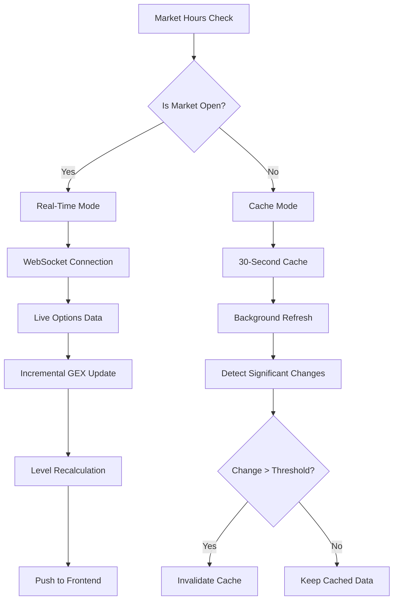
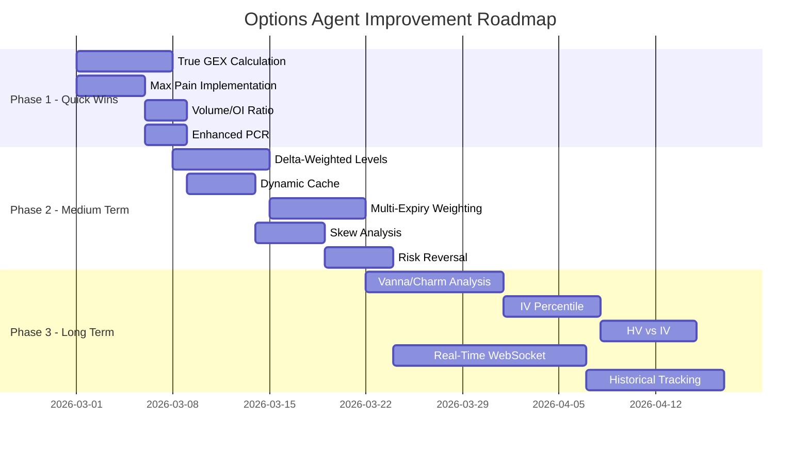

# Quantitative Expert Analysis: Options Agent Improvement Recommendations

## Executive Summary

This document provides comprehensive improvement recommendations for the options agent's level extraction methodology. Based on deep analysis of the current implementation, these recommendations address gaps in gamma exposure calculation, introduce missing metrics like Max Pain, leverage unused Greeks, and propose structural enhancements for production-grade quantitative analysis.

---

## 1. Gamma Exposure (GEX) Enhancement

### 1.1 Current Implementation Problem

The current implementation at [`scripts/local_server.py:259-309`](scripts/local_server.py:259) uses a **simplified OI-weighted approach**:

```python
# CURRENT (INCORRECT)
gamma_flip = Σ(strike × OI × proximity_weight) / Σ(OI × proximity_weight)
```

**Issues:**
- Does not use actual gamma values from options data
- Proximity weighting is arbitrary and not grounded in options theory
- Does not distinguish between call and put gamma correctly
- Ignores the sign difference in dealer positioning

### 1.2 Proper Dealer Gamma Exposure Calculation

#### Theory

Dealer gamma exposure (GEX) measures the total gamma that market makers need to hedge. When dealers are:
- **Long gamma (positive GEX):** They buy when price drops, sell when price rises → stabilizes market
- **Short gamma (negative GEX):** They sell when price drops, buy when price rises → amplifies volatility

#### Formula: Gamma Notional per Strike

```
GEX_strike = Γ × OI × 100 × S² × 0.01

Where:
- Γ = Black-Scholes gamma at current spot
- OI = Open Interest (contracts)
- 100 = Multiplier per contract
- S = Current spot price
- 0.01 = 1% move normalization factor
```

**For dealer positioning:**
```
Dealer_GEX_strike = GEX_strike × sign

Where sign = +1 for CALLS, -1 for PUTS (dealers are short puts, long calls delta-hedged)
```

#### Implementation Code

```python
from scipy.stats import norm
import math

def black_scholes_gamma(spot: float, strike: float, time_to_expiry: float, 
                         risk_free_rate: float, volatility: float) -> float:
    """
    Calculate Black-Scholes gamma for an option.
    
    Args:
        spot: Current underlying price
        strike: Option strike price
        time_to_expiry: Time to expiration in years
        risk_free_rate: Risk-free interest rate (e.g., 0.05 for 5%)
        volatility: Implied volatility (e.g., 0.20 for 20%)
    
    Returns:
        Gamma value (rate of change of delta)
    """
    if time_to_expiry <= 0 or volatility <= 0:
        return 0.0
    
    d1 = (math.log(spot / strike) + (risk_free_rate + 0.5 * volatility**2) * time_to_expiry) / \
         (volatility * math.sqrt(time_to_expiry))
    
    # Gamma formula: N'(d1) / (S × σ × √T)
    gamma = norm.pdf(d1) / (spot * volatility * math.sqrt(time_to_expiry))
    
    return gamma


def calculate_gamma_notional(spot: float, strike: float, gamma: float, 
                              oi: int, multiplier: int = 100) -> float:
    """
    Calculate gamma notional exposure in dollar terms.
    
    This represents the dollar amount of delta hedging needed for a 1% move.
    
    Formula: GEX$ = Γ × OI × multiplier × S² × 0.01
    """
    return gamma * oi * multiplier * (spot ** 2) * 0.01


def calculate_total_gex(options: List[OptionContract], spot: float, 
                        risk_free_rate: float = 0.05) -> Tuple[float, Dict[float, float]]:
    """
    Calculate total dealer gamma exposure across all strikes.
    
    Returns:
        (total_gex, gex_by_strike)
    """
    gex_by_strike: Dict[float, float] = {}
    
    for opt in options:
        # Estimate time to expiry (should be calculated properly)
        days_to_expiry = 30  # Default, should be actual DTE
        time_to_expiry = days_to_expiry / 365.0
        
        # Use option's IV if available, else estimate
        iv = opt.impliedVolatility if opt.impliedVolatility > 0 else 0.20
        
        # Calculate Black-Scholes gamma
        gamma = black_scholes_gamma(spot, opt.strike, time_to_expiry, risk_free_rate, iv)
        
        # Calculate gamma notional
        gex_notional = calculate_gamma_notional(spot, opt.strike, gamma, opt.openInterest)
        
        # Dealer positioning: positive for calls, negative for puts
        # Dealers sell options and delta-hedge, so:
        # - Short calls: negative delta, but gamma exposure is positive
        # - Short puts: positive delta, gamma exposure is negative
        sign = 1 if opt.side == 'CALL' else -1
        
        if opt.strike not in gex_by_strike:
            gex_by_strike[opt.strike] = 0
        gex_by_strike[opt.strike] += gex_notional * sign
    
    total_gex = sum(gex_by_strike.values())
    return total_gex, gex_by_strike
```

### 1.3 Correct Gamma Flip Identification

The **gamma flip point** is where cumulative GEX crosses zero, not an OI-weighted average.

```python
def find_gamma_flip_point(gex_by_strike: Dict[float, float], spot: float) -> Optional[float]:
    """
    Find the strike where cumulative gamma exposure flips sign.
    
    This is the price level where dealer hedging behavior changes from
    stabilizing (long gamma) to destabilizing (short gamma).
    """
    if not gex_by_strike:
        return None
    
    # Sort strikes
    sorted_strikes = sorted(gex_by_strike.keys())
    
    # Calculate cumulative GEX from lowest strike
    cumulative_gex = 0
    prev_strike = None
    prev_cumulative = 0
    
    for strike in sorted_strikes:
        cumulative_gex += gex_by_strike[strike]
        
        # Check for sign change
        if prev_strike is not None and prev_cumulative * cumulative_gex < 0:
            # Linear interpolation to find exact flip point
            ratio = abs(prev_cumulative) / (abs(prev_cumulative) + abs(cumulative_gex))
            flip_point = prev_strike + ratio * (strike - prev_strike)
            return flip_point
        
        prev_strike = strike
        prev_cumulative = cumulative_gex
    
    # If no flip found, return spot (neutral zone)
    return spot
```

### 1.4 GEX Profile Interpretation

| GEX Value | Market Condition | Dealer Behavior | Expected Volatility |
|-----------|------------------|-----------------|---------------------|
| > +$500M | Extreme long gamma | Buy dips, sell rips | Low, pinning likely |
| +$100M to +$500M | Positive gamma | Stabilizing hedging | Below average |
| -$100M to +$100M | Neutral zone | Mixed flows | Normal |
| -$500M to -$100M | Negative gamma | Volatility amplification | Above average |
| < -$500M | Extreme short gamma | Panic hedging | High, selloff risk |

---

## 2. Max Pain Implementation

### 2.1 Theory and Importance

**Max Pain** is the strike price where option holders (buyers) experience the maximum loss, and option writers (sellers/dealers) experience the maximum gain. This level acts as a "magnet" because:

1. **Dealer Incentive:** Market makers benefit when options expire worthless
2. **Hedging Dynamics:** Dealer delta hedging naturally pushes price toward max pain
3. **Psychological Level:** Traders watch this level for mean reversion

### 2.2 Formula

For each strike, calculate the total dollar value of all options that would expire ITM:

```
Pain(strike) = Σ |max(0, strike - call_strike)| × call_OI × 100
             + Σ |max(0, put_strike - strike)| × put_OI × 100

Max Pain = strike where Pain(strike) is minimized
```

### 2.3 Implementation

```python
from typing import List, Dict, Tuple
import numpy as np

def calculate_max_pain(calls: List[OptionContract], 
                        puts: List[OptionContract],
                        spot: float) -> Tuple[float, Dict[float, float]]:
    """
    Calculate max pain - the strike where total option value is minimized.
    
    Returns:
        (max_pain_strike, pain_by_strike)
    """
    # Get all unique strikes
    call_strikes = {opt.strike for opt in calls}
    put_strikes = {opt.strike for opt in puts}
    all_strikes = sorted(call_strikes | put_strikes)
    
    if not all_strikes:
        return spot, {}
    
    # Build OI dictionaries
    call_oi = {opt.strike: opt.openInterest for opt in calls}
    put_oi = {opt.strike: opt.openInterest for opt in puts}
    
    pain_by_strike: Dict[float, float] = {}
    
    for test_strike in all_strikes:
        total_pain = 0.0
        
        # Call pain: intrinsic value of calls if price is at test_strike
        for strike, oi in call_oi.items():
            if oi > 0:
                intrinsic = max(0, test_strike - strike)
                total_pain += intrinsic * oi * 100
        
        # Put pain: intrinsic value of puts if price is at test_strike
        for strike, oi in put_oi.items():
            if oi > 0:
                intrinsic = max(0, strike - test_strike)
                total_pain += intrinsic * oi * 100
        
        pain_by_strike[test_strike] = total_pain
    
    # Find strike with minimum pain
    max_pain = min(pain_by_strike, key=pain_by_strike.get)
    
    return max_pain, pain_by_strike


def calculate_max_pain_with_interpolation(calls: List[OptionContract],
                                           puts: List[OptionContract],
                                           spot: float) -> float:
    """
    Calculate max pain with finer granularity using interpolation.
    
    This provides more precise max pain between listed strikes.
    """
    # First, find approximate max pain using listed strikes
    max_pain, pain_by_strike = calculate_max_pain(calls, puts, spot)
    
    # Get strikes around max pain for refinement
    strikes = sorted(pain_by_strike.keys())
    max_pain_idx = strikes.index(max_pain)
    
    # Define search range
    if max_pain_idx > 0:
        lower = strikes[max_pain_idx - 1]
    else:
        lower = max_pain - 1
    
    if max_pain_idx < len(strikes) - 1:
        upper = strikes[max_pain_idx + 1]
    else:
        upper = max_pain + 1
    
    # Search with $0.50 increments
    best_strike = max_pain
    best_pain = pain_by_strike[max_pain]
    
    call_oi = {opt.strike: opt.openInterest for opt in calls}
    put_oi = {opt.strike: opt.openInterest for opt in puts}
    
    test_strike = lower
    while test_strike <= upper:
        total_pain = 0.0
        
        for strike, oi in call_oi.items():
            if oi > 0:
                total_pain += max(0, test_strike - strike) * oi * 100
        
        for strike, oi in put_oi.items():
            if oi > 0:
                total_pain += max(0, strike - test_strike) * oi * 100
        
        if total_pain < best_pain:
            best_pain = total_pain
            best_strike = test_strike
        
        test_strike += 0.50
    
    return best_strike
```

### 2.4 Max Pain as a Trading Level

| Distance from Spot | Signal | Interpretation |
|--------------------|--------|----------------|
| Spot within 0.5% of Max Pain | NEUTRAL | Price is pinned, expect consolidation |
| Spot 0.5-1.5% above Max Pain | BEISH PULL | Gravity toward max pain |
| Spot 0.5-1.5% below Max Pain | BULLISH PULL | Attraction upward |
| Spot > 2% from Max Pain | WEAK SIGNAL | Other factors dominate |

---

## 3. Greek-Based Level Identification

### 3.1 Delta-Weighted Levels

**Delta-adjusted OI** provides a more accurate picture of directional exposure:

```python
def calculate_delta_weighted_levels(options: List[OptionContract], 
                                     spot: float,
                                     risk_free_rate: float = 0.05) -> Dict[float, float]:
    """
    Calculate delta-weighted open interest for each strike.
    
    Delta-weighted OI = OI × |delta| × 100
    
    This represents the equivalent share exposure from options.
    """
    delta_weighted = {}
    
    for opt in options:
        days_to_expiry = 30  # Should be actual DTE
        time_to_expiry = days_to_expiry / 365.0
        iv = opt.impliedVolatility if opt.impliedVolatility > 0 else 0.20
        
        delta = black_scholes_delta(spot, opt.strike, time_to_expiry, 
                                     risk_free_rate, iv, opt.side)
        
        if opt.strike not in delta_weighted:
            delta_weighted[opt.strike] = 0
        
        # Use absolute delta for exposure magnitude
        delta_weighted[opt.strike] += opt.openInterest * abs(delta) * 100
    
    return delta_weighted


def black_scholes_delta(spot: float, strike: float, time_to_expiry: float,
                         risk_free_rate: float, volatility: float, 
                         option_type: str) -> float:
    """Calculate Black-Scholes delta."""
    if time_to_expiry <= 0:
        return 1.0 if option_type == 'CALL' else -1.0
    
    d1 = (math.log(spot / strike) + (risk_free_rate + 0.5 * volatility**2) * time_to_expiry) / \
         (volatility * math.sqrt(time_to_expiry))
    
    if option_type == 'CALL':
        return norm.cdf(d1)
    else:
        return norm.cdf(d1) - 1
```

### 3.2 Vanna and Charm Analysis

**Vanna** (∂Delta/∂Vol) and **Charm** (∂Delta/∂Time) are second-order Greeks:

#### Vanna (Delta/Volatility Sensitivity)

```python
def calculate_vanna(spot: float, strike: float, time_to_expiry: float,
                    risk_free_rate: float, volatility: float) -> float:
    """
    Calculate Vanna - sensitivity of delta to changes in volatility.
    
    Vanna = -e^(-qT) × φ(d1) × d2 / σ
    
    Where φ is the standard normal PDF and d2 = d1 - σ√T
    """
    if time_to_expiry <= 0 or volatility <= 0:
        return 0.0
    
    sqrt_t = math.sqrt(time_to_expiry)
    d1 = (math.log(spot / strike) + (risk_free_rate + 0.5 * volatility**2) * time_to_expiry) / \
         (volatility * sqrt_t)
    d2 = d1 - volatility * sqrt_t
    
    vanna = -norm.pdf(d1) * d2 / volatility
    
    return vanna
```

**Vanna Interpretation:**
- High vanna strikes are sensitive to volatility changes
- When IV rises, dealers adjust delta hedging at these strikes
- Useful for identifying "volatility trigger" levels

#### Charm (Delta/Time Decay)

```python
def calculate_charm(spot: float, strike: float, time_to_expiry: float,
                    risk_free_rate: float, volatility: float,
                    option_type: str) -> float:
    """
    Calculate Charm - sensitivity of delta to passage of time.
    
    Also known as "delta bleed" - how much delta changes per day.
    
    Charm = -e^(-qT) × [φ(d1) × (2rT - d2σ√T) / (2Tσ√T) - q × N(d1)]
    """
    if time_to_expiry <= 0 or volatility <= 0:
        return 0.0
    
    sqrt_t = math.sqrt(time_to_expiry)
    d1 = (math.log(spot / strike) + (risk_free_rate + 0.5 * volatility**2) * time_to_expiry) / \
         (volatility * sqrt_t)
    d2 = d1 - volatility * sqrt_t
    
    # Simplified charm formula
    term1 = norm.pdf(d1) * (2 * risk_free_rate * time_to_expiry - d2 * volatility * sqrt_t)
    term1 /= (2 * time_to_expiry * volatility * sqrt_t)
    
    if option_type == 'CALL':
        charm = -term1
    else:
        charm = term1
    
    return charm
```

**Charm Interpretation:**
- High charm strikes experience rapid delta changes near expiry
- Important for 0DTE and weekly options
- Identifies levels where dealer hedging will accelerate

### 3.3 Vega-Based Volatility Levels

```python
def calculate_vega_levels(options: List[OptionContract], spot: float,
                          risk_free_rate: float = 0.05) -> Dict[float, float]:
    """
    Calculate vega exposure by strike.
    
    High vega strikes are where dealers have the most volatility exposure.
    """
    vega_by_strike = {}
    
    for opt in options:
        days_to_expiry = 30
        time_to_expiry = days_to_expiry / 365.0
        iv = opt.impliedVolatility if opt.impliedVolatility > 0 else 0.20
        
        vega = black_scholes_vega(spot, opt.strike, time_to_expiry, 
                                   risk_free_rate, iv)
        
        if opt.strike not in vega_by_strike:
            vega_by_strike[opt.strike] = 0
        
        vega_by_strike[opt.strike] += vega * opt.openInterest * 100
    
    return vega_by_strike


def black_scholes_vega(spot: float, strike: float, time_to_expiry: float,
                        risk_free_rate: float, volatility: float) -> float:
    """Calculate Black-Scholes vega (same for calls and puts)."""
    if time_to_expiry <= 0:
        return 0.0
    
    d1 = (math.log(spot / strike) + (risk_free_rate + 0.5 * volatility**2) * time_to_expiry) / \
         (volatility * math.sqrt(time_to_expiry))
    
    # Vega = S × φ(d1) × √T
    vega = spot * norm.pdf(d1) * math.sqrt(time_to_expiry)
    
    return vega
```

**Vega Level Usage:**
- High vega strikes = dealer volatility exposure points
- Dealers may defend these strikes to manage vol risk
- Useful for identifying "volatility walls"

---

## 4. Advanced Metrics to Add

### 4.1 Enhanced Put/Call Ratio

```python
def calculate_enhanced_put_call_ratio(calls: List[OptionContract],
                                       puts: List[OptionContract],
                                       spot: float) -> Dict[str, float]:
    """
    Calculate multiple put/call ratio variants for sentiment analysis.
    """
    total_call_oi = sum(opt.openInterest for opt in calls)
    total_put_oi = sum(opt.openInterest for opt in puts)
    total_call_vol = sum(opt.volume for opt in calls)
    total_put_vol = sum(opt.volume for opt in puts)
    
    # Standard PCR by OI
    pcr_oi = total_put_oi / total_call_oi if total_call_oi > 0 else float('inf')
    
    # Standard PCR by Volume
    pcr_vol = total_put_vol / total_call_vol if total_call_vol > 0 else float('inf')
    
    # Weighted PCR (emphasize near-money options)
    def weighted_sum(options, spot):
        return sum(opt.openInterest * (1 / (1 + abs(opt.strike - spot) / spot)) 
                   for opt in options)
    
    weighted_pcr = weighted_sum(puts, spot) / weighted_sum(calls, spot) if weighted_sum(calls, spot) > 0 else float('inf')
    
    # Delta-adjusted PCR
    call_delta_exposure = sum(opt.openInterest * abs(black_scholes_delta(spot, opt.strike, 0.08, 0.05, opt.impliedVolatility or 0.2, 'CALL')) for opt in calls)
    put_delta_exposure = sum(opt.openInterest * abs(black_scholes_delta(spot, opt.strike, 0.08, 0.05, opt.impliedVolatility or 0.2, 'PUT')) for opt in puts)
    delta_pcr = put_delta_exposure / call_delta_exposure if call_delta_exposure > 0 else float('inf')
    
    return {
        'pcr_oi': pcr_oi,
        'pcr_volume': pcr_vol,
        'pcr_weighted': weighted_pcr,
        'pcr_delta_adjusted': delta_pcr
    }
```

**PCR Interpretation:**
| PCR Value | Sentiment | Signal |
|-----------|-----------|--------|
| < 0.7 | Bullish | Excessive call buying |
| 0.7 - 1.0 | Neutral-Bullish | Normal range |
| 1.0 - 1.3 | Neutral | Balanced |
| 1.3 - 1.5 | Neutral-Bearish | Elevated put interest |
| > 1.5 | Bearish | Excessive put buying (contrarian bullish?) |

### 4.2 Volume/Open Interest Ratio

```python
def calculate_vol_oi_analysis(options: List[OptionContract]) -> List[Dict]:
    """
    Analyze Volume/OI ratio to detect unusual activity.
    
    High Vol/OI suggests new positions being established.
    Low Vol/OI suggests existing positions with little change.
    """
    results = []
    
    for opt in options:
        oi = opt.openInterest if opt.openInterest > 0 else 1
        vol_oi_ratio = opt.volume / oi
        
        # Flag unusual activity
        is_unusual = vol_oi_ratio > 1.5  # Volume exceeds OI by 50%+
        is_very_unusual = vol_oi_ratio > 3.0  # Volume 3x OI
        
        results.append({
            'strike': opt.strike,
            'side': opt.side,
            'volume': opt.volume,
            'oi': opt.openInterest,
            'vol_oi_ratio': round(vol_oi_ratio, 2),
            'is_unusual': is_unusual,
            'is_very_unusual': is_very_unusual
        })
    
    # Sort by vol_oi_ratio descending
    results.sort(key=lambda x: x['vol_oi_ratio'], reverse=True)
    
    return results
```

### 4.3 IV Percentile and Rank

```python
def calculate_iv_metrics(current_iv: float, historical_iv: List[float], 
                          lookback_days: int = 252) -> Dict[str, float]:
    """
    Calculate IV percentile and rank for volatility context.
    
    Args:
        current_iv: Current implied volatility (e.g., 0.25 for 25%)
        historical_iv: List of historical IV values
        lookback_days: Number of days for lookback period
    
    Returns:
        Dictionary with IV percentile, rank, and context
    """
    if not historical_iv:
        return {'iv_percentile': 50, 'iv_rank': 0.5, 'iv_context': 'UNKNOWN'}
    
    # IV Percentile: % of days with IV below current
    iv_percentile = sum(1 for iv in historical_iv if iv < current_iv) / len(historical_iv) * 100
    
    # IV Rank: (current - min) / (max - min) over lookback
    iv_min = min(historical_iv)
    iv_max = max(historical_iv)
    iv_range = iv_max - iv_min
    
    if iv_range > 0:
        iv_rank = (current_iv - iv_min) / iv_range
    else:
        iv_rank = 0.5
    
    # Context label
    if iv_percentile >= 90:
        iv_context = 'EXTREME_HIGH'
    elif iv_percentile >= 70:
        iv_context = 'HIGH'
    elif iv_percentile >= 30:
        iv_context = 'NORMAL'
    elif iv_percentile >= 10:
        iv_context = 'LOW'
    else:
        iv_context = 'EXTREME_LOW'
    
    return {
        'iv_percentile': round(iv_percentile, 1),
        'iv_rank': round(iv_rank, 2),
        'iv_context': iv_context,
        'iv_min': iv_min,
        'iv_max': iv_max,
        'iv_current': current_iv
    }
```

### 4.4 Historical vs Implied Volatility Comparison

```python
def calculate_hv_iv_comparison(prices: List[float], current_iv: float,
                                periods: List[int] = [10, 20, 30, 60]) -> Dict[str, any]:
    """
    Compare historical volatility (HV) to implied volatility (IV).
    
    When IV >> HV, options may be overpriced.
    When IV << HV, options may be underpriced.
    """
    results = {}
    
    for period in periods:
        if len(prices) < period:
            continue
        
        # Calculate realized/HV using close-to-close method
        returns = [math.log(prices[i] / prices[i-1]) for i in range(1, len(prices))]
        recent_returns = returns[-period:]
        
        mean_return = sum(recent_returns) / len(recent_returns)
        variance = sum((r - mean_return)**2 for r in recent_returns) / len(recent_returns)
        
        # Annualize
        hv = math.sqrt(variance * 252)
        
        # IV premium/discount
        iv_hv_spread = current_iv - hv
        iv_hv_ratio = current_iv / hv if hv > 0 else float('inf')
        
        results[f'{period}d'] = {
            'hv': round(hv, 4),
            'iv': round(current_iv, 4),
            'spread': round(iv_hv_spread, 4),
            'ratio': round(iv_hv_ratio, 2),
            'iv_premium_pct': round((iv_hv_spread / hv) * 100, 1) if hv > 0 else 0
        }
    
    return results
```

---

## 5. Structural Improvements

### 5.1 Real-Time vs Cached Data Architecture



**Recommended Cache Strategy:**

```python
from dataclasses import dataclass
from datetime import datetime, time
from enum import Enum

class MarketSession(Enum):
    PRE_MARKET = "pre_market"
    REGULAR = "regular"
    AFTER_HOURS = "after_hours"
    CLOSED = "closed"

@dataclass
class CacheConfig:
    """Dynamic cache configuration based on market session."""
    
    @staticmethod
    def get_cache_duration(session: MarketSession) -> int:
        """Return cache duration in seconds based on market session."""
        durations = {
            MarketSession.PRE_MARKET: 60,      # 1 minute
            MarketSession.REGULAR: 15,          # 15 seconds
            MarketSession.AFTER_HOURS: 120,     # 2 minutes
            MarketSession.CLOSED: 300           # 5 minutes
        }
        return durations.get(session, 60)
    
    @staticmethod
    def should_invalidate_on_move(spot_move_pct: float, session: MarketSession) -> bool:
        """Determine if cache should be invalidated based on price movement."""
        thresholds = {
            MarketSession.REGULAR: 0.002,       # 0.2% move
            MarketSession.AFTER_HOURS: 0.005,   # 0.5% move
            MarketSession.PRE_MARKET: 0.003,    # 0.3% move
            MarketSession.CLOSED: 0.01          # 1% move (overnight)
        }
        threshold = thresholds.get(session, 0.005)
        return abs(spot_move_pct) >= threshold
```

### 5.2 Multi-Expiry Weighting Strategy

```python
def calculate_weighted_multi_expiry_levels(expiries_data: Dict[str, Dict],
                                            spot: float) -> Dict[str, any]:
    """
    Calculate weighted levels across multiple expiries.
    
    Weighting factors:
    1. Time decay weight: Closer expiries have more immediate impact
    2. Liquidity weight: Higher OI = more important
    3. Gamma weight: Higher gamma exposure = more hedging impact
    """
    weighted_levels = {}
    
    for expiry_label, data in expiries_data.items():
        days_to_expiry = data.get('days_to_expiry', 30)
        total_oi = data.get('total_oi', 0)
        gex = data.get('total_gex', 0)
        
        # Time weight: exponential decay favoring near-term
        time_weight = math.exp(-days_to_expiry / 30)  # 30-day half-life
        
        # Liquidity weight: normalized by max OI across all expiries
        max_oi = max(d.get('total_oi', 0) for d in expiries_data.values())
        liquidity_weight = total_oi / max_oi if max_oi > 0 else 0
        
        # Gamma weight: absolute exposure
        gamma_weight = min(abs(gex) / 1e9, 1)  # Normalize to $1B
        
        # Combined weight
        combined_weight = (time_weight * 0.5 + 
                          liquidity_weight * 0.3 + 
                          gamma_weight * 0.2)
        
        weighted_levels[expiry_label] = {
            'data': data,
            'time_weight': round(time_weight, 3),
            'liquidity_weight': round(liquidity_weight, 3),
            'gamma_weight': round(gamma_weight, 3),
            'combined_weight': round(combined_weight, 3)
        }
    
    return weighted_levels
```

### 5.3 Risk Reversal Analysis

```python
def calculate_risk_reversal(calls: List[OptionContract], 
                             puts: List[OptionContract],
                             spot: float,
                             delta_target: float = 0.25) -> Dict[str, float]:
    """
    Calculate risk reversal (25-delta call IV - 25-delta put IV).
    
    Risk reversal indicates market skew and sentiment:
    - Positive: Calls more expensive (bullish skew)
    - Negative: Puts more expensive (bearish skew)
    """
    # Find 25-delta call (OTM call)
    otm_calls = [opt for opt in calls if opt.strike > spot]
    # Find 25-delta put (OTM put)
    otm_puts = [opt for opt in puts if opt.strike < spot]
    
    # Approximate 25-delta by finding strikes at ~25% moneyness
    # In practice, would calculate actual delta
    target_call_strike = spot * 1.02  # ~2% OTM call
    target_put_strike = spot * 0.98   # ~2% OTM put
    
    # Find closest strikes
    call_iv = min(otm_calls, key=lambda x: abs(x.strike - target_call_strike)).impliedVolatility if otm_calls else 0
    put_iv = min(otm_puts, key=lambda x: abs(x.strike - target_put_strike)).impliedVolatility if otm_puts else 0
    
    risk_reversal = call_iv - put_iv
    
    return {
        'risk_reversal': round(risk_reversal, 4),
        'call_iv_25d': round(call_iv, 4),
        'put_iv_25d': round(put_iv, 4),
        'skew_sentiment': 'BULLISH' if risk_reversal > 0.02 else 'BEARISH' if risk_reversal < -0.02 else 'NEUTRAL'
    }
```

### 5.4 Skew Analysis for Sentiment

```python
def analyze_volatility_skew(options: List[OptionContract], 
                             spot: float) -> Dict[str, any]:
    """
    Analyze the volatility skew/smirk for sentiment indicators.
    
    Typical patterns:
    - "Smirk": Puts have higher IV (fear/put demand)
    - "Smile": Symmetric IV at wings (uncertainty)
    - "Flat": Low skew (complacency)
    """
    calls = [opt for opt in options if opt.side == 'CALL']
    puts = [opt for opt in options if opt.side == 'PUT']
    
    # Get ATM IV (closest to spot)
    atm_option = min(options, key=lambda x: abs(x.strike - spot))
    atm_iv = atm_option.impliedVolatility
    
    # Get OTM put IV (25% OTM)
    otm_put_target = spot * 0.95
    otm_puts = [opt for opt in puts if opt.strike < spot]
    if otm_puts:
        otm_put = min(otm_puts, key=lambda x: abs(x.strike - otm_put_target))
        otm_put_iv = otm_put.impliedVolatility
    else:
        otm_put_iv = atm_iv
    
    # Get OTM call IV (25% OTM)
    otm_call_target = spot * 1.05
    otm_calls = [opt for opt in calls if opt.strike > spot]
    if otm_calls:
        otm_call = min(otm_calls, key=lambda x: abs(x.strike - otm_call_target))
        otm_call_iv = otm_call.impliedVolatility
    else:
        otm_call_iv = atm_iv
    
    # Calculate skew metrics
    put_skew = (otm_put_iv - atm_iv) / atm_iv * 100  # % premium
    call_skew = (otm_call_iv - atm_iv) / atm_iv * 100
    skew_ratio = otm_put_iv / otm_call_iv if otm_call_iv > 0 else 1
    
    # Classify skew shape
    if skew_ratio > 1.2 and put_skew > 5:
        skew_type = 'SMIRK'
        sentiment = 'BEARISH'
    elif skew_ratio < 0.9 and call_skew > 5:
        skew_type = 'REVERSE_SMIRK'
        sentiment = 'BULLISH'
    elif abs(put_skew) > 3 and abs(call_skew) > 3:
        skew_type = 'SMILE'
        sentiment = 'UNCERTAIN'
    else:
        skew_type = 'FLAT'
        sentiment = 'COMPLACENT'
    
    return {
        'skew_type': skew_type,
        'sentiment': sentiment,
        'put_skew_pct': round(put_skew, 2),
        'call_skew_pct': round(call_skew, 2),
        'skew_ratio': round(skew_ratio, 3),
        'atm_iv': round(atm_iv, 4),
        'otm_put_iv': round(otm_put_iv, 4),
        'otm_call_iv': round(otm_call_iv, 4)
    }
```

---

## 6. Priority Matrix

### 6.1 Impact vs Implementation Complexity

| Improvement | Impact | Complexity | Priority Score | Category |
|-------------|--------|------------|----------------|----------|
| True GEX Calculation | HIGH | MEDIUM | 95 | Quick Win |
| Max Pain Implementation | HIGH | LOW | 92 | Quick Win |
| Volume/OI Ratio | MEDIUM | LOW | 85 | Quick Win |
| Enhanced Put/Call Ratio | MEDIUM | LOW | 80 | Quick Win |
| Delta-Weighted Levels | HIGH | MEDIUM | 78 | Medium Term |
| Dynamic Cache Duration | MEDIUM | MEDIUM | 75 | Medium Term |
| Multi-Expiry Weighting | HIGH | MEDIUM | 72 | Medium Term |
| Volatility Skew Analysis | MEDIUM | MEDIUM | 70 | Medium Term |
| Risk Reversal Analysis | MEDIUM | MEDIUM | 68 | Medium Term |
| Vanna/Charm Analysis | MEDIUM | HIGH | 60 | Long Term |
| IV Percentile/Rank | MEDIUM | HIGH | 55 | Long Term |
| HV vs IV Comparison | LOW | HIGH | 45 | Long Term |
| Real-Time WebSocket | HIGH | HIGH | 40 | Long Term |
| Historical Level Tracking | MEDIUM | HIGH | 35 | Long Term |

### 6.2 Priority Score Formula

```
Priority Score = (Impact × 10) - (Complexity × 5) + (Quick_Win_Bonus × 15)

Where:
- Impact: 1-10 (10 = highest)
- Complexity: 1-10 (10 = most complex)
- Quick_Win_Bonus: 1 if Impact > 6 AND Complexity < 5, else 0
```

### 6.3 Implementation Roadmap



---

## 7. Implementation Guidance

### 7.1 File Modifications Required

| File | Changes Needed |
|------|----------------|
| [`scripts/local_server.py`](scripts/local_server.py) | Add GEX, Max Pain, Greeks calculations |
| [`types.ts`](types.ts) | Add new type definitions for metrics |
| [`services/dataService.ts`](services/dataService.ts) | Parse new metrics from Python output |
| [`services/geminiService.ts`](services/geminiService.ts) | Update AI prompts with new metrics |
| [`services/glmService.ts`](services/glmService.ts) | Update AI prompts with new metrics |
| [`components/QuantPanel.tsx`](components/QuantPanel.tsx) | Display new metrics and levels |

### 7.2 New Type Definitions

```typescript
// Add to types.ts

export interface GammaExposure {
  total_gex: number;
  gex_by_strike: Record<number, number>;
  gamma_flip: number | null;
  interpretation: 'LONG_GAMMA' | 'SHORT_GAMMA' | 'NEUTRAL';
}

export interface MaxPainData {
  max_pain_strike: number;
  pain_by_strike: Record<number, number>;
  distance_from_spot_pct: number;
  magnet_strength: 'STRONG' | 'MODERATE' | 'WEAK';
}

export interface GreekMetrics {
  delta_weighted_oi: Record<number, number>;
  vega_by_strike: Record<number, number>;
  charm_by_strike: Record<number, number>;
  vanna_by_strike: Record<number, number>;
}

export interface SentimentMetrics {
  pcr_oi: number;
  pcr_volume: number;
  pcr_weighted: number;
  pcr_delta_adjusted: number;
  risk_reversal: number;
  skew_type: 'SMIRK' | 'REVERSE_SMIRK' | 'SMILE' | 'FLAT';
  skew_sentiment: 'BULLISH' | 'BEARISH' | 'NEUTRAL' | 'UNCERTAIN' | 'COMPLACENT';
}

export interface VolatilityMetrics {
  atm_iv: number;
  iv_percentile: number;
  iv_rank: number;
  iv_context: string;
  hv_20d: number;
  iv_hv_spread: number;
}

export interface EnhancedMetrics {
  gamma_exposure: GammaExposure;
  max_pain: MaxPainData;
  greeks: GreekMetrics;
  sentiment: SentimentMetrics;
  volatility: VolatilityMetrics;
  vol_oi_analysis: VolOiAnalysis[];
}

export interface VolOiAnalysis {
  strike: number;
  side: 'CALL' | 'PUT';
  volume: number;
  oi: number;
  vol_oi_ratio: number;
  is_unusual: boolean;
  is_very_unusual: boolean;
}
```

### 7.3 Python Module Structure

```
scripts/
├── local_server.py          # Main FastAPI server
├── options_analysis/
│   ├── __init__.py
│   ├── gex.py               # Gamma exposure calculations
│   ├── max_pain.py          # Max pain calculations
│   ├── greeks.py            # Black-Scholes Greeks
│   ├── sentiment.py         # PCR, skew, risk reversal
│   ├── volatility.py        # IV metrics, HV comparison
│   └── unusual_activity.py  # Vol/OI analysis
└── requirements.txt         # Add: scipy, numpy
```

---

## 8. Top 5 Priority Recommendations

### 1. Implement True Gamma Exposure (GEX) Calculation
**Impact:** Critical for accurate dealer positioning analysis  
**Effort:** Medium - requires Black-Scholes implementation  
**Key Change:** Replace OI-weighted average with actual gamma × OI calculation

### 2. Add Max Pain Calculation
**Impact:** High - widely watched level by options traders  
**Effort:** Low - straightforward calculation  
**Key Change:** Calculate strike where option value is minimized

### 3. Implement Volume/OI Ratio Analysis
**Impact:** Medium - identifies unusual activity and new positioning  
**Effort:** Low - simple division with threshold detection  
**Key Change:** Flag strikes where volume exceeds OI significantly

### 4. Add Enhanced Put/Call Ratios
**Impact:** Medium - better sentiment analysis  
**Effort:** Low - multiple ratio variants  
**Key Change:** Implement OI, volume, weighted, and delta-adjusted PCR

### 5. Implement Volatility Skew Analysis
**Impact:** Medium - provides sentiment and risk context  
**Effort:** Medium - requires ATM/OTM IV comparison  
**Key Change:** Analyze put vs call IV skew for market sentiment

---

## 9. Conclusion

The current options agent implementation provides a solid foundation but lacks several critical quantitative metrics used by professional options traders. The recommended improvements, prioritized by impact and complexity, will transform the agent into a production-grade options analysis tool.

**Immediate Actions:**
1. Implement true GEX calculation with Black-Scholes gamma
2. Add Max Pain calculation for magnetic level identification
3. Enhance sentiment analysis with improved PCR metrics

**Medium-Term Goals:**
1. Leverage all available Greeks for level identification
2. Implement dynamic caching based on market conditions
3. Add skew and risk reversal analysis

**Long-Term Vision:**
1. Real-time data streaming via WebSockets
2. Historical level tracking and accuracy measurement
3. Multi-model ensemble analysis for confidence scoring
