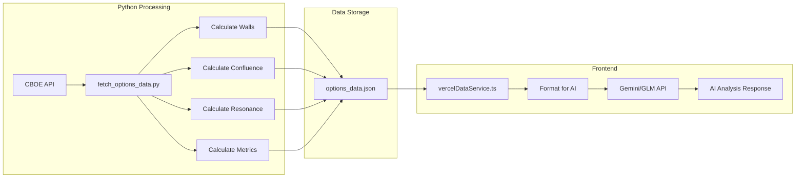
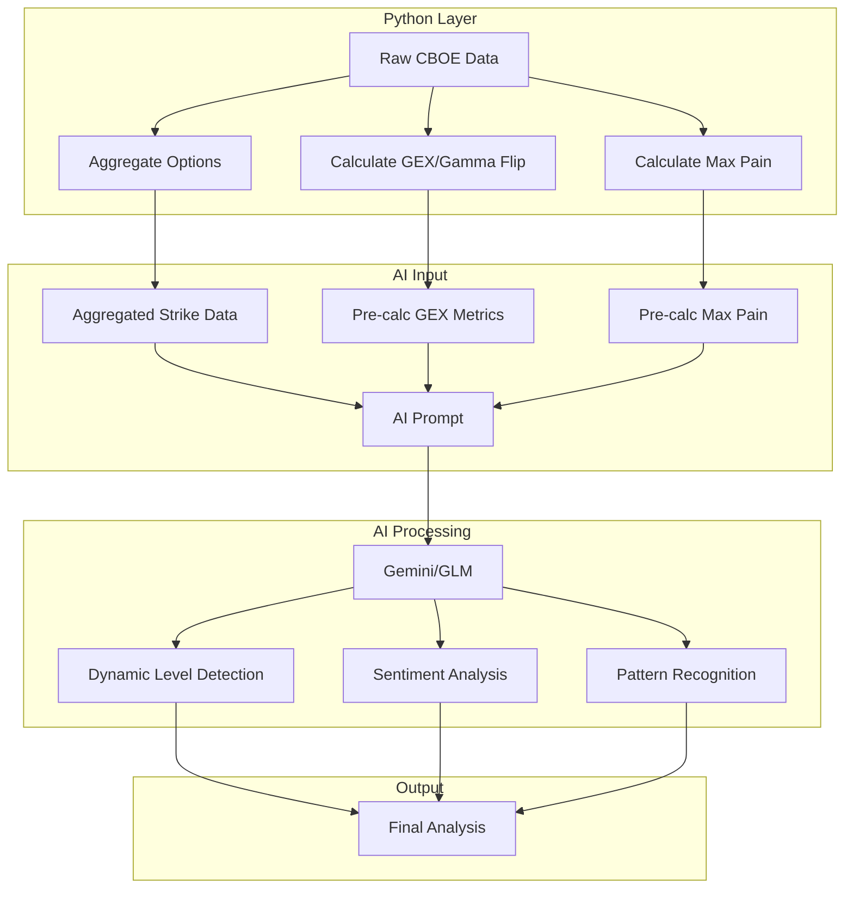

# Feasibility Study: Raw Data AI Analysis

## Executive Summary

This document analyzes the feasibility of feeding raw options data directly to AI for calculating levels and metrics, instead of pre-processing them in Python.

**Conclusion**: A **hybrid approach** is recommended where:
- AI analyzes **aggregated/filtered raw data** to identify key levels dynamically
- Mathematical metrics (GEX, gamma flip) remain **pre-calculated** for precision
- This balances AI's pattern recognition strength with computational accuracy

---

## Current Architecture Analysis

### Data Flow Diagram



### Current Data Structure

**Raw Option Data** (from [`data/options_data.json`](data/options_data.json)):
```json
{
  "strike": 680.0,
  "side": "CALL",
  "iv": 0.0,
  "oi": 1234,
  "vol": 5678
}
```

**Pre-calculated Levels** (Python output):
- Call/Put Walls (highest OI strikes)
- Gamma Flip (GEX sign change point)
- Max Pain (minimum option value strike)
- Confluence Levels (multi-expiry alignment)
- Resonance Levels (triple-expiry alignment)

**Pre-calculated Metrics** (Python output):
- `gamma_flip`: number
- `total_gex`: number
- `max_pain`: number
- `put_call_ratios`: object (MISSING - causes N/A bug)
- `volatility_skew`: object (MISSING - causes N/A bug)
- `gex_by_strike`: array (MISSING - causes N/A bug)

---

## AI Provider Capabilities

### Context Window Analysis

| Provider | Model | Context Window | Max Output | Best For |
|----------|-------|----------------|------------|----------|
| Gemini | 2.5 Pro | 2M tokens | 8K tokens | Complex reasoning |
| Gemini | 2.5 Flash | 1M tokens | 8K tokens | Speed + quality |
| Gemini | 3.1 Pro | 1M tokens | 8K tokens | Advanced reasoning |
| GLM | GLM-5 | 128K tokens | 4K tokens | General purpose |
| GLM | GLM-4.7 | 128K tokens | 4K tokens | Balanced |

### Current Data Size

- **Full raw data**: ~50,000 lines (~2.5MB of JSON)
- **Estimated tokens**: ~1-1.5M tokens (too large for GLM, borderline for Gemini)

### AI Mathematical Capabilities

| Task | AI Capability | Recommendation |
|------|---------------|----------------|
| Identify OI concentration | ✅ Excellent | AI can do this |
| Detect volume spikes | ✅ Excellent | AI can do this |
| Calculate GEX formulas | ⚠️ Unreliable | Pre-calculate |
| Gamma flip calculation | ❌ Poor | Pre-calculate |
| Max pain calculation | ⚠️ Moderate | Pre-calculate |
| Pattern recognition | ✅ Excellent | AI strength |
| Sentiment analysis | ✅ Excellent | AI strength |

---

## Feasibility Assessment

### Option 1: Full Raw Data to AI

**Approach**: Send complete options data JSON to AI

**Pros**:
- Maximum flexibility
- AI can discover patterns we haven't coded
- Adapts to market regime changes

**Cons**:
- ❌ Data too large (50K lines)
- ❌ Exceeds GLM context window
- ❌ Expensive token costs
- ❌ AI unreliable for precise math (GEX)
- ❌ Latency issues

**Verdict**: **NOT FEASIBLE** in current form

---

### Option 2: Aggregated Raw Data to AI

**Approach**: Filter and aggregate data before sending to AI

**Data Reduction Strategy**:
```python
# Instead of all options, send aggregated data:
{
  "spot": 680.28,
  "expiries": {
    "0DTE": {
      "strikes": [
        {"strike": 675, "call_oi": 50000, "put_oi": 30000, "call_vol": 10000, "put_vol": 8000, "call_iv": 0.25, "put_iv": 0.28},
        {"strike": 680, "call_oi": 80000, "put_oi": 75000, "call_vol": 15000, "put_vol": 12000, "call_iv": 0.22, "put_iv": 0.24},
        // Only strikes within ±3% of spot
      ],
      "total_call_oi": 500000,
      "total_put_oi": 450000,
      "put_call_ratio": 0.90
    }
  }
}
```

**Estimated Size**: ~5,000 tokens (very manageable)

**Pros**:
- ✅ Fits all AI context windows
- ✅ AI can identify key levels dynamically
- ✅ Lower token costs
- ✅ Faster response times

**Cons**:
- ⚠️ Still need pre-calculated GEX for accuracy
- ⚠️ Some data loss in aggregation

**Verdict**: **FEASIBLE** with hybrid approach

---

### Option 3: Hybrid Approach (Recommended)

**Architecture**:



**What AI Receives**:
1. **Aggregated strike data** (OI, volume, IV per strike)
2. **Pre-calculated metrics** (GEX, gamma flip, max pain)
3. **Market context** (spot price, expiry dates)

**What AI Calculates**:
1. **Key levels** (walls, pivots, magnets)
2. **Confluence detection** (multi-expiry alignment)
3. **Sentiment scoring**
4. **Trading signals**

**What Python Pre-calculates**:
1. **GEX by strike** (requires precise formulas)
2. **Gamma flip point** (mathematical calculation)
3. **Max pain** (optimization algorithm)
4. **Put/call ratios** (simple but needs accuracy)

**Verdict**: **RECOMMENDED**

---

## Implementation Plan

### Phase 1: Fix Current 0DTE Bug

The immediate issue is that Python's `calculate_quant_metrics()` returns only 4 fields but TypeScript expects 6.

**Fix in [`scripts/fetch_options_data.py`](scripts/fetch_options_data.py:1290-1295)**:
```python
def calculate_quant_metrics(options: List[Dict], spot_price: float) -> Dict:
    # Existing calculations
    gamma_flip = calculate_gamma_flip(options, spot_price)
    total_gex = calculate_total_gex(options)
    max_pain = calculate_max_pain(options)
    
    # ADD MISSING FIELDS:
    put_call_ratios = calculate_put_call_ratios(options)
    volatility_skew = calculate_volatility_skew(options)
    gex_by_strike = calculate_gex_by_strike(options)
    
    return {
        'gamma_flip': gamma_flip,
        'total_gex': total_gex,
        'max_pain': max_pain,
        'put_call_ratios': put_call_ratios,  # NEW
        'volatility_skew': volatility_skew,   # NEW
        'gex_by_strike': gex_by_strike        # NEW
    }
```

### Phase 2: Create Aggregated Data Function

**New function in [`scripts/fetch_options_data.py`](scripts/fetch_options_data.py)**:
```python
def create_ai_ready_data(symbols_data: Dict, spot_price: float) -> Dict:
    """
    Create aggregated data optimized for AI analysis.
    Reduces token count while preserving analytical value.
    """
    ai_ready = {}
    
    for symbol, data in symbols_data.items():
        # Filter strikes within ±5% of spot
        relevant_strikes = filter_strikes_by_distance(
            data['options'], 
            spot_price, 
            max_distance_pct=5.0
        )
        
        # Aggregate by strike
        aggregated = aggregate_options_by_strike(relevant_strikes)
        
        # Add pre-calculated metrics
        ai_ready[symbol] = {
            'spot': spot_price,
            'expiries': {},
            'precalc_metrics': data.get('quantMetrics', {})
        }
        
        for expiry in data['expiries']:
            ai_ready[symbol]['expiries'][expiry['label']] = {
                'date': expiry['date'],
                'strikes': aggregated[expiry['label']],
                'totals': {
                    'call_oi': sum(s['call_oi'] for s in aggregated[expiry['label']]),
                    'put_oi': sum(s['put_oi'] for s in aggregated[expiry['label']]),
                }
            }
    
    return ai_ready
```

### Phase 3: Update AI Service

**Modify [`services/geminiService.ts`](services/geminiService.ts)**:
```typescript
const formatAIReadyData = (aiReadyData: AIReadyData, spotPrice: number): string => {
  return `
=== RAW OPTIONS DATA FOR ANALYSIS ===
Spot Price: ${spotPrice}

${Object.entries(aiReadyData.expiries).map(([label, expiry]) => `
EXPIRY: ${label} (${expiry.date})
Total Call OI: ${expiry.totals.call_oi.toLocaleString()}
Total Put OI: ${expiry.totals.put_oi.toLocaleString()}

Top Strikes by OI:
${expiry.strikes.slice(0, 20).map(s => 
  `  ${s.strike}: Call OI ${s.call_oi.toLocaleString()}, Put OI ${s.put_oi.toLocaleString()}, IV ${s.call_iv.toFixed(2)}/${s.put_iv.toFixed(2)}`
).join('\n')}
`).join('\n')}

=== PRE-CALCULATED METRICS ===
Gamma Flip: ${aiReadyData.precalc_metrics.gamma_flip}
Total GEX: ${aiReadyData.precalc_metrics.total_gex}B
Max Pain: ${aiReadyData.precalc_metrics.max_pain}

ANALYSIS INSTRUCTIONS:
1. Identify CALL WALLS (strikes with dominant call OI above spot)
2. Identify PUT WALLS (strikes with dominant put OI below spot)
3. Find CONFLUENCE (same strike significant in 2+ expiries)
4. Find RESONANCE (same strike significant in all 3 expiries)
5. Assess sentiment based on PCR and IV skew
6. Provide trading signals for each level
`;
};
```

---

## Benefits of Hybrid Approach

### Dynamic Level Detection
- AI can identify levels based on **current market regime**
- Adapts to **unusual activity** (volume spikes, OI changes)
- Can detect **new patterns** not hardcoded in Python

### Resilience to Market Changes
- Not limited to pre-defined algorithms
- AI can weigh factors differently based on conditions
- Better handling of **edge cases**

### Reduced Maintenance
- Fewer hardcoded rules to update
- AI handles variations automatically
- More robust to data quality issues

### Cost Efficiency
- Aggregated data = fewer tokens
- Pre-calculated math = smaller context needed
- Faster AI responses

---

## Risks and Mitigations

| Risk | Mitigation |
|------|------------|
| AI hallucination | Use structured JSON output with schema validation |
| Inconsistent results | Set temperature to 0.1, use retry logic |
| Token cost spikes | Implement data aggregation, monitor usage |
| Latency | Use Flash models for speed, cache results |
| Math errors | Pre-calculate all numerical metrics |

---

## Recommended Next Steps

1. **Immediate**: Fix 0DTE metrics bug (add missing fields to Python)
2. **Short-term**: Implement data aggregation function
3. **Medium-term**: Update AI prompts to use aggregated data
4. **Long-term**: Add AI-based pattern detection for new level types

---

## Conclusion

The hybrid approach provides the best balance of:
- **Accuracy** (pre-calculated mathematical metrics)
- **Flexibility** (AI-driven level detection)
- **Efficiency** (reduced token usage)
- **Resilience** (adapts to market changes)

This architecture allows the system to evolve dynamically while maintaining computational precision where it matters most.
