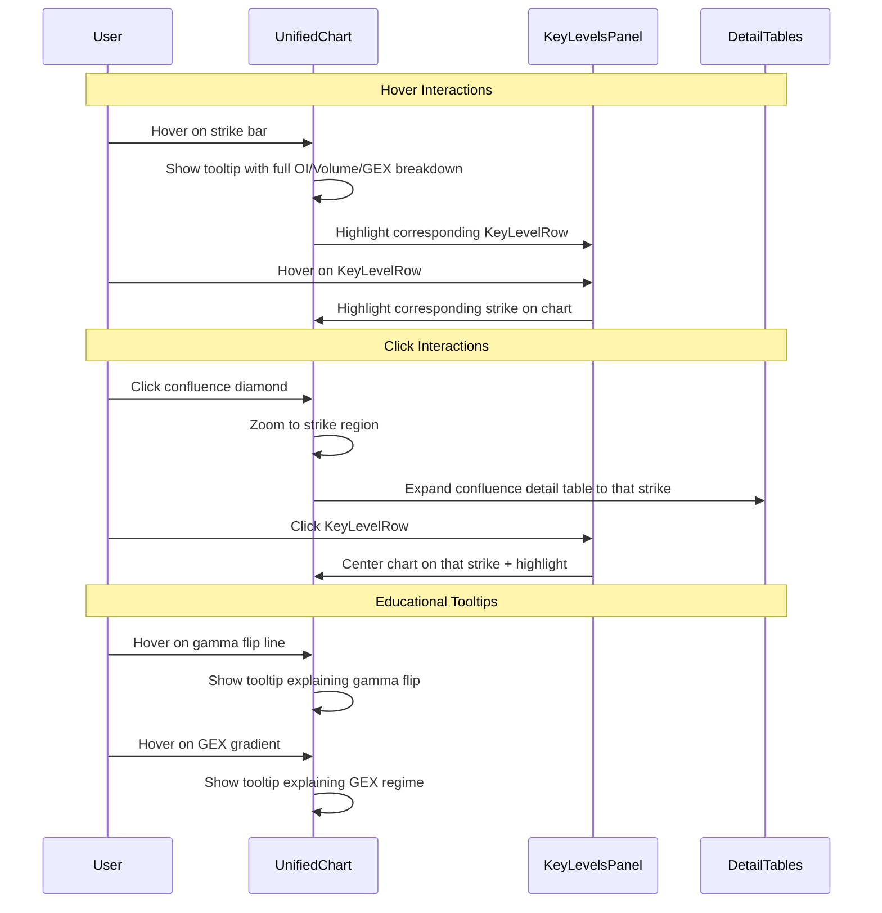
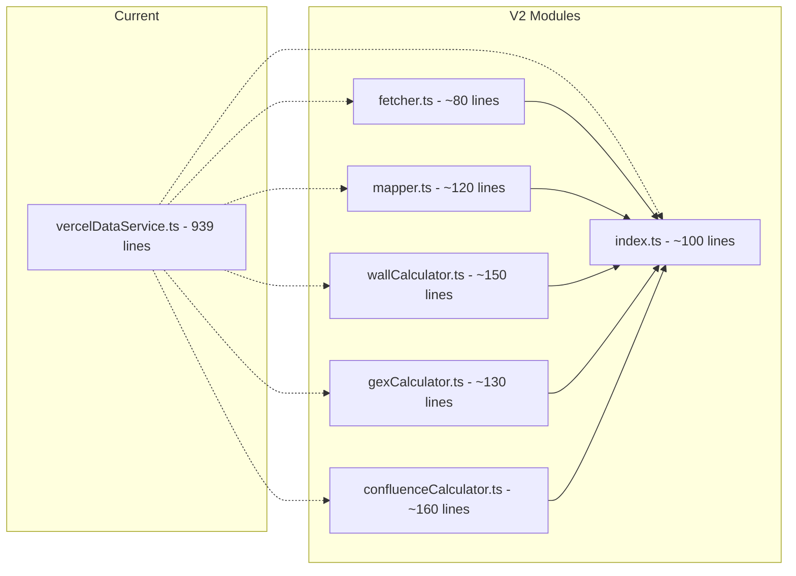
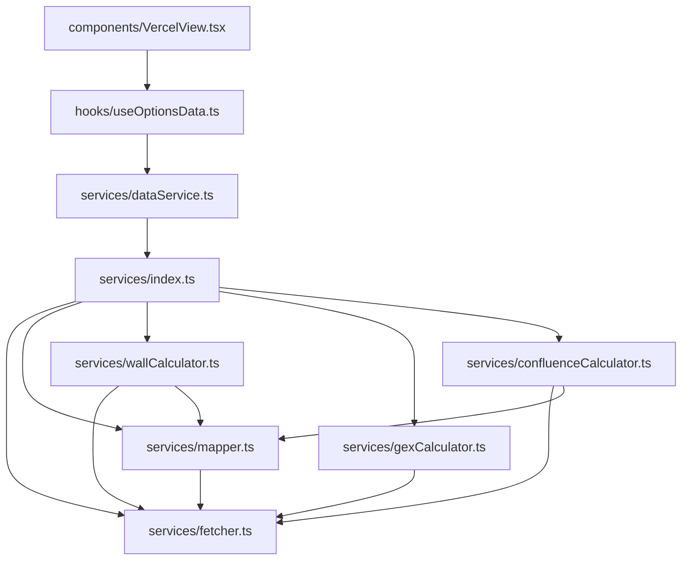
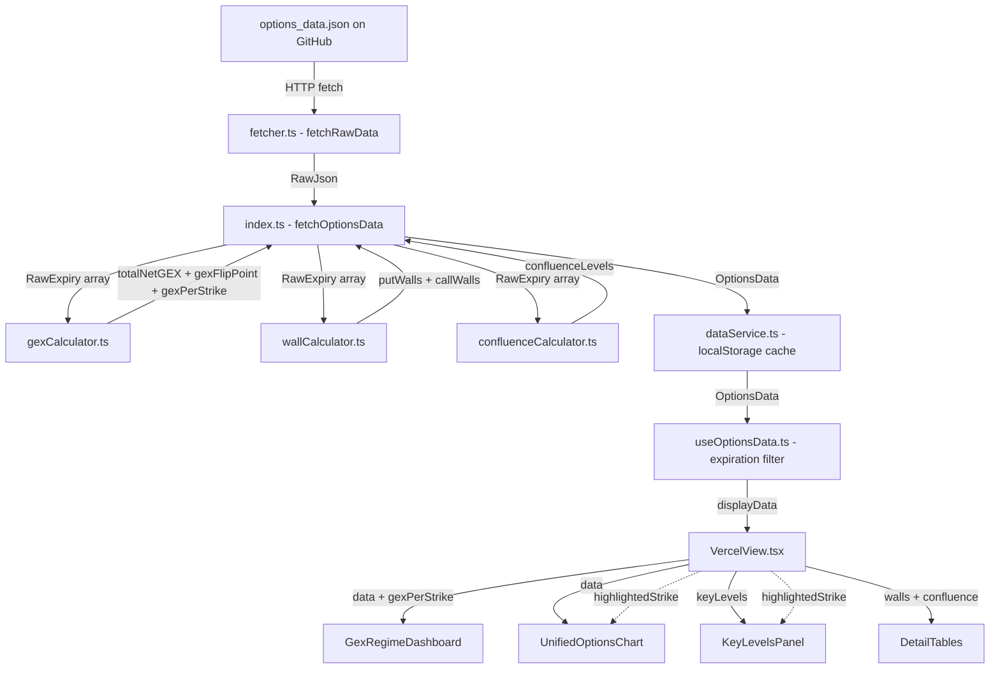
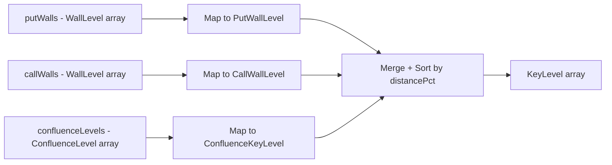
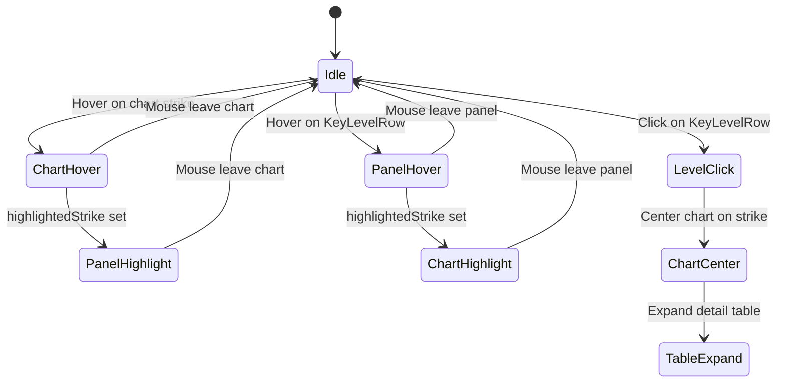

# Options Flow Analysis Platform — V2 Redesign Architecture

> **Status**: Draft  
> **Date**: 2026-05-24  
> **Scope**: Full UI/UX redesign + service layer decomposition + type system overhaul

---

## Table of Contents

1. [Executive Summary](#1-executive-summary)
2. [Current State Analysis](#2-current-state-analysis)
3. [Architecture Overview](#3-architecture-overview)
4. [Component Tree & Specifications](#4-component-tree--specifications)
5. [Service Layer Redesign](#5-service-layer-redesign)
6. [Type System](#6-type-system)
7. [Data Flow](#7-data-flow)
8. [Color & Design System](#8-color--design-system)
9. [Implementation Plan](#9-implementation-plan)
10. [Migration Strategy](#10-migration-strategy)

---

## 1. Executive Summary

### Problem Statement

The current platform computes rich analytics — GEX regime, gamma flip points, confluence levels, wall scoring — but **fails to surface them visually**. The user experience is fragmented: critical metrics are buried in tiny badges or disconnected tables, the main chart lacks key overlays, and the 939-line monolith service makes the codebase hard to maintain.

### Design Goals

| Goal | Description |
|------|-------------|
| **Visual Integration** | All computed analytics appear directly on the unified chart |
| **Progressive Disclosure** | GEX regime dashboard → unified chart → key levels → detail tables |
| **Educational UX** | Every metric has tooltip explanations; legend explains all visual elements |
| **Service Modularity** | 939-line monolith split into 6 focused modules under 200 lines each |
| **Type Safety** | Separate types for walls, confluence, chart elements, and unified key levels |
| **Dark Theme** | Professional trading aesthetic with consistent color coding |

### Key Changes at a Glance

| Area | Current | V2 |
|------|---------|-----|
| GEX display | 36-line tiny badge in header | Full-width GEX Regime Dashboard |
| Chart | 552-line bar chart, walls only | Unified chart with GEX coloring, flip line, confluence markers, wall labels |
| Key levels | 3 disconnected tables | Unified Key Levels Panel + collapsible detail tables |
| Service | 1 file, 939 lines | 6 modules, each under 200 lines |
| Types | `WallLevel` overloaded for all 3 types | `WallLevel`, `ConfluenceLevel`, `KeyLevel` union, chart types |

---

## 2. Current State Analysis

### 2.1 File Inventory

```
Current LOC Distribution:
├── services/vercelDataService.ts    939 lines  ← MONOLITH
├── components/PricePositionBar.tsx  552 lines  ← chart, walls only
├── hooks/useOptionsData.ts         274 lines  ← data hook
├── components/VercelView.tsx       280 lines  ← orchestrator
├── components/WallRow.tsx          145 lines
├── components/ConfluenceTable.tsx  122 lines
├── components/WallTable.tsx        103 lines
├── services/dataService.ts         136 lines  ← cache adapter
├── types.ts                         54 lines
├── components/GexIndicator.tsx      36 lines  ← TOO SMALL
├── components/SettingsPanel.tsx     ~80 lines
├── components/LoadingState.tsx      ~20 lines
├── components/ErrorState.tsx        ~20 lines
├── components/Icons.tsx             ~60 lines
├── utils/formatting.ts              49 lines
```

### 2.2 Critical Issues

1. **GEX is invisible on chart** — [`GexIndicator`](components/GexIndicator.tsx:17) is a 36-line badge showing only text. The computed GEX per strike, total net GEX, and gamma flip point are never rendered on the chart.

2. **Confluence levels are table-only** — [`ConfluenceTable`](components/ConfluenceTable.tsx:20) renders a flat table. No visual markers appear on [`PricePositionBar`](components/PricePositionBar.tsx:18).

3. **Chart lacks overlays** — [`PricePositionBar`](components/PricePositionBar.tsx:18) renders only put/call OI bars and spot price. Missing: gamma flip line, confluence diamonds, wall labels, GEX background gradient.

4. **Monolith service** — [`vercelDataService.ts`](services/vercelDataService.ts:1) handles fetching, caching, wall computation, GEX computation, confluence computation, and data mapping in a single 939-line file.

5. **No educational context** — Terms like GEX, gamma flip, confluence ratio are never explained to the user.

6. **Fragmented UX** — Chart, confluence table, and wall tables are visually disconnected. No hover/click interaction links them.

### 2.3 What Works Well (Preserve)

- Cross-side penalty scoring formula: `ownActivity × max(0, 1 − α × crossRatio)` with `α = 0.35`
- Time-decay weighting: `1 / (1 + DTE / 7)`
- GEX formula: `OI × γ × 100 × S² × sign × timeWeight`
- Confluence scoring: weighted composite of interest (50%), balance ratio (30%), proximity (20%)
- localStorage + in-memory dual caching strategy
- Expiration filter presets
- Symbol switching with data persistence
- Auto-refresh with background refresh indicator

---

## 3. Architecture Overview

### 3.1 High-Level Layout

```
┌──────────────────────────────────────────────────────────────┐
│  HEADER — Symbol tabs, spot price, controls                  │
├──────────────────────────────────────────────────────────────┤
│  SECTION A: GEX REGIME DASHBOARD                             │
│  ┌─────────┐ ┌──────────────┐ ┌──────────────┐ ┌─────────┐ │
│  │ Regime  │ │ Net GEX      │ │ Gamma Flip   │ │ Spot    │ │
│  │ Badge   │ │ Gauge        │ │ vs Spot      │ │ Context │ │
│  └─────────┘ └──────────────┘ └──────────────┘ └─────────┘ │
├──────────────────────────────────────────────────────────────┤
│  EXPIRATION FILTER BAR                                        │
├──────────────────────────────────────────────────────────────┤
│  SECTION B: UNIFIED CHART                                     │
│  ┌──────────────────────────────────────────────────────────┐│
│  │  GEX background gradient per strike                      ││
│  │  ┌─ Call OI bars above center line ──────────────────┐   ││
│  │  │  CW $745 label  ◆ confluence diamond              │   ││
│  │  ├────────────── spot line ─── ⚡ gamma flip ─────────┤   ││
│  │  │  PW $735 label  ◆ confluence diamond              │   ││
│  │  └─ Put OI bars below center line ───────────────────┘   ││
│  │  Legend: ■ Put Wall  ■ Call Wall  ◆ Confluence  --- Flip ││
│  └──────────────────────────────────────────────────────────┘│
├──────────────────────────────────────────────────────────────┤
│  SECTION C: KEY LEVELS PANEL                                  │
│  ┌──────────────────────────────────────────────────────────┐│
│  │ Unified list sorted by proximity to spot                 ││
│  │ PW $735  -1.2%  ████████░░ 82  │  CW $745  +0.8% ...   ││
│  │ ◆ $740   +0.1%  ██████░░░░ 65  │  ◆ $738   -0.3% ...   ││
│  └──────────────────────────────────────────────────────────┘│
├──────────────────────────────────────────────────────────────┤
│  SECTION D: DETAILED TABLES (collapsible)                     │
│  ▶ Put Walls Detail                                           │
│  ▶ Call Walls Detail                                          │
│  ▶ Confluence Levels Detail                                   │
└──────────────────────────────────────────────────────────────┘
```

### 3.2 Component Tree

```mermaid
graph TD
    App[App.tsx] --> VercelView[VercelView - Orchestrator]
    
    VercelView --> Header[Header]
    VercelView --> GexDashboard[GexRegimeDashboard]
    VercelView --> FilterBar[ExpirationFilterBar]
    VercelView --> UnifiedChart[UnifiedOptionsChart]
    VercelView --> KeyLevelsPanel[KeyLevelsPanel]
    VercelView --> DetailTables[DetailTables - Collapsible]
    VercelView --> SettingsPanel[SettingsPanel]
    
    Header --> SymbolTabs[SymbolTabs]
    Header --> SpotPrice[SpotPriceDisplay]
    Header --> RefreshButton[RefreshControl]
    
    GexDashboard --> RegimeBadge[GexRegimeBadge]
    GexDashboard --> GexGauge[NetGexGauge]
    GexDashboard --> FlipComparison[GammaFlipComparison]
    GexDashboard --> EducationalTooltip[EducationalTooltip]
    
    UnifiedChart --> StrikeAxis[StrikeAxis]
    UnifiedChart --> OiBars[OiBarLayer]
    UnifiedChart --> GexGradient[GexBackgroundLayer]
    UnifiedChart --> FlipLine[GammaFlipLine]
    UnifiedChart --> ConfluenceMarkers[ConfluenceMarkerLayer]
    UnifiedChart --> WallLabels[WallLabelLayer]
    UnifiedChart --> SpotLine[SpotPriceLine]
    UnifiedChart --> ChartLegend[ChartLegend]
    UnifiedChart --> ChartTooltip[ChartTooltip]
    
    KeyLevelsPanel --> KeyLevelRow[KeyLevelRow]
    
    DetailTables --> PutWallTable[PutWallTable]
    DetailTables --> CallWallTable[CallWallTable]
    DetailTables --> ConfluenceDetailTable[ConfluenceDetailTable]
```



### 3.3 Interaction Model



---

## 4. Component Tree & Specifications

### 4.1 `VercelView` — Orchestrator

**File**: `components/VercelView.tsx`  
**Role**: Thin layout orchestrator. Renders the 4 sections in order. Manages shared interaction state.

```typescript
interface VercelViewState {
  highlightedStrike: number | null;   // strike currently hovered/selected
  selectedLevel: KeyLevel | null;     // level selected for detail view
  chartZoomRange: [number, number] | null;
}
```

**Behavior**:
- Uses [`useOptionsData`](hooks/useOptionsData.ts:46) hook for data fetching
- Passes `highlightedStrike` down to both chart and key levels panel for visual linking
- Passes `onStrikeHover` and `onStrikeClick` callbacks to children
- Renders sections A→B→C→D top-to-bottom
- Shows [`LoadingState`](components/LoadingState.tsx) or [`ErrorState`](components/ErrorState.tsx) when appropriate

### 4.2 Section A: `GexRegimeDashboard`

**File**: `components/GexRegimeDashboard.tsx`  
**Size estimate**: ~180 lines  
**Replaces**: [`GexIndicator`](components/GexIndicator.tsx:17) (36-line badge)

```typescript
interface GexRegimeDashboardProps {
  totalNetGEX: number;
  gexFlipPoint: number | null;
  spotPrice: number;
  gexPerStrike: Map<number, number>;  // NEW: per-strike GEX for sparkline
}
```

**Visual Design**:
```
┌─────────────────────────────────────────────────────────────────┐
│ ┌──────────────┐ ┌──────────────────┐ ┌───────────────────────┐│
│ │  LOW VOL     │ │  Net GEX         │ │  Gamma Flip           ││
│ │  REGIME      │ │  +$2.4B          │ │  $592.50              ││
│ │  ●━━━━━━━━━  │ │  ▓▓▓▓▓▓▓▓░░ 82% │ │  Spot: $595.30        ││
│ │  GEX > 0     │ │  positive        │ │  ▲ Above flip +0.5%   ││
│ │  ℹ tooltip   │ │  ℹ tooltip       │ │  ℹ tooltip            ││
│ └──────────────┘ └──────────────────┘ └───────────────────────┘│
└─────────────────────────────────────────────────────────────────┘
```

**Sub-components**:

| Component | Props | Behavior |
|-----------|-------|----------|
| `GexRegimeBadge` | `isPositive: boolean` | Large pill: green "LOW VOL REGIME" or red "HIGH VOL REGIME" with pulsing dot |
| `NetGexGauge` | `value: number` | Horizontal bar gauge with `formatGEX()` label. Green fill for positive, red for negative |
| `GammaFlipComparison` | `flipPoint: number or null, spotPrice: number` | Shows flip strike, spot price, and whether spot is above/below with arrow and % distance |
| `EducationalTooltip` | `term: string, definition: string` | Hover ℹ icon shows explanation popup |

**Educational Content**:

| Term | Tooltip Text |
|------|-------------|
| GEX | Gamma Exposure — the total dollar-weighted gamma across all outstanding options. Positive GEX means dealers are long gamma, which suppresses volatility. Negative GEX means dealers are short gamma, amplifying moves. |
| Gamma Flip | The strike price where net GEX crosses zero. Below this level, dealer hedging amplifies moves. Above it, hedging suppresses moves. |
| Low Vol Regime | Net GEX is positive — market makers are long gamma. Their hedging activity dampens price moves, keeping volatility low. |
| High Vol Regime | Net GEX is negative — market makers are short gamma. Their hedging activity amplifies price moves, increasing volatility. |

### 4.3 Section B: `UnifiedOptionsChart`

**File**: `components/UnifiedOptionsChart.tsx`  
**Size estimate**: ~450 lines  
**Replaces**: [`PricePositionBar`](components/PricePositionBar.tsx:18) (552 lines)

```typescript
interface UnifiedOptionsChartProps {
  data: OptionsData;
  gexPerStrike: Map<number, GexStrikeData>;
  highlightedStrike: number | null;
  onStrikeHover: (strike: number | null) => void;
  onStrikeClick: (strike: number) => void;
  zoomRange: [number, number] | null;
  onZoomChange: (range: [number, number] | null) => void;
}

interface GexStrikeData {
  netGEX: number;
  callGEX: number;
  putGEX: number;
}
```

**Visual Layers** (rendered bottom-to-top):

```
Layer 0: GEX Background Gradient
  - Per-strike vertical band colored by net GEX
  - Green (#10B981) for positive GEX, Red (#EF4444) for negative
  - Opacity proportional to |GEX| magnitude (max 15% opacity to avoid overpowering)

Layer 1: OI Bar Layer
  - Put bars extend DOWNWARD from center line (blue-tinted)
  - Call bars extend UPWARD from center line (red-tinted)
  - Bar width: proportional to strike spacing, min 4px
  - Bar height: proportional to OI, min 8% max 85% of chart height
  - On hover: show OI + Volume + GEX for that strike

Layer 2: Spot Price Line
  - Solid white horizontal line at spot price
  - Label: "SPOT $595.30" with white background pill

Layer 3: Gamma Flip Line
  - Dashed amber/yellow (#F59E0B) line at flip point strike
  - Label: "⚡ GAMMA FLIP $592.50" with amber background pill
  - Only shown if gexFlipPoint is not null AND within visible range
  - Educational tooltip on hover

Layer 4: Confluence Markers
  - Diamond shape (◆) at each confluence level strike
  - Orange (#F97316) fill, size proportional to confluence score
  - Positioned at the center line (between put and call bars)
  - On hover: show confluence score, ratio, total interest

Layer 5: Wall Labels
  - "PW $735" labels on the strongest put wall (blue, left-aligned)
  - "CW $745" labels on the strongest call wall (purple, right-aligned)
  - Only top 3 walls per side get labels to avoid clutter
  - Labels have dark background pill for readability

Layer 6: Chart Legend
  - Fixed position bottom-right
  - Shows: ■ Put Wall  ■ Call Wall  ◆ Confluence  --- Gamma Flip  ── Spot
  - Collapsible on mobile

Layer 7: Tooltip
  - Appears on hover over any element
  - Shows: Strike, Put OI/Vol, Call OI/Vol, Net GEX, Wall type if applicable
  - For confluence: additionally shows ratio and total interest
```

**Zoom Behavior** (preserved from current):
- Default: ±5% around spot
- Drag to select zoom range
- Double-click to reset zoom
- "Show All" button to zoom to full data range

**Interaction Callbacks**:
- `onStrikeHover(strike)` → updates `highlightedStrike` in parent
- `onStrikeClick(strike)` → centers chart on strike, opens detail table

### 4.4 Section C: `KeyLevelsPanel`

**File**: `components/KeyLevelsPanel.tsx`  
**Size estimate**: ~200 lines  
**New component** — no current equivalent

```typescript
interface KeyLevelsPanelProps {
  levels: KeyLevel[];
  spotPrice: number;
  highlightedStrike: number | null;
  onLevelHover: (strike: number | null) => void;
  onLevelClick: (strike: number) => void;
}
```

**Visual Design**:
```
┌─────────────────────────────────────────────────────────────────┐
│  KEY LEVELS — sorted by proximity to spot                       │
├─────────────────────────────────────────────────────────────────┤
│  ◆ $740.00  +0.1%  ████████████░░  95  Confluence              │
│  ▲ $745.00  +0.8%  ██████████░░░░  82  Call Wall               │
│  ▼ $735.00  -1.2%  ████████░░░░░░  74  Put Wall                │
│  ◆ $738.00  -0.3%  ██████░░░░░░░░  61  Confluence              │
│  ▲ $750.00  +1.5%  █████░░░░░░░░░  48  Call Wall               │
│  ▼ $730.00  -2.0%  ████░░░░░░░░░░  35  Put Wall                │
└─────────────────────────────────────────────────────────────────┘
```

**KeyLevelRow** sub-component:

```typescript
interface KeyLevelRowProps {
  level: KeyLevel;
  spotPrice: number;
  isHighlighted: boolean;
  onHover: () => void;
  onClick: () => void;
}
```

**Row visual elements**:
- **Type icon**: ▼ blue (put wall), ▲ purple (call wall), ◆ orange (confluence)
- **Strike**: monospace font, white
- **Distance %**: green if positive, red if negative, gray if < 0.1%
- **Strength bar**: horizontal bar, width proportional to score (0-100)
- **Score**: numeric value
- **Type label**: colored text matching the type
- **Hover**: light background highlight + triggers chart highlight
- **Click**: centers chart on this strike

### 4.5 Section D: `DetailTables`

**File**: `components/DetailTables.tsx`  
**Size estimate**: ~100 lines (wrapper)  
**Reuses**: [`WallTable`](components/WallTable.tsx:22), [`ConfluenceTable`](components/ConfluenceTable.tsx:20) with minor enhancements

```typescript
interface DetailTablesProps {
  putWalls: WallLevel[];
  callWalls: WallLevel[];
  confluenceLevels: ConfluenceLevel[];
  spotPrice: number;
  expandedTable: 'put' | 'call' | 'confluence' | null;
  onToggleTable: (table: string) => void;
  highlightedStrike: number | null;
}
```

**Behavior**:
- Three collapsible sections, each starting collapsed
- Clicking a section header expands it
- When a level is clicked in KeyLevelsPanel, the corresponding table auto-expands and scrolls to that row
- Each table row highlights when its strike matches `highlightedStrike`

**Enhanced WallTable** (minor changes to existing):
- Add `highlightedStrike` prop
- Highlight matching row with subtle background color
- Add `onStrikeHover` callback for cross-component linking

**Enhanced ConfluenceTable** (minor changes to existing):
- Same highlight/hover enhancements as WallTable

### 4.6 Supporting Components

#### `EducationalTooltip`

**File**: `components/EducationalTooltip.tsx`  
**Size estimate**: ~60 lines

```typescript
interface EducationalTooltipProps {
  term: string;
  children: React.ReactNode;
}
```

- Renders an ℹ icon next to children
- On hover, shows a dark tooltip with the term definition
- Definitions sourced from a constants map in `utils/educationalContent.ts`

#### `ChartLegend`

**File**: `components/ChartLegend.tsx`  
**Size estimate**: ~80 lines

```typescript
interface ChartLegendProps {
  visibleLayers: {
    gexGradient: boolean;
    flipLine: boolean;
    confluenceMarkers: boolean;
    wallLabels: boolean;
  };
}
```

- Fixed position inside chart container, bottom-right
- Shows colored indicators for each visual layer
- Each item is clickable to toggle layer visibility

---

## 5. Service Layer Redesign

### 5.1 Module Decomposition Map

The current [`vercelDataService.ts`](services/vercelDataService.ts:1) (939 lines) is decomposed into 6 focused modules:



### 5.2 Module Specifications

#### `services/fetcher.ts` — Raw Data Fetching + Caching

**Extracted from**: Lines 100-170 of [`vercelDataService.ts`](services/vercelDataService.ts:122)  
**Size estimate**: ~80 lines

```typescript
// Internal types (moved from vercelDataService.ts lines 33-98)
export interface RawJson { ... }
export interface RawSymbolData { ... }
export interface RawExpiry { ... }
export interface RawOption { ... }
export interface RawWall { ... }
export interface RawConfluenceLevel { ... }

// Cache configuration
const DATA_URL = 'https://raw.githubusercontent.com/...';
const CACHE_DURATION_MS = 15 * 60 * 1000;

// Public API
export async function fetchRawData(forceRefresh?: boolean): Promise<RawJson | null>;
export function clearRawCache(): void;
export function getRawCacheStatus(): { cached: boolean; ageMinutes: number; symbols: string[] } | null;
```

**Responsibilities**:
- HTTP fetch from GitHub Raw URL
- In-memory cache with 15-minute TTL
- Stale cache fallback on network errors
- Cache invalidation

**Does NOT do**: Any computation, mapping, or business logic

#### `services/mapper.ts` — Raw → Typed Data Mapping

**Extracted from**: Lines 180-423 of [`vercelDataService.ts`](services/vercelDataService.ts:310)  
**Size estimate**: ~120 lines

```typescript
import { RawWall, RawConfluenceLevel, RawExpiry } from './fetcher';
import { WallLevel, ConfluenceLevel, ExpirationDetail } from '../types';

// Public API
export function mapWalls(
  rawWalls: RawWall[],
  wallType: 'put' | 'call',
  expiries: RawExpiry[]
): WallLevel[];

export function mapConfluenceLevels(
  rawLevels: RawConfluenceLevel[],
  expiries: RawExpiry[]
): ConfluenceLevel[];

export function buildExpirationDetails(
  strike: number,
  wallType: 'put' | 'call',
  expiries: RawExpiry[],
  generatedAt?: string
): ExpirationDetail[];

export function buildConfluenceExpirationDetails(
  strike: number,
  expiries: RawExpiry[],
  generatedAt?: string
): ExpirationDetail[];
```

**Responsibilities**:
- Transform raw JSON shapes into typed domain objects
- Handle backward compatibility (old format without per-side fields)
- Build per-expiration breakdowns
- Recompute scores from absolute values

#### `services/wallCalculator.ts` — Wall Computation + Scoring

**Extracted from**: Lines 439-546 of [`vercelDataService.ts`](services/vercelDataService.ts:439)  
**Size estimate**: ~150 lines

```typescript
import { RawExpiry } from './fetcher';
import { WallLevel } from '../types';

const CROSS_SIDE_ALPHA = 0.35;

// Public API
export function computeWallsFromExpiries(
  expiries: RawExpiry[],
  spotPrice: number,
  generatedAt?: string
): { putWalls: WallLevel[]; callWalls: WallLevel[] };

export function normalizeWallScores(
  putWalls: WallLevel[],
  callWalls: WallLevel[]
): { putWalls: WallLevel[]; callWalls: WallLevel[] };

// Internal helpers
function computeTopWalls(
  map: Map<number, StrikeAggregated>,
  wallType: 'put' | 'call',
  filterFn: (strike: number) => boolean,
  oppositeMap: Map<number, StrikeAggregated>
): WallLevel[];

function aggregateStrikesBySide(
  expiries: RawExpiry[],
  side: 'PUT' | 'CALL',
  spotPrice: number,
  generatedAt?: string
): Map<number, StrikeAggregated>;
```

**Key formulas preserved**:
- Time-decay: `1 / (1 + DTE / 7)`
- Activity: `OI × 0.8 + Volume × 0.2`
- Score: `ownActivity × max(0, 1 − 0.35 × crossRatio)`
- Normalization: scores scaled to 0-100 across both sides

#### `services/gexCalculator.ts` — GEX + Flip Point Computation

**Extracted from**: Lines 773-815 of [`vercelDataService.ts`](services/vercelDataService.ts:773) + GEX portions of wall computation  
**Size estimate**: ~130 lines

```typescript
import { RawExpiry } from './fetcher';
import { GexStrikeData } from '../types';

const CONTRACT_SIZE = 100;

// Public API
export function computeGexFromExpiries(
  expiries: RawExpiry[],
  spotPrice: number,
  generatedAt?: string
): {
  totalNetGEX: number;
  gexFlipPoint: number | null;
  gexPerStrike: Map<number, GexStrikeData>;
};

// Internal helpers
function computeGexContribution(
  oi: number,
  gamma: number,
  spotPrice: number,
  side: 'CALL' | 'PUT',
  timeWeight: number
): number;

function findFlipPoint(
  gexPerStrike: Map<number, number>
): number | null;
```

**Key formulas preserved**:
- GEX: `OI × γ × 100 × S² × sign × timeWeight`
- Sign: +1 for calls, -1 for puts
- Flip: linear interpolation between last positive and first negative strike

**New output**: `gexPerStrike: Map<number, GexStrikeData>` — per-strike GEX breakdown needed for chart background gradient

#### `services/confluenceCalculator.ts` — Confluence Computation

**Extracted from**: Lines 552-712 of [`vercelDataService.ts`](services/vercelDataService.ts:570)  
**Size estimate**: ~160 lines

```typescript
import { RawExpiry } from './fetcher';
import { ConfluenceLevel } from '../types';

// Scoring constants
const CONFLUENCE_MIN_INTEREST = 50;
const CONFLUENCE_MIN_RATIO = 0.15;
const CONFLUENCE_INTEREST_WEIGHT = 0.5;
const CONFLUENCE_RATIO_WEIGHT = 0.3;
const CONFLUENCE_DISTANCE_WEIGHT = 0.2;

// Public API
export function computeConfluenceFromExpiries(
  expiries: RawExpiry[],
  spotPrice: number,
  generatedAt?: string
): ConfluenceLevel[];

export function normalizeConfluenceScores(
  levels: ConfluenceLevel[]
): ConfluenceLevel[];

// Internal helpers
function minMaxNormalize(values: number[]): number[];
```

**Key formulas preserved**:
- Total interest: `putSide + callSide` where `side = OI × 0.8 + Vol × 0.2`
- Confluence ratio: `min(put, call) / max(put, call)`
- Composite score: `interest × 0.5 + ratio × 0.3 + proximity × 0.2`
- Min-max normalization of each factor before weighting

#### `services/index.ts` — Public API Composition

**Extracted from**: Lines 714-939 of [`vercelDataService.ts`](services/vercelDataService.ts:725)  
**Size estimate**: ~100 lines

```typescript
import { fetchRawData, clearRawCache, getRawCacheStatus } from './fetcher';
import { mapWalls, mapConfluenceLevels } from './mapper';
import { computeWallsFromExpiries, normalizeWallScores } from './wallCalculator';
import { computeGexFromExpiries } from './gexCalculator';
import { computeConfluenceFromExpiries, normalizeConfluenceScores } from './confluenceCalculator';

// Re-export the main public API (same signatures as current vercelDataService)
export async function fetchOptionsData(
  symbol?: string,
  forceRefresh?: boolean
): Promise<OptionsData | null>;

export async function getAvailableSymbols(): Promise<string[]>;
export async function isDataFresh(symbol?: string): Promise<boolean>;
export async function getDataAgeMinutes(symbol?: string): Promise<number>;
export async function getLastUpdateTime(symbol?: string): Promise<string>;
export function clearCache(): void;
export function getCacheStatus(): CacheStatus | null;
```

**Composition logic** (the `fetchOptionsData` function):
1. Call `fetchRawData()` from `fetcher.ts`
2. Extract symbol data from raw JSON
3. Call `computeGexFromExpiries()` from `gexCalculator.ts`
4. Call `computeWallsFromExpiries()` from `wallCalculator.ts`
5. Call `normalizeWallScores()` from `wallCalculator.ts`
6. Call `computeConfluenceFromExpiries()` from `confluenceCalculator.ts`
7. Call `normalizeConfluenceScores()` from `confluenceCalculator.ts`
8. Assemble and return `OptionsData` with new `gexPerStrike` field

**The `dataService.ts` adapter remains unchanged** — it wraps `services/index.ts` with localStorage caching, just as it currently wraps `vercelDataService.ts`.

### 5.3 Dependency Graph



---

## 6. Type System

### 6.1 Current Types (Preserved)

The existing types in [`types.ts`](types.ts:1) are preserved for backward compatibility:

```typescript
// PRESERVED - existing types remain unchanged
export interface WallLevel { ... }        // lines 3-25
export interface ExpirationDetail { ... } // lines 27-39
export interface OptionsData { ... }      // lines 41-51
export type ExpirationFilterPreset = ...  // line 53
```

### 6.2 New Types

#### `ConfluenceLevel` — Separate from WallLevel

**Problem**: Currently, confluence levels use `WallLevel` with optional fields (`totalInterest?`, `confluenceRatio?`). This is type-unsafe — consumers must check `type === 'confluence'` and then cast.

```typescript
/**
 * A strike with significant bilateral (put + call) options activity.
 * Separate from WallLevel to enforce type safety on confluence-specific fields.
 */
export interface ConfluenceLevel {
  strike: number;
  totalOI: number;
  totalVolume: number;
  score: number;                    // 0-100, composite weighted score
  expirations: ExpirationDetail[];

  // Per-side breakdown (always populated for confluence)
  putOI: number;
  putVolume: number;
  callOI: number;
  callVolume: number;

  // GEX breakdown
  callGEX: number;
  putGEX: number;
  netGEX: number;

  // Confluence-specific fields (ALWAYS present, not optional)
  totalInterest: number;            // combined put+call activity
  confluenceRatio: number;          // min(put,call) / max(put,call) — 1.0 = perfect balance
}
```

#### `KeyLevel` — Union Type for Unified Panel

```typescript
/**
 * Discriminated union for any important price level.
 * Used by KeyLevelsPanel to render a unified sorted list.
 */
export type KeyLevel = PutWallLevel | CallWallLevel | ConfluenceKeyLevel;

export interface PutWallLevel {
  kind: 'put_wall';
  strike: number;
  score: number;
  distancePct: number;
  wall: WallLevel;
}

export interface CallWallLevel {
  kind: 'call_wall';
  strike: number;
  score: number;
  distancePct: number;
  wall: WallLevel;
}

export interface ConfluenceKeyLevel {
  kind: 'confluence';
  strike: number;
  score: number;
  distancePct: number;
  confluence: ConfluenceLevel;
}
```

#### `GexStrikeData` — Per-Strike GEX for Chart

```typescript
/**
 * GEX breakdown for a single strike.
 * Used by UnifiedOptionsChart for background gradient coloring.
 */
export interface GexStrikeData {
  netGEX: number;
  callGEX: number;
  putGEX: number;
}
```

#### Chart Visual Types

```typescript
/**
 * Configuration for a visual overlay on the chart.
 * Used to control layer visibility and rendering.
 */
export interface ChartLayerConfig {
  gexGradient: boolean;
  flipLine: boolean;
  confluenceMarkers: boolean;
  wallLabels: boolean;
  spotLine: boolean;
}

/**
 * Data for a single strike on the chart.
 * Pre-computed by the chart component from OptionsData.
 */
export interface ChartStrikeData {
  strike: number;
  positionPct: number;            // 0-100 position within visible range
  putOI: number;
  callOI: number;
  putVolume: number;
  callVolume: number;
  netGEX: number;
  isPutWall: boolean;
  isCallWall: boolean;
  isConfluence: boolean;
  wallScore: number;
  confluenceScore: number;
  confluenceRatio: number;
}

/**
 * Tooltip data shown when hovering over a chart element.
 */
export interface ChartTooltipData {
  strike: number;
  putOI: number;
  putVolume: number;
  callOI: number;
  callVolume: number;
  netGEX: number;
  levelType: 'put_wall' | 'call_wall' | 'confluence' | 'none';
  score: number;
  confluenceRatio?: number;
  totalInterest?: number;
}
```

### 6.3 Updated `OptionsData`

```typescript
export interface OptionsData {
  symbol: string;
  spotPrice: number;
  timestamp: string;
  putWalls: WallLevel[];
  callWalls: WallLevel[];
  confluenceLevels: ConfluenceLevel[];   // CHANGED: was WallLevel[]
  allExpirations: string[];
  totalNetGEX: number;
  gexFlipPoint: number | null;

  // NEW: per-strike GEX data for chart background gradient
  gexPerStrike: Map<number, GexStrikeData>;
}
```

### 6.4 Type Migration Notes

- `ConfluenceLevel` replaces `WallLevel` when `type === 'confluence'`
- The `WallLevel` interface loses the confluence-specific optional fields (`totalInterest?`, `confluenceRatio?`)
- `KeyLevel` is a derived type — computed from `OptionsData` by the `KeyLevelsPanel`, not stored
- `gexPerStrike` is computed by `gexCalculator.ts` and included in `OptionsData`
- Backward compatibility: `ConfluenceLevel` has the same shape as `WallLevel` with `type: 'confluence'`, so existing code that treats it generically still works

---

## 7. Data Flow

### 7.1 Fetch → Compute → Render Pipeline



### 7.2 KeyLevel Derivation Flow



**Derivation logic** (lives in `utils/keyLevelUtils.ts`, ~40 lines):

```typescript
export function deriveKeyLevels(
  putWalls: WallLevel[],
  callWalls: WallLevel[],
  confluenceLevels: ConfluenceLevel[],
  spotPrice: number
): KeyLevel[] {
  const putLevels: KeyLevel[] = putWalls.map(w => ({
    kind: 'put_wall' as const,
    strike: w.strike,
    score: w.score,
    distancePct: ((w.strike - spotPrice) / spotPrice) * 100,
    wall: w,
  }));

  const callLevels: KeyLevel[] = callWalls.map(w => ({
    kind: 'call_wall' as const,
    strike: w.strike,
    score: w.score,
    distancePct: ((w.strike - spotPrice) / spotPrice) * 100,
    wall: w,
  }));

  const confLevels: KeyLevel[] = confluenceLevels.map(c => ({
    kind: 'confluence' as const,
    strike: c.strike,
    score: c.score,
    distancePct: ((c.strike - spotPrice) / spotPrice) * 100,
    confluence: c,
  }));

  return [...putLevels, ...callLevels, ...confLevels]
    .sort((a, b) => Math.abs(a.distancePct) - Math.abs(b.distancePct));
}
```

### 7.3 Interaction State Flow



**State management**: All interaction state lives in `VercelView` via `useState`:

```typescript
const [highlightedStrike, setHighlightedStrike] = useState<number | null>(null);
const [selectedLevel, setSelectedLevel] = useState<KeyLevel | null>(null);
```

No global state library needed — props drilling is minimal (2 levels deep).

---

## 8. Color & Design System

### 8.1 Color Tokens

```typescript
// utils/theme.ts - Centralized color constants

export const COLORS = {
  // GEX
  gexPositive: '#10B981',     // Emerald 500
  gexNegative: '#EF4444',     // Red 500
  
  // Gamma Flip
  gammaFlip: '#F59E0B',       // Amber 500
  
  // Wall types
  putWall: '#3B82F6',         // Blue 500
  callWall: '#8B5CF6',        // Violet 500
  confluence: '#F97316',      // Orange 500
  
  // Spot
  spotPrice: '#FFFFFF',       // White
  
  // Backgrounds
  bgPrimary: '#0F172A',       // Slate 900
  bgSecondary: '#1E293B',     // Slate 800
  bgSurface: '#334155',       // Slate 700
  
  // Text
  textPrimary: '#F8FAFC',     // Slate 50
  textSecondary: '#94A3B8',   // Slate 400
  textMuted: '#64748B',       // Slate 500
} as const;

// Tailwind classes for common patterns
export const TW = {
  putWallText: 'text-blue-500',
  callWallText: 'text-violet-500',
  confluenceText: 'text-orange-500',
  gexPositiveText: 'text-emerald-400',
  gexNegativeText: 'text-red-400',
  gammaFlipText: 'text-amber-400',
} as const;
```

### 8.2 GEX Background Gradient Calculation

For each visible strike on the chart, compute the background color:

```typescript
function gexToBackgroundColor(netGEX: number, maxAbsGex: number): string {
  if (maxAbsGex === 0) return 'transparent';
  const intensity = Math.min(Math.abs(netGEX) / maxAbsGex, 1);
  const alpha = intensity * 0.15; // max 15% opacity
  return netGEX >= 0
    ? `rgba(16, 185, 129, ${alpha})`   // green
    : `rgba(239, 68, 68, ${alpha})`;   // red
}
```

### 8.3 Typography Scale

| Element | Font | Size | Weight |
|---------|------|------|--------|
| Section title | Inter/sans | 18px | 600 |
| Card title | Inter/sans | 14px | 600 |
| Body text | Inter/sans | 13px | 400 |
| Strike price | Monospace | 14px | 600 |
| Badge/label | Inter/sans | 11px | 500 |
| Tooltip | Inter/sans | 12px | 400 |

### 8.4 Spacing & Layout

```
Container max-width: 1280px (max-w-7xl)
Section gap: 24px (space-y-6)
Card padding: 16px (p-4)
Card border-radius: 12px (rounded-xl)
Card border: 1px slate-700
```

---

## 9. Implementation Plan

### 9.1 Implementation Order

The implementation is ordered by dependency chain — each phase builds on the previous one.

```mermaid
gantt
    title Implementation Phases
    dateFormat X
    axisFormat %s
    
    section Phase 1 - Foundation
    Type system updates           :p1a, 0, 1
    Service layer decomposition   :p1b, 1, 2
    
    section Phase 2 - Service Layer
    fetcher.ts                    :p2a, 2, 3
    gexCalculator.ts              :p2b, 2, 3
    wallCalculator.ts             :p2c, 2, 3
    confluenceCalculator.ts       :p2d, 3, 4
    mapper.ts                     :p2e, 3, 4
    services/index.ts             :p2f, 4, 5
    
    section Phase 3 - GEX Dashboard
    EducationalTooltip component  :p3a, 5, 6
    GexRegimeDashboard component  :p3b, 6, 7
    
    section Phase 4 - Unified Chart
    Chart layer sub-components    :p4a, 7, 8
    UnifiedOptionsChart component :p4b, 8, 9
    
    section Phase 5 - Key Levels
    KeyLevel derivation utils     :p5a, 9, 10
    KeyLevelsPanel component      :p5b, 10, 11
    
    section Phase 6 - Integration
    DetailTables enhancements     :p6a, 11, 12
    VercelView rewrite            :p6b, 12, 13
    Interaction wiring            :p6c, 13, 14
    
    section Phase 7 - Polish
    Theme and color system        :p7a, 14, 15
    Educational content           :p7b, 14, 15
    Responsive layout             :p7c, 15, 16
    Testing and bug fixes         :p7d, 15, 16
```



### 9.2 Phase Details

#### Phase 1: Type System Updates

**Files to modify**: `types.ts`  
**Dependencies**: None

Tasks:
- Add `ConfluenceLevel` interface (separate from `WallLevel`)
- Add `GexStrikeData` interface
- Add `KeyLevel` union type with `PutWallLevel`, `CallWallLevel`, `ConfluenceKeyLevel`
- Add `ChartLayerConfig`, `ChartStrikeData`, `ChartTooltipData` interfaces
- Update `OptionsData` to use `ConfluenceLevel[]` and add `gexPerStrike`
- Remove confluence-specific optional fields from `WallLevel` (`totalInterest?`, `confluenceRatio?`)

#### Phase 2: Service Layer Decomposition

**Files to create**: `services/fetcher.ts`, `services/mapper.ts`, `services/wallCalculator.ts`, `services/gexCalculator.ts`, `services/confluenceCalculator.ts`, `services/index.ts`  
**Dependencies**: Phase 1 types

Tasks:
- Extract `fetchRawData()`, cache logic, raw types into `services/fetcher.ts`
- Extract `buildExpirationDetails()`, `buildConfluenceExpirationDetails()`, `mapWalls()`, `mapConfluenceLevels()` into `services/mapper.ts`
- Extract `computeWallsFromExpiries()`, `normalizeWallScores()` into `services/wallCalculator.ts`
- Extract GEX computation and flip point detection into `services/gexCalculator.ts` — **new output**: `gexPerStrike` map
- Extract `computeConfluenceFromExpiries()`, `normalizeConfluenceScores()` into `services/confluenceCalculator.ts`
- Create `services/index.ts` composing all modules into the same public API as current `vercelDataService.ts`
- Verify `dataService.ts` still works unchanged (it imports from `./vercelDataService` → update import to `./index`)

**Validation**: After this phase, the app should render identically to before. No UI changes yet.

#### Phase 3: GEX Regime Dashboard

**Files to create**: `components/GexRegimeDashboard.tsx`, `components/EducationalTooltip.tsx`, `utils/educationalContent.ts`  
**Dependencies**: Phase 1 types

Tasks:
- Create `utils/educationalContent.ts` with tooltip definitions for GEX, gamma flip, confluence, walls
- Create `EducationalTooltip` component (ℹ icon + hover popup)
- Create `GexRegimeDashboard` with sub-components:
  - `GexRegimeBadge` — large regime indicator with pulsing dot
  - `NetGexGauge` — horizontal bar gauge
  - `GammaFlipComparison` — flip vs spot with arrow
- Wire into `VercelView` (replace current `GexIndicator` usage)

#### Phase 4: Unified Chart

**Files to create**: `components/UnifiedOptionsChart.tsx`, `components/ChartLegend.tsx`  
**Dependencies**: Phase 1 types, Phase 2 services

Tasks:
- Create chart layer sub-components (internal to UnifiedOptionsChart):
  - `GexBackgroundLayer` — per-strike background gradient
  - `OiBarLayer` — put/call OI bars (adapted from current PricePositionBar)
  - `GammaFlipLine` — dashed amber line with label
  - `ConfluenceMarkerLayer` — diamond markers at confluence strikes
  - `WallLabelLayer` — "PW"/"CW" annotations on top walls
  - `SpotPriceLine` — white line with label
- Create `ChartLegend` component
- Create `ChartTooltip` component (replaces current inline tooltip)
- Port zoom/pan logic from current `PricePositionBar`
- Wire `onStrikeHover` and `onStrikeClick` callbacks

#### Phase 5: Key Levels Panel

**Files to create**: `components/KeyLevelsPanel.tsx`, `utils/keyLevelUtils.ts`  
**Dependencies**: Phase 1 types

Tasks:
- Create `utils/keyLevelUtils.ts` with `deriveKeyLevels()` function
- Create `KeyLevelsPanel` component
- Create `KeyLevelRow` sub-component with type icon, distance, strength bar
- Wire `onLevelHover` and `onLevelClick` callbacks

#### Phase 6: Integration & Interaction Wiring

**Files to modify**: `components/VercelView.tsx`, `components/WallTable.tsx`, `components/WallRow.tsx`, `components/ConfluenceTable.tsx`  
**Dependencies**: Phases 3-5

Tasks:
- Rewrite `VercelView` to use new layout (sections A→B→C→D)
- Add `highlightedStrike` state and callbacks to `VercelView`
- Pass interaction callbacks to all child components
- Enhance `WallTable` and `ConfluenceTable` with `highlightedStrike` prop
- Create `DetailTables` wrapper with collapsible sections
- Wire click from KeyLevelsPanel → chart center + table expand

#### Phase 7: Polish & Testing

**Files to create**: `utils/theme.ts`  
**Dependencies**: Phase 6

Tasks:
- Create `utils/theme.ts` with centralized color tokens
- Apply consistent dark theme across all components
- Add responsive breakpoints (stack vertically on mobile)
- Add educational tooltips to all metric labels
- Test all interaction flows (hover, click, zoom)
- Verify data accuracy matches current implementation
- Remove old `PricePositionBar.tsx` and `GexIndicator.tsx` (replaced)
- Keep old `vercelDataService.ts` as `vercelDataServicelegacy.ts` temporarily for reference

### 9.3 Dependency Matrix

| Phase | Blocks | Can run in parallel with |
|-------|--------|--------------------------|
| Phase 1 | Phases 2-7 | — |
| Phase 2 | Phases 4, 6 | Phase 3 |
| Phase 3 | Phase 6 | Phase 2, Phase 5 |
| Phase 4 | Phase 6 | Phase 3, Phase 5 |
| Phase 5 | Phase 6 | Phase 2, Phase 3, Phase 4 |
| Phase 6 | Phase 7 | — |
| Phase 7 | — | — |

### 9.4 Risk Mitigation

| Risk | Mitigation |
|------|-----------|
| Service decomposition breaks data pipeline | Phase 2 ends with validation: app renders identically before any UI changes |
| `ConfluenceLevel` type change breaks existing code | Keep `WallLevel` backward-compatible during migration; `ConfluenceLevel` extends same shape |
| Chart performance with many overlays | Use CSS transforms for positioning; limit GEX gradient to visible strikes only |
| Interaction state complexity | Keep all state in `VercelView` — no global store needed for 2-level prop drilling |
| Mobile responsiveness | Use Tailwind responsive classes; stack sections vertically below `lg` breakpoint |

---

## 10. Migration Strategy

### 10.1 File Mapping: Old → New

| Current File | V2 File | Action |
|-------------|---------|--------|
| `types.ts` | `types.ts` | **Modify**: add new types, update `OptionsData` |
| `services/vercelDataService.ts` | `services/fetcher.ts` | **Extract**: raw data fetching + caching |
| | `services/mapper.ts` | **Extract**: data mapping functions |
| | `services/wallCalculator.ts` | **Extract**: wall computation |
| | `services/gexCalculator.ts` | **Extract**: GEX computation |
| | `services/confluenceCalculator.ts` | **Extract**: confluence computation |
| | `services/index.ts` | **Extract**: public API composition |
| `services/dataService.ts` | `services/dataService.ts` | **Modify**: update import path |
| `hooks/useOptionsData.ts` | `hooks/useOptionsData.ts` | **Modify**: add `gexPerStrike` passthrough |
| `components/VercelView.tsx` | `components/VercelView.tsx` | **Rewrite**: new layout + interaction state |
| `components/PricePositionBar.tsx` | `components/UnifiedOptionsChart.tsx` | **Replace**: new chart with overlays |
| `components/GexIndicator.tsx` | `components/GexRegimeDashboard.tsx` | **Replace**: full dashboard |
| `components/ConfluenceTable.tsx` | `components/ConfluenceTable.tsx` | **Modify**: add highlight/hover props |
| `components/WallTable.tsx` | `components/WallTable.tsx` | **Modify**: add highlight/hover props |
| `components/WallRow.tsx` | `components/WallRow.tsx` | **Modify**: add highlight styling |
| — | `components/KeyLevelsPanel.tsx` | **New**: unified levels panel |
| — | `components/EducationalTooltip.tsx` | **New**: reusable tooltip |
| — | `components/ChartLegend.tsx` | **New**: chart legend |
| — | `components/DetailTables.tsx` | **New**: collapsible wrapper |
| — | `utils/keyLevelUtils.ts` | **New**: KeyLevel derivation |
| — | `utils/educationalContent.ts` | **New**: tooltip text content |
| — | `utils/theme.ts` | **New**: color tokens |
| `components/Icons.tsx` | `components/Icons.tsx` | **Preserve**: unchanged |
| `components/LoadingState.tsx` | `components/LoadingState.tsx` | **Preserve**: unchanged |
| `components/ErrorState.tsx` | `components/ErrorState.tsx` | **Preserve**: unchanged |
| `components/SettingsPanel.tsx` | `components/SettingsPanel.tsx` | **Preserve**: unchanged |
| `utils/formatting.ts` | `utils/formatting.ts` | **Preserve**: unchanged |

### 10.2 New File Structure

```
agente-quant-interattivo-per-opzioni/
├── types.ts                              (updated)
├── App.tsx                               (unchanged)
├── index.tsx                             (unchanged)
├── components/
│   ├── VercelView.tsx                    (rewritten)
│   ├── UnifiedOptionsChart.tsx           (NEW - replaces PricePositionBar)
│   ├── GexRegimeDashboard.tsx            (NEW - replaces GexIndicator)
│   ├── KeyLevelsPanel.tsx                (NEW)
│   ├── DetailTables.tsx                  (NEW)
│   ├── EducationalTooltip.tsx            (NEW)
│   ├── ChartLegend.tsx                   (NEW)
│   ├── ConfluenceTable.tsx               (enhanced)
│   ├── WallTable.tsx                     (enhanced)
│   ├── WallRow.tsx                       (enhanced)
│   ├── SettingsPanel.tsx                 (unchanged)
│   ├── LoadingState.tsx                  (unchanged)
│   ├── ErrorState.tsx                    (unchanged)
│   └── Icons.tsx                         (unchanged)
├── services/
│   ├── index.ts                          (NEW - public API)
│   ├── fetcher.ts                        (NEW - from vercelDataService)
│   ├── mapper.ts                         (NEW - from vercelDataService)
│   ├── wallCalculator.ts                (NEW - from vercelDataService)
│   ├── gexCalculator.ts                 (NEW - from vercelDataService)
│   ├── confluenceCalculator.ts          (NEW - from vercelDataService)
│   ├── dataService.ts                   (updated import)
│   └── vercelDataServiceLegacy.ts       (renamed old file, for reference)
├── hooks/
│   └── useOptionsData.ts                (minor update)
├── utils/
│   ├── formatting.ts                    (unchanged)
│   ├── theme.ts                         (NEW)
│   ├── keyLevelUtils.ts                 (NEW)
│   └── educationalContent.ts            (NEW)
├── scripts/
│   └── fetch_options_data.py            (unchanged)
└── data/
    └── options_data.json                (unchanged)
```

### 10.3 Code Patterns

#### Service Module Pattern

Each service module follows this pattern:

```typescript
/**
 * Module docstring explaining purpose and key formulas.
 * @module services/moduleName
 */

// 1. Imports (only from ./fetcher for types, or ../types)
// 2. Constants (module-specific)
// 3. Internal helper functions (not exported)
// 4. Public API functions (exported, JSDoc'd)
```

#### Component Pattern

Each component follows this pattern:

```typescript
/**
 * Component docstring.
 * @module components/ComponentName
 */

import React, { useState, useMemo } from 'react';
import { Type1, Type2 } from '../types';

// 1. Props interface (exported)
export interface ComponentNameProps { ... }

// 2. Sub-components (if any, defined above main component)
// 3. Main component (exported, named export, not default)
export const ComponentName: React.FC<ComponentNameProps> = (props) => {
  // a. State
  // b. Computed values (useMemo)
  // c. Event handlers (useCallback)
  // d. Render
};
```

#### Interaction Callback Pattern

```typescript
// Parent defines state and callbacks
const [highlightedStrike, setHighlightedStrike] = useState<number | null>(null);

// Child receives callback
<UnifiedOptionsChart
  onStrikeHover={(strike) => setHighlightedStrike(strike)}
/>

// Sibling receives state
<KeyLevelsPanel
  highlightedStrike={highlightedStrike}
/>
```

---

## Appendix A: Educational Content Definitions

```typescript
// utils/educationalContent.ts

export const DEFINITIONS: Record<string, { title: string; explanation: string }> = {
  gex: {
    title: 'Gamma Exposure (GEX)',
    explanation: 'The total dollar-weighted gamma across all outstanding options contracts. When GEX is positive, market makers are long gamma — their hedging dampens price moves (low vol regime). When GEX is negative, market makers are short gamma — their hedging amplifies moves (high vol regime).',
  },
  gammaFlip: {
    title: 'Gamma Flip Point',
    explanation: 'The strike price where net GEX crosses from positive to negative. Above this level, dealer hedging suppresses volatility. Below it, hedging amplifies moves. This is a critical inflection point for intraday volatility expectations.',
  },
  putWall: {
    title: 'Put Wall',
    explanation: 'A strike price with exceptionally high put open interest. Market makers who sold these puts must hedge by selling futures when price drops. This creates a "wall" of selling pressure that can act as a floor — but if breached, can accelerate the decline.',
  },
  callWall: {
    title: 'Call Wall',
    explanation: 'A strike price with exceptionally high call open interest. Market makers who sold these calls must hedge by buying futures when price rises. This creates a "ceiling" that caps upside — but if broken, can trigger a short squeeze.',
  },
  confluence: {
    title: 'Confluence Level',
    explanation: 'A strike where both put AND call options show significant activity. High bilateral interest means this level matters to both bulls and bears. The confluence ratio measures balance: 1.0 means perfectly equal put/call interest. These levels often become magnetic price targets.',
  },
  score: {
    title: 'Strength Score (0-100)',
    explanation: 'A composite score measuring how significant a level is. For walls: based on own-side activity discounted by cross-side presence. For confluence: weighted combination of total interest (50%), put/call balance (30%), and proximity to current price (20%).',
  },
  crossSidePenalty: {
    title: 'Cross-Side Penalty',
    explanation: 'A reduction in wall score when the opposite side also has significant activity at the same strike. A put wall with high call activity at the same strike is less "pure" and thus scored lower. Factor: α = 0.35.',
  },
  timeDecay: {
    title: 'Time-Decay Weighting',
    explanation: 'Near-term options have more gamma impact than far-dated ones. Each expiration is weighted by: 1 / (1 + DTE/7). This means 0 DTE options get full weight, 7 DTE get 50%, and 30+ DTE get less than 20%.',
  },
};
```

---

## Appendix B: Chart Rendering Algorithm

```typescript
// Pseudocode for UnifiedOptionsChart render logic

function renderChart(data, gexPerStrike, highlightedStrike, zoomRange) {
  // 1. Compute visible range
  const rangeMin = zoomRange?.[0] ?? spotPrice * 0.95;
  const rangeMax = zoomRange?.[1] ?? spotPrice * 1.05;
  
  // 2. Collect all visible strikes
  const visibleStrikes = getAllStrikes(data)
    .filter(s => s >= rangeMin && s <= rangeMax);
  
  // 3. Pre-compute chart data per strike
  const chartData = visibleStrikes.map(strike => ({
    strike,
    positionPct: ((strike - rangeMin) / (rangeMax - rangeMin)) * 100,
    ...aggregateData(strike, data),
    gex: gexPerStrike.get(strike),
  }));
  
  // 4. Compute max values for normalization
  const maxOI = Math.max(...chartData.map(d => Math.max(d.putOI, d.callOI)));
  const maxAbsGex = Math.max(...chartData.map(d => Math.abs(d.netGEX)));
  
  // 5. Render layers (bottom to top)
  return (
    <div className="relative" style={{ height: 400 }}>
      {/* Layer 0: GEX background */}
      {chartData.map(d => (
        <div style={{
          position: 'absolute',
          left: `${d.positionPct}%`,
          width: `${100 / chartData.length}%`,
          height: '100%',
          backgroundColor: gexToBackgroundColor(d.netGEX, maxAbsGex),
        }} />
      ))}
      
      {/* Layer 1: OI bars */}
      {chartData.map(d => renderOiBars(d, maxOI))}
      
      {/* Layer 2: Spot line */}
      <SpotPriceLine position={pct(spotPrice)} />
      
      {/* Layer 3: Gamma flip line */}
      {data.gexFlipPoint && (
        <GammaFlipLine position={pct(data.gexFlipPoint)} />
      )}
      
      {/* Layer 4: Confluence markers */}
      {data.confluenceLevels
        .filter(c => c.strike >= rangeMin && c.strike <= rangeMax)
        .map(c => (
          <ConfluenceMarker
            key={c.strike}
            position={pct(c.strike)}
            score={c.score}
          />
        ))
      }
      
      {/* Layer 5: Wall labels */}
      {getTopWalls(data, 3).map(w => (
        <WallLabel key={w.strike} wall={w} position={pct(w.strike)} />
      ))}
      
      {/* Layer 6: Legend */}
      <ChartLegend />
      
      {/* Layer 7: Tooltip (conditional) */}
      {hoveredStrike && <ChartTooltip data={tooltipData} />}
    </div>
  );
}
```
