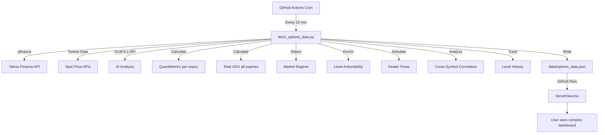
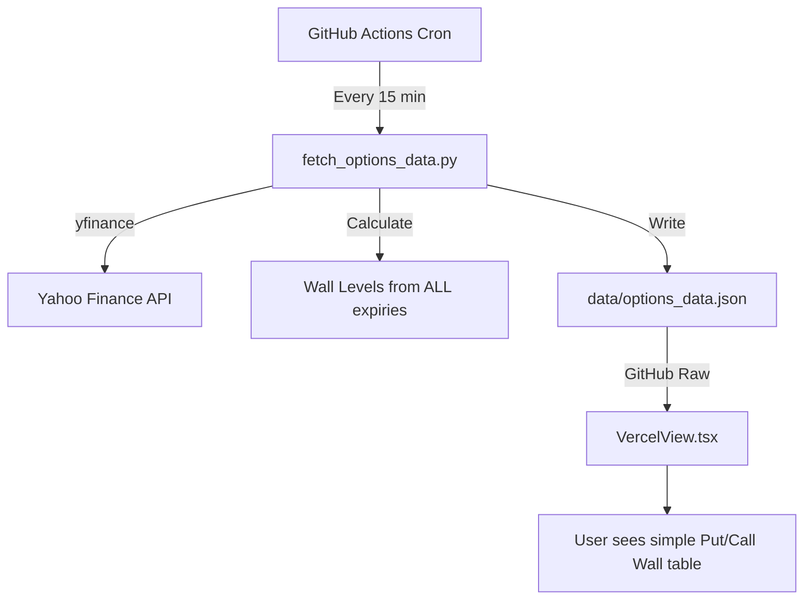

# Options Analysis Simplification Plan

## 1. Current Architecture Summary

### Overview
The application is an options analysis tool that fetches options chain data from Yahoo Finance via a Python script, processes it through complex quantitative metrics, optionally runs AI analysis, and displays results in a React frontend.

### Current File Structure & Complexity

| File | Lines | Role | Complexity |
|------|-------|------|------------|
| `types.ts` | ~497 | Type definitions | **HIGH** - 30+ interfaces including GEX, PCR, skew, regime, actionability, confluence, resonance, history |
| `scripts/fetch_options_data.py` | ~4384 | Python data pipeline | **VERY HIGH** - Black-Scholes gamma, GEX, gamma flip, max pain, PCR, volatility skew, AI calls, regime detection, dealer flow simulation, cross-symbol correlation, level history |
| `services/vercelDataService.ts` | ~418 | Data fetching from GitHub | **MEDIUM** - Fetches JSON from GitHub Raw, caching |
| `services/dataService.ts` | ~552 | Alternative data service | **MEDIUM** - Multiple format parsing, localStorage caching |
| `services/aiService.ts` | ~226 | AI provider router | **MEDIUM** - Routes between Gemini and GLM |
| `services/geminiService.ts` | ~523 | Gemini AI service | **HIGH** - Complex prompts, confluence/resonance formatting |
| `services/glmService.ts` | ~628 | GLM AI service | **HIGH** - Complex prompts, total GEX formatting |
| `components/VercelView.tsx` | ~4263 | Main frontend component | **VERY HIGH** - Black-Scholes in TS, GEX calc, gamma flip, max pain, PCR, skew, confluence/resonance detection, level scoring, 15+ sub-components |
| `components/SettingsPanel.tsx` | ~43 | Settings | **LOW** |
| `components/Icons.tsx` | ~40 | SVG icons | **LOW** |
| `api/index.ts` | ~224 | Vercel serverless API | **MEDIUM** |
| `App.tsx` | ~10 | App wrapper | **LOW** |

### Current Data Flow



### What Gets Removed
The following metrics/features are **removed entirely**:
- Gamma Flip / Gamma Flip Zone
- Total GEX / GEX by Strike / GEX by Expiry
- Max Pain
- Put/Call Ratios (OI-based, Volume-based, Weighted, Delta-adjusted)
- Volatility Skew (smirk, reverse_smirk, sentiment)
- Market Regime Detection
- Dynamic Tolerances (VIX-based)
- Level Actionability Framework
- Dealer Flow Simulation
- Cross-Symbol Correlation Analysis
- Level History Tracking / Evolution
- AI Analysis (GLM/Gemini service calls)
- Confluence / Resonance detection
- Black-Scholes Gamma calculation
- Theta Decay Adjustment
- Significance Scoring (5-component)

---

## 2. Simplified Data Model

### New Type Definitions (replaces all of `types.ts`)

```typescript
// === CORE DATA TYPES ===

/** Single option contract from the chain */
export interface OptionData {
  strike: number;
  side: 'CALL' | 'PUT';
  oi: number;
  vol: number;
}

/** One expiration date with its options chain */
export interface ExpiryData {
  label: string;       // e.g. "0DTE", "WEEKLY", "MONTHLY", or date-based
  date: string;        // YYYY-MM-DD
  options: OptionData[];
}

/** A wall level derived from multi-expiry analysis */
export interface WallLevel {
  strike: number;
  type: 'PUT_WALL' | 'CALL_WALL';
  total_oi: number;       // Aggregate OI across contributing expiries
  total_vol: number;      // Aggregate Volume across contributing expiries
  score: number;          // Combined ranking score (OI * 0.6 + Vol * 0.4 normalized)
  contributing_expiries: string[];  // Which expiries have significant OI/Vol at this strike
  distance_pct: number;   // % distance from spot price
}

/** Per-symbol analyzed data */
export interface SymbolData {
  spot: number;
  generated: string;
  expiries: ExpiryData[];
  walls: {
    put_walls: WallLevel[];    // Supports - below spot, ranked by score
    call_walls: WallLevel[];   // Resistances - above spot, ranked by score
  };
}

/** Top-level data response */
export interface OptionsDataResponse {
  version: string;
  generated: string;
  symbols: Record<string, SymbolData>;
}

/** Cache entry */
export interface CachedData {
  data: OptionsDataResponse;
  timestamp: number;
}
```

### Wall Scoring Algorithm

The core simplification: analyze **ALL available expiration dates**, aggregate OI and Volume per strike across expiries, then rank:

```
For each unique strike across ALL expiries:
  1. Sum CALL OI at that strike → call_oi_total
  2. Sum CALL Vol at that strike → call_vol_total  
  3. Sum PUT OI at that strike → put_oi_total
  4. Sum PUT Vol at that strike → put_vol_total

CALL WALLS (resistances):
  - Filter: strike > spot_price
  - For each strike: score = normalize(call_oi_total) * 0.6 + normalize(call_vol_total) * 0.4
  - Sort by score descending
  - Take top 5

PUT WALLS (supports):
  - Filter: strike < spot_price
  - For each strike: score = normalize(put_oi_total) * 0.6 + normalize(put_vol_total) * 0.4
  - Sort by score descending
  - Take top 5
```

### New Data Flow



---

## 3. Python Script Changes

### File: `scripts/fetch_options_data.py`

#### REMOVE entirely (~3000+ lines removed):
- `HARMONIC_SYSTEM_INSTRUCTION` constant (AI prompt)
- `clean_json_response()` 
- `format_quant_metrics_for_ai()`
- `format_gex_strikes()`
- `format_options_for_ai()`
- `call_ai_api()`
- `get_ai_analysis()`
- `process_ai_analysis_for_symbol()`
- `calculate_black_scholes_gamma()`
- `norm_cdf()`
- `simulate_dealer_flows()`
- `flatten_options_for_simulation()`
- `calculate_total_gex()`
- `calculate_gamma_flip()`
- `calculate_gamma_flip_zone()`
- `calculate_max_pain()`
- `calculate_skew_type()`
- `calculate_put_call_ratios()`
- `calculate_volatility_skew()`
- `calculate_gex_by_strike()`
- `calculate_time_to_expiry()`
- `calculate_quant_metrics()`
- `calculate_significance_score()`
- `create_ai_ready_data()`
- `find_resonance_levels()`
- `find_confluence_levels()`
- `get_options_at_strike()`
- `find_confluence_levels_enhanced()`
- `find_resonance_levels_enhanced()`
- `select_walls_by_expiry()`
- `fetch_vix()`
- `detect_market_regime()`
- `assign_actionability()` and all `_determine_behavior`, `_get_confirmation_signals`, etc.
- `calculate_theta_adjusted_score()`
- `apply_theta_to_0dte_levels()`
- `enrich_levels_with_actionability()`
- `calculate_dynamic_tolerances()`
- `select_important_levels()`
- `extract_level_snapshot()`
- `update_level_history()`
- `_extract_strikes_with_scores()`
- `analyze_cross_symbol_correlation()`
- All AI API configuration (`AI_API_URL`, `AI_MODEL`, `AI_API_KEY`)
- `TWELVEDATA_API_KEY`, `SPOT_SYMBOL_MAP`, `ETF_PROXY_CONFIG`, `FUTURES_PROXY_CONFIG`
- `DEFAULT_IV`, `MIN_IV` constants
- `_option_chain_cache`

#### KEEP (modified):
- `OptionRow` dataclass (simplified - remove `iv` field)
- `ExpiryData` dataclass
- `OptionsDataset` dataclass (simplified - remove `total_gex_data`, `data_quality`)
- `is_friday()`, `is_monthly()`, `is_weekly_friday()` - for labeling
- `get_spot_price()` - simplified, remove futures/twelvedata proxy logic
- `select_expirations_enhanced()` - **CHANGE: select ALL available expirations instead of just 3**
- `fetch_options_chain()` - simplified, remove IV processing
- `fetch_symbol_data()` - simplified
- `generate_tradingview_levels()` - simplified for walls only
- `generate_legacy_content()` - can be removed
- `calculate_walls()` - **REPLACE** with new multi-expiry wall analysis
- `main()` - massively simplified

#### ADD new:
- `calculate_walls_multi_expiry()` - New function that analyzes ALL expirations

```python
def calculate_walls_multi_expiry(expiries: List[Dict], spot: float, top_n: int = 5) -> Dict:
    """
    Analyze ALL expiration dates to find the most important Put/Call walls.
    
    Aggregates OI and Volume per strike across all expiries,
    then ranks by combined score.
    
    Returns:
        {
            "put_walls": [WallLevel, ...],   # Top supports (below spot)
            "call_walls": [WallLevel, ...]    # Top resistances (above spot)
        }
    """
    # 1. Aggregate OI and Volume per strike per side across ALL expiries
    call_data = {}  # strike -> {oi: int, vol: int, expiries: [str]}
    put_data = {}   # strike -> {oi: int, vol: int, expiries: [str]}
    
    for expiry in expiries:
        label = expiry.get('label', 'UNKNOWN')
        for opt in expiry.get('options', []):
            strike = opt['strike']
            oi = opt.get('oi', 0)
            vol = opt.get('vol', 0)
            
            if opt['side'] == 'CALL':
                if strike not in call_data:
                    call_data[strike] = {'oi': 0, 'vol': 0, 'expiries': []}
                call_data[strike]['oi'] += oi
                call_data[strike]['vol'] += vol
                if oi > 0 or vol > 0:
                    call_data[strike]['expiries'].append(label)
            else:  # PUT
                if strike not in put_data:
                    put_data[strike] = {'oi': 0, 'vol': 0, 'expiries': []}
                put_data[strike]['oi'] += oi
                put_data[strike]['vol'] += vol
                if oi > 0 or vol > 0:
                    put_data[strike]['expiries'].append(label)
    
    # 2. Score and rank CALL walls (above spot)
    call_walls = _score_and_rank(call_data, spot, 'CALL_WALL', top_n)
    
    # 3. Score and rank PUT walls (below spot)
    put_walls = _score_and_rank(put_data, spot, 'PUT_WALL', top_n)
    
    return {"put_walls": put_walls, "call_walls": call_walls}


def _score_and_rank(data: Dict, spot: float, wall_type: str, top_n: int) -> List[Dict]:
    """Score strikes by normalized OI + Volume and return top N."""
    if not data:
        return []
    
    # Filter by side of spot
    if wall_type == 'CALL_WALL':
        filtered = {s: d for s, d in data.items() if s > spot}
    else:
        filtered = {s: d for s, d in data.items() if s < spot}
    
    if not filtered:
        return []
    
    # Normalize OI and Volume
    max_oi = max(d['oi'] for d in filtered.values()) or 1
    max_vol = max(d['vol'] for d in filtered.values()) or 1
    
    scored = []
    for strike, d in filtered.items():
        if d['oi'] == 0 and d['vol'] == 0:
            continue
        oi_norm = d['oi'] / max_oi
        vol_norm = d['vol'] / max_vol
        score = oi_norm * 0.6 + vol_norm * 0.4
        distance_pct = round((strike - spot) / spot * 100, 2) if spot > 0 else 0
        
        scored.append({
            'strike': round(strike, 2),
            'type': wall_type,
            'total_oi': d['oi'],
            'total_vol': d['vol'],
            'score': round(score * 100, 1),
            'contributing_expiries': d['expiries'],
            'distance_pct': distance_pct
        })
    
    scored.sort(key=lambda x: x['score'], reverse=True)
    return scored[:top_n]
```

#### Modified `select_expirations_enhanced()`:
Change from selecting 3 expirations to selecting ALL available (or up to a reasonable limit like 12):

```python
def select_all_expirations(expirations: List[str], max_expiries: int = 12) -> List[tuple]:
    """
    Select ALL available expirations for comprehensive wall analysis.
    Labels them by time category.
    """
    if not expirations:
        return []
    
    selected = []
    for i, exp in enumerate(expirations[:max_expiries]):
        if i == 0:
            label = "0DTE"
        elif is_monthly(exp):
            label = "MONTHLY"
        elif is_friday(exp):
            label = "WEEKLY"
        else:
            label = f"D{i}"  # Day-based label
        selected.append((label, exp))
    
    return selected
```

#### Modified `fetch_options_chain()`:
Remove IV processing - only keep strike, side, oi, vol:

```python
def fetch_options_chain(ticker: yf.Ticker, expiry_date: str, label: str) -> Optional[ExpiryData]:
    try:
        chain = get_cached_option_chain(ticker, expiry_date)
        options = []
        
        for _, row in chain.calls.iterrows():
            options.append({
                "strike": round(float(row['strike']), 2),
                "side": "CALL",
                "oi": int(row['openInterest']) if pd.notna(row['openInterest']) else 0,
                "vol": int(row['volume']) if pd.notna(row['volume']) else 0
            })
        
        for _, row in chain.puts.iterrows():
            options.append({
                "strike": round(float(row['strike']), 2),
                "side": "PUT",
                "oi": int(row['openInterest']) if pd.notna(row['openInterest']) else 0,
                "vol": int(row['volume']) if pd.notna(row['volume']) else 0
            })
        
        return ExpiryData(label=label, date=expiry_date, options=options)
    except Exception as e:
        logger.error(f"Error fetching {label}: {e}")
        return None
```

#### Modified `main()`:
Simplified pipeline:
1. For each symbol: fetch spot price, fetch ALL option chains
2. Calculate walls across all expiries
3. Save to JSON

Remove: AI analysis phase, regime detection, actionability enrichment, theta adjustment, dealer flow simulation, cross-symbol correlation, level history, VIX fetch, dynamic tolerances.

#### Modified `requirements.txt`:
Remove `requests` (only needed for AI API calls). Keep `yfinance`, `pandas`.

### Estimated line reduction: ~4384 → ~400 lines

---

## 4. TypeScript Service Changes

### File: `types.ts`
**Complete rewrite.** Remove all 30+ interfaces, replace with ~5 simple interfaces (see Section 2).

**Remove entirely:**
- `AnalysisLevel`, `DailyOutlook`, `MarketDataset`
- `OptionsMetadata`, `GammaLevel`, `OptionLevel`, `StructuredLevels`
- `LegacyExpiryContent`, `LegacyConfluenceLevel`, `LegacyResonanceLevel`
- `SelectedLevels`
- `AIOutlook`, `AILevel`, `AIAnalysis`
- `GEXData`, `TotalGexData`
- `VolOIAnalysis`, `PutCallRatios`, `VolatilitySkew`
- `QuantMetrics`
- `MarketRegime`, `DynamicTolerances`, `MarketContext`
- `LevelActionability`
- `ConfluenceLevel`, `ResonanceLevel`, `ConfluenceExpiryDetail`
- `AIReadyStrike`, `AIReadyExpiry`, `AIReadyData`
- `HistoryKeyLevel`, `LevelSnapshot`, `LevelHistory`, `LevelEvolution`
- `isEnhancedConfluenceLevel()`, `isEnhancedResonanceLevel()`
- `FetchResult`

**Keep (modified):**
- `OptionData` - simplified (remove `iv`)
- `ExpiryData` - simplified (remove `quantMetrics`)
- `SymbolData` - simplified (remove `legacy`, `selected_levels`, `ai_analysis`, `totalGexData`, add `walls`)
- `OptionsDataResponse` - simplified
- `CachedData` - keep as-is

### File: `services/vercelDataService.ts`
**Simplify significantly:**
- Remove `fetchLevelHistory()` and related imports
- Remove `getAIReadyData()`
- Remove `DynamicTolerances` interface
- Remove `VercelOptionsData` interface (use `OptionsDataResponse` from types)
- Keep: `fetchVercelOptionsData()`, `getSymbolData()`, `isDataFresh()`, `getLastUpdateTime()`, `getDataAgeMinutes()`, `getAvailableSymbols()`, `clearCache()`, `getCacheStatus()`

### File: `services/dataService.ts`
**Simplify significantly:**
- Remove `parseStructuredLevels()` 
- Remove `parseLegacyFormat()`
- Simplify `parseSymbolsFormat()` - no more quantMetrics passthrough
- Remove `fetchFromBackend()`, `fetchMultipleFromBackend()`, backend caching
- Keep: `fetchOptionsData()`, `convertToDatasets()` (simplified), `getTimeSinceUpdate()`

### File: `services/aiService.ts`
**DELETE ENTIRELY** - No more AI analysis.

### File: `services/geminiService.ts`
**DELETE ENTIRELY** - No more AI analysis.

### File: `services/glmService.ts`
**DELETE ENTIRELY** - No more AI analysis.

### File: `api/index.ts`
**Simplify:**
- Remove `SYMBOL_MAP` (keep only if needed for yfinance formatting)
- Simplify response format to match new data model
- This file may become unnecessary if all data comes from pre-generated JSON

---

## 5. Frontend Simplification

### File: `components/VercelView.tsx`
**Complete rewrite.** From ~4263 lines to ~400-500 lines.

#### REMOVE entirely:
- All Black-Scholes / quantitative calculation functions (lines 264-675)
- All fallback level generation system (lines 700-1280)
- All confluence/resonance detection (lines 1085-1280)
- `ZeroDTEMetricsDisplay` component
- `AggregateMetricsDisplay` component
- `TotalGexDisplay` component
- `LevelRow` component (replace with simpler version)
- `LevelEvolutionBadge` component
- All tooltip constants (`TOOLTIPS`, `DETAILED_TOOLTIPS`)
- All scoring functions (`calculateLevelScore`, `classifyWallType`, etc.)
- `MetricLabel` component
- Dynamic tolerance handling
- Market hours detection (can keep for display purposes)
- AI analysis display sections

#### NEW Simple UI Design:

```
┌─────────────────────────────────────────────────┐
│  📊 Options Wall Analyzer                       │
│  Last updated: 2 min ago                        │
│                                                  │
│  [SPY] [QQQ] [SPX] [NDX]                       │
│                                                  │
│  SPOT: $711.69                                   │
│                                                  │
│  ── RESISTANCES (Call Walls) ────────────────── │
│  ┌───────┬──────────┬─────────┬──────────┐      │
│  │ Strike│ Tot OI   │ Tot Vol │ Distance │      │
│  ├───────┼──────────┼─────────┼──────────┤      │
│  │ 715.00│ 125,432  │ 89,234  │ +0.47%   │ ████ │
│  │ 720.00│ 98,765   │ 67,890  │ +1.17%   │ ███  │
│  │ 725.00│ 76,543   │ 45,678  │ +1.87%   │ ██   │
│  │ 730.00│ 54,321   │ 34,567  │ +2.57%   │ █    │
│  │ 735.00│ 32,100   │ 23,456  │ +3.27%   │ █    │
│  └───────┴──────────┴─────────┴──────────┘      │
│                                                  │
│  ── SUPPORTS (Put Walls) ────────────────────── │
│  ┌───────┬──────────┬─────────┬──────────┐      │
│  │ Strike│ Tot OI   │ Tot Vol │ Distance │      │
│  ├───────┼──────────┼─────────┼──────────┤      │
│  │ 710.00│ 112,345  │ 78,901  │ -0.24%   │ ████ │
│  │ 705.00│ 87,654   │ 56,789  │ -0.94%   │ ███  │
│  │ 700.00│ 65,432   │ 45,678  │ -1.64%   │ ██   │
│  │ 695.00│ 43,210   │ 23,456  │ -2.34%   │ █    │
│  │ 690.00│ 21,098   │ 12,345  │ -3.04%   │ █    │
│  └───────┴──────────┴─────────┴──────────┘      │
│                                                  │
│  Expiries analyzed: 12 (0DTE through 2026-09-18) │
│  Data source: Yahoo Finance via GitHub Actions   │
└─────────────────────────────────────────────────┘
```

#### New Component Structure:

```typescript
// VercelView.tsx - Simplified

// 1. Imports (minimal)
// 2. Constants (SYMBOLS array only)
// 3. Helper functions (formatCurrency, formatNumber)
// 4. Sub-components:
//    - LoadingSpinner (keep as-is)
//    - ErrorDisplay (keep as-is)
//    - DataAgeBadge (keep as-is)
//    - TabButton (keep as-is)
//    - WallTable (NEW - displays a table of wall levels)
//    - SymbolView (NEW - displays spot + wall tables for one symbol)
// 5. Main VercelView component:
//    - Fetch data from GitHub Raw
//    - Tab switching between symbols
//    - Render SymbolView for selected symbol
```

#### Key WallTable Component:

```tsx
const WallTable: React.FC<{
  title: string;
  walls: WallLevel[];
  spot: number;
  icon: string;
}> = ({ title, walls, spot, icon }) => {
  if (walls.length === 0) {
    return <div className="text-gray-500 text-center py-4">No significant levels found</div>;
  }

  const maxScore = Math.max(...walls.map(w => w.score));

  return (
    <div className="mb-6">
      <h3 className="text-sm font-bold uppercase tracking-wider text-gray-400 mb-3">
        {icon} {title}
      </h3>
      <div className="bg-gray-900/50 rounded-lg overflow-hidden">
        <table className="w-full text-sm">
          <thead>
            <tr className="border-b border-gray-700">
              <th className="px-4 py-2 text-left text-gray-500">Strike</th>
              <th className="px-4 py-2 text-right text-gray-500">Total OI</th>
              <th className="px-4 py-2 text-right text-gray-500">Total Vol</th>
              <th className="px-4 py-2 text-right text-gray-500">Distance</th>
              <th className="px-4 py-2 text-right text-gray-500">Score</th>
            </tr>
          </thead>
          <tbody>
            {walls.map((wall, i) => (
              <tr key={i} className="border-b border-gray-800/50 hover:bg-gray-800/30">
                <td className="px-4 py-2 font-mono font-bold">
                  ${wall.strike.toFixed(2)}
                </td>
                <td className="px-4 py-2 text-right font-mono">
                  {wall.total_oi.toLocaleString()}
                </td>
                <td className="px-4 py-2 text-right font-mono">
                  {wall.total_vol.toLocaleString()}
                </td>
                <td className="px-4 py-2 text-right font-mono">
                  {wall.distance_pct > 0 ? '+' : ''}{wall.distance_pct.toFixed(2)}%
                </td>
                <td className="px-4 py-2 text-right">
                  <div className="flex items-center justify-end gap-2">
                    <div className="w-16 bg-gray-700 rounded-full h-1.5">
                      <div 
                        className="h-full rounded-full bg-blue-500"
                        style={{ width: `${(wall.score / maxScore) * 100}%` }}
                      />
                    </div>
                    <span className="font-mono text-xs">{wall.score}</span>
                  </div>
                </td>
              </tr>
            ))}
          </tbody>
        </table>
      </div>
    </div>
  );
};
```

### File: `components/SettingsPanel.tsx`
**Simplify** - Remove AI API key references. Keep only basic info about data source.

### File: `components/Icons.tsx`
**Keep as-is** - Already minimal.

### File: `App.tsx`
**Keep as-is** - Already minimal.

---

## 6. File-by-File Change List

### Files to DELETE:
| File | Reason |
|------|--------|
| `services/aiService.ts` | AI analysis removed |
| `services/geminiService.ts` | AI analysis removed |
| `services/glmService.ts` | AI analysis removed |
| `scripts/validate_levels.py` | Validates levels we no longer compute |

### Files to REWRITE:
| File | Current Lines | Target Lines | Change |
|------|--------------|-------------|--------|
| `types.ts` | ~497 | ~50 | Replace 30+ interfaces with 5 simple ones |
| `scripts/fetch_options_data.py` | ~4384 | ~400 | Remove all quant metrics, AI, regime, history; add multi-expiry wall analysis |
| `components/VercelView.tsx` | ~4263 | ~400-500 | Remove all quant calculations, complex sub-components; simple wall table display |

### Files to SIMPLIFY:
| File | Change |
|------|--------|
| `services/vercelDataService.ts` | Remove history fetching, AI-ready data, dynamic tolerances; simplify interfaces |
| `services/dataService.ts` | Remove backend fetch, structured/legacy parsing; simplify |
| `components/SettingsPanel.tsx` | Remove AI API key references |
| `api/index.ts` | Simplify response format (or remove if unused) |

### Files to KEEP UNCHANGED:
| File | Reason |
|------|--------|
| `App.tsx` | Already minimal |
| `components/Icons.tsx` | Already minimal |
| `index.tsx` | Entry point |
| `index.html` | HTML template |
| `vite.config.ts` | Build config |
| `tsconfig.json` | TS config |
| `package.json` | Dependencies (remove AI-related packages later) |
| `vercel.json` | Deployment config |
| `.github/workflows/fetch-options-data.yml` | May need minor updates (remove AI_API_KEY secret) |

### New `package.json` dependency removals:
- `@google/genai` - Gemini AI SDK (no longer needed)

---

## 7. Implementation Order

The changes should be implemented in this order:

1. **`types.ts`** - New simplified type definitions (foundation for everything else)
2. **`scripts/fetch_options_data.py`** - New simplified Python script with multi-expiry wall analysis
3. **Run Python script** - Generate new `data/options_data.json` with simplified format
4. **`services/vercelDataService.ts`** - Simplified data service
5. **`services/dataService.ts`** - Simplified data service
6. **`components/VercelView.tsx`** - New simple frontend
7. **`components/SettingsPanel.tsx`** - Simplified settings
8. **Delete** `services/aiService.ts`, `services/geminiService.ts`, `services/glmService.ts`
9. **`api/index.ts`** - Simplify or remove
10. **`package.json`** - Remove unused dependencies
11. **`.github/workflows/fetch-options-data.yml`** - Remove AI_API_KEY secret reference

---

## 8. JSON Output Format Comparison

### Before (current `data/options_data.json` - 62,374 lines):
```json
{
  "version": "2.0",
  "generated": "...",
  "dynamic_tolerances": { "resonance": 0.00459, "confluence": 0.00919, ... },
  "symbols": {
    "SPY": {
      "spot": 711.69,
      "expiries": [{
        "label": "0DTE",
        "date": "2026-04-28",
        "options": [{ "strike": 530.0, "side": "CALL", "iv": 2.3398, "oi": 2, "vol": 2 }],
        "quantMetrics": { "gamma_flip": ..., "max_pain": ..., "total_gex": ..., ... }
      }],
      "selected_levels": { "resonance": [...], "confluence": [...], "call_walls": [...], ... },
      "totalGexData": { ... },
      "ai_analysis": { ... },
      "legacy": { ... }
    }
  },
  "ai_ready_data": { ... },
  "cross_symbol_correlations": [...]
}
```

### After (simplified - estimated ~5,000-8,000 lines):
```json
{
  "version": "3.0",
  "generated": "2026-05-06T15:00:00Z",
  "symbols": {
    "SPY": {
      "spot": 711.69,
      "generated": "2026-05-06T15:00:00Z",
      "expiries": [{
        "label": "0DTE",
        "date": "2026-05-06",
        "options": [{ "strike": 715.0, "side": "CALL", "oi": 12543, "vol": 8923 }]
      }],
      "walls": {
        "put_walls": [{
          "strike": 710.0,
          "type": "PUT_WALL",
          "total_oi": 112345,
          "total_vol": 78901,
          "score": 95.2,
          "contributing_expiries": ["0DTE", "WEEKLY", "MONTHLY"],
          "distance_pct": -0.24
        }],
        "call_walls": [{
          "strike": 715.0,
          "type": "CALL_WALL",
          "total_oi": 125432,
          "total_vol": 89234,
          "score": 98.1,
          "contributing_expiries": ["0DTE", "WEEKLY", "MONTHLY"],
          "distance_pct": 0.47
        }]
      }
    }
  }
}
```

---

## 9. Risk & Considerations

1. **Data size**: Fetching ALL expirations (up to 12) instead of 3 will increase yfinance API calls. The script already limits to 12 in some functions. Keep this limit.

2. **GitHub Actions timeout**: The simplified script will be MUCH faster (no AI calls, no complex calculations). Should go from ~5-10 min to ~1-2 min.

3. **Backward compatibility**: The JSON format changes completely. The `version` field changes from `"2.0"` to `"3.0"`. Old TradingView levels file format also changes.

4. **No more AI dependency**: The `AI_API_KEY` secret in GitHub Actions is no longer needed. The `SKIP_AI_ANALYSIS` env var becomes irrelevant.

5. **Spot price fetching**: Keep the current multi-source spot price logic (Yahoo Finance primary) but remove the complex futures/Twelve Data proxy logic. Just use Yahoo Finance directly.

6. **Options data still includes IV**: Even though we remove IV from the simplified `OptionData` type, the Python script can still fetch it for potential future use. But the JSON output and frontend will not use it.
