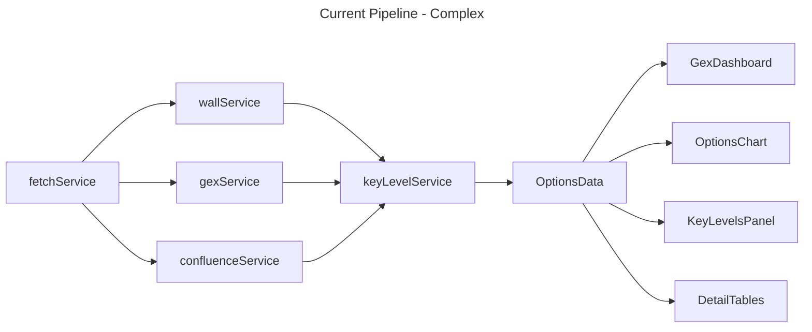
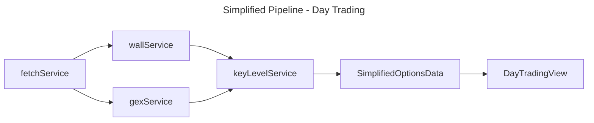

# Simplified Day Trading Redesign

> **Goal**: Strip this options analysis app down to the essentials for intraday day trading — simple key levels, GEX regime, nothing complex.

---

## 1. Critical Bugs to Fix

### 1.1 NDX/SPX Spot-Strike Mismatch (BLOCKER)

**File**: [`scripts/fetch_options_data.py`](scripts/fetch_options_data.py:76)

**Problem**: The [`SPOT_FUTURES_MAP`](scripts/fetch_options_data.py:76) fetches spot from futures (`NQ=F` ~22,000 for NDX, `ES=F` for SPX), but options chains are fetched from the actual index tickers (`^NDX` ~18,500, `^SPX`). This means:

- NDX spot shows ~22,000 but strikes range around ~18,500
- Gamma flip point computes to $22,815 instead of the correct ~$18,500 range
- All distance-from-spot percentages are completely wrong for NDX and SPX

**Fix**: Change [`get_spot_price()`](scripts/fetch_options_data.py:164) to use the **index ticker** (`^NDX`, `^SPX`) for spot price, not futures. Use futures only as a fallback.

```python
# BEFORE (lines 76-79):
SPOT_FUTURES_MAP = {
    "SPX": "ES=F",
    "NDX": "NQ=F",
}

# AFTER — remove futures map entirely, use index tickers directly:
# The SYMBOL_YFINANCE_MAP already maps to ^SPX and ^NDX.
# Just use ticker.history() from the index ticker itself.
```

The [`get_spot_price()`](scripts/fetch_options_data.py:164) function should try `ticker.history(period="1d")` first (which now uses `^NDX`/`^SPX` via the already-correct `SYMBOL_YFINANCE_MAP`), then fall back to `fast_info.last_price`, and only as a last resort try futures.

### 1.2 Gamma Estimated with Flat 25% IV

**File**: [`utils/gammaEstimate.ts`](utils/gammaEstimate.ts:55)

**Problem**: [`estimateGamma()`](utils/gammaEstimate.ts:55) defaults to `impliedVol = 0.25` when no IV is provided. The Python script already fetches gamma from yfinance (see [`parse_chain_side()`](scripts/fetch_options_data.py:240) line 240: `gamma = float(row["gamma"])`), so the TS estimation is only used as a fallback when `opt.gamma` is falsy (0 or undefined).

**Fix**: 
1. In the Python script, ensure gamma is always captured and never zero for active contracts
2. In the TS fallback, use a simple IV proxy based on symbol rather than flat 25%:

```typescript
// In gammaEstimate.ts — better default IV per symbol
const DEFAULT_IV: Record<string, number> = {
  SPY: 0.15, QQQ: 0.20, SPX: 0.15, NDX: 0.20,
};
```

### 1.3 Gamma Flip Point Computed on Sparse Data

**File**: [`services/gexService.ts`](services/gexService.ts:117) — [`computeGexFlipPoint()`](services/gexService.ts:117)

**Problem**: The flip point is computed across ALL strikes in the filtered data, including far OTM strikes with negligible GEX. This produces unreliable flip points.

**Fix**: Only search for the flip within ±5% of spot price, and require minimum GEX threshold:

```typescript
export function computeGexFlipPoint(
  strikeMap: Map<number, GexStrikeData>,
  spotPrice: number
): number | null {
  const lowerBound = spotPrice * 0.95;
  const upperBound = spotPrice * 1.05;
  
  const nearby = Array.from(strikeMap.entries())
    .filter(([strike]) => strike >= lowerBound && strike <= upperBound)
    .filter(([, data]) => Math.abs(data.netGEX) > 0)
    .sort(([a], [b]) => a - b);

  // ... interpolation logic on nearby strikes only
}
```

---

## 2. What to Remove

| Component | File | Lines | Reason |
|-----------|------|-------|--------|
| Confluence service | [`services/confluenceService.ts`](services/confluenceService.ts) | 314 | Complex, no clear day trading value |
| Confluence table | [`components/ConfluenceTable.tsx`](components/ConfluenceTable.tsx) | ~200 | UI for removed feature |
| Detail tables | [`components/DetailTables.tsx`](components/DetailTables.tsx) | 387 | Too complex for simple view |
| GEX dashboard | [`components/GexDashboard.tsx`](components/GexDashboard.tsx) | 241 | Replace with simple badge |
| Key levels panel | [`components/KeyLevelsPanel.tsx`](components/KeyLevelsPanel.tsx) | 286 | Replace with simplified version |
| Wall table | [`components/WallTable.tsx`](components/WallTable.tsx) | — | Replaced by new component |
| Wall row | [`components/WallRow.tsx`](components/WallRow.tsx) | — | Replaced by new component |
| GEX indicator | [`components/GexIndicator.tsx`](components/GexIndicator.tsx) | — | Merged into new badge |
| Price position bar | [`components/PricePositionBar.tsx`](components/PricePositionBar.tsx) | — | Merged into new view |
| Confluence types | [`ConfluenceLevel`](types.ts:54), [`KeyLevelType`](types.ts:70) | — | No longer needed |

---

## 3. Simplified Architecture

### 3.1 Data Flow (Before vs After)





### 3.2 New Simplified Types

**File**: [`types.ts`](types.ts)

```typescript
// ========================================================================
// SIMPLIFIED TYPES — Day Trading Redesign
// ========================================================================

/** A single key level for day trading */
export interface DayTradingLevel {
  strike: number;
  type: 'support' | 'resistance';
  oi: number;              // time-weighted OI
  volume: number;           // time-weighted volume
  distanceFromSpot: number; // percentage
  score: number;            // simplified OI-weighted score, 0-100
}

/** GEX regime — just the sign, no dollar amounts */
export type GexRegime = 'low_vol' | 'high_vol';

/** Simplified data container */
export interface DayTradingData {
  symbol: string;
  spotPrice: number;
  gexRegime: GexRegime;
  gexFlipPoint: number | null;  // null if not computable within ±5%
  supportLevels: DayTradingLevel[];    // put walls below spot, max 7
  resistanceLevels: DayTradingLevel[]; // call walls above spot, max 7
  allExpirations: string[];
  lastUpdated?: string;
}

/** Expiration filter — keep simple */
export type ExpirationFilterPreset = '0dte' | '1-7dte' | '8-30dte' | '30+dte' | 'all';
```

### 3.3 Service Changes

#### 3.3.1 [`services/index.ts`](services/index.ts) — Simplified Pipeline

```typescript
// BEFORE: 5-step pipeline with confluence
// AFTER:  3-step pipeline

export async function fetchDayTradingData(
  symbol: string,
  forceRefresh: boolean = false
): Promise<DayTradingData | null> {
  const raw = await fetchRawData(forceRefresh);
  if (!raw) return null;

  const symbolData = raw.symbols[symbol.toUpperCase()];
  if (!symbolData) return null;

  // Step 1: Compute walls (simplified scoring)
  const { putWalls, callWalls } = computeWalls(
    symbolData.expiries, symbolData.spot, raw.generated
  );

  // Step 2: Compute GEX regime (just sign of total net GEX)
  const gexMap = computeGEXPerStrike(symbolData.expiries, symbolData.spot, raw.generated);
  const totalNetGEX = computeTotalNetGEX(gexMap);
  const gexRegime: GexRegime = totalNetGEX >= 0 ? 'low_vol' : 'high_vol';
  const gexFlipPoint = computeGexFlipPoint(gexMap, symbolData.spot); // now takes spotPrice

  // Step 3: Build day trading levels
  const supportLevels = buildDayTradingLevels(putWalls, symbolData.spot, 'support');
  const resistanceLevels = buildDayTradingLevels(callWalls, symbolData.spot, 'resistance');

  return {
    symbol: symbol.toUpperCase(),
    spotPrice: symbolData.spot,
    gexRegime,
    gexFlipPoint,
    supportLevels,
    resistanceLevels,
    allExpirations: symbolData.expiries.map(e => e.date),
    lastUpdated: raw.generated,
  };
}
```

#### 3.3.2 [`services/wallService.ts`](services/wallService.ts) — Simplify Scoring

**Current**: Cross-side penalty scoring with α=0.35 (lines 127-175 of [`wallService.ts`](services/wallService.ts:127))

**Simplified**: Just OI-weighted with time decay. Remove cross-side penalty, remove GEX computation from wall service (GEX stays in gexService).

```typescript
// Simplified scoring: just OI × time_weight
const score = data.oi * timeWeight;
```

Keep the time-decay weighting (`1 / (1 + dte / 7)`) — it's correct and important. Remove the cross-side penalty complexity since it doesn't add value for simple support/resistance identification.

#### 3.3.3 [`services/gexService.ts`](services/gexService.ts) — Add Spot Bounds to Flip

**Change**: [`computeGexFlipPoint()`](services/gexService.ts:117) gets a second parameter `spotPrice: number` and only searches within ±5% of spot.

Remove the complex GEX dollar display logic. The service only needs to return:
- `totalNetGEX` (number, for regime sign)
- `gexFlipPoint` (number | null, bounded ±5% of spot)

#### 3.3.4 [`services/keyLevelService.ts`](services/keyLevelService.ts) — Simplify to Wall-Only

**Current**: Merges walls + confluence into unified `KeyLevel[]` (lines 29-85 of [`keyLevelService.ts`](services/keyLevelService.ts:29))

**Simplified**: Only processes walls. No confluence. Returns `DayTradingLevel[]` capped at 7 per side, sorted by proximity to spot.

```typescript
export function buildDayTradingLevels(
  walls: WallLevel[],
  spotPrice: number,
  type: 'support' | 'resistance'
): DayTradingLevel[] {
  return walls
    .map(w => ({
      strike: w.strike,
      type,
      oi: Math.round(w.totalOI),
      volume: Math.round(w.totalVolume),
      distanceFromSpot: Math.round(Math.abs(w.strike - spotPrice) / spotPrice * 10000) / 100,
      score: w.score,
    }))
    .sort((a, b) => a.distanceFromSpot - b.distanceFromSpot)
    .slice(0, 7);
}
```

#### 3.3.5 [`services/confluenceService.ts`](services/confluenceService.ts) — DELETE ENTIRELY

Remove the file. Remove all imports from [`services/index.ts`](services/index.ts:16).

---

## 4. UI Redesign

### 4.1 Mockup — Simplified Day Trading View

```
┌──────────────────────────────────────────────────────────────┐
│  SPY  $592.45  │  0 DTE  │  1-7 DTE  │  8-30 DTE  │  ALL   │
│                 │  ▬▬▬▬▬  │           │            │        │
├──────────────────────────────────────────────────────────────┤
│                                                              │
│   ┌─────────────────────────────────────────────────────┐   │
│   │  🟢 LOW VOLATILITY REGIME   │  Gamma Flip: $5,890   │   │
│   │     Positive GEX — dealer buying dips               │   │
│   └─────────────────────────────────────────────────────┘   │
│                                                              │
│   ┌─────────────────────────────────────────────────────┐   │
│   │              KEY LEVELS                              │   │
│   │                                                      │   │
│   │  RESISTANCE (Call Walls)                             │   │
│   │  ─────────────────────────────────────────────────── │   │
│   │  🔴 $595  │ +0.43% │ OI: 12,450 │ Vol: 3,200      │   │
│   │  🔴 $600  │ +1.27% │ OI: 28,900 │ Vol: 8,100      │   │
│   │  🔴 $605  │ +2.11% │ OI: 15,600 │ Vol: 4,300      │   │
│   │                                                      │   │
│   │  ━━━━━━━━━━━  $592.45 SPOT  ━━━━━━━━━━━━━━━━━━━━━━  │   │
│   │                                                      │   │
│   │  SUPPORT (Put Walls)                                 │   │
│   │  ─────────────────────────────────────────────────── │   │
│   │  🟢 $590  │ -0.41% │ OI: 18,200 │ Vol: 5,400      │   │
│   │  🟢 $585  │ -1.26% │ OI: 32,100 │ Vol: 9,800      │   │
│   │  🟢 $580  │ -2.10% │ OI: 22,400 │ Vol: 6,700      │   │
│   │                                                      │   │
│   └─────────────────────────────────────────────────────┘   │
│                                                              │
│   ┌─────────────────────────────────────────────────────┐   │
│   │  GEX Profile Chart (simplified)                      │   │
│   │  [Net GEX bars per strike, spot line, flip point]    │   │
│   └─────────────────────────────────────────────────────┘   │
│                                                              │
│  Last updated: 2 min ago  │  🔄 Refresh                     │
└──────────────────────────────────────────────────────────────┘
```

### 4.2 New Component: `components/DayTradingView.tsx`

**Replaces**: `GexDashboard`, `KeyLevelsPanel`, `DetailTables`, `WallTable`, `WallRow`, `GexIndicator`, `PricePositionBar`

**Structure**:

```
DayTradingView
├── Header
│   ├── Symbol tabs: SPY | QQQ | SPX | NDX
│   ├── Spot price display
│   └── Expiration filter pills (default: 0 DTE)
├── RegimeBadge
│   ├── "LOW VOL" (green) or "HIGH VOL" (red)
│   └── Gamma flip point (if available)
├── KeyLevelsList
│   ├── ResistanceSection
│   │   └── LevelRow[] (call walls above spot, max 7)
│   ├── SpotLine
│   └── SupportSection
│       └── LevelRow[] (put walls below spot, max 7)
├── GexChart (simplified OptionsChart)
│   └── Net GEX bars + spot line + flip point
└── Footer
    ├── Last updated timestamp
    └── Refresh button
```

### 4.3 Default Expiration Filter: 0-DTE

**File**: [`hooks/useOptionsData.ts`](hooks/useOptionsData.ts:72)

Change the default filter from `'all'` to `'0dte'`:

```typescript
// BEFORE (line 72):
const [expirationFilter, setExpirationFilter] = useState<ExpirationFilterPreset>('all');

// AFTER:
const [expirationFilter, setExpirationFilter] = useState<ExpirationFilterPreset>('0dte');
```

---

## 5. File Change Summary

### Files to Modify

| File | Change | Scope |
|------|--------|-------|
| [`scripts/fetch_options_data.py`](scripts/fetch_options_data.py) | Fix spot price: use index ticker directly, remove futures-first logic | Lines 76-79, 164-198 |
| [`types.ts`](types.ts) | Replace with simplified types, remove `ConfluenceLevel`, `KeyLevel`, `ChartData` | Full rewrite |
| [`services/index.ts`](services/index.ts) | Remove confluence step, simplify pipeline to 3 steps | Full rewrite |
| [`services/gexService.ts`](services/gexService.ts) | Add `spotPrice` param to `computeGexFlipPoint`, bound to ±5% | Lines 117-137 |
| [`services/wallService.ts`](services/wallService.ts) | Simplify scoring to OI-weighted only, remove cross-side penalty | Lines 127-175 |
| [`services/keyLevelService.ts`](services/keyLevelService.ts) | Simplify to wall-only, return `DayTradingLevel[]`, cap at 7 per side | Full rewrite |
| [`utils/gammaEstimate.ts`](utils/gammaEstimate.ts) | Better default IV per symbol instead of flat 25% | Lines 55-62 |
| [`hooks/useOptionsData.ts`](hooks/useOptionsData.ts) | Default filter to `0dte`, remove confluence handling, simplify return type | Multiple sections |
| [`components/VercelView.tsx`](components/VercelView.tsx) | Replace all sub-components with single `DayTradingView` | Full rewrite |
| [`services/dataService.ts`](services/dataService.ts) | Update to use new `DayTradingData` type | Minor |
| [`components/OptionsChart.tsx`](components/OptionsChart.tsx) | Simplify to show only net GEX bars + spot + flip | Moderate |
| [`components/SettingsPanel.tsx`](components/SettingsPanel.tsx) | Remove confluence-related settings | Minor |

### Files to Delete

| File | Reason |
|------|--------|
| [`services/confluenceService.ts`](services/confluenceService.ts) | Feature removed |
| [`components/ConfluenceTable.tsx`](components/ConfluenceTable.tsx) | Feature removed |
| [`components/DetailTables.tsx`](components/DetailTables.tsx) | Replaced by DayTradingView |
| [`components/GexDashboard.tsx`](components/GexDashboard.tsx) | Replaced by RegimeBadge |
| [`components/KeyLevelsPanel.tsx`](components/KeyLevelsPanel.tsx) | Replaced by KeyLevelsList |
| [`components/WallTable.tsx`](components/WallTable.tsx) | Replaced by DayTradingView |
| [`components/WallRow.tsx`](components/WallRow.tsx) | Replaced by LevelRow |
| [`components/GexIndicator.tsx`](components/GexIndicator.tsx) | Merged into RegimeBadge |
| [`components/PricePositionBar.tsx`](components/PricePositionBar.tsx) | Merged into KeyLevelsList |

### Files to Create

| File | Purpose |
|------|---------|
| `components/DayTradingView.tsx` | Single unified day trading view component |

---

## 6. Implementation Order

### Phase 1: Fix Critical Bugs
1. Fix [`scripts/fetch_options_data.py`](scripts/fetch_options_data.py:76) — spot price source for NDX/SPX
2. Fix [`services/gexService.ts`](services/gexService.ts:117) — bound gamma flip to ±5% of spot
3. Fix [`utils/gammaEstimate.ts`](utils/gammaEstimate.ts:55) — per-symbol default IV

### Phase 2: Simplify Types & Services
4. Rewrite [`types.ts`](types.ts) — simplified `DayTradingData`, `DayTradingLevel`, `GexRegime`
5. Simplify [`services/wallService.ts`](services/wallService.ts) — remove cross-side penalty
6. Rewrite [`services/keyLevelService.ts`](services/keyLevelService.ts) — wall-only, capped at 7
7. Rewrite [`services/index.ts`](services/index.ts) — remove confluence step
8. Update [`services/dataService.ts`](services/dataService.ts) — new types

### Phase 3: Simplify UI
9. Create `components/DayTradingView.tsx` — single unified component
10. Rewrite [`components/VercelView.tsx`](components/VercelView.tsx) — use DayTradingView
11. Simplify [`components/OptionsChart.tsx`](components/OptionsChart.tsx) — net GEX only
12. Update [`hooks/useOptionsData.ts`](hooks/useOptionsData.ts) — default 0-DTE, new types

### Phase 4: Cleanup
13. Delete [`services/confluenceService.ts`](services/confluenceService.ts)
14. Delete unused components: `ConfluenceTable`, `DetailTables`, `GexDashboard`, `KeyLevelsPanel`, `WallTable`, `WallRow`, `GexIndicator`, `PricePositionBar`
15. Remove confluence settings from [`components/SettingsPanel.tsx`](components/SettingsPanel.tsx)
16. Verify no broken imports across the codebase

---

## 7. Python Script Fix Detail

### Current Behavior (BROKEN)

```
NDX:
  yfinance ticker = ^NDX (for options chains) → strikes around 18,500-19,500
  spot price from NQ=F (futures) → ~22,000
  
  Result: spot=22,000, strikes=18,500-19,500
  All distance calculations WRONG
  Gamma flip point at ~$22,815 (nonsensical)
```

### Fixed Behavior

```
NDX:
  yfinance ticker = ^NDX (for options chains) → strikes around 18,500-19,500
  spot price from ^NDX (same index) → ~18,800
  
  Result: spot=18,800, strikes=18,500-19,500
  Distance calculations CORRECT
  Gamma flip point within expected range
```

### Code Change in [`get_spot_price()`](scripts/fetch_options_data.py:164)

```python
def get_spot_price(symbol: str, ticker: yf.Ticker) -> Optional[float]:
    """
    Return the last traded price for symbol.
    
    For indices (SPX, NDX), the ticker is already set to ^SPX/^NDX
    which provides accurate spot pricing matching the options strikes.
    Futures are only used as a last resort fallback.
    """
    # Primary: use the ticker directly (already mapped to ^SPX, ^NDX, etc.)
    try:
        hist = ticker.history(period="1d")
        if hist is not None and not hist.empty:
            price = float(hist["Close"].iloc[-1])
            logger.info(f"💰 {symbol} spot from ticker: ${price:.2f}")
            return price
    except Exception as e:
        logger.warning(f"Could not fetch spot from ticker history: {e}")
    
    # Fallback: fast_info
    try:
        return float(ticker.fast_info.last_price)
    except Exception:
        pass

    # Last resort: futures
    futures_ticker = SPOT_FUTURES_MAP.get(symbol)
    if futures_ticker:
        try:
            fut = yf.Ticker(futures_ticker)
            hist = fut.history(period="1d")
            if hist is not None and not hist.empty:
                price = float(hist["Close"].iloc[-1])
                logger.warning(
                    f"⚠️ {symbol} using futures fallback {futures_ticker}: ${price:.2f} "
                    f"— may not match index option strikes!"
                )
                return price
        except Exception as e:
            logger.warning(f"Futures fallback also failed: {e}")

    return None
```

---

## 8. Risk Mitigation

| Risk | Mitigation |
|------|------------|
| ^NDX/^SPX don't return prices via yfinance | Keep futures as last-resort fallback with a warning log |
| Removing confluence breaks existing users | Confluence was complex and not useful for day trading — clean break |
| Simplified scoring misses important levels | OI-weighted scoring is the industry standard for wall detection |
| 0-DTE filter shows no data outside market hours | Show "No 0-DTE data available" message with option to switch to "All" |
| Gamma flip still unreliable even with ±5% bound | Make it nullable — show "N/A" if not computable |
