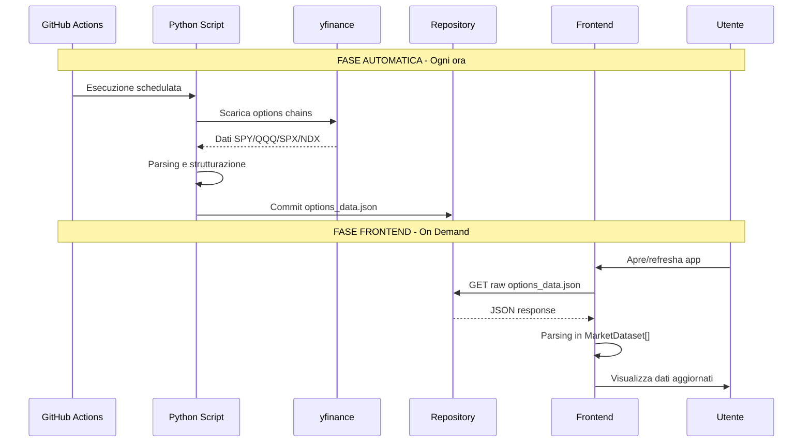

# Soluzione Automazione con GitHub Actions

## 1. Panoramica della Soluzione

Questa soluzione automatizza il download dei dati delle opzioni utilizzando GitHub Actions con scheduling periodico. I dati vengono salvati in formato JSON nel repository e sono accessibili pubblicamente dal frontend React.

### Obiettivi
- Eliminare l'esecuzione manuale dello script Python
- Garantire dati aggiornati ogni ora durante le market hours
- Mantenere compatibilità con il frontend esistente
- Zero costi infrastrutturali (GitHub Actions gratuito per repo pubblici)

---

## 2. Architettura della Soluzione

### 2.1 Diagramma del Flusso Dati

```mermaid
flowchart TB
    subgraph GitHub [GitHub Repository]
        WF[GitHub Actions Workflow]
        PY[fetch_options_data.py]
        JSON[data/options_data.json]
        REPO[Repository]
    end
    
    subgraph External [Sistemi Esterni]
        YF[yfinance API]
        MARKET[Market Data]
    end
    
    subgraph Frontend [React Application]
        DS[dataService.ts]
        QP[QuantPanel.tsx]
        APP[App.tsx]
    end
    
    WF -->|1. Trigger schedulato| PY
    PY -->|2. Richiesta dati| YF
    YF -->|3. Options chains| MARKET
    MARKET -->|4. Dati raw| PY
    PY -->|5. Genera JSON strutturato| JSON
    JSON -->|6. Commit automatico| REPO
    REPO -->|7. Hosting raw file| DS
    DS -->|8. Fetch + parsing| QP
    QP -->|9. MarketDataset[]| APP
```

### 2.2 Sequenza Temporale



### 2.3 Componenti Necessari

| Componente | Tipo | Descrizione |
|------------|------|-------------|
| `scripts/fetch_options_data.py` | Python Script | Logica estratta da PythonBridge con output JSON |
| `.github/workflows/fetch-options-data.yml` | YAML | Workflow GitHub Actions con cron scheduling |
| `data/options_data.json` | JSON | Output dello script, versione nel repo |
| `services/dataService.ts` | TypeScript | Nuovo servizio per fetch automatico dati |
| `components/QuantPanel.tsx` | TypeScript | Modifiche per supportare auto-refresh |

---

## 3. Script Python Standalone

### 3.1 Struttura del File

**Percorso**: `scripts/fetch_options_data.py`

### 3.2 Codice Completo

```python
#!/usr/bin/env python3
"""
QUANT SMART SWEEP v14.0 - GitHub Actions Edition
Scarica dati opzioni da yfinance e genera JSON strutturato per il frontend.

Uso:
    python scripts/fetch_options_data.py [--symbol SYMBOL] [--output PATH]

Esempi:
    python scripts/fetch_options_data.py --symbol SPY
    python scripts/fetch_options_data.py --symbol ALL --output data/options_data.json
"""

import yfinance as yf
import pandas as pd
import json
import argparse
import logging
import sys
from datetime import datetime
from typing import Optional, Dict, List, Any
from dataclasses import dataclass, asdict
from pathlib import Path

# Configurazione logging
logging.basicConfig(
    level=logging.INFO,
    format='%(asctime)s - %(levelname)s - %(message)s',
    handlers=[
        logging.StreamHandler(sys.stdout)
    ]
)
logger = logging.getLogger(__name__)


@dataclass
class OptionRow:
    """Rappresenta una singola opzione."""
    strike: float
    side: str  # CALL o PUT
    iv: float
    oi: int
    vol: int


@dataclass
class ExpiryData:
    """Dati per una scadenza."""
    label: str  # 0DTE, WEEKLY, MONTHLY
    date: str
    options: List[Dict[str, Any]]


@dataclass
class OptionsDataset:
    """Dataset completo per un simbolo."""
    symbol: str
    spot: float
    generated: str
    expiries: List[Dict[str, Any]]


def is_monthly(date_str: str) -> bool:
    """
    Verifica se una data corrisponde al terzo venerdì del mese.
    Le opzioni mensili standard scadono il terzo venerdì.
    """
    try:
        dt = datetime.strptime(date_str, '%Y-%m-%d')
        return dt.weekday() == 4 and 15 <= dt.day <= 21
    except ValueError:
        return False


def get_spot_price(ticker: yf.Ticker) -> Optional[float]:
    """
    Recupera il prezzo spot corrente con fallback multipli.
    """
    try:
        # Metodo1: fast_info (più veloce)
        return float(ticker.fast_info['last_price'])
    except (KeyError, TypeError):
        pass
    
    try:
        # Metodo2: history
        hist = ticker.history(period="1d")
        if not hist.empty:
            return float(hist['Close'].iloc[-1])
    except Exception:
        pass
    
    return None


def select_expirations(expirations: List[str]) -> List[tuple]:
    """
    Seleziona 3 scadenze distinte secondo la logica v13.0:
    1. 0DTE - Prima scadenza disponibile
    2. WEEKLY - Prima scadenza che non sia 0DTE
    3. MONTHLY - Prima scadenza mensile standard
    """
    if not expirations:
        return []
    
    selected = []
    used_dates = set()
    
    # 1. 0DTE - sempre la prima
    selected.append(("0DTE", expirations[0]))
    used_dates.add(expirations[0])
    
    # 2. WEEKLY - prima disponibile diversa da 0DTE
    for exp in expirations[1:]:
        if exp not in used_dates:
            selected.append(("WEEKLY", exp))
            used_dates.add(exp)
            break
    
    # 3. MONTHLY - prima scadenza mensile non ancora usata
    for exp in expirations:
        if is_monthly(exp) and exp not in used_dates:
            selected.append(("MONTHLY", exp))
            used_dates.add(exp)
            break
    
    # Se non abbiamo trovato un mensile, prendiamo la prossima disponibile
    if len(selected) < 3:
        for exp in expirations:
            if exp not in used_dates:
                selected.append(("EXTRA_EXP", exp))
                used_dates.add(exp)
                if len(selected) == 3:
                    break
    
    return selected


def fetch_options_chain(ticker: yf.Ticker, expiry_date: str, label: str) -> Optional[ExpiryData]:
    """
    Scarica e processa una singola option chain.
    """
    try:
        logger.info(f"  -> Scaricando {label} ({expiry_date})...")
        chain = ticker.option_chain(expiry_date)
        
        options = []
        
        # Processa CALLs
        for _, row in chain.calls.iterrows():
            options.append({
                "strike": round(float(row['strike']), 2),
                "side": "CALL",
                "iv": round(float(row['impliedVolatility']), 4),
                "oi": int(row['openInterest']) if pd.notna(row['openInterest']) else 0,
                "vol": int(row['volume']) if pd.notna(row['volume']) else 0
            })
        
        # Processa PUTs
        for _, row in chain.puts.iterrows():
            options.append({
                "strike": round(float(row['strike']), 2),
                "side": "PUT",
                "iv": round(float(row['impliedVolatility']), 4),
                "oi": int(row['openInterest']) if pd.notna(row['openInterest']) else 0,
                "vol": int(row['volume']) if pd.notna(row['volume']) else 0
            })
        
        return ExpiryData(
            label=label,
            date=expiry_date,
            options=options
        )
        
    except Exception as e:
        logger.error(f"  ❌ Errore su {label}: {e}")
        return None


def fetch_symbol_data(symbol: str) -> Optional[OptionsDataset]:
    """
    Scarica tutti i dati per un singolo simbolo.
    """
    logger.info(f"\n{'='*50}")
    logger.info(f"  Elaborazione: {symbol}")
    logger.info(f"{'='*50}")
    
    try:
        ticker = yf.Ticker(symbol)
        
        # Recupera spot price
        logger.info("[1/3] Recupero prezzo spot...")
        spot = get_spot_price(ticker)
        if spot is None:
            logger.error(f"❌ Impossibile recuperare spot price per {symbol}")
            return None
        logger.info(f"  -> Spot: {spot:.2f}")
        
        # Recupera scadenze disponibili
        logger.info("[2/3] Recupero scadenze...")
        expirations = list(ticker.options)
        if not expirations:
            logger.error(f"❌ Nessuna opzione trovata per {symbol}")
            return None
        logger.info(f"  -> Trovate {len(expirations)} scadenze")
        
        # Seleziona 3 scadenze
        selected = select_expirations(expirations)
        logger.info(f"  -> Selezionate: {[f'{l}({d})' for l, d in selected]}")
        
        # Scarica options chains
        logger.info("[3/3] Download options chains...")
        expiries = []
        for label, date in selected:
            data = fetch_options_chain(ticker, date, label)
            if data:
                expiries.append(asdict(data))
        
        if not expiries:
            logger.error(f"❌ Nessun dato scaricato per {symbol}")
            return None
        
        return OptionsDataset(
            symbol=symbol,
            spot=round(spot, 2),
            generated=datetime.now().isoformat(),
            expiries=expiries
        )
        
    except Exception as e:
        logger.error(f"❌ Errore generale per {symbol}: {e}")
        return None


def generate_legacy_content(dataset: OptionsDataset) -> Dict[str, str]:
    """
    Genera il contenuto in formato legacy per compatibilità con QuantPanel.
    Questo permette al frontend di usare lo stesso parsing esistente.
    """
    legacy_datasets = {}
    
    for expiry in dataset.expiries:
        lines = [f"STRIKE | TIPO | IV | OI | VOL"]
        for opt in expiry['options']:
            lines.append(
                f"{opt['strike']:.2f} | {opt['side']} | {opt['iv']:.4f} | {opt['oi']} | {opt['vol']}"
            )
        content = "\n".join(lines)
        
        # Chiave nel formato "TYPE (DATE)"
        key = f"{expiry['label']} ({expiry['date']})"
        legacy_datasets[key] = {
            "content": content,
            "type": expiry['label'],
            "date": expiry['date']
        }
    
    return legacy_datasets


def main():
    parser = argparse.ArgumentParser(
        description='QUANT Smart Sweep - GitHub Actions Edition'
    )
    parser.add_argument(
        '--symbol', 
        type=str, 
        default='SPY',
        help='Simbolo da scaricare (SPY, QQQ, ^SPX, ^NDX, o ALL)'
    )
    parser.add_argument(
        '--output', 
        type=str, 
        default='data/options_data.json',
        help='Percorso file output JSON'
    )
    parser.add_argument(
        '--symbols', 
        type=str, 
        nargs='+',
        help='Lista di simboli da scaricare'
    )
    
    args = parser.parse_args()
    
    # Determina simboli da processare
    if args.symbols:
        symbols = args.symbols
    elif args.symbol.upper() == 'ALL':
        symbols = ['SPY', 'QQQ', '^SPX', '^NDX']
    else:
        symbols = [args.symbol.upper()]
    
    logger.info(f"\n{'#'*60}")
    logger.info("# QUANT SMART SWEEP v14.0 - GitHub Actions Edition")
    logger.info(f"{'#'*60}")
    logger.info(f"Simboli: {symbols}")
    logger.info(f"Output: {args.output}")
    
    # Scarica dati per ogni simbolo
    all_data = {
        "version": "14.0",
        "generated": datetime.now().isoformat(),
        "symbols": {}
    }
    
    successful = 0
    for symbol in symbols:
        data = fetch_symbol_data(symbol)
        if data:
            # Genera anche formato legacy
            legacy = generate_legacy_content(data)
            all_data["symbols"][symbol] = {
                "spot": data.spot,
                "generated": data.generated,
                "expiries": data.expiries,
                "legacy": legacy
            }
            successful += 1
    
    # Salva output
    output_path = Path(args.output)
    output_path.parent.mkdir(parents=True, exist_ok=True)
    
    with open(output_path, 'w', encoding='utf-8') as f:
        json.dump(all_data, f, indent=2, ensure_ascii=False)
    
    logger.info(f"\n{'='*60}")
    logger.info(f"✅ COMPLETATO! Scaricati {successful}/{len(symbols)} simboli")
    logger.info(f"📁 File salvato: {output_path.absolute()}")
    logger.info(f"{'='*60}")
    
    # Exit code per GitHub Actions
    sys.exit(0 if successful > 0 else 1)


if __name__ == "__main__":
    main()
```

### 3.3 File requirements.txt

**Percorso**: `scripts/requirements.txt`

```txt
yfinance>=0.2.36
pandas>=2.0.0
numpy>=1.24.0
```

### 3.4 Gestione Errori e Logging

Lo script include:
- **Logging strutturato**: Output su stdout per GitHub Actions
- **Exit codes**: 0 per successo, 1 per fallimento
- **Fallback multipli**: Per spot price (fast_info → history)
- **Graceful degradation**: Se un simbolo fallisce, continua con gli altri
- **Timeout implicito**: yfinance ha timeout interno

---

## 4. Formato JSON Output

### 4.1 Schema Completo

```json
{
  "version": "14.0",
  "generated": "2026-02-20T14:30:00.000000",
  "symbols": {
    "SPY": {
      "spot": 450.25,
      "generated": "2026-02-20T14:30:00.000000",
      "expiries": [
        {
          "label": "0DTE",
          "date": "2026-02-20",
          "options": [
            {
              "strike": 449.00,
              "side": "PUT",
              "iv": 0.2345,
              "oi": 12500,
              "vol": 3200
            },
            {
              "strike": 450.00,
              "side": "CALL",
              "iv": 0.2198,
              "oi": 18200,
              "vol": 4500
            }
          ]
        },
        {
          "label": "WEEKLY",
          "date": "2026-02-27",
          "options": []
        },
        {
          "label": "MONTHLY",
          "date": "2026-03-20",
          "options": []
        }
      ],
      "legacy": {
        "0DTE (2026-02-20)": {
          "content": "STRIKE | TIPO | IV | OI | VOL\n449.00 | PUT | 0.2345 | 12500 | 3200\n...",
          "type": "0DTE",
          "date": "2026-02-20"
        },
        "WEEKLY (2026-02-27)": {
          "content": "...",
          "type": "WEEKLY",
          "date": "2026-02-27"
        },
        "MONTHLY (2026-03-20)": {
          "content": "...",
          "type": "MONTHLY",
          "date": "2026-03-20"
        }
      }
    }
  }
}
```

### 4.2 Compatibilità con Frontend

Il campo `legacy` contiene i dati già formattati per essere compatibili con il parsing esistente in [`QuantPanel.tsx`](components/QuantPanel.tsx:176). Questo permette:
- Transizione graduale senza breaking changes
- Fallback al caricamento manuale
- Possibilità di usare sia il nuovo formato JSON che il vecchio formato TXT

---

## 5. GitHub Actions Workflow

### 5.1 File Workflow

**Percorso**: `.github/workflows/fetch-options-data.yml`

```yaml
name: Fetch Options Data

on:
  # Trigger manuale per test
  workflow_dispatch:
    inputs:
      symbol:
        description: 'Symbol to fetch (SPY, QQQ, ALL)'
        required: false
        default: 'ALL'
  
  # Scheduling automatico
  # Ogni ora dalle 14:30 alle 21:00 UTC (market hours US: 9:30 AM - 4:00 PM ET)
  schedule:
    # Ogni ora durante market hours (14:30, 15:30, ..., 20:30 UTC)
    - cron: '30 14-20 * * 1-5'  # Lun-Ven, 14:30-20:30 UTC

env:
  PYTHON_VERSION: '3.11'

jobs:
  fetch-data:
    runs-on: ubuntu-latest
    permissions:
      contents: write  # Necessario per commit
    
    steps:
      - name: Checkout repository
        uses: actions/checkout@v4
        with:
          fetch-depth: 1
      
      - name: Setup Python
        uses: actions/setup-python@v5
        with:
          python-version: ${{ env.PYTHON_VERSION }}
          cache: 'pip'
      
      - name: Install dependencies
        run: |
          python -m pip install --upgrade pip
          pip install -r scripts/requirements.txt
      
      - name: Fetch options data
        id: fetch
        run: |
          python scripts/fetch_options_data.py \
            --symbol ${{ github.event.inputs.symbol || 'ALL' }} \
            --output data/options_data.json
        continue-on-error: false
      
      - name: Check for changes
        id: check_changes
        run: |
          git diff --exit-code data/options_data.json && echo "changed=false" >> $GITHUB_OUTPUT || echo "changed=true" >> $GITHUB_OUTPUT
      
      - name: Commit and push changes
        if: steps.check_changes.outputs.changed == 'true'
        run: |
          git config --local user.email "github-actions[bot]@users.noreply.github.com"
          git config --local user.name "github-actions[bot]"
          git add data/options_data.json
          git commit -m "chore: update options data [skip ci]"
          git push
      
      - name: Summary
        if: always()
        run: |
          echo "## Fetch Options Data Summary" >> $GITHUB_STEP_SUMMARY
          echo "" >> $GITHUB_STEP_SUMMARY
          if [ -f data/options_data.json ]; then
            echo "✅ Data fetched successfully" >> $GITHUB_STEP_SUMMARY
            echo "" >> $GITHUB_STEP_SUMMARY
            echo "### Generated at" >> $GITHUB_STEP_SUMMARY
            echo "$(jq -r '.generated' data/options_data.json)" >> $GITHUB_STEP_SUMMARY
            echo "" >> $GITHUB_STEP_SUMMARY
            echo "### Symbols" >> $GITHUB_STEP_SUMMARY
            jq -r '.symbols | keys[]' data/options_data.json >> $GITHUB_STEP_SUMMARY
          else
            echo "❌ Failed to fetch data" >> $GITHUB_STEP_SUMMARY
          fi

  # Job opzionale per notifiche
  notify-on-failure:
    runs-on: ubuntu-latest
    needs: fetch-data
    if: failure()
    
    steps:
      - name: Create issue on failure
        uses: actions/github-script@v7
        with:
          script: |
            github.rest.issues.create({
              owner: context.repo.owner,
              repo: context.repo.repo,
              title: '⚠️ Options data fetch failed',
              body: 'The scheduled options data fetch workflow failed. Check the logs: ${{ github.server_url }}/${{ github.repository }}/actions/runs/${{ github.run_id }}',
              labels: ['automation', 'alert']
            })
```

### 5.2 Spiegazione Cron Expression

```
┌───────────── minuto (30)
│ ┌───────────── ora (14-20 UTC)
│ │ ┌───────────── giorno del mese (*)
│ │ │ ┌───────────── mese (*)
│ │ │ │ ┌───────────── giorno della settimana (1-5 = Lun-Ven)
│ │ │ │ │
30 14-20 * * 1-5
```

**Conversione orari**:
- 14:30 UTC = 9:30 AM ET (market open)
- 20:30 UTC = 3:30 PM ET (30 min prima della chiusura)

### 5.3 Considerazioni sui Limiti

| Limite | Valore | Impatto |
|--------|--------|---------|
| Workflow minutes (free) | 2000/min mese | ~30 run/giorno, ampiamente sufficiente |
| Job timeout | 6 ore | Non rilevante (job ~2-5 min) |
| API rate yfinance | ~2000 req/ora | 4 simboli × 3 expiries = 12 richieste/run |

---

## 6. Modifiche Frontend

### 6.1 Nuovo Servizio: dataService.ts

**Percorso**: `services/dataService.ts`

```typescript
/**
 * dataService.ts
 * Servizio per il fetch automatico dei dati opzioni dal repository GitHub.
 */

import { MarketDataset } from '../types';

// URL base per i raw file GitHub
// Per repo pubblico: https://raw.githubusercontent.com/OWNER/REPO/BRANCH/PATH
const GITHUB_RAW_BASE = 'https://raw.githubusercontent.com';
const REPO_OWNER = 'YOUR_USERNAME'; // Sostituire con il proprio username
const REPO_NAME = 'agente-quant-interattivo-per-opzioni';
const BRANCH = 'main';
const DATA_PATH = 'data/options_data.json';

// Cache settings
const CACHE_DURATION_MS = 5 * 60 * 1000; // 5 minuti

interface OptionsDataResponse {
  version: string;
  generated: string;
  symbols: {
    [symbol: string]: {
      spot: number;
      generated: string;
      expiries: ExpiryData[];
      legacy: {
        [key: string]: {
          content: string;
          type: '0DTE' | 'WEEKLY' | 'MONTHLY' | 'EXTRA_EXP';
          date: string;
        };
      };
    };
  };
}

interface ExpiryData {
  label: string;
  date: string;
  options: Array<{
    strike: number;
    side: 'CALL' | 'PUT';
    iv: number;
    oi: number;
    vol: number;
  }>;
}

interface CachedData {
  timestamp: number;
  data: OptionsDataResponse;
}

// Cache in-memory
let cache: CachedData | null = null;

/**
 * Costruisce l'URL completo per il file JSON.
 */
function getDataUrl(): string {
  return `${GITHUB_RAW_BASE}/${REPO_OWNER}/${REPO_NAME}/${BRANCH}/${DATA_PATH}`;
}

/**
 * Verifica se la cache è ancora valida.
 */
function isCacheValid(): boolean {
  if (!cache) return false;
  return Date.now() - cache.timestamp < CACHE_DURATION_MS;
}

/**
 * Converte i dati legacy in MarketDataset.
 */
function legacyToMarketDatasets(
  legacy: OptionsDataResponse['symbols'][string]['legacy'],
  symbol: string
): MarketDataset[] {
  return Object.entries(legacy).map(([key, value]) => ({
    id: `auto-${symbol}-${value.type}-${value.date}`,
    name: key,
    content: value.content,
    type: value.type === 'EXTRA_EXP' ? 'OTHER' : value.type
  }));
}

/**
 * Fetcha i dati dal repository GitHub.
 * Usa la cache se disponibile e valida.
 */
export async function fetchOptionsData(
  symbol: string = 'SPY',
  forceRefresh: boolean = false
): Promise<OptionsDataResponse | null> {
  // Controlla cache
  if (!forceRefresh && isCacheValid() && cache?.data.symbols[symbol]) {
    console.log('[dataService] Using cached data');
    return cache.data;
  }

  try {
    const url = getDataUrl();
    console.log(`[dataService] Fetching from ${url}`);
    
    const response = await fetch(url, {
      // Aggiungi timestamp per evitare cache del browser
      headers: {
        'Accept': 'application/json'
      }
    });

    if (!response.ok) {
      throw new Error(`HTTP error! status: ${response.status}`);
    }

    const data: OptionsDataResponse = await response.json();
    
    // Aggiorna cache
    cache = {
      timestamp: Date.now(),
      data
    };

    console.log('[dataService] Data fetched successfully');
    return data;

  } catch (error) {
    console.error('[dataService] Fetch error:', error);
    // Ritorna cache scaduta se disponibile
    if (cache?.data) {
      console.log('[dataService] Using stale cache as fallback');
      return cache.data;
    }
    return null;
  }
}

/**
 * Ottiene i dataset per un simbolo specifico.
 */
export async function getMarketDatasets(
  symbol: string = 'SPY'
): Promise<MarketDataset[]> {
  const data = await fetchOptionsData(symbol);
  
  if (!data || !data.symbols[symbol]) {
    return [];
  }

  return legacyToMarketDatasets(data.symbols[symbol].legacy, symbol);
}

/**
 * Ottiene il prezzo spot per un simbolo.
 */
export async function getSpotPrice(symbol: string = 'SPY'): Promise<number | null> {
  const data = await fetchOptionsData(symbol);
  
  if (!data || !data.symbols[symbol]) {
    return null;
  }

  return data.symbols[symbol].spot;
}

/**
 * Ottiene tutti i simboli disponibili.
 */
export async function getAvailableSymbols(): Promise<string[]> {
  const data = await fetchOptionsData();
  
  if (!data) {
    return [];
  }

  return Object.keys(data.symbols);
}

/**
 * Ottiene la data di ultima generazione.
 */
export async function getLastGenerated(symbol: string = 'SPY'): Promise<string | null> {
  const data = await fetchOptionsData(symbol);
  
  if (!data || !data.symbols[symbol]) {
    return null;
  }

  return data.symbols[symbol].generated;
}

/**
 * Forza il refresh dei dati.
 */
export async function refreshData(): Promise<OptionsDataResponse | null> {
  cache = null;
  return fetchOptionsData('SPY', true);
}

/**
 * Hook per verificare se i dati sono disponibili.
 */
export async function isDataAvailable(): Promise<boolean> {
  try {
    const data = await fetchOptionsData();
    return data !== null && Object.keys(data.symbols).length > 0;
  } catch {
    return false;
  }
}
```

### 6.2 Modifiche a QuantPanel.tsx

**Modifiche da apportare**:

```typescript
// Aggiungere import
import { getMarketDatasets, getSpotPrice, getLastGenerated, isDataAvailable } from '../services/dataService';

// Aggiungere stato per auto-fetch
const [autoFetchEnabled, setAutoFetchEnabled] = useState(false);
const [lastUpdate, setLastUpdate] = useState<string | null>(null);
const [isFetching, setIsFetching] = useState(false);

// Nuova funzione per auto-fetch
const handleAutoFetch = async () => {
  setIsFetching(true);
  try {
    // Verifica disponibilità dati
    const available = await isDataAvailable();
    if (!available) {
      console.warn('Auto-fetch data not available');
      return;
    }

    // Fetch spot price
    const spot = await getSpotPrice('SPY');
    if (spot) {
      setCurrentPrice(spot.toString());
    }

    // Fetch datasets
    const datasets = await getMarketDatasets('SPY');
    
    // Aggiungi ogni dataset
    datasets.forEach(dataset => {
      addDataset(dataset);
    });

    // Aggiorna timestamp
    const generated = await getLastGenerated('SPY');
    setLastUpdate(generated);

  } catch (error) {
    console.error('Auto-fetch error:', error);
  } finally {
    setIsFetching(false);
  }
};

// Auto-fetch all'avvio se abilitato
useEffect(() => {
  if (autoFetchEnabled) {
    handleAutoFetch();
  }
}, [autoFetchEnabled]);

// Nuovo bottone nell'UI
<button 
  onClick={handleAutoFetch}
  disabled={isFetching}
  className="shrink-0 w-32 flex flex-col items-center justify-center p-3 rounded-xl border border-dashed border-green-700 hover:border-green-500 hover:bg-green-500/5 transition-all text-green-500 hover:text-green-400"
>
  <IconRefresh className={isFetching ? 'animate-spin' : ''} />
  <span className="text-[9px] font-bold uppercase mt-1">
    {isFetching ? 'Loading...' : 'Auto Fetch'}
  </span>
</button>

// Indicatore ultimo aggiornamento
{lastUpdate && (
  <div className="text-[9px] text-gray-500 mt-2">
    Ultimo aggiornamento: {new Date(lastUpdate).toLocaleString('it-IT')}
  </div>
)}
```

### 6.3 Icona Refresh

Aggiungere a `Icons.tsx`:

```typescript
export const IconRefresh = ({ className = '' }: IconProps) => (
  <svg className={`w-5 h-5 ${className}`} fill="none" viewBox="0 0 24 24" stroke="currentColor">
    <path strokeLinecap="round" strokeLinejoin="round" strokeWidth={2} 
      d="M4 4v5h.582m15.356 2A8.001 8.001 0 004.582 9m0 0H9m11 11v-5h-.581m0 0a8.003 8.003 0 01-15.357-2m15.357 2H15" 
    />
  </svg>
);
```

---

## 7. Hosting Dati

### 7.1 Opzioni Analizzate

| Opzione | Pro | Contro |
|---------|-----|--------|
| **GitHub Raw File** | Semplice, gratuito, CDN globale | Cache GitHub (5 min), no CORS custom |
| **GitHub Pages** | Custom domain, HTTPS, controllo cache | Setup aggiuntivo, rebuild per update |
| **GitHub Releases** | Versioning, note, storico | Overkill per update frequenti |

### 7.2 Soluzione Scelta: GitHub Raw File

**URL formato**:
```
https://raw.githubusercontent.com/{owner}/{repo}/{branch}/data/options_data.json
```

**Vantaggi**:
- Zero configurazione
- Accesso immediato dopo commit
- CDN globale di GitHub
- CORS abilitato per default

**Considerazioni Cache**:
- GitHub cache: ~5 minuti
- Soluzione: Aggiungere query parameter random per bypass
- Implementato in dataService con cache lato client

### 7.3 Configurazione Repository

Per garantire che il file sia sempre accessibile:

1. **Repo pubblico**: Necessario per accesso raw senza autenticazione
2. **Branch protection**: Non necessario per `data/`
3. **.gitignore**: Aggiungere eccezione per `data/`

```gitignore
# Aggiungere a .gitignore
data/
!data/options_data.json
!.gitkeep
```

---

## 8. Struttura File Completa

### 8.1 Albero Directory

```
agente-quant-interattivo-per-opzioni/
├── .github/
│   └── workflows/
│       └── fetch-options-data.yml    # NUOVO
├── components/
│   ├── ChatPanel.tsx
│   ├── Icons.tsx                     # MODIFICATO (IconRefresh)
│   ├── PythonBridge.tsx              # DEPRECATO (mantenere per fallback)
│   └── QuantPanel.tsx                # MODIFICATO (auto-fetch)
├── data/
│   ├── .gitkeep                      # NUOVO
│   └── options_data.json             # NUOVO (generato)
├── plans/
│   ├── analisi-architettura-quant-agent.md
│   └── soluzione-github-actions.md   # NUOVO (questo file)
├── scripts/
│   ├── fetch_options_data.py         # NUOVO
│   └── requirements.txt              # NUOVO
├── services/
│   ├── dataService.ts                # NUOVO
│   └── geminiService.ts
├── types.ts
├── App.tsx
├── package.json
├── tsconfig.json
└── vite.config.ts
```

### 8.2 File da Creare

| File | Descrizione |
|------|-------------|
| `scripts/fetch_options_data.py` | Script Python standalone |
| `scripts/requirements.txt` | Dipendenze Python |
| `.github/workflows/fetch-options-data.yml` | Workflow GitHub Actions |
| `services/dataService.ts` | Servizio fetch frontend |
| `data/.gitkeep` | Placeholder per directory |

### 8.3 File da Modificare

| File | Modifiche |
|------|-----------|
| `components/QuantPanel.tsx` | Aggiungere auto-fetch button e logica |
| `components/Icons.tsx` | Aggiungere IconRefresh |
| `.gitignore` | Aggiungere eccezione per data/ |

---

## 9. Limiti e Considerazioni

### 9.1 Limiti Tecnici

1. **Cache GitHub**: I raw file hanno una cache di ~5 minuti
   - **Impatto**: I dati potrebbero non essere immediatamente aggiornati
   - **Mitigazione**: Cache lato client con TTL configurabile

2. **Rate Limiting yfinance**: ~2000 richieste/ora
   - **Impatto**: Con 4 simboli × 3 expiries × 7 run/giorno = 84 richieste/giorno
   - **Mitigazione**: Ampiamente entro i limiti

3. **Market Hours**: Lo script gira solo durante market hours US
   - **Impatto**: Dati non aggiornati nel weekend/festivi
   - **Mitigazione**: Indicatore "ultimo aggiornamento" nell'UI

4. **Single Point of Failure**: GitHub Actions potrebbe fallire
   - **Impatto**: Dati non aggiornati
   - **Mitigazione**: Notification job che crea issue su failure

### 9.2 Alternative Considerate

| Alternativa | Quando Considerare |
|-------------|-------------------|
| **Backend FastAPI** | Se serve real-time (< 5 min) |
| **Vercel Cron** | Se si vuole evitare commit nel repo |
| **AWS Lambda** | Se si ha già infrastruttura AWS |
| **GitHub Releases** | Se si vuole versioning storico |

### 9.3 Migrazioni Future

Per evolvere la soluzione:

1. **Fase 2**: Aggiungere backend FastAPI per real-time
2. **Fase 3**: Implementare WebSocket per push notifications
3. **Fase 4**: Database storico per backtesting

---

## 10. Checklist Implementazione

### Pre-Implementazione
- [ ] Verificare che il repository sia pubblico
- [ ] Configurare `REPO_OWNER` in dataService.ts
- [ ] Testare lo script Python localmente

### Implementazione
- [ ] Creare `scripts/fetch_options_data.py`
- [ ] Creare `scripts/requirements.txt`
- [ ] Creare `.github/workflows/fetch-options-data.yml`
- [ ] Creare `services/dataService.ts`
- [ ] Modificare `components/QuantPanel.tsx`
- [ ] Modificare `components/Icons.tsx`
- [ ] Aggiornare `.gitignore`
- [ ] Creare `data/.gitkeep`

### Post-Implementazione
- [ ] Triggerare workflow manualmente per test
- [ ] Verificare che `data/options_data.json` sia generato
- [ ] Testare fetch dal frontend
- [ ] Verificare auto-refresh nell'UI

---

## 11. Riepilogo

Questa soluzione fornisce un'automazione completa e gratuita per il download dei dati opzioni, utilizzando:

- **GitHub Actions** per lo scheduling (ogni ora durante market hours)
- **Python + yfinance** per il download dati
- **JSON strutturato** per compatibilità con il frontend
- **GitHub Raw File** per l'hosting pubblico
- **dataService.ts** per il fetch automatico dal frontend

La soluzione è:
- ✅ **Gratuita** (GitHub Actions free tier)
- ✅ **Manutenibile** (codice documentato e testabile)
- ✅ **Scalabile** (supporta multipli simboli)
- ✅ **Resiliente** (fallback e cache multipli)
