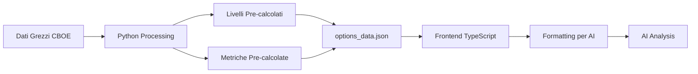
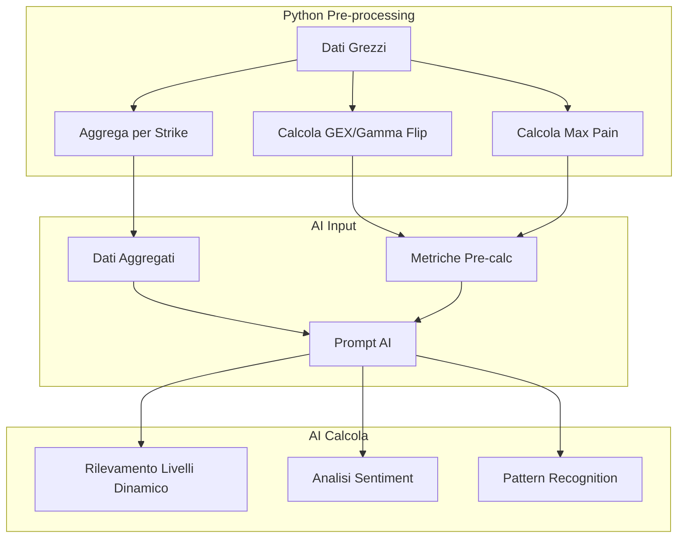

# Sintesi e Raccomandazioni: Analisi Livelli, Metriche e Approccio AI

## Riassunto Esecutivo

Ho completato l'analisi completa del sistema di calcolo livelli e metriche. Ecco i risultati principali:

---

## 1. Bug delle Metriche 0DTE (N/A)

### Causa Identificata
Il problema è un **mismatch di schema** tra Python e TypeScript:

| Campo | Python Restituisce | TypeScript Si Aspetta | Risultato |
|-------|-------------------|----------------------|-----------|
| `gamma_flip` | ✅ | ✅ | Funziona |
| `max_pain` | ✅ | ✅ | Funziona |
| `total_gex` | ✅ | ✅ | Funziona |
| `put_call_ratios` | ❌ Mancante | ✅ Richiesto | **N/A** |
| `volatility_skew` | ❌ Mancante | ✅ Richiesto | **N/A** |
| `gex_by_strike` | ❌ Mancante | ✅ Richiesto | **N/A** |

### Posizione del Bug
- [`scripts/fetch_options_data.py:1290-1295`](scripts/fetch_options_data.py:1290) - Funzione `calculate_quant_metrics()` restituisce solo 4 campi
- [`types.ts:257-264`](types.ts:257) - Interfaccia `QuantMetrics` ne richiede 6

### Fix Necessario
Aggiungere a Python i calcoli mancanti:
```python
def calculate_quant_metrics(options: List[Dict], spot_price: float) -> Dict:
    return {
        'gamma_flip': gamma_flip,
        'total_gex': total_gex,
        'max_pain': max_pain,
        'put_call_ratios': calculate_put_call_ratios(options),    # NUOVO
        'volatility_skew': calculate_volatility_skew(options),     # NUOVO
        'gex_by_strike': calculate_gex_by_strike(options)          # NUOVO
    }
```

---

## 2. Come Vengono Calcolati i Livelli

### Architettura Corrente



### Calcolo Livelli (Python)

| Livello | Funzione | Posizione | Algoritmo |
|---------|----------|-----------|-----------|
| **Call Wall** | `calculate_walls()` | [`fetch_options_data.py:931`](scripts/fetch_options_data.py:931) | Strike con massimo Call OI sopra spot |
| **Put Wall** | `calculate_walls()` | [`fetch_options_data.py:931`](scripts/fetch_options_data.py:931) | Strike con massimo Put OI sotto spot |
| **Gamma Flip** | Derivato da GEX | [`fetch_options_data.py:1270`](scripts/fetch_options_data.py:1270) | Punto dove GEX cumulativa cambia segno |
| **Max Pain** | `calculate_max_pain()` | Python | Strike dove valore opzioni è minimo |
| **Confluence** | `find_confluence_levels_enhanced()` | [`fetch_options_data.py:1452`](scripts/fetch_options_data.py:1452) | Stesso strike in 2 scadenze |
| **Resonance** | `find_resonance_levels()` | [`fetch_options_data.py:1302`](scripts/fetch_options_data.py:1302) | Stesso strike in 3 scadenze |

---

## 3. Fattibilità Approccio AI con Dati Grezzi

### Verdetto: Approccio Ibrido Raccomandato

**Non è possibile** passare tutti i dati grezzi all'AI perché:
- File `options_data.json` = ~50,000 righe (~1.5M token)
- Supererebbe il context window di GLM (128K)
- Costi token proibitivi

### Approccio Ibrido Raccomandato



### Cosa Pre-calcolare (Python)
- ✅ GEX per strike (formule matematiche precise)
- ✅ Gamma flip (calcolo matematico)
- ✅ Max pain (algoritmo di ottimizzazione)
- ✅ Put/call ratios (accuratezza numerica)

### Cosa Far Calcolare all'AI
- ✅ Identificazione livelli dinamica (pattern recognition)
- ✅ Confluence detection (flessibilità)
- ✅ Sentiment analysis (interpretazione)
- ✅ Trading signals (contesto mercato)

### Benefici
1. **Dinamicità**: AI adatta i livelli al regime di mercato corrente
2. **Resilienza**: Non limitato ad algoritmi hard-coded
3. **Efficienza**: Dati aggregati = meno token
4. **Manutenibilità**: Meno regole da aggiornare

---

## 4. Piano di Implementazione

### Fase 1: Fix Immediato Bug 0DTE
**Priorità**: Alta
**File**: [`scripts/fetch_options_data.py`](scripts/fetch_options_data.py:1290)

Aggiungere i 3 campi mancanti alla funzione `calculate_quant_metrics()`:
- `put_call_ratios`
- `volatility_skew`
- `gex_by_strike`

### Fase 2: Creare Funzione Aggregazione Dati
**Priorità**: Media
**File**: Nuova funzione in [`scripts/fetch_options_data.py`](scripts/fetch_options_data.py)

Filtrare strike entro ±5% dello spot e aggregare per ridurre token.

### Fase 3: Aggiornare AI Service
**Priorità**: Media
**File**: [`services/geminiService.ts`](services/geminiService.ts), [`services/glmService.ts`](services/glmService.ts)

Modificare prompt per usare dati aggregati + metriche pre-calcolate.

---

## 5. Documenti Completi

- **Analisi Livelli e Metriche**: [`plans/level-metrics-analysis.md`](plans/level-metrics-analysis.md)
- **Studio Fattibilità AI**: [`plans/raw-data-ai-feasibility.md`](plans/raw-data-ai-feasibility.md)

---

## Prossimi Passi

Vuoi che proceda con l'implementazione?

1. **Fix Bug 0DTE** - Correggere il mismatch dello schema
2. **Implementare Approccio Ibrido** - Aggiungere aggregazione dati
3. **Entrambi** - Fix bug + nuovo approccio AI
