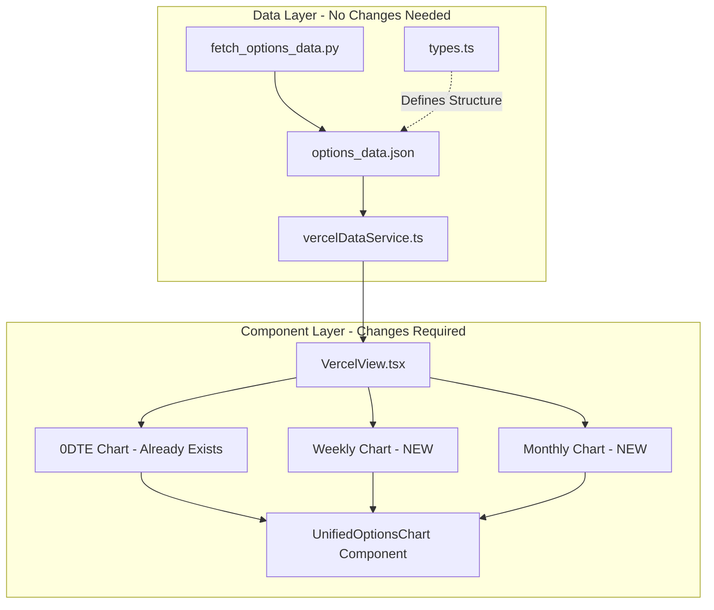
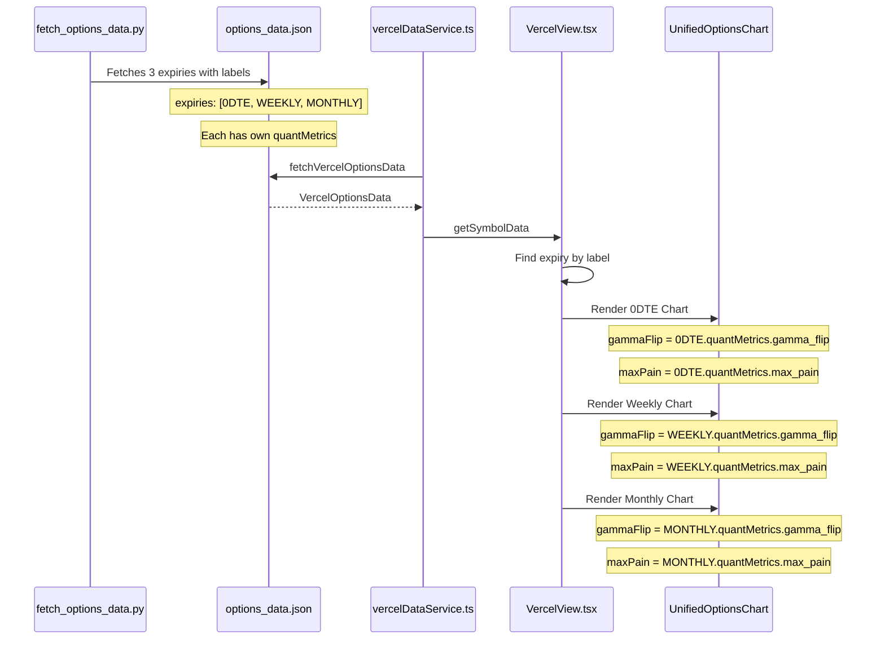

# Three Charts Implementation Analysis

## Executive Summary

The current implementation already has the data infrastructure to support **three separate charts** (0DTE, Weekly, Monthly). The data structure in [`types.ts`](types.ts) and the Python fetcher in [`scripts/fetch_options_data.py`](scripts/fetch_options_data.py) already separate expiries with individual `quantMetrics` per expiry. The only changes needed are in the UI component layer.

---

## Current State Analysis

### 1. Component Analysis - [`components/VercelView.tsx`](components/VercelView.tsx)

#### Current Chart Rendering (Lines 3343-3393)

The component currently renders **two charts**:

```tsx
// Chart 1: 0DTE Only (Lines 3343-3370)
{activeSymbolData.expiries && activeSymbolData.expiries.length > 0 && (() => {
  const zeroDteExpiry = activeSymbolData.expiries.find(e => e.label === '0DTE');
  const zeroDteGammaFlip = zeroDteExpiry?.quantMetrics?.gamma_flip;
  const zeroDteMaxPain = zeroDteExpiry?.quantMetrics?.max_pain;
  
  return zeroDteExpiry && (
    <UnifiedOptionsChart
      expiries={[zeroDteExpiry]}
      spot={activeSymbolData.spot}
      gammaFlip={zeroDteGammaFlip}
      maxPain={zeroDteMaxPain}
    />
  );
})()}

// Chart 2: All Expiries Combined (Lines 3372-3393)
<UnifiedOptionsChart
  expiries={activeSymbolData.expiries}  // ALL expiries
  spot={activeSymbolData.spot}
  gammaFlip={activeSymbolData.selected_levels?.gamma_flip}
  maxPain={activeSymbolData.selected_levels?.max_pain}
/>
```

#### Key Component: [`UnifiedOptionsChart`](components/VercelView.tsx:2300)

The `UnifiedOptionsChart` component (lines 2297-2700):
- Accepts an array of `expiries` 
- Aggregates options by strike using `aggregateOptionsByStrike()`
- Displays Spot, Gamma Flip, and Max Pain markers
- Shows horizontal bar chart for CALL/PUT OI and Volume

**Important**: This component is already designed to work with single or multiple expiries.

---

### 2. Data Structure Analysis - [`types.ts`](types.ts)

#### SymbolData Structure (Lines 153-163)

```typescript
export interface SymbolData {
  spot: number;
  generated: string;
  /** Up to 3 expiries: 0DTE, WEEKLY, MONTHLY */
  expiries: ExpiryData[];
  legacy?: Record<string, LegacyExpiryContent>;
  selected_levels?: SelectedLevels;
  ai_analysis?: AIAnalysis;
  totalGexData?: TotalGexData;
}
```

#### ExpiryData Structure (Lines 82-87)

```typescript
export interface ExpiryData {
  label: string;              // '0DTE', 'WEEKLY', 'MONTHLY'
  date: string;
  options: OptionData[];
  quantMetrics?: QuantMetrics;  // ← Each expiry has its OWN metrics!
}
```

#### QuantMetrics Structure (Lines 257-264)

```typescript
export interface QuantMetrics {
  gamma_flip: number;         // ← Per-expiry Gamma Flip
  total_gex: number;          // ← Per-expiry Total GEX
  max_pain: number;           // ← Per-expiry Max Pain
  put_call_ratios: PutCallRatios;
  volatility_skew: VolatilitySkew;
  gex_by_strike: GEXData[];
}
```

**Key Finding**: Each expiry already has its own `quantMetrics` containing `gamma_flip`, `max_pain`, and `total_gex`. The data structure fully supports three separate charts.

---

### 3. Data Source Analysis - [`scripts/fetch_options_data.py`](scripts/fetch_options_data.py)

#### Expiry Selection Logic (Lines 672-716)

```python
def select_3_expirations(expirations: List[str]) -> List[Tuple[str, str]]:
    """
    Select 3 distinct expirations for precise analysis:
    1. 0DTE - First available (intraday gamma)
    2. WEEKLY - First weekly Friday (not monthly)
    3. MONTHLY - First monthly (third Friday)
    """
    selected = []
    
    # 1. 0DTE - always the first
    selected.append(("0DTE", expirations[0]))
    
    # 2. WEEKLY - First weekly Friday (not monthly)
    for exp in expirations:
        if exp not in used_dates and is_weekly_friday(exp):
            selected.append(("WEEKLY", exp))
    
    # 3. MONTHLY - First third Friday not yet used
    for exp in expirations:
        if exp not in used_dates and is_monthly(exp):
            selected.append(("MONTHLY", exp))
```

#### QuantMetrics Calculation Per Expiry (Lines 917-965)

Each expiry gets its own `quantMetrics` calculated:

```python
def fetch_options_chain(ticker: yf.Ticker, expiry_date: str, label: str) -> Optional[ExpiryData]:
    # ... fetches options ...
    return ExpiryData(
        label=label,           # '0DTE', 'WEEKLY', or 'MONTHLY'
        date=expiry_date,
        options=options_list,
        quantMetrics=quant_metrics  # ← Calculated for THIS expiry only
    )
```

---

### 4. JSON Data Structure - [`data/options_data.json`](data/options_data.json)

```json
{
  "version": "2.0",
  "generated": "2026-03-13T16:56:16.339381Z",
  "symbols": {
    "SPY": {
      "spot": 664.05,
      "expiries": [
        {
          "label": "0DTE",
          "date": "2026-03-13",
          "options": [...],
          "quantMetrics": {
            "gamma_flip": 662.50,
            "max_pain": 663.00,
            "total_gex": 0.85,
            ...
          }
        },
        {
          "label": "WEEKLY",
          "date": "2026-03-21",
          "options": [...],
          "quantMetrics": {
            "gamma_flip": 660.25,
            "max_pain": 661.50,
            "total_gex": 1.24,
            ...
          }
        },
        {
          "label": "MONTHLY",
          "date": "2026-03-28",
          "options": [...],
          "quantMetrics": {
            "gamma_flip": 658.75,
            "max_pain": 660.00,
            "total_gex": 2.15,
            ...
          }
        }
      ]
    }
  }
}
```

---

## Gap Analysis

### What's Already Supported ✅

| Feature | Status | Location |
|---------|--------|----------|
| 0DTE data separation | ✅ Already exists | `expiries.find(e => e.label === '0DTE')` |
| WEEKLY data separation | ✅ Already exists | `expiries.find(e => e.label === 'WEEKLY')` |
| MONTHLY data separation | ✅ Already exists | `expiries.find(e => e.label === 'MONTHLY')` |
| Per-expiry gamma_flip | ✅ Already exists | `expiry.quantMetrics.gamma_flip` |
| Per-expiry max_pain | ✅ Already exists | `expiry.quantMetrics.max_pain` |
| Per-expiry total_gex | ✅ Already exists | `expiry.quantMetrics.total_gex` |
| UnifiedOptionsChart component | ✅ Already exists | Works with single or multiple expiries |

### What Needs to Change ❌

| Component | Change Required |
|-----------|-----------------|
| [`VercelView.tsx`](components/VercelView.tsx) | Add two more chart sections for WEEKLY and MONTHLY |
| No other changes needed | Data layer is complete |

---

## Implementation Plan

### Minimal Changes Required

The implementation requires **only UI component changes** in [`components/VercelView.tsx`](components/VercelView.tsx). No changes to:
- ❌ Data structures ([`types.ts`](types.ts))
- ❌ Python fetcher ([`scripts/fetch_options_data.py`](scripts/fetch_options_data.py))
- ❌ Service layer ([`services/vercelDataService.ts`](services/vercelDataService.ts))
- ❌ JSON data format ([`data/options_data.json`](data/options_data.json))

### Specific Code Changes

#### Location: [`components/VercelView.tsx`](components/VercelView.tsx) Lines 3343-3393

Replace the current two-chart structure with three charts:

```tsx
// Chart 1: 0DTE Options Chart (Already exists, keep as-is)
{activeSymbolData.expiries && activeSymbolData.expiries.length > 0 && (() => {
  const zeroDteExpiry = activeSymbolData.expiries.find(e => e.label === '0DTE');
  const zeroDteGammaFlip = zeroDteExpiry?.quantMetrics?.gamma_flip;
  const zeroDteMaxPain = zeroDteExpiry?.quantMetrics?.max_pain;
  
  return zeroDteExpiry && zeroDteExpiry.options && zeroDteExpiry.options.length > 0 && (
    <div className="bg-gray-800/50 rounded-xl border border-gray-700/50 overflow-hidden">
      <div className="px-4 py-3 bg-gray-800/70 border-b border-gray-700/50">
        <h3 className="text-lg font-bold text-white uppercase tracking-wider">
          0DTE Options Chart
          <span className="ml-2 text-sm font-normal text-gray-400">
            (Today's Expiry Only)
          </span>
        </h3>
      </div>
      <div className="p-4">
        <UnifiedOptionsChart
          expiries={[zeroDteExpiry]}
          spot={activeSymbolData.spot}
          gammaFlip={zeroDteGammaFlip}
          maxPain={zeroDteMaxPain}
          topStrikesCount={12}
        />
      </div>
    </div>
  );
})()}

// Chart 2: WEEKLY Options Chart (NEW)
{activeSymbolData.expiries && activeSymbolData.expiries.length > 0 && (() => {
  const weeklyExpiry = activeSymbolData.expiries.find(e => e.label === 'WEEKLY');
  const weeklyGammaFlip = weeklyExpiry?.quantMetrics?.gamma_flip;
  const weeklyMaxPain = weeklyExpiry?.quantMetrics?.max_pain;
  
  return weeklyExpiry && weeklyExpiry.options && weeklyExpiry.options.length > 0 && (
    <div className="bg-gray-800/50 rounded-xl border border-gray-700/50 overflow-hidden">
      <div className="px-4 py-3 bg-gray-800/70 border-b border-gray-700/50">
        <h3 className="text-lg font-bold text-white uppercase tracking-wider">
          Weekly Options Chart
          <span className="ml-2 text-sm font-normal text-gray-400">
            (Next Weekly Expiry)
          </span>
        </h3>
      </div>
      <div className="p-4">
        <UnifiedOptionsChart
          expiries={[weeklyExpiry]}
          spot={activeSymbolData.spot}
          gammaFlip={weeklyGammaFlip}
          maxPain={weeklyMaxPain}
          topStrikesCount={12}
        />
      </div>
    </div>
  );
})()}

// Chart 3: MONTHLY Options Chart (NEW)
{activeSymbolData.expiries && activeSymbolData.expiries.length > 0 && (() => {
  const monthlyExpiry = activeSymbolData.expiries.find(e => e.label === 'MONTHLY');
  const monthlyGammaFlip = monthlyExpiry?.quantMetrics?.gamma_flip;
  const monthlyMaxPain = monthlyExpiry?.quantMetrics?.max_pain;
  
  return monthlyExpiry && monthlyExpiry.options && monthlyExpiry.options.length > 0 && (
    <div className="bg-gray-800/50 rounded-xl border border-gray-700/50 overflow-hidden">
      <div className="px-4 py-3 bg-gray-800/70 border-b border-gray-700/50">
        <h3 className="text-lg font-bold text-white uppercase tracking-wider">
          Monthly Options Chart
          <span className="ml-2 text-sm font-normal text-gray-400">
            (Next Monthly Expiry)
          </span>
        </h3>
      </div>
      <div className="p-4">
        <UnifiedOptionsChart
          expiries={[monthlyExpiry]}
          spot={activeSymbolData.spot}
          gammaFlip={monthlyGammaFlip}
          maxPain={monthlyMaxPain}
          topStrikesCount={12}
        />
      </div>
    </div>
  );
})()}

// REMOVE: All Expiries Options Chart (no longer needed)
```

---

## Architecture Diagram



---

## Data Flow Diagram



---

## Summary

| Aspect | Finding |
|--------|---------|
| **Data Structure** | ✅ Already supports 3 separate expiries with individual metrics |
| **Python Fetcher** | ✅ Already fetches and labels 0DTE, WEEKLY, MONTHLY separately |
| **Service Layer** | ✅ Already passes through all expiry data |
| **UI Component** | ❌ Only renders 2 charts (0DTE + All combined) |
| **Effort Required** | **Minimal** - Add 2 new chart sections in VercelView.tsx |
| **Risk Level** | **Low** - No data layer changes, pure UI addition |

The implementation is straightforward: duplicate the existing 0DTE chart pattern for WEEKLY and MONTHLY expiries, using their respective `quantMetrics` for gamma_flip and max_pain values.
