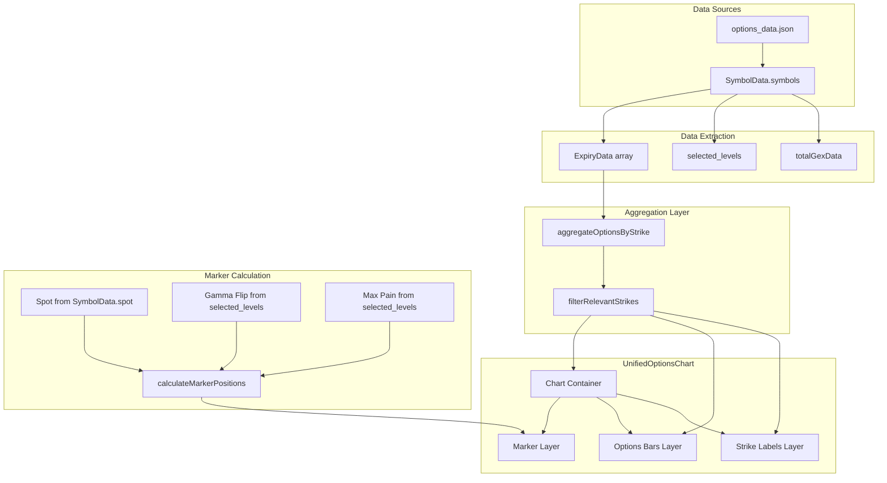

# Unified Options Chart Architecture Design

## Document Information
- **Created**: 2026-03-05
- **Purpose**: Design a unified chart that aggregates options data from ALL expiries with visual markers for key levels
- **Status**: Design Phase

---

## 1. Current State Analysis

### 1.1 Existing OptionsChart Component

**Location**: [`components/VercelView.tsx`](components/VercelView.tsx:1951) (lines 1949-2203)

**Current Implementation**:
- Custom CSS/div-based horizontal bar chart (no external charting library)
- Displays CALL options on the LEFT side (green gradient bars)
- Displays PUT options on the RIGHT side (red gradient bars)
- Shows top 5 options by Open Interest for each side
- Uses absolute positioning with calculated widths for bar lengths
- Includes hover tooltips showing OI, Volume, and IV

**Current Props Interface**:
```typescript
function OptionsChart({
  callOptions,
  putOptions,
  spot
}: {
  callOptions: OptionData[];
  putOptions: OptionData[];
  spot: number;
}): ReactElement
```

### 1.2 Current Expiry Details Section

**Location**: [`components/VercelView.tsx`](components/VercelView.tsx:2822) (lines 2822-2848)

**Current Behavior**:
```tsx
{activeSymbolData.expiries.map((expiry, idx) => {
  const topCalls = getTopOptionsByOI(expiry.options, 'CALL', 5);
  const topPuts = getTopOptionsByOI(expiry.options, 'PUT', 5);

  return (
    <div key={`${expiry.label}-${expiry.date}-${idx}`}>
      <OptionsChart
        callOptions={topCalls}
        putOptions={topPuts}
        spot={activeSymbolData.spot}
      />
    </div>
  );
})}
```

**Problem**: Creates 5 separate charts (one per expiry: 0DTE, Weekly 1, Weekly 2, Monthly 1, Monthly 2)

### 1.3 Available Data Sources

#### Per-Expiry QuantMetrics
**Location**: [`types.ts`](types.ts:257) - `QuantMetrics` interface

```typescript
interface QuantMetrics {
  gamma_flip: number;
  total_gex: number;
  max_pain: number;
  put_call_ratios: PutCallRatios;
  volatility_skew: VolatilitySkew;
  gex_by_strike: GEXData[];
}
```

#### Symbol-Level Aggregated Data
**Location**: [`types.ts`](types.ts:153) - `SymbolData` interface

```typescript
interface SymbolData {
  spot: number;
  expiries: ExpiryData[];
  selected_levels?: SelectedLevels;  // Contains aggregate gamma_flip, max_pain
  totalGexData?: TotalGexData;       // Contains flip_point across all expiries
}
```

#### SelectedLevels Structure
**Location**: [`types.ts`](types.ts:107)

```typescript
interface SelectedLevels {
  resonance: Array<ResonanceLevel | LegacyResonanceLevel>;
  confluence: Array<ConfluenceLevel | LegacyConfluenceLevel>;
  call_walls: Array<{strike: number; oi: number; expiry: string}>;
  put_walls: Array<{strike: number; oi: number; expiry: string}>;
  gamma_flip: number;  // Aggregate gamma flip
  max_pain: number;    // Aggregate max pain
}
```

#### TotalGexData Structure
**Location**: [`types.ts`](types.ts:203)

```typescript
interface TotalGexData {
  total_gex: number;
  gex_by_expiry: Array<{
    date: string;
    gex: number;
    weight: number;
  }>;
  positive_gex: number;
  negative_gex: number;
  flip_point: number;  // Aggregate gamma flip point
}
```

---

## 2. Proposed Architecture

### 2.1 Component Structure

```
┌─────────────────────────────────────────────────────────────────┐
│                    UnifiedOptionsChart                          │
├─────────────────────────────────────────────────────────────────┤
│  ┌─────────────────────────────────────────────────────────┐   │
│  │                    Chart Legend                          │   │
│  │  [CALL] [PUT] [●Spot] [◆Gamma Flip] [■Max Pain]         │   │
│  └─────────────────────────────────────────────────────────┘   │
│                                                                 │
│  ┌─────────────────────────────────────────────────────────┐   │
│  │                 Vertical Markers Layer                   │   │
│  │     │        ◆          ■           ●                    │   │
│  │     │        │          │           │                    │   │
│  │     │   GF   │    MP    │   SPOT    │                    │   │
│  └─────────────────────────────────────────────────────────┘   │
│                                                                 │
│  ┌─────────────────────────────────────────────────────────┐   │
│  │              Aggregated Options Data                     │   │
│  │   ◀── CALL Bars ──▶ │ ◀── PUT Bars ───▶                │   │
│  │                      │                                   │   │
│  │   All expiries       │   All expiries                   │   │
│  │   aggregated with    │   aggregated with                │   │
│  │   expiry color code  │   expiry color code              │   │
│  └─────────────────────────────────────────────────────────┘   │
│                                                                 │
│  ┌─────────────────────────────────────────────────────────┐   │
│  │                   Strike Labels                          │   │
│  │              6700│6750│6800│6850│6900                   │   │
│  └─────────────────────────────────────────────────────────┘   │
└─────────────────────────────────────────────────────────────────┘
```

### 2.2 New Component: UnifiedOptionsChart

**Props Interface**:
```typescript
interface UnifiedOptionsChartProps {
  // Raw data
  expiries: ExpiryData[];           // All expiry data
  spot: number;                      // Current spot price
  
  // Key levels (from selected_levels or totalGexData)
  gammaFlip?: number;                // Aggregate gamma flip level
  maxPain?: number;                  // Aggregate max pain level
  
  // Optional per-expiry levels for detailed view
  perExpiryLevels?: {
    [expiryLabel: string]: {
      gamma_flip: number;
      max_pain: number;
    };
  };
  
  // Display options
  topStrikesCount?: number;          // Default: 10
  showExpiryColors?: boolean;        // Default: true
  showPerExpiryLevels?: boolean;     // Default: false
}
```

### 2.3 Data Aggregation Logic

```typescript
interface AggregatedStrike {
  strike: number;
  
  // Aggregated totals
  total_call_oi: number;
  total_put_oi: number;
  total_call_vol: number;
  total_put_vol: number;
  
  // Per-expiry breakdown (for color coding)
  by_expiry: {
    [expiryLabel: string]: {
      call_oi: number;
      put_oi: number;
      call_vol: number;
      put_vol: number;
    };
  };
  
  // For calculating bar widths
  max_oi: number;  // Max OI across all strikes
  max_vol: number; // Max Volume across all strikes
}

function aggregateOptionsByStrike(expiries: ExpiryData[]): AggregatedStrike[] {
  const strikeMap = new Map<number, AggregatedStrike>();
  
  for (const expiry of expiries) {
    for (const option of expiry.options) {
      const existing = strikeMap.get(option.strike) || {
        strike: option.strike,
        total_call_oi: 0,
        total_put_oi: 0,
        total_call_vol: 0,
        total_put_vol: 0,
        by_expiry: {}
      };
      
      if (option.side === 'CALL') {
        existing.total_call_oi += option.oi || 0;
        existing.total_call_vol += option.vol || 0;
      } else {
        existing.total_put_oi += option.oi || 0;
        existing.total_put_vol += option.vol || 0;
      }
      
      // Track per-expiry data
      if (!existing.by_expiry[expiry.label]) {
        existing.by_expiry[expiry.label] = {
          call_oi: 0, put_oi: 0, call_vol: 0, put_vol: 0
        };
      }
      
      if (option.side === 'CALL') {
        existing.by_expiry[expiry.label].call_oi += option.oi || 0;
        existing.by_expiry[expiry.label].call_vol += option.vol || 0;
      } else {
        existing.by_expiry[expiry.label].put_oi += option.oi || 0;
        existing.by_expiry[expiry.label].put_vol += option.vol || 0;
      }
      
      strikeMap.set(option.strike, existing);
    }
  }
  
  return Array.from(strikeMap.values()).sort((a, b) => a.strike - b.strike);
}
```

### 2.4 Visual Marker Implementation

#### Spot Price Marker
```typescript
// Vertical line with label
const SpotMarker: React.FC<{position: number; chartHeight: number}> = ({ position, chartHeight }) => (
  <div
    className="absolute top-0 bottom-0 w-0.5 bg-yellow-400 z-10"
    style={{ left: `${position}%` }}
  >
    <div className="absolute -top-6 left-1/2 -translate-x-1/2 whitespace-nowrap">
      <span className="text-xs font-bold text-yellow-400">SPOT</span>
    </div>
    <div className="absolute top-0 bottom-0 w-4 -ml-2 bg-yellow-400/10" />
  </div>
);
```

#### Gamma Flip Marker
```typescript
// Dashed vertical line with diamond marker
const GammaFlipMarker: React.FC<{position: number; chartHeight: number; value: number}> = ({ position, chartHeight, value }) => (
  <div
    className="absolute top-0 bottom-0 z-10"
    style={{ left: `${position}%` }}
  >
    <div className="absolute top-0 bottom-0 w-0 border-l-2 border-dashed border-purple-500" />
    <div className="absolute -top-6 left-1/2 -translate-x-1/2 flex items-center gap-1">
      <span className="text-purple-400">◆</span>
      <span className="text-xs font-medium text-purple-400">G.FLIP</span>
    </div>
    <div className="absolute top-0 bottom-0 w-4 -ml-2 bg-purple-500/5" />
  </div>
);
```

#### Max Pain Marker
```typescript
// Solid vertical line with square marker
const MaxPainMarker: React.FC<{position: number; chartHeight: number; value: number}> = ({ position, chartHeight, value }) => (
  <div
    className="absolute top-0 bottom-0 z-10"
    style={{ left: `${position}%` }}
  >
    <div className="absolute top-0 bottom-0 w-0.5 bg-orange-500" />
    <div className="absolute -top-6 left-1/2 -translate-x-1/2 flex items-center gap-1">
      <span className="text-orange-400">■</span>
      <span className="text-xs font-medium text-orange-400">MAX PAIN</span>
    </div>
    <div className="absolute top-0 bottom-0 w-4 -ml-2 bg-orange-500/5" />
  </div>
);
```

---

## 3. Visual Design Specifications

### 3.1 Color Palette

| Element | Color | Tailwind Class | Hex |
|---------|-------|----------------|-----|
| CALL Bars (Primary) | Green Gradient | `from-green-500 to-green-400` | #22c55e → #4ade80 |
| PUT Bars (Primary) | Red Gradient | `from-red-400 to-red-500` | #f87171 → #ef4444 |
| Spot Marker | Yellow | `bg-yellow-400` | #facc15 |
| Gamma Flip Marker | Purple | `border-purple-500` | #a855f7 |
| Max Pain Marker | Orange | `bg-orange-500` | #f97316 |
| Chart Background | Dark Gray | `bg-gray-800/30` | rgba(31, 41, 55, 0.3) |
| Strike Labels | Gray/White | `text-gray-400` | #9ca3af |

### 3.2 Expiry Color Coding (Optional Feature)

When `showExpiryColors` is enabled, use opacity or border colors to distinguish:

| Expiry | Opacity/Style |
|--------|---------------|
| 0DTE | 100% opacity, solid |
| Weekly 1 | 85% opacity |
| Weekly 2 | 70% opacity |
| Monthly 1 | 55% opacity |
| Monthly 2 | 40% opacity, dashed border |

### 3.3 Layout Dimensions

```typescript
const CHART_DIMENSIONS = {
  barHeight: 24,          // Height of each strike row
  barGap: 4,              // Gap between rows
  labelWidth: 80,         // Strike label column width
  chartWidth: 250,        // Width per side (call/put)
  markerZoneWidth: 40,    // Space for marker labels above
  minVisibleStrikes: 10,  // Minimum strikes to show
  maxVisibleStrikes: 30,  // Maximum strikes before scroll
};
```

### 3.4 Strike Filtering Logic

```typescript
function filterRelevantStrikes(
  aggregatedStrikes: AggregatedStrike[],
  spot: number,
  topN: number = 10
): AggregatedStrike[] {
  // 1. Sort by total OI (call + put)
  const sortedByOI = [...aggregatedStrikes].sort(
    (a, b) => (b.total_call_oi + b.total_put_oi) - (a.total_call_oi + a.total_put_oi)
  );
  
  // 2. Take top N strikes
  const topStrikes = sortedByOI.slice(0, topN);
  
  // 3. Ensure strikes around spot are included
  const spotRange = spot * 0.02; // 2% around spot
  const nearSpot = aggregatedStrikes.filter(
    s => Math.abs(s.strike - spot) <= spotRange
  );
  
  // 4. Merge and deduplicate
  const allRelevant = [...new Map(
    [...topStrikes, ...nearSpot].map(s => [s.strike, s])
  ).values()];
  
  // 5. Sort by strike for display
  return allRelevant.sort((a, b) => b.strike - a.strike);
}
```

---

## 4. Implementation Steps

### Phase 1: Core Component Creation

- [ ] **Step 1.1**: Create new `UnifiedOptionsChart` component file
  - Location: `components/UnifiedOptionsChart.tsx`
  - Copy existing `OptionsChart` as starting point

- [ ] **Step 1.2**: Define TypeScript interfaces
  - `UnifiedOptionsChartProps`
  - `AggregatedStrike`
  - `MarkerPosition`

- [ ] **Step 1.3**: Implement data aggregation function
  - `aggregateOptionsByStrike()`
  - `filterRelevantStrikes()`

### Phase 2: Marker Implementation

- [ ] **Step 2.1**: Create `VerticalMarker` sub-component
  - Support for different marker types (spot, gamma flip, max pain)
  - Configurable colors and styles

- [ ] **Step 2.2**: Calculate marker positions
  - Convert strike values to percentage positions
  - Handle markers outside visible range

- [ ] **Step 2.3**: Implement marker layering
  - Z-index management
  - Overlap handling

### Phase 3: Visual Enhancements

- [ ] **Step 3.1**: Implement expiry color coding
  - Opacity-based differentiation
  - Legend updates

- [ ] **Step 3.2**: Add interactive tooltips
  - Show per-expiry breakdown on hover
  - Display all relevant metrics

- [ ] **Step 3.3**: Responsive design
  - Handle narrow viewports
  - Scrollable chart container

### Phase 4: Integration

- [ ] **Step 4.1**: Replace Expiry Details section
  - Remove individual expiry charts
  - Add unified chart

- [ ] **Step 4.2**: Connect to data sources
  - Use `selected_levels` for aggregate levels
  - Use `totalGexData.flip_point` as fallback

- [ ] **Step 4.3**: Add toggle for legacy view
  - Allow users to switch between unified and per-expiry views

---

## 5. New Types and Interfaces

### 5.1 Core Types

```typescript
// components/UnifiedOptionsChart.tsx

/**
 * Aggregated strike data across all expiries
 */
export interface AggregatedStrike {
  strike: number;
  total_call_oi: number;
  total_put_oi: number;
  total_call_vol: number;
  total_put_vol: number;
  by_expiry: Record<string, ExpiryStrikeData>;
}

/**
 * Per-expiry data at a single strike
 */
export interface ExpiryStrikeData {
  call_oi: number;
  put_oi: number;
  call_vol: number;
  put_vol: number;
}

/**
 * Marker configuration for vertical line markers
 */
export interface ChartMarker {
  type: 'spot' | 'gamma_flip' | 'max_pain';
  value: number;
  color: string;
  label: string;
  style: 'solid' | 'dashed';
  symbol: '●' | '◆' | '■';
}

/**
 * Calculated position for a marker
 */
export interface MarkerPosition {
  marker: ChartMarker;
  positionPercent: number;
  isVisible: boolean;
}

/**
 * Props for the UnifiedOptionsChart component
 */
export interface UnifiedOptionsChartProps {
  expiries: ExpiryData[];
  spot: number;
  gammaFlip?: number;
  maxPain?: number;
  perExpiryLevels?: Record<string, { gamma_flip: number; max_pain: number }>;
  topStrikesCount?: number;
  showExpiryColors?: boolean;
  showPerExpiryLevels?: boolean;
  className?: string;
}
```

### 5.2 Utility Types

```typescript
/**
 * Result of strike aggregation
 */
export interface AggregationResult {
  strikes: AggregatedStrike[];
  maxOi: number;
  maxVol: number;
  strikeRange: {
    min: number;
    max: number;
  };
}

/**
 * Chart dimension configuration
 */
export interface ChartDimensions {
  barHeight: number;
  barGap: number;
  labelWidth: number;
  chartWidth: number;
  totalWidth: number;
  totalHeight: number;
}
```

---

## 6. Data Flow Diagram



---

## 7. Fallback Strategy

### 7.1 Missing Data Handling

| Scenario | Fallback |
|----------|----------|
| No `selected_levels` | Calculate gamma_flip and max_pain from aggregated data |
| No `totalGexData` | Use per-expiry quantMetrics from first expiry |
| Empty options array | Show "No data available" message |
| Missing spot price | Disable spot marker |

### 7.2 Gamma Flip Calculation (Fallback)

If `selected_levels.gamma_flip` is not available, calculate from scratch:

```typescript
function calculateAggregateGammaFlip(
  expiries: ExpiryData[],
  spot: number
): number {
  // Reuse existing calculateGammaFlip function
  // with all options from all expiries
  const allOptions = expiries.flatMap(e => e.options);
  const avgT = expiries.reduce((sum, e) => {
    return sum + calculateTimeToExpiry(e.date);
  }, 0) / expiries.length;
  
  return calculateGammaFlip(allOptions, spot, avgT);
}
```

### 7.3 Max Pain Calculation (Fallback)

If `selected_levels.max_pain` is not available:

```typescript
function calculateAggregateMaxPain(
  expiries: ExpiryData[],
  spot: number
): number {
  const allOptions = expiries.flatMap(e => e.options);
  return calculateMaxPain(allOptions, spot);
}
```

---

## 8. Testing Considerations

### 8.1 Unit Tests

- Aggregation function correctness
- Strike filtering logic
- Marker position calculations
- Edge cases (empty data, single expiry)

### 8.2 Integration Tests

- Data flow from props to rendered chart
- Marker visibility based on data availability
- Responsive behavior

### 8.3 Visual Tests

- Marker alignment with strikes
- Color coding accuracy
- Tooltip content

---

## 9. Performance Considerations

### 9.1 Memoization

```typescript
// Memoize aggregation results
const aggregatedStrikes = useMemo(
  () => aggregateOptionsByStrike(expiries),
  [expiries]
);

// Memoize filtered strikes
const relevantStrikes = useMemo(
  () => filterRelevantStrikes(aggregatedStrikes, spot, topStrikesCount),
  [aggregatedStrikes, spot, topStrikesCount]
);

// Memoize marker positions
const markerPositions = useMemo(
  () => calculateMarkerPositions(relevantStrikes, spot, gammaFlip, maxPain),
  [relevantStrikes, spot, gammaFlip, maxPain]
);
```

### 9.2 Virtual Scrolling (Future Enhancement)

For symbols with many strikes (e.g., SPX with 100+ strikes):

```typescript
// Consider react-window or react-virtualized for large datasets
import { FixedSizeList } from 'react-window';
```

---

## 10. Summary

This design proposes a new `UnifiedOptionsChart` component that:

1. **Aggregates data** from all expiries into a single cohesive view
2. **Displays key levels** (spot, gamma flip, max pain) as vertical markers
3. **Maintains compatibility** with existing data structures
4. **Provides fallbacks** for missing aggregate data
5. **Supports optional features** like expiry color coding

The implementation should be done in phases, starting with core functionality and adding visual enhancements incrementally.
